# Docker 核心技术


## 1. 从系统架构谈起

### 传统分层架构 vs 微服务

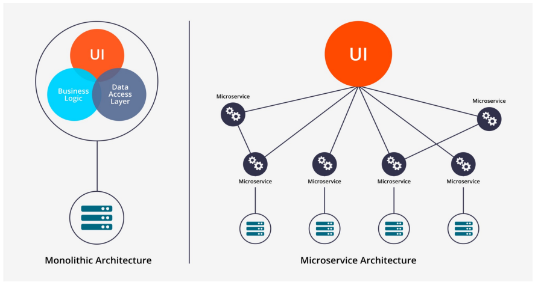

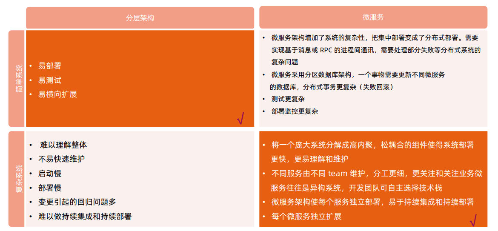

### 微服务改造

分离微服务的方法建议：

- 审视并发现可以分离的业务逻辑业务逻辑
- 寻找天生隔离的代码模块，可以借助于静态代码分析工具
- 不同并发规模，不同内存需求的模块都可以分离出不同的微服务，此方法可提高资源利用率，节省成本

一些常用的可微服务化的组件：

- 用户和账户管理
- 授权和会话管理
- 系统配置
- 通知和通讯服务
- 照片，多媒体，元数据等

分解原则：基于size, scope and capabilities


### 微服务间通讯

点对点：

- 多用于系统内部多组件之间通讯；
- 有大量的重复模块如认证授权；
- 缺少统一规范，如监控，审计等功能；
- 后期维护成本高，服务和服务的依赖关系错综复杂难以管理。

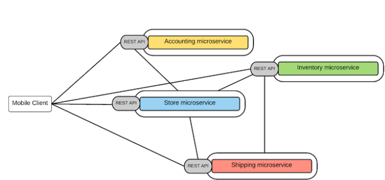


API 网关

- 基于一个轻量级的message gateway
- 新API通过注册至Gateway实现
- 整合实现Common function

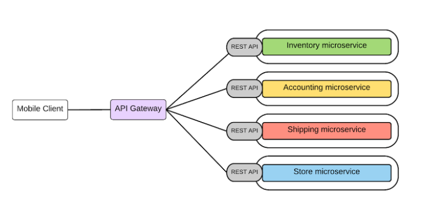


## 2. 理解 Docker


### Docker

- 基于Linux 内核的Cgroup，Namespace，以及Union FS等技术，对进程进行封装隔离，属于操作系统
    层面的虚拟化技术，由于隔离的进程独立于宿主和其它的隔离的进程，因此也称其为容器。
- 最初实现是基于LXC，从0.7 以后开始去除LXC，转而使用自行开发的Libcontainer，从1.11 开始，则
    进一步演进为使用runC和Containerd。
- Docker 在容器的基础上，进行了进一步的封装，从文件系统、网络互联到进程隔离等等，极大的简化了容
    器的创建和维护，使得Docker 技术比虚拟机技术更为轻便、快捷。


### 为什么要用 Docker

- 更高效地利用系统资源
- 更快速的启动时间
- 一致的运行环境
- 持续交付和部署
- 更轻松地迁移
- 更轻松地维护和扩展

......


### 虚拟机和容器运行态的对比

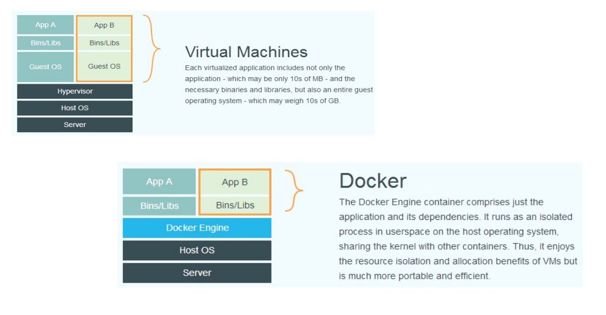

### 性能对比

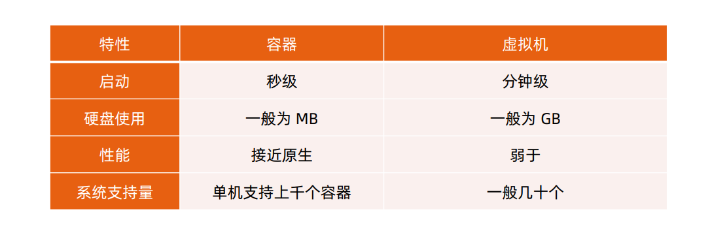

### 安装 Docker

在ubuntu上安装Docker运行时，参考https://docs.docker.com/engine/install/ubuntu/
$ sudoapt-get update
$ sudoapt-get install \
apt-transport-https \
ca-certificates \
curl \
gnupg-agent \
software-properties-common
$ curl -fsSLhttps://download.docker.com/linux/ubuntu/gpg| sudoapt-key add -
$ sudoadd-apt-repository \
"deb [arch=amd64] https://download.docker.com/linux/ubuntu \
$(lsb_release-cs) \
stable"
$ sudoapt-get update
$ sudoapt-get install docker-cedocker-ce-cli containerd.io


### 容器操作

启动：

- docker run
    - it 交互
    - d后台运行
    - p端口映射
    - v磁盘挂载
- 启动已终止容器

```
docker start
```
- 停止容器

```
docker stop
```
- 查看容器进程

```
dockerps
```

- 查看容器细节：

dockerinspect <containerid>

- 进入容器；
- Docker attach：

    通过 nsenter
    PID=$(docker inspect --format "{{ .State.Pid}}"
    <container>)

    $ nsenter--target $PID --mount --uts--ipc--net --pid

- 拷贝文件至容器内：

    dockercp file1 <containerid>:/file-to-path


### 初识容器

- cat Dockerfile

```
FROM ubuntu
ENV MY_SERVICE_PORT=80
ADD bin/amd64/httpserver /httpserver
ENTRYPOINT /httpserver
```
- 将Dockerfile打包成镜像
```
docker build -t cncamp/httpserver:${tag}.
docker push cncamp/httpserver:v1.
```
- 运行容器
```
docker run -d cncamp/httpserver:v1.
```
### 容器标准

- Open Container Initiative（OCI）
    - 轻量级开放式管理组织（项目）
- OCI主要定义两个规范
    - Runtime Specification
       - 文件系统包如何解压至硬盘，共运行时运行。
    - Image Specification
       - 如何通过构建系统打包，生成镜像清单（Manifest）、文件系统序列化文件、镜像配置。


### 容器主要特性

- 隔离性
- 便携性
- 可配额
- 安全性


### Namespace

- Linux Namespace是一种Linux Kernel提供的资源隔离方案：
    - 系统可以为进程分配不同的Namespace；
    - 并保证不同的Namespace资源独立分配、进程彼此隔离，即不同的Namespace下的进程互不干扰。


##### Linux 内核代码中 Namespace 的实现

- 进程数据结构

```
struct task_struct {
...
/* namespaces */
struct nsproxy *nsproxy;
...
}
```

- Namespace数据结构

```
struct nsproxy {
atomic_t count;
struct uts_namespace *uts_ns;
struct ipc_namespace *ipc_ns;
struct mnt_namespace *mnt_ns;
struct pid_namespace
*pid_ns_for_children;
struct net *net_ns;
}
```

#### Linux 对 Namespace 操作方法

- clone

在创建新进程的系统调用时，可以通过flags参数指定需要新建的Namespace类型：
// CLONE_NEWCGROUP/ CLONE_NEWIPC/ CLONE_NEWNET/ CLONE_NEWNS/ CLONE_NEWPID/
CLONE_NEWUSER/ CLONE_NEWUTS

```
int clone(int (*fn)(void *), void *child_stack, int flags, void *arg)
```
- setns

该系统调用可以让调用进程加入某个已经存在的Namespace中：
```
Int setns(int fd, int nstype)
```
- unshare
该系统调用可以将调用进程移动到新的Namespace下：

```
int unshare(int flags)
```

#### 隔离性 – Linux Namespace

```
Namespace类型 隔离资源 Kernel版本
```
```
IPC System V IPC和POSIX消息队列 2.6.19
```
```
Network 网络设备、网络协议栈、网络端口等 2.6.29
```
```
PID 进程 2.6.14
```
```
Mount 挂载点 2.4.19
```
```
UTS 主机名和域名 2.6.19
```
```
USR 用户和用户组 3.8
```

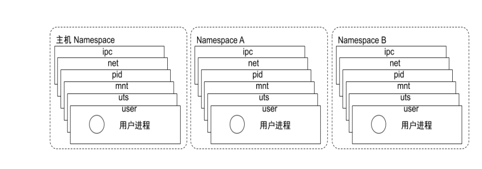

Pidnamespace
- 不同用户的进程就是通过Pidnamespace隔离开的，且不同namespace 中可以有相同Pid。
- 有了Pidnamespace, 每个namespace中的Pid能够相互隔离。

net namespace
- 网络隔离是通过net namespace实现的，每个net namespace有独立的network devices, IP
    addresses, IP routing tables, /proc/net 目录。
- Docker默认采用veth的方式将container中的虚拟网卡同host上的一个docker bridge: docker0连接在一起。

ipcnamespace
- Container中进程交互还是采用linux常见的进程间交互方法（interprocesscommunication –IPC）, 包括常见的信号量、消息队列和共享内存。
- container 的进程间交互实际上还是host上具有相同Pidnamespace中的进程间交互，因此需要在IPC资源申请时加入namespace信息-每个IPC资源有一个唯一的 32 位ID。

mntnamespace
- mntnamespace允许不同namespace的进程看到的文件结构不同，这样每个namespace 中的进程所看到的文件目录就被隔离开了。

utsnamespace
-UTS(“UNIX Time-sharing System”) namespace允许每个container拥有独立的hostname和
domain name, 使其在网络上可以被视作一个独立的节点而非Host上的一个进程。

user namespace
- 每个container可以有不同的user 和group id, 也就是说可以在container内部用container内部的用户执行程序而非Host上的用户。


#### 关于 namespace 的常用操作

- 查看当前系统的namespace：

```
lsns –t <type>
```
- 查看某进程的namespace：

```
ls -la /proc/<pid>/ns/
```
- 进入某namespace运行命令：

```
nsenter-t <pid> -n ipaddr
```

#### Namespace 练习

- 在新networknamespace执行sleep指令：
    unshare-fnsleep 60
- 查看进程信息
    ps-ef|grepsleep
    root 32882 4935 0 10:00 pts/0 00:00:00 unshare-fnsleep 60
    root 32883 32882 0 10:00 pts/0 00:00:00 sleep 60
- 查看网络Namespace
    lsns-t net
    4026532508 net 2 32882 root unassigned unshare
- 进入改进程所在Namespace查看网络配置，与主机不一致
    nsenter-t 32882 -n ipa
    1: lo: <LOOPBACK> mtu 65536 qdiscnoopstate DOWN group default qlen 1000
       link/loopback 00:00:00:00:00:00 brd00:00:00:00:00:00


### Cgroups

- Cgroups（Control Groups）是Linux下用于对一个或一组进程进行资源控制和监控的机制；
- 可以对诸如CPU使用时间、内存、磁盘I/O等进程所需的资源进行限制；
- 不同资源的具体管理工作由相应的Cgroup子系统（Subsystem）来实现；
- 针对不同类型的资源限制，只要将限制策略在不同的的子系统上进行关联即可；
- Cgroups在不同的系统资源管理子系统中以层级树（Hierarchy）的方式来组织管理：每个Cgroup都可以
    包含其他的子Cgroup，因此子Cgroup能使用的资源除了受本Cgroup配置的资源参数限制，还受到父
    Cgroup设置的资源限制。


##### Linux 内核代码中 Cgroups 的实现

- 进程数据结构

```
struct task_struct
{
#ifdef CONFIG_CGROUPS
struct css_set __rcu *cgroups; 
struct list_head cg_list; 
#endif
}
```

- css_set 是 cgroup_subsys_state 对象的集合数据结构

```
struct css_set {
/*
* Set of subsystem states, one for each subsystem. This array is
* immutable after creation apart from the init_css_set during
* subsystem registration (at boot time).
*/
struct cgroup_subsys_state *subsys[CGROUP_SUBSYS_COUNT];
};
```

### 可配额/可度量 - Control Groups (cgroups)

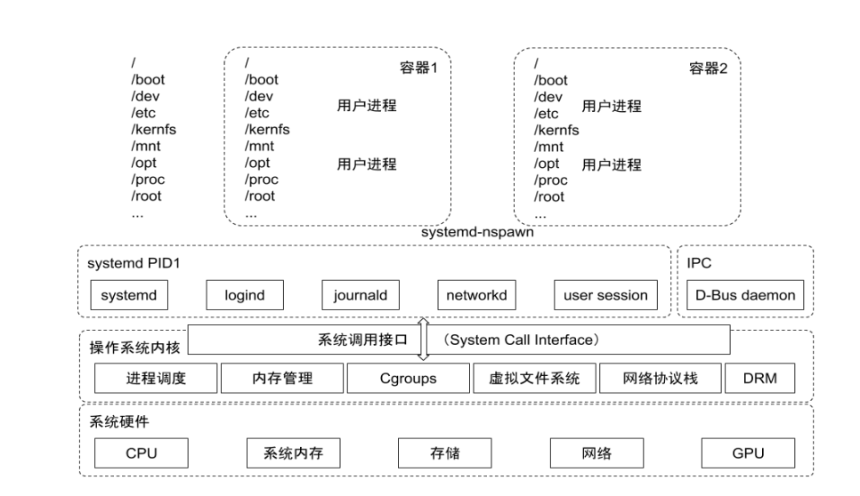

cgroups实现了对资源的配额和度量

- blkio： 这个子系统设置限制每个块设备的输入输出控制。例如:磁盘，光盘以及USB等等。
- CPU： 这个子系统使用调度程序为cgroup任务提供CPU的访问。
- cpuacct： 产生 cgroup任务的CPU资源报告。
- cpuset： 如果是多核心的CPU，这个子系统会为cgroup任务分配单独的CPU和内存。
- devices： 允许或拒绝cgroup任务对设备的访问。
- freezer： 暂停和恢复cgroup任务。
- memory： 设置每个cgroup的内存限制以及产生内存资源报告。
- net_cls： 标记每个网络包以供cgroup方便使用。
- ns： 名称空间子系统。
- pid: 进程标识子系统。

#### CPU 子系统

cpu.shares： 可出让的能获得CPU使用时间的相对值。

cpu.cfs_period_us：cfs_period_us用来配置时间周期长度，单位为us（微秒）。

cpu.cfs_quota_us：cfs_quota_us用来配置当前Cgroup在cfs_period_us时间内最多能使用的CPU时间数，单
位为us（微秒）。

cpu.stat： Cgroup内的进程使用的CPU时间统计。

nr_periods： 经过cpu.cfs_period_us的时间周期数量。

nr_throttled： 在经过的周期内，有多少次因为进程在指定的时间周期内用光了配额时间而受到限制。

throttled_time： Cgroup中的进程被限制使用CPU的总用时，单位是ns（纳秒）。


#### Linux 调度器

内核默认提供了 5 个调度器，Linux内核使用struct sched_class来对调度器进行抽象：

- Stop调度器，stop_sched_class：优先级最高的调度类，可以抢占其他所有进程，不能被其他进程抢占；
- Deadline调度器，dl_sched_class：使用红黑树，把进程按照绝对截止期限进行排序，选择最小进程进
    行调度运行；
- RT调度器，rt_sched_class：实时调度器，为每个优先级维护一个队列；
- CFS调度器，cfs_sched_class：完全公平调度器，采用完全公平调度算法，引入虚拟运行时间概念；
- IDLE-Task调度器，idle_sched_class：空闲调度器，每个CPU都会有一个idle线程，当没有其他进程
    可以调度时，调度运行idle线程。


#### CFS 调度器

- CFS是Completely Fair Scheduler简称，即完全公平调度器。
- CFS 实现的主要思想是维护为任务提供处理器时间方面的平衡，这意味着应给进程分配相当数量的处理器。
- 分给某个任务的时间失去平衡时，应给失去平衡的任务分配时间，让其执行。
- CFS通过虚拟运行时间（vruntime）来实现平衡，维护提供给某个任务的时间量。
    - vruntime= 实际运行时间*1024 / 进程权重
- 进程按照各自不同的速率在物理时钟节拍内前进，优先级高则权重大，其虚拟时钟比真实时钟跑得慢，但
    获得比较多的运行时间。


#### vruntime 红黑树

CFS调度器没有将进程维护在运行队列中，而是维护了一个以虚拟运行时间为顺序的红黑树。红黑树的主要
特点有：

1. 自平衡，树上没有一条路径会比其他路径长出俩倍。
2. O(log n) 时间复杂度，能够在树上进行快速高效地插入或删除进程。

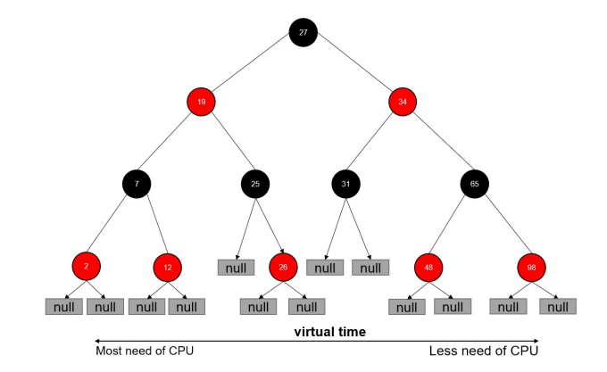

#### CFS进程调度

- 在时钟周期开始时，调度器调用__schedule()函数来开始调度的运行。
- __schedule()函数调用pick_next_task()让进程调度器从就绪队列中选择一个最合适的进程next，即红
    黑树最左边的节点。
- 通过context_switch()切换到新的地址空间，从而保证next进程运行。
- 在时钟周期结束时，调度器调用entity_tick()函数来更新进程负载、进程状态以及vruntime（当前vruntime+ 该时钟周期内运行的时间）。
- 最后，将该进程的虚拟时间与就绪队列红黑树中最左边的调度实体的虚拟时间做比较，如果小于坐左边的时间，则不用触发调度，继续调度当前调度实体。

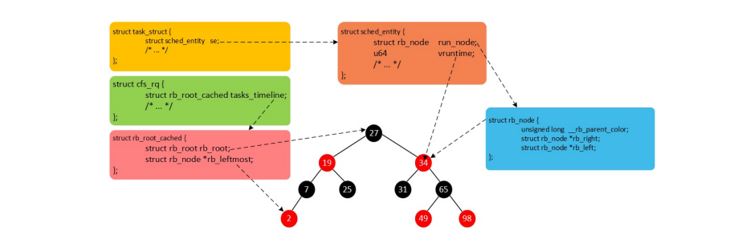

#### CPU 子系统练习

- 在cgroupcpu子系统目录中创建目录结构
cd /sys/fs/cgroup/cpu
mkdircpudemo
cd cpudemo
- 运行busyloop
- 执行top查看CPU使用情况，CPU占用200%
- 通过cgroup限制cpu
cd /sys/fs/cgroup/cpu/cpudemo
    - 把进程添加到cgroup进程配置组
echo ps-ef|grepbusyloop|grep-v grep|awk'{print $2}' > cgroup.procs
    - 设置cpuquota
echo 10000 > cpu.cfs_quota_us
- 执行top查看CPU使用情况，CPU占用变为10%


##### cpuacct 子系统

用于统计Cgroup及其子Cgroup下进程的CPU的使用情况。

- cpuacct.usage

包含该Cgroup及其子Cgroup下进程使用CPU的时间，单位是ns（纳秒）。

- cpuacct.stat

包含该Cgroup及其子Cgroup下进程使用的CPU时间，以及用户态和内核态的时间。


#### Memory 子系统

- memory.usage_in_bytes

```
cgroup下进程使用的内存，包含cgroup及其子cgroup下的进程使用的内存
```
- memory.max_usage_in_bytes

```
cgroup下进程使用内存的最大值，包含子cgroup的内存使用量。
```
- memory.limit_in_bytes

```
设置Cgroup下进程最多能使用的内存。如果设置为- 1 ，表示对该cgroup的内存使用不做限制。
```
- memory.soft_limit_in_bytes

```
这个限制并不会阻止进程使用超过限额的内存，只是在系统内存足够时，会优先回收超过限额的内存，使之向限定值靠拢。
```
- memory.oom_control

设置是否在Cgroup中使用OOM（Out of Memory）Killer，默认为使用。当属于该cgroup的进程使用的内存超过最大的限定值时，
会立刻被OOM Killer处理。


#### Cgroup driver

systemd:

- 当操作系统使用systemd作为initsystem时，初始化进程生成一个根cgroup目录结构并作为cgroup
    管理器。
- systemd与cgroup紧密结合，并且为每个systemdunit分配cgroup。
cgroupfs:
- docker默认用cgroupfs作为cgroup驱动。

存在问题：

- 在systemd作为initsystem的系统中，默认并存着两套groupdriver。
- 这会使得系统中Docker和kubelet管理的进程被cgroupfs驱动管，而systemd拉起的服务由
    systemd驱动管，让cgroup管理混乱且容易在资源紧张时引发问题。
因此kubelet会默认--cgroup-driver=systemd，若运行时cgroup不一致时，kubelet会报错。


### 文件系统

Union FS

- 将不同目录挂载到同一个虚拟文件系统下（unite several directories into a single virtual filesystem）
    的文件系统
- 支持为每一个成员目录（类似GitBranch）设定readonly、readwrite 和whiteout-able 权限
- 文件系统分层, 对readonly权限的branch 可以逻辑上进行修改(增量地, 不影响readonly部分的)。
- 通常Union FS 有两个用途, 一方面可以将多个disk挂到同一个目录下, 另一个更常用的就是将一个
    readonly的branch 和一个writeable 的branch 联合在一起。


#### 容器镜像

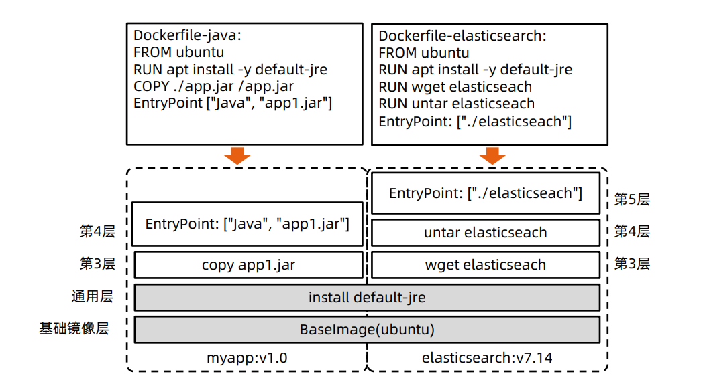

##### Docker 的文件系统

典型的Linux文件系统组成：

- Bootfs（boot file system）
    - Bootloader-引导加载kernel，
    - Kernel-当kernel被加载到内存中后umount
    bootfs。
- rootfs（root file system）
    - /dev，/proc，/bin，/etc等标准目录和文件。
    - 对于不同的linux发行版, bootfs基本是一致的，
    但rootfs会有差别。


##### Docker 启动

Linux

- 在启动后，首先将rootfs设置为readonly, 进行一系列检查, 然后将其切换为“readwrite”供用户使用。

Docker启动

- 初始化时也是将rootfs以readonly方式加载并检查，然而接下来利用union mount 的方式将一个
    readwrite文件系统挂载在readonly的rootfs之上；
- 并且允许再次将下层的FS（file system）设定为readonly并且向上叠加。
- 这样一组readonly和一个writeable的结构构成一个container的运行时态, 每一个FS被称作一个FS层。


#### 写操作

由于镜像具有共享特性，所以对容器可写层的操作需要依赖存储驱动提供的写时复制和用时分配机制，以此来
支持对容器可写层的修改，进而提高对存储和内存资源的利用率。

- 写时复制
    - 写时复制，即Copy-on-Write。
    - 一个镜像可以被多个容器使用，但是不需要在内存和磁盘上做多个拷贝。
    - 在需要对镜像提供的文件进行修改时，该文件会从镜像的文件系统被复制到容器的可写层的文件系统
       进行修改，而镜像里面的文件不会改变。
    - 不同容器对文件的修改都相互独立、互不影响。
- 用时分配

按需分配空间，而非提前分配，即当一个文件被创建出来后，才会分配空间。


#### 容器存储驱动

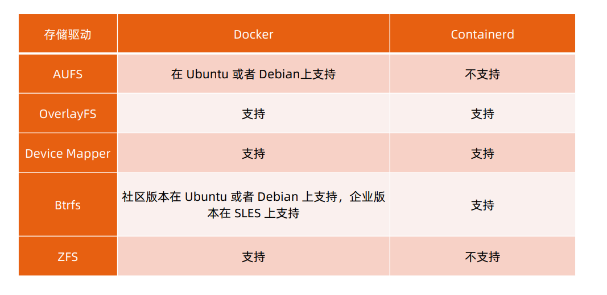

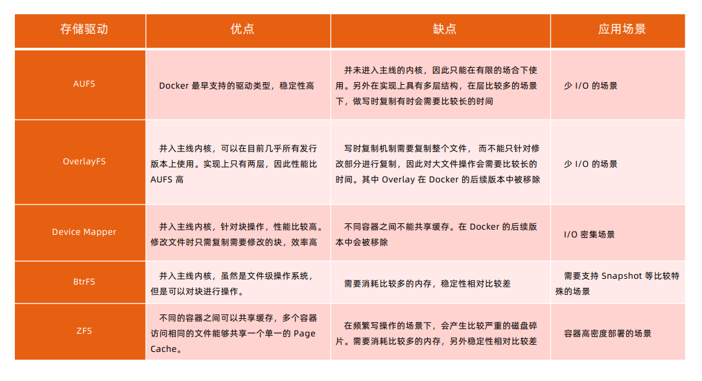

#### 以 OverlayFS 为例

OverlayFS也是一种与AUFS类似的联合文件系统，同样属于文件级的存储驱动，包含了最初的Overlay和
更新更稳定的overlay2。

Overlay只有两层：upper层和lower层，Lower层代表镜像层，upper层代表容器可写层。

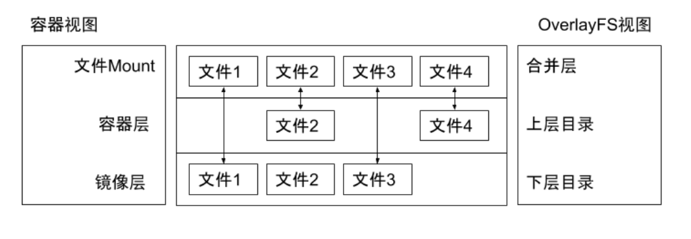

##### OverlayFS 文件系统练习

$ mkdirupper lower merged work

$ echo "from lower" > lower/in_lower.txt

$ echo "from upper" > upper/in_upper.txt

$ echo "from lower" > lower/in_both.txt

$ echo "from upper" > upper/in_both.txt

$ sudomount -t overlay overlay -o lowerdir=`pwd`/lower,upperdir=`pwd`/upper,workdir=`pwd`/work
`pwd`/merged

$ cat merged/in_both.txt

$ delete merged/in_both.txt

$ delete merged/in_lower.txt

$ delete merged/in_upper.txt


#### OCI 容器标准

Open Container Initiative

- OCI组织于 2015 年创建，是一个致力于定义容器镜像标准和运行时标准的开放式组织。
- OCI定义了镜像标准（Runtime Specification）、运行时标准（Image Specification）和分发标准
    （DistributionSpecification）
       - 镜像标准定义应用如何打包
       - 运行时标准定义如何解压应用包并运行
       - 分发标准定义如何分发容器镜像


#### Docker 引擎架构

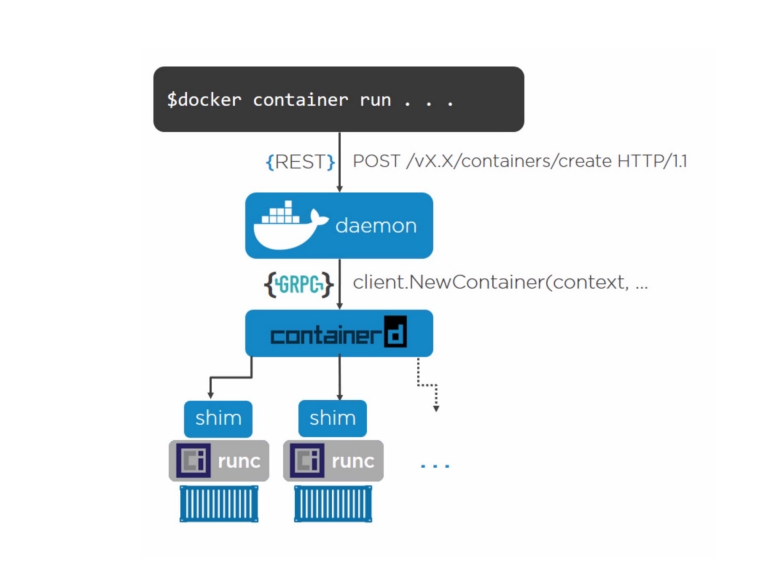

#### 网络

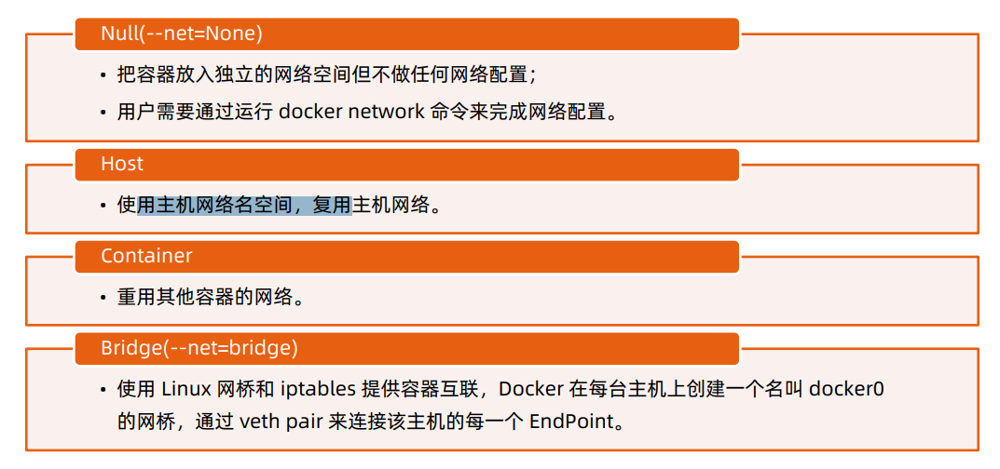
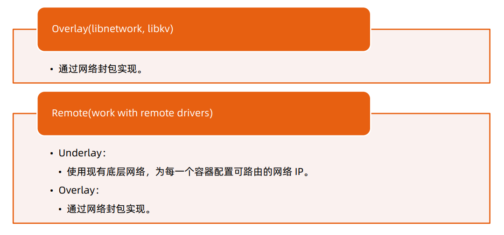

##### Null 模式

- Null 模式是一个空实现；
- 可以通过Null模式启动容器并在宿主机上通
    过命令为容器配置网络。

```
mkdir-p /var/run/netns
find -L /var/run/netns-type l -delete
ln -s /proc/$pid/ns/net /var/run/netns/$pid
iplink add A type vethpeer name B
brctladdifbr0 A
iplink set A up
iplink set B netns$pid
ipnetnsexec $pidiplink set dev B name eth0
ipnetnsexec $pidiplink set eth0 up
ipnetnsexec $pidipaddradd
$SETIP/$SETMASK dev eth0
ipnetnsexec $pidiproute add default via
$GATEWAY
```

##### 默认模式– 网桥和 NAT

为主机eth0分配IP192.168.0.101；

启动dockerdaemon，查看主机iptables；

- POSTROUTING-A POSTROUTING -s 172.17.0.0/16! -o docker0 -j MASQUERADE

在主机启动容器：

- docker run -d --name ssh-p 2333:22 centos-ssh
- Docker会以标准模式配置网络：
    - 创建vethpair；
    - 将vethpair的一端连接到docker0网桥；
    - vethpair的另外一端设置为容器名空间的eth0；
    - 为容器名空间的eth0分配ip；
    - 主机上的Iptables 规则：PREROUTING-A DOCKER! -idocker0 -p tcp-m tcp--dport 2333 - j DNAT --to-
       destination 172.17.0.2:22。

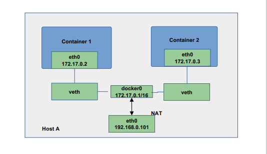

#### Underlay

- 采用Linux 网桥设备（sbrctl），通过物理网络连通容器；
- 创建新的网桥设备mydr0；
- 将主机网卡加入网桥；
- 把主机网卡的地址配置到网桥，并把默认路由规则转移到网桥mydr0；
- 启动容器；
- 创建veth对，并且把一个peer添加到网桥mydr0；
- 配置容器把veth的另一个peer分配给容器网卡；

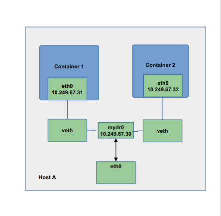

#### Docker Libnetwork Overlay

l Dockeroverlay网络驱动原生支持多主机网络；

l Libnetwork是一个内置的基于VXLAN的网络驱动。


#### VXLAN

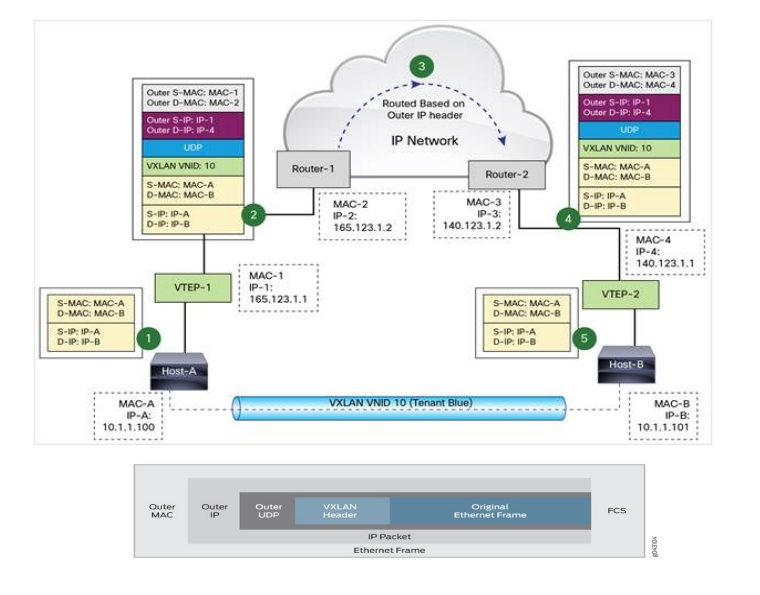

#### Overlay network sample – Flannel

- 同一主机内的 Pod可以使用网桥进行通信。

- 不同主机上的 Pod将通过flanneld将其流量封装在UDP数据包中。

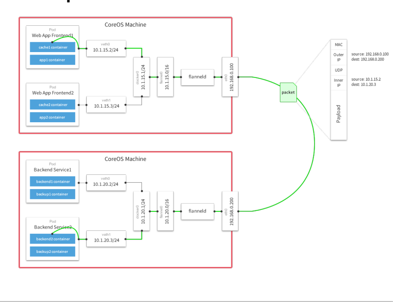


#### Flannel packet sample

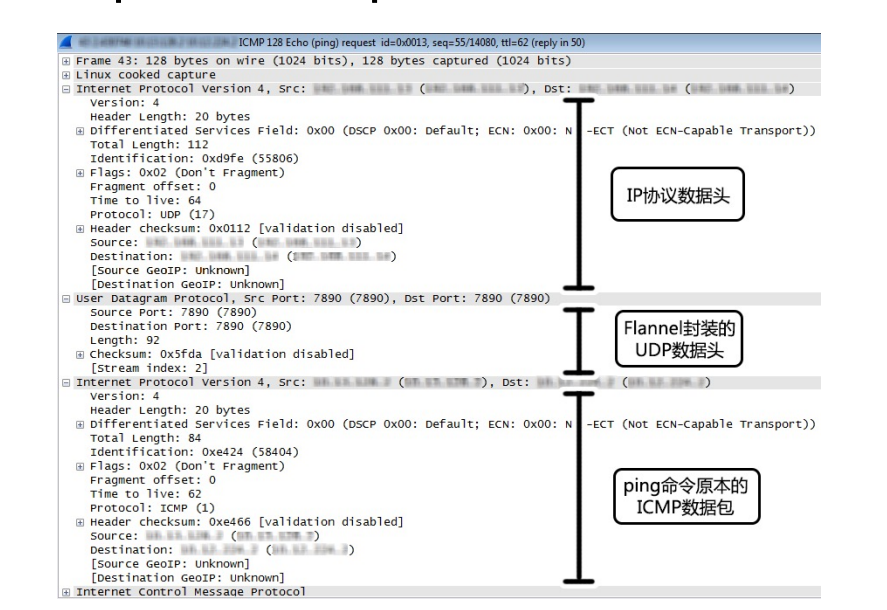

##### 创建 docker 镜像

定义dockerfile

```
FROM ubuntu
# so aptENV DEBIAN_FRONTEND=-get doesn't complainnoninteractive
RUN sed-i's/^exit 101/exit 0/' /usr/sbin/policy-rc.d
RUN \
aptapt--get update get install -y ca&& \-certificates && \
apt-get install -y curl && \
rm-rf/var/lib/apt/lists/*
ADD ENTRYPOINT ./bin/eiceic["/eic"]
```
docker build
```
docker build
```

### 3. Dockerfile 的最佳实践


#### 回顾 12 Factor 之进程

- 运行环境中，应用程序通常是以一个和多个进程运行的。
    - 12 - Factor 应用的进程必须无状态（Stateless）且无共享（Share nothing）。
- 任何需要持久化的数据都要存储在后端服务内，比如数据库。
    - 应在构建阶段将源代码编译成待执行应用。
- Session Sticky是 12 - Factor 极力反对的。
    - Session 中的数据应该保存在诸如Memcached或Redis这样的带有过期时间
       的缓存中。

Docker遵循以上原则管理和构建应用。


#### 理解构建上下文（Build Context）

- 当运行dockerbuild命令时，当前工作目录被称为构建上下文。
- dockerbuild 默认查找当前目录的Dockerfile作为构建输入，也可以通过–f指定Dockerfile。
    - docker build –f ./Dockerfile
- 当dockerbuild运行时，首先会把构建上下文传输给dockerdaemon，把没用的文件包含在构建上下文时，会
    导致传输时间长，构建需要的资源多，构建出的镜像大等问题。
       - 试着到一个包含文件很多的目录运行下面的命令，会感受到差异；
       - docker build -f $GOPATH/src/github.com/cncamp/golang/httpserver/Dockerfile；
       - docker build $GOPATH/src/github.com/cncamp/golang/httpserver/；
       - 可以通过.dockerignore文件从编译上下文排除某些文件。
- 因此需要确保构建上下文清晰，比如创建一个专门的目录放置Dockerfile，并在目录中运行dockerbuild。


#### 镜像构建日志

docker build $GOPATH/src/github.com/cncamp/golang/httpserver/
Sending build context to Docker daemon 14.57MB
Step 1/4 : FROM ubuntu
---> cf0f3ca922e0
Step 2/4 : ENV MY_SERVICE_PORT=80
---> Using cache
---> a7d824f74410
Step 3/4 : ADD bin/amd64/httpserver/httpserver
---> Using cache
---> 00bb47fce704
Step 4/4 : ENTRYPOINT /httpserver
---> Using cache
---> f77ee3366d08
Successfully built f77ee3366d08


#### Build Cache

构建容器镜像时，Docker依次读取Dockerfile中的指令，并按顺序依次执行构建指令。

Docker读取指令后，会先判断缓存中是否有可用的已存镜像，只有已存镜像不存在时才会重新构建。

- 通常Docker简单判断Dockerfile中的指令与镜像。
- 针对ADD和COPY指令，Docker判断该镜像层每一个文件的内容并生成一个checksum，与现存镜
    像比较时，Docker比较的是二者的checksum。
- 其他指令，比如RUN apt-get -y update，Docker简单比较与现存镜像中的指令字串是否一致。
- 当某一层cache失效以后，所有所有层级的cache均一并失效，后续指令都重新构建镜像。


#### 多段构建（Multi-stage build）

- 有效减少镜像层级的方式
FROM golang:1.16-alpine AS build
RUN apkadd --no-cache git
RUN go get github.com/golang/dep/cmd/dep

COPY Gopkg.lockGopkg.toml/go/src/project/
WORKDIR /go/src/project/
RUN dep ensure -vendor-only

COPY. /go/src/project/
RUN go build -o /bin/project（只有这个二进制文件是产线需要的，其他都是waste）

FROM scratch
COPY --from=build /bin/project /bin/project
ENTRYPOINT ["/bin/project"]
CMD ["--help"]


#### Dockerfile 常用指令

- FROM：选择基础镜像，推荐alpine

FROM [--platform=<platform>] <image>[@<digest>] [AS <name>]

- LABELS：按标签组织项目

LABEL multi.label1="value1" multi.label2="value2" other="value3”

配合labelfilter可过滤镜像查询结果

docker images -f label=multi.label1="value1"

- RUN：执行命令

最常见的用法是RUN apt-get update && apt-get install，这两条命令应该永远用&&连接，如果分开执行，RUN
apt-get update 构建层被缓存，可能会导致新package无法安装

- CMD：容器镜像中包含应用的运行命令，需要带参数

CMD ["executable", "param1", "param2"...]


#### Dockerfile 常用指令

- EXPOSE：发布端口
```
    EXPOSE <port> [<port>/<protocol>...]
    - 是镜像创建者和使用者的约定
    - 在dockerrun –P时，docker会自动映射expose的端口到主机大端口，如0.0.0.0:32768->80/tcp
```

- ENV 设置环境变量
```
ENV <key>=<value> ...
```

- ADD：从源地址（文件，目录或者URL）复制文件到目标路径
```
ADD [--chown=<user>:<group>] <src>... <dest>

ADD [--chown=<user>:<group>] [“<src>”,... “<dest>”] （路径中有空格时使用）
```
- ADD支持Go风格的通配符，如ADD check* /testdir/
- src如果是文件，则必须包含在编译上下文中，ADD 指令无法添加编译上下文之外的文件
- src如果是URL
    - 如果dest结尾没有/，那么dest是目标文件名，如果dest结尾有/，那么dest是目标目录名
- 如果src是一个目录，则所有文件都会被复制至dest
- 如果src是一个本地压缩文件，则在ADD 的同时完整解压操作
- 如果dest不存在，则ADD 指令会创建目标目录
- 应尽量减少通过ADDURL 添加remote 文件，建议使用curl 或者wget&& untar


- COPY：从源地址（文件，目录或者URL）复制文件到目标路径
```
COPY [--chown=<user>:<group>] <src>... <dest>

COPY [--chown=<user>:<group>] ["<src>",... "<dest>"]//路径中有空格时使用
```
- COPY的使用与ADD类似，但有如下区别
- COPY 只支持本地文件的复制，不支持URL
- COPY 不解压文件
- COPY可以用于多阶段编译场景，可以用前一个临时镜像中拷贝文件
    - COPY --from=build /bin/project /bin/project

COPY 语义上更直白，复制本地文件时，优先使用COPY


- ENTRYPOINT：定义可以执行的容器镜像入口命令
```
ENTRYPOINT ["executable", "param1", "param2"] // docker run参数追加模式

ENTRYPOINT command param1 param2 // docker run参数替换模式
```
- docker run –entrypoint可替换Dockerfile中定义的ENTRYPOINT
- ENTRYPOINT的最佳实践是用ENTRYPOINT定义镜像主命令，并通过CMD定义主要参数，如下所示
    - ENTRYPOINT ["s3cmd"]
    - CMD ["--help"]


##### Dockerfile 常用指令

- VOLUME：将指定目录定义为外挂存储卷，Dockerfile中在该指令之后所有对同一目录的修改都无效
```
VOLUME ["/data"]
```
等价于docker run –v /data，可通过dockerinspect查看主机的mountpoint，
/var/lib/docker/volumes/<containerid>/_data
- USER：切换运行镜像的用户和用户组，因安全性要求，越来越多的场景要求容器应用要以non-root身份运行
```
USER <user>[:<group>]
```
- WORKDIR：等价于cd，切换工作目录
```
WORKDIR /path/to/workdir
```
- 其他非常用指令
    - ARG
    - ONBUILD
    - STOPSIGNAL
    - HEALTHCHECK
    - SHELL


#### Dockerfile 最佳实践

- 不要安装无效软件包。
- 应简化镜像中同时运行的进程数，理想状况下，每个镜像应该只有一个进程。
- 当无法避免同一镜像运行多进程时，应选择合理的初始化进程（initprocess）。
- 最小化层级数
    - 最新的docker只有RUN，COPY，ADD创建新层，其他指令创建临时层，不会增加镜像大小。
       - 比如EXPOSE指令就不会生成新层。
    - 多条RUN命令可通过连接符连接成一条指令集以减少层数。
    - 通过多段构建减少镜像层数。
- 把多行参数按字母排序，可以减少可能出现的重复参数，并且提高可读性。
- 编写dockerfile的时候，应该把变更频率低的编译指令优先构建以便放在镜像底层以有效利用buildcache。
- 复制文件时，每个文件应独立复制，这确保某个文件变更时，只影响改文件对应的缓存。

目标：易管理、少漏洞、镜像小、层级少、利用缓存。


#### 多进程的容器镜像

- 选择适当的init进程
    - 需要捕获SIGTERM信号并完成子进程的优雅终止
    - 负责清理退出的子进程以避免僵尸进程

开源项目

https://github.com/krallin/tini


#### Docker 镜像管理

dockersave/load

dockertag

dockerpush/pull


#### 基于 Docker 镜像的版本管理

- Docker tag

docker tag命令可以为容器镜像添加标签

docker tag 0e5574283393 hub.docker.com/cncamp/httpserver:v1.0

hub.docker.com：镜像仓库地址，如果不填，则默认为hub.docker.com

cncamp:repositry

httpserver：镜像名

v1.0：tag，常用来记录版本信息


#### Docker tag 与 github 的版本管理合力

- 以Kubernetes为例
    - 开发分支
       - git checkout master
    - Release分支
       - git checkout –b release-1.21
    - 在并行期，所有的变更同时放进master和releasebranch
    - 版本发布
       - 以releasebranch为基础构建镜像，并为镜像标记版本信息：docker tag 0e5574283393
          k8s.io/kubernetes/apiserver:v1.21
    - 在github中保存release代码快照
       - git tag v1.21


#### 镜像仓库

Docker hub

- https://hub.docker.com/

创建私有镜像仓库

- sudodocker run -d -p 5000:5000 registry


##### Docker 优势

封装性：

- 不需要再启动内核，所以应用扩缩容时可以秒速启动。
- 资源利用率高，直接使用宿主机内核调度资源，性能损失
    小。
- 方便的CPU、内存资源调整。
- 能实现秒级快速回滚。
- 一键启动所有依赖服务，测试不用为搭建环境犯愁，PE也不用为
    建站复杂担心。
- 镜像一次编译，随处使用。
- 测试、生产环境高度一致（数据除外）。

镜像增量分发：

- 由于采用了Union FS，简单来说就是支持将不同的目录
    挂载到同一个虚拟文件系统下，并实现一种layer的概
    念，每次发布只传输变化的部分，节约带宽。

隔离性：

- 应用的运行环境和宿主机环境无关，完全由镜像控制，一台物理
    机上部署多种环境的镜像测试。
- 多个应用版本可以并存在机器上。

社区活跃：

- Docker命令简单、易用，社区十分活跃，且周边组件丰富。

