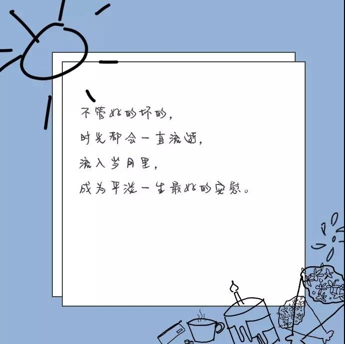
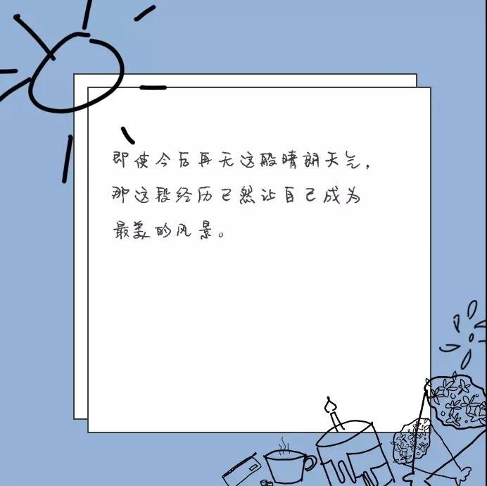
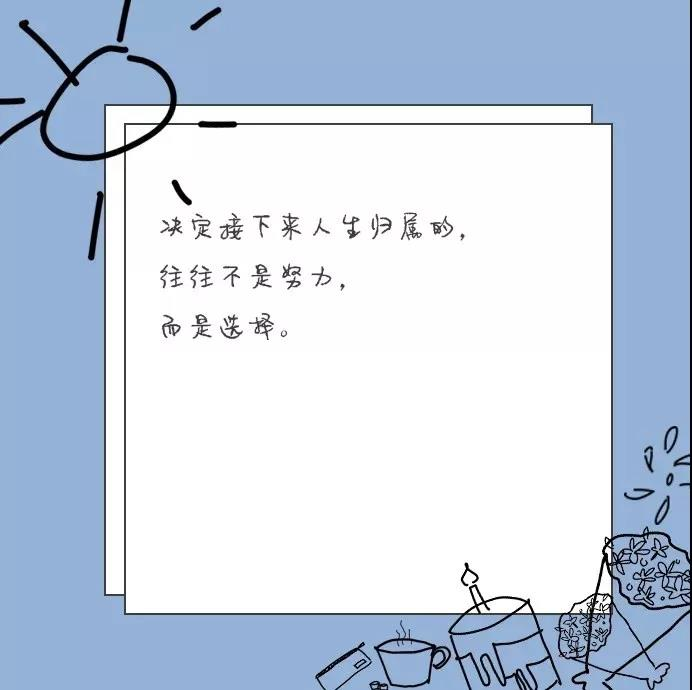

# 决定接下来人生归属的，不是努力，而是选择

当我们被困在当下这个时间里面，我们因为委屈而流泪，不公而愤怒，失败而心酸，生活总是有那么多不如意的时刻的。
可是生活不就该如此吗，梦想能轻易实现的话是不配成为梦想的。在多年以后，记忆经过时间的淘选，最后刻在脑海里的，不是那些无处发泄的情绪，而是天刚微亮去往学校的那条马路，是一起加班至深夜的麻辣烫外卖，最终变成一个个平凡又特殊的画面，印在我们的人生画布上。

别把此刻的结果看得太重，你要相信自己，相信未来，一切真的会有最好的安排的，而到时，你会感谢此刻的选择。