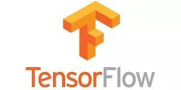
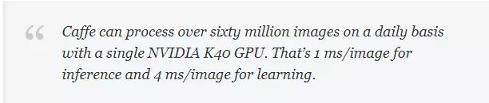
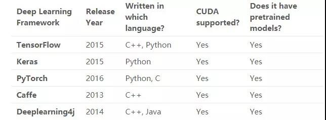

# 数据科学家必知的 5 个深度学习框架

从出道起，我就一直是一名程序员。我喜欢从头开始编写代码，这有助于我清楚地理解主题（或技巧）。当我们刚开始学习数据科学时，这种方法尤为有用。

尝试从无到有地实现一个神经网络，你将会明白很多有趣的事情。但是当需要为现实世界的数据集构建深度学习模型时，这还是一个不错的主意吗？如果你需要几天或几周的时间来建立起模型，这是完全不可能的。

对于那些无法访问无限计算资源的人来说，你们已经来到了正确的地方。


值得庆幸的是，我们现在已经有了易于使用的开源深度学习框架，旨在简化复杂和大规模深度学习模型的实现。使用这些神奇的框架，我们可以实现诸如卷积神经网络这样复杂的模型。

在本文中，将介绍5种非常有用的深度学习框架、它们的优点以及应用。我们将对每个框架进行比较，以了解何时何地可以使用它们。
**我们还创建了一个非常酷的针对每个深度学习框架的信息图表，附在在文章的末尾，为每个数据科学家所必备。**

## 目录

* 一、什么是深度学习框架？
* 二、TensorFlow
* 三、Keras
* 四、PyTorch
* 五、Caffe
* 六、Deeplearning4j
* 七、五个深度学习框架之间的对比

### 一、什么是深度学习框架？

让我们用一个例子来理解这个概念，来看以下图像集合：


在这个图像中有不同的分类：猫，骆驼，鹿，大象等。我们的任务是将这些图像归到相应的类（或类别）中。用Google搜索一下就能知道：**卷积神经网络（CNNs）**对于这类图像分类任务十分有效。

我们要做的工作就是实现这个模型，对吗？如果从头开始编写一个卷积神经网络，则需要几天（甚至几周）才能得到一个有效的模型，我们却没法等这么长的时间！

这正是深度学习框架真正改变了局面的地方。


>深度学习框架是一种界面、库或工具，它使我们在无需深入了解底层算法的细节的情况下，能够更容易、更快速地构建深度学习模型。深度学习框架利用预先构建和优化好的组件集合定义模型，为模型的实现提供了一种清晰而简洁的方法。

利用恰当的框架来快速构建模型，而无需编写数百行代码，一个良好的深度学习框架具备以下关键特征：

* 优化的性能
* 易于理解和编码
* 良好的社区支持
* 并行化的进程，以减少计算
* 自动计算梯度

这五点也是我用来挑选五大顶级深度学习框架的标准。下面让我们详细研究一下它们。

### 二、TensorFlow



TensorFlow是由谷歌大脑团队的研究人员和工程师开发的，它是深度学习领域中最常用的软件库（尽管其他软件正在迅速崛起）。


>我喜欢TensorFlow的原因有两点：它完全是开源的，并且有出色的社区支持。TensorFlow为大多数复杂的深度学习模型预先编写好了代码，比如递归神经网络和卷积神经网络。

TensorFlow如此流行的最大原因之一是支持多种语言来创建深度学习模型，比如Python、C和R，并且有不错的文档和指南。

TensorFlow有许多组件，其中最为突出的是：

* Tensorboard：帮助使用数据流图进行有效的数据可视化
* TensorFlow：用于快速部署新算法/试验

TensorFlow的灵活架构使我们能够在一个或多个CPU（以及GPU）上部署深度学习模型。下面是一些典型的TensorFlow用例：

* 基于文本的应用：语言检测、文本摘要
* 图像识别：图像字幕、人脸识别、目标检测
* 声音识别
* 时间序列分析
* 视频分析

用例远远不止这些，如果你知道TensorFlow还有以上所述之外的其他应用，我很乐意知道！可以在本文的评论部分告诉我，我们再做讨论。

安装TensorFlow也是一个非常简单的任务。

对于CPU：

``` python
pip install tensorflow
```

对于启用CUDA的GPU卡：

``` python
pip install tensorflow-gpu
```

通过以下综合教程了解如何使用TensorFlow建立神经网络模型：

* [利用TensorFlow实现神经网络简介](https://www.analyticsvidhya.com/blog/2016/10/an-introduction-to-implementing-neural-networks-using-tensorflow/?utm_source=blog&utm_medium=comparison-deep-learning-framework)
* [TensorFlow教程](https://www.tensorflow.org/tutorials)

### 三、Keras


你习惯使用Python吗？如果是，那么可以立即连接到Keras。这是一个开启你的深度学习之旅的完美的框架。

Keras用Python编写，可以在TensorFlow（以及CNTK和Theano）之上运行。TensorFlow的接口具备挑战性，因为它是一个低级库，新用户可能会很难理解某些实现。

而Keras是一个高层的API，它为快速实验而开发。因此，如果希望获得快速结果，Keras会自动处理核心任务并生成输出。Keras支持卷积神经网络和递归神经网络，可以在CPU和GPU上无缝运行。

深度学习的初学者经常会抱怨：无法正确理解复杂的模型。如果你是这样的用户，Keras便是你的正确选择！它的目标是最小化用户操作，并使其模型真正容易理解。

可以将Keras中的模型大致分为两类：

1. 序列化

模型的层是按顺序定义的。这意味着当我们训练深度学习模型时，这些层次是按顺序实现的。下面是一个顺序模型的示例：

``` python
from keras.models import Sequential
from keras.layers import Dense

model = Sequential()
# we can add multiple layers to the model using .add()
model.add(Dense(units=64, activation='relu', input_dim=100))
model.add(Dense(units=10, activation='softmax'))
```

2. Keras 函数API

用于定义复杂模型，例如多输出模型或具有共享层的模型。请查看下面的代码来理解这一点：

``` python
from keras.layers import Input, Dense
from keras.models import Model

inputs = Input(shape=(100,)) # specify the input shape
x = Dense(64, activation='relu')(inputs)
predictions = Dense(10, activation='softmax')(x)

model = Model(inputs=inputs, outputs=predictions)
```

Keras有多种架构，如下所述，用于解决各种各样的问题，其中包括我的最爱之一：图像分类！

* VGG 16
* VGG 19
* InceptionV 3
* Mobilenet及更多
可以参考官方的Keras文档来详细了解框架是如何工作的。
[Keras官方中文文档](https://keras.io/zh/​)

仅需一行代码即可安装Keras：

```python
pip install keras
```

对Keras感兴趣？可以继续学习以下教程，了解如何使用Keras实现神经网络：

[基于Keras的神经网络优化](https://www.analyticsvidhya.com/blog/2016/10/tutorial-optimizing-neural-networks-using-keras-with-image-recognition-case-study/?utm_source=blog&utm_medium=comparison-deep-learning-framework)

### 四、PyTorch

还记得我们说过TensorFlow是目前最常用的深度学习框架吗？但是如果考虑到数据科学家和开发者们拥抱Facebook的PyTorch的速度，那它可能很快就要落伍了。

我是PyTorch的拥护者，在我所研究过的框架中，PyTorch最富灵活性。

PyTorch是Torch深度学习框架的一个接口，可用于建立深度神经网络和执行张量计算。Torch是一个基于Lua的框架，而PyTorch则运行在Python上。

PyTorch是一个Python包，它提供张量计算。张量是多维数组，就像numpy的ndarray一样，它也可以在GPU上运行。PyTorch使用动态计算图，PyTorch的Autograd软件包从张量生成计算图，并自动计算梯度。

与特定功能的预定义的图表不同，PyTorch提供了一个框架，用于在运行时构建计算图形，甚至在运行时也可以对这些图形进行更改。当不知道创建神经网络需要多少内存的情况下，这个功能便很有价值。

可以使用PyTorch处理各种来自深度学习的挑战，包括：

* 影像（检测、分类等）
* 文本(NLP)
* 增强学习

想知道如何在机器上安装PyTorch，请稍等片刻。安装步骤取决于操作系统、需要安装的PyTorch包、正在使用的工具/语言、CUDA等其他一些因素。

根据此链接的内容检查PyTorch安装步骤，准备好框架之后，再检查以下两个资源，利用PyTorch构建第一个神经网络：

* [学习如何使用PyTorch来构建快速和准确的神经网络-4个不错的案例研究](https://www.analyticsvidhya.com/blog/2019/01/guide-pytorch-neural-networks-case-studies/https://www.analyticsvidhya.com/blog/2019/01/guide-pytorch-neural-networks-case-studies/?utm_source=blog&amp;utm_medium=comparison-deep-learning-framework)

* [PyTorch教程](https://pytorch.org/tutorials/beginner/deep_learning_60min_blitz.html)

### 五、Caffe

CAFE是另一个面向图像处理领域的、比较流行的深度学习框架，它是由贾阳青（Yangqing Jia）在加利福尼亚伯克利大学读博士期间开发的。同样，它也是开源的！

首先，Caffe对递归网络和语言建模的支持不如上述三个框架。但是Caffe最突出的地方是它的处理速度和从图像中学习的速度。



>Caffe可以每天处理超过六千万张图像，只需单个NVIDIA K40 GPU，其中 1毫秒/图像用于推理，4毫秒/图像用于学习。

它为C、Python、MATLAB等接口以及传统的命令行提供了坚实的支持。

通过Caffe Model Zoo框架可访问用于解决深度学习问题的预训练网络、模型和权重。这些模型可完成下述任务：

* 简单的递归
* 大规模视觉分类
* 用于图像相似性的SiameSE网络
* 语音和机器人应用

有关更多细节，您可以查看Caffe相关文档。

[Caffe安装文档](http://caffe.berkeleyvision.org/installation.html)

[Caffe文档](http://caffe.berkeleyvision.org/)

### 六、Deeplearning4j


我们社区中有Java程序员吗？这是你理想的深度学习框架！Deeplearning4j是用Java实现的，因此与Python相比效率更高。它使用称为ND4J的张量库，提供了处理n维数组（也称为张量）的能力。该框架还支持CPU和GPU。

Deeplearning4j将加载数据和训练算法的任务作为单独的过程处理，这种功能分离提供了很大的灵活性。谁都喜欢这样，尤其是在深度学习中！

Deeplearning4j也适用于不同的数据类型：

* 图像
* CSV
* 纯文本等

可以使用Deeplearning4j构建的深度学习模型有：

* 卷积神经网络(CNNs)
* 递归神经网络(RNNs)
* 长短时记忆(LSTM)等多种结构

阅读Deeplearning4j的安装步骤和文档，开始使用这个框架。

[Deeplearning4j安装步骤](https://deeplearning4j.org/docs/latest/deeplearning4j-config-gpu-cpu)

[Deeplearning4j文档](https://deeplearning4j.org/docs/latest/deeplearning4j-quickstart)

### 七、五种深度学习框架之间的对比

上面已经讨论了五个最流行的深度学习框架，每一个都独具特性，那么数据科学家会如何做出选择呢。

你决定用哪一种了吗？或者你打算换一个全新的框架？不管是什么情况，了解每个框架的优点和局限性非常重要。如果选对了正确的框架，当遇到错误时，便不会感到惊讶了！

某些框架在处理图像数据时工作得非常好，但无法解析文本数据；某些框架在处理图像和文本数据时，性能很好，但是它们的内部工作原理很难理解。
在本节中，将使用以下标准比较这五个深度学习框架：

* 社区支持力度
* 使用的语言
* 接口
* 对预训练的模型的支持

下表对这些框架进行了比较：



对于选择使用的框架来说，这是一个非常方便的对比表！

所有这些框架都是开源的，支持CUDA，并有预训练的模型。**但是，应该如何正确开始，应该选择哪个框架来构建（初始）深度学习模型？**让我们来做详细的讨论！

* [TensorFlow](https://www.tensorflow.org)

我们先来说说TensortFlow。TensorFlow能处理图像以及基于序列的数据，如果你是深度学习的初学者，或者对线性代数和微积分等数学概念没有坚实的基础，那么TensortFlow的学习曲线将会令人畏惧地陡峭。

我完全理解，对于刚起步的人来说，这可能太复杂。但我建议你不断练习，不断探索社区，并继续阅读文章以掌握TensorFlow的诀窍。一旦对这个框架有了一个很好的理解，实现一个深度学习模型对你来说将是易如反掌。

* [Keras](https://keras.io/zh/​)

Keras是一个非常坚实的框架，可以开启深度学习之旅。如果你熟悉Python，并且没有进行一些高级研究或开发某种特殊的神经网络，那么Keras适合你。

Keras的重点更多地放在取得成果上，而不是被模型的复杂之处所困扰。因此，如果有一个与图像分类或序列模型相关的项目，可以从Keras开始，很快便可以构建出一个工作模型。

Keras也集成在TensorFlow中，因此也可以使用tf.keras.构建模型。

* [PyTorch](https://pytorch.org/)

与特定功能的预定义的图表不同，PyTorch提供了一个框架，用于在运行时构建计算图形，甚至在运行时也可以对这些图形进行更改。当不知道创建神经网络需要多少内存的情况下，这个功能便很有价值。

* [Caffe](http://caffe.berkeleyvision.org/)

在图像数据上构建深度学习模型时，Caffe是不错的选择。但是，当谈到递归神经网络和语言模型时，Caffe落后于我们讨论过的其他框架。**Caffe的主要优点是，即使没有强大的机器学习或微积分知识，也可以构建出深度学习模型。**

Caffe主要用于建立和部署移动电话和其他计算受限平台的深度学习模型。

* [Deeplearning4j](https://deeplearning4j.org/docs/latest/deeplearning4j-quickstart)

正如之前所述，DeepleEarning4J是Java程序员的天堂。它为CNNS、RNN和LSTMS等不同的神经网络提供了大量的支持，它在不牺牲速度的情况下可以处理大量数据。听起来不错，有机会通过！

### 后记及图示信息图

记住，这些框架基本上只是帮助我们实现最终目标的工具，正确地选择它们可以减少大量的精力和时间。

除了文中提及的五种深度学习框架之外，你有没有其他的深度学习框架？很想听听你的想法和反馈。请issues me。