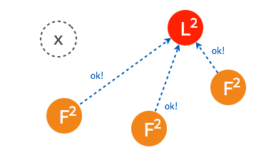
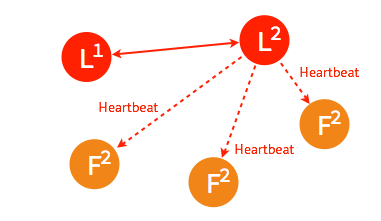
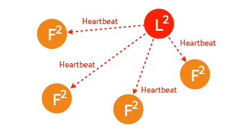

# Raft算法和Gossip协议
简单介绍下集群数据同步，集群监控用到的两种常见算法。
## Raft算法
raft 集群中的每个节点都可以根据集群运行的情况在三种状态间切换：follower, candidate 与 leader。leader 向 follower 同步日志，follower 只从 leader 处获取日志。在节点初始启动时，节点的 raft 状态机将处于 follower 状态并被设定一个 election timeout，如果在这一时间周期内没有收到来自 leader 的 heartbeat，节点将发起选举：节点在将自己的状态切换为 candidate 之后，向集群中其它 follower 节点发送请求，询问其是否选举自己成为 leader。当收到来自集群中过半数节点的接受投票后，节点即成为 leader，开始接收保存 client 的数据并向其它的 follower 节点同步日志。leader 节点依靠定时向 follower 发送 heartbeat 来保持其地位。任何时候如果其它 follower 在 election timeout 期间都没有收到来自 leader 的 heartbeat，同样会将自己的状态切换为 candidate 并发起选举。每成功选举一次，新 leader 的步进数都会比之前 leader 的步进数大1。

Raft一致性算法处理日志复制以保证强一致性。

## follower 节点不可用
follower 节点不可用的情况相对容易解决。因为集群中的日志内容始终是从 leader 节点同步的，只要这一节点再次加入集群时重新从 leader 节点处复制日志即可。
## leader 不可用
一般情况下，leader 节点定时发送 heartbeat 到 follower 节点。

由于某些异常导致 leader 不再发送 heartbeat ，或 follower 无法收到 heartbeat 。

当某一 follower 发生 election timeout 时，其状态变更为 candidate，并向其他 follower 发起投票。

当超过半数的 follower 接受投票后，这一节点将成为新的 leader，leader 的步进数加1并开始向 follower 同步日志。

当一段时间之后，如果之前的 leader 再次加入集群，则两个 leader 比较彼此的步进数，步进数低的 leader 将切换自己的状态为 follower。

较早前 leader 中不一致的日志将被清除，并与现有 leader 中的日志保持一致。

## Gossip协议
传统的监控，如ceilometer，由于每个节点都会向server报告状态，随着节点数量的增加server的压力随之增大。分布式健康检查可以解决这类性能瓶颈，降节点数量从数百台扩至数千台，甚至更多。

Agent在每台节点上运行，可以在每个Agent上添加一些健康检查的动作，Agent会周期性的运行这些动作。用户可以添加脚本或者请求一个URL链接。一旦有健康检查报告失败，Agent就把这个事件上报给服务器节点。用户可以在服务器节点上订阅健康检查事件，并处理这些报错消息。

在所有的Agent之间（包括服务器模式和普通模式）运行着Gossip协议。服务器节点和普通Agent都会加入这个Gossip集群，收发Gossip消息。每隔一段时间，每个节点都会随机选择几个节点发送Gossip消息，其他节点会再次随机选择其他几个节点接力发送消息。这样一段时间过后，整个集群都能收到这条消息。示意图如下。

Gossip协议已经是P2P网络中比较成熟的协议了。Gossip协议的最大的好处是，即使集群节点的数量增加，每个节点的负载也不会增加很多，几乎是恒定的。这就允许Consul管理的集群规模能横向扩展到数千个节点。

Consul的每个Agent会利用Gossip协议互相检查在线状态，本质上是节点之间互Ping，分担了服务器节点的心跳压力。如果有节点掉线，不用服务器节点检查，其他普通节点会发现，然后用Gossip广播给整个集群。

Gossip算法又被称为反熵（Anti-Entropy），熵是物理学上的一个概念，代表杂乱无章，而反熵就是在杂乱无章中寻求一致，这充分说明了Gossip的特点：在一个有界网络中，每个节点都随机地与其他节点通信，经过一番杂乱无章的通信，最终所有节点的状态都会达成一致。每个节点可能知道所有其他节点，也可能仅知道几个邻居节点，只要这些节可以通过网络连通，最终他们的状态都是一致的，当然这也是疫情传播的特点。

要注意到的一点是，即使有的节点因宕机而重启，有新节点加入，但经过一段时间后，这些节点的状态也会与其他节点达成一致，也就是说，Gossip天然具有分布式容错的优点。

Gossip协议实现 [serf](https://github.com/hashicorp/serf)