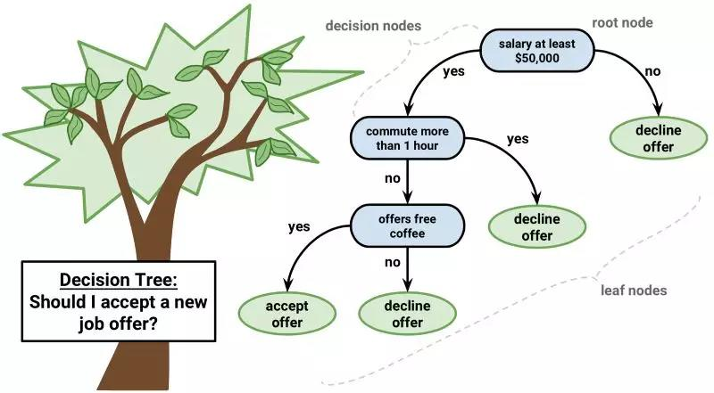
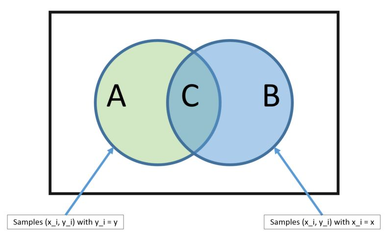
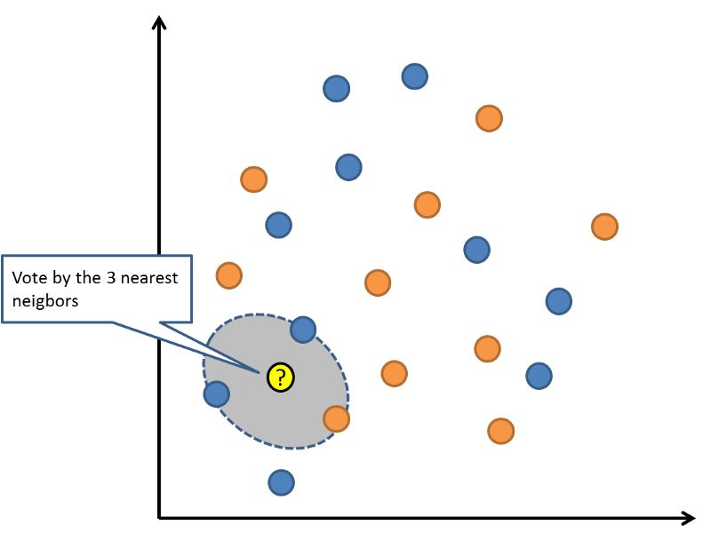

# 必学的 10 大算法

>10 大常用机器学习算法，包括线性回归、Logistic 回归、线性判别分析、朴素贝叶斯、KNN、随机森林等。

## 线性回归

在统计学和机器学习领域，线性回归可能是最广为人知也最易理解的算法之一。

预测建模主要关注的是在牺牲可解释性的情况下，尽可能最小化模型误差或做出最准确的预测。我们将借鉴、重用来自许多其它领域的算法（包括统计学）来实现这些目标。

线性回归模型被表示为一个方程式，它为输入变量找到特定的权重（即系数 B），进而描述一条最佳拟合了输入变量（x）和输出变量（y）之间关系的直线。

例如：y = B0 + B1 * x

我们将在给定输入值 x 的条件下预测 y，线性回归学习算法的目的是找到系数 B0 和 B1 的值。

我们可以使用不同的技术来从数据中学习线性回归模型，例如普通最小二乘法的线性代数解和梯度下降优化。

线性回归大约有 200 多年的历史，并已被广泛地研究。在使用此类技术时，有一些很好的经验规则：我们可以删除非常类似（相关）的变量，并尽可能移除数据中的噪声。线性回归是一种运算速度很快的简单技术，也是一种适合初学者尝试的经典算法。

## Logistic 回归

Logistic 回归是机器学习从统计学领域借鉴过来的另一种技术。它是二分类问题的首选方法。

像线性回归一样，Logistic 回归的目的也是找到每个输入变量的权重系数值。但不同的是，Logistic 回归的输出预测结果是通过一个叫作「logistic 函数」的非线性函数变换而来的。

logistic 函数的形状看起来像一个大的「S」，它会把任何值转换至 0-1 的区间内。这十分有用，因为我们可以把一个规则应用于 logistic 函数的输出，从而得到 0-1 区间内的捕捉值（例如，将阈值设置为 0.5，则如果函数值小于 0.5，则输出值为 1），并预测类别的值。

由于模型的学习方式，Logistic 回归的预测结果也可以用作给定数据实例属于类 0 或类 1 的概率。这对于需要为预测结果提供更多理论依据的问题非常有用。

与线性回归类似，当删除与输出变量无关以及彼此之间非常相似（相关）的属性后，Logistic 回归的效果更好。该模型学习速度快，对二分类问题十分有效。

## 线性判别分析

Logistic 回归是一种传统的分类算法，它的使用场景仅限于二分类问题。如果你有两个以上的类，那么线性判别分析算法（LDA）是首选的线性分类技术。

LDA 的表示方法非常直接。它包含为每个类计算的数据统计属性。对于单个输入变量而言，这些属性包括：

* 每个类的均值。
* 所有类的方差。

## 分类和回归树

决策树是一类重要的机器学习预测建模算法。

决策树可以被表示为一棵二叉树。这种二叉树与算法设计和数据结构中的二叉树是一样的，没有什么特别。每个节点都代表一个输入变量（x）和一个基于该变量的分叉点（假设该变量是数值型的）。

决策树的叶子结点包含一个用于做出预测的输出变量（y）。预测结果是通过在树的各个分叉路径上游走，直到到达一个叶子结点并输出该叶子结点的类别值而得出。

决策树的学习速度很快，做出预测的速度也很快。它们在大量问题中往往都很准确，而且不需要为数据做任何特殊的预处理准备。

## 朴素贝叶斯

朴素贝叶斯是一种简单而强大的预测建模算法。

该模型由两类可直接从训练数据中计算出来的概率组成：1）数据属于每一类的概率；2）给定每个 x 值，数据从属于每个类的条件概率。一旦这两个概率被计算出来，就可以使用贝叶斯定理，用概率模型对新数据进行预测。当你的数据是实值的时候，通常假设数据符合高斯分布（钟形曲线），这样你就可以很容易地估计这些概率。

朴素贝叶斯之所以被称为「朴素」，是因为它假设每个输入变量相互之间是独立的。这是一种很强的、对于真实数据并不现实的假设。不过，该算法在大量的复杂问题中十分有效。

## K 最近邻算法

K 最近邻（KNN）算法是非常简单而有效的。KNN 的模型表示就是整个训练数据集。这很简单吧？

对新数据点的预测结果是通过在整个训练集上搜索与该数据点最相似的 K 个实例（近邻）并且总结这 K 个实例的输出变量而得出的。对于回归问题来说，预测结果可能就是输出变量的均值；而对于分类问题来说，预测结果可能是众数（或最常见的）的类的值。

关键之处在于如何判定数据实例之间的相似程度。如果你的数据特征尺度相同（例如，都以英寸为单位），那么最简单的度量技术就是使用欧几里得距离，你可以根据输入变量之间的差异直接计算出该值。

KNN 可能需要大量的内存或空间来存储所有数据，但只有在需要预测时才实时执行计算（或学习）。随着时间的推移，你还可以更新并管理训练实例，以保证预测的准确率。

使用距离或接近程度的度量方法可能会在维度非常高的情况下（有许多输入变量）崩溃，这可能会对算法在你的问题上的性能产生负面影响。这就是所谓的维数灾难。这告诉我们，应该仅仅使用那些与预测输出变量最相关的输入变量。

## 学习向量量化

KNN 算法的一个缺点是，你需要处理整个训练数据集。而学习向量量化算法（LVQ）允许选择所需训练实例数量，并确切地学习这些实例。

LVQ 的表示是一组码本向量。它们在开始时是随机选择的，经过多轮学习算法的迭代后，最终对训练数据集进行最好的总结。通过学习，码本向量可被用来像 K 最近邻那样执行预测。通过计算每个码本向量与新数据实例之间的距离，可以找到最相似的邻居（最匹配的码本向量）。然后返回最匹配单元的类别值（分类）或实值（回归）作为预测结果。如果将数据重新放缩放到相同的范围中（例如 0 到 1 之间），就可以获得最佳的预测结果。

如果你发现 KNN 能够在你的数据集上得到不错的预测结果，那么不妨试一试 LVQ 技术，它可以减少对内存空间的需求，不需要像 KNN 那样存储整个训练数据集。

## 支持向量机

支持向量机（SVM）可能是目前最流行、被讨论地最多的机器学习算法之一。

超平面是一条对输入变量空间进行划分的「直线」。支持向量机会选出一个将输入变量空间中的点按类（类 0 或类 1）进行最佳分割的超平面。在二维空间中，你可以把他想象成一条直线，假设所有输入点都可以被这条直线完全地划分开来。SVM 学习算法旨在寻找最终通过超平面得到最佳类别分割的系数。

超平面与最近数据点之间的距离叫作间隔（margin）。能够将两个类分开的最佳超平面是具有最大间隔的直线。只有这些点与超平面的定义和分类器的构建有关，这些点叫作支持向量，它们支持或定义超平面。在实际应用中，人们采用一种优化算法来寻找使间隔最大化的系数值。

支持向量机可能是目前可以直接使用的最强大的分类器之一，值得你在自己的数据集上试一试。

## 袋装法和随机森林

随机森林是最流行也最强大的机器学习算法之一，它是一种集成机器学习算法。

自助法是一种从数据样本中估计某个量（例如平均值）的强大统计学方法。你需要在数据中取出大量的样本，计算均值，然后对每次取样计算出的均值再取平均，从而得到对所有数据的真实均值更好的估计。

Bagging 使用了相同的方法。但是最常见的做法是使用决策树，而不是对整个统计模型进行估计。Bagging 会在训练数据中取多个样本，然后为每个数据样本构建模型。当你需要对新数据进行预测时，每个模型都会产生一个预测结果，Bagging 会对所有模型的预测结果取平均，以便更好地估计真实的输出值。

随机森林是这种方法的改进，它会创建决策树，这样就不用选择最优分割点，而是通过引入随机性来进行次优分割。

因此，为每个数据样本创建的模型比在其它情况下创建的模型更加独特，但是这种独特的方式仍能保证较高的准确率。结合它们的预测结果可以更好地估计真实的输出值。

如果你使用具有高方差的算法（例如决策树）获得了良好的结果，那么你通常可以通过对该算法执行 Bagging 获得更好的结果。

## Boosting 和 AdaBoost

Boosting 是一种试图利用大量弱分类器创建一个强分类器的集成技术。要实现 Boosting 方法，首先你需要利用训练数据构建一个模型，然后创建第二个模型（它企图修正第一个模型的误差）。直到最后模型能够对训练集进行完美地预测或加入的模型数量已达上限，我们才停止加入新的模型。

AdaBoost 是第一个为二分类问题开发的真正成功的 Boosting 算法。它是人们入门理解 Boosting 的最佳起点。当下的 Boosting 方法建立在 AdaBoost 基础之上，最著名的就是随机梯度提升机。

AdaBoost 使用浅层决策树。在创建第一棵树之后，使用该树在每个训练实例上的性能来衡量下一棵树应该对每个训练实例赋予多少权重。难以预测的训练数据权重会增大，而易于预测的实例权重会减小。模型是一个接一个依次创建的，每个模型都会更新训练实例权重，影响序列中下一棵树的学习。在构建所有的树之后，我们就可以对新的数据执行预测，并根据每棵树在训练数据上的准确率来对其性能进行加权。

由于算法在纠正错误上投入了如此多的精力，因此删除数据中的异常值在数据清洗过程中是非常重要的。

