# 数据中台的思考与总结

## 数据中台


### 数据汇聚

数据汇聚是数据中台必须提供的核心工具，把各种异构网络、异构数据源的数据方便地采集到数据中台中进行集中存储，为后续的加工建模做准备。数据汇聚方式一般有数据库同步、埋点、网络爬虫、消息队列等；从汇聚的时效性来分，有离线批量汇聚和实时采集。

数据采集工具:

* Canal
* DataX
* Sqoop

### 数据开发

数据开发模块主要面向开发人员、分析人员，提供离线、实时、算法开发工具。

#### 离线开发

1. 作业调度
  * 依赖调度：所有父作业运行完成后，当前作业才能开始运行。图64中的作业B，只有父作业A和C运行完成后，才能开始被调度。
  * 时间调度：可指定作业的调度开始时间。图64中的作业B，只有到达05：00后才能开始被调度。
2. 基线控制
在大数据离线作业中，作业执行时间较长，经常遇到急着用数据发现数据还没出来的情况。采用算法对作业完成时间进行智能预测，根据预测，当作业无法正常产出且动态调整无法完成时，调度中心会及时通过监控告警通知运维值班人员提前介入处理，为大数据作业执行留出充裕的时间。  
3. 异构存储
企业内部的存储计算引擎呈多元化趋势。离线开发中心针对每种类型的计算引擎会开发不同的组件，例如，针对Oracle开发Oracle插件，针对Hadoop体系分别开发出Hive、Spark、MR等插件。用户在界面新建各种作业类型，在执行时自动根据作业的类型寻找相应的插件来运行作业。
4. 代码校验
对于常见的SQL任务类型，SQL检查器会做好严格的管控，做到事前发现问题。
5. 多环境级联
通过环境级联的方式灵活支持企业的各类环境需求，方便对资源、权限进行控制和隔离。每个环境有独立的Hive数据库、Yarn调度队列，甚至不同的Hadoop集群。常见的环境如下：
  * 单一环境：只有一个生产环境，内部管理简单。
  * 经典环境：开发环境中存放脱敏数据、供开发测试使用，上生产环境走发布流程，用于真实数据生产。
任务、资源和函数必须在开发环境下进行新建、修改或删除，再经过提交、创建发布包、同意发布三个操作后，才能同步到生产环境。
  * 复杂环境：企业有外部人员和内部人员，会给外部人员提供一个脱敏管控的环境，外部人员开发完的数据模型经过测试后发布到内部开发环境。
6. 推荐依赖
随着业务的不断深入，数据开发人员需要开发的作业会不断累加。既能保证准确找到需要定位的上游作业，又能保证不会形成环路。

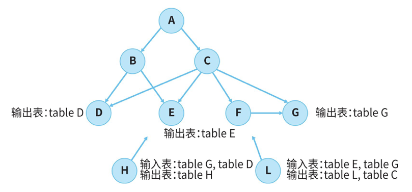

获取推荐依赖的核心原理在于上下游作业输入和输出的表级血缘依赖图；
通过血缘分析当前作业的输入和输出，找到合适的上游作业；
对合适的作业进行环路检测，剔除存在闭环的作业；
返回合适的节点列表。

7. 数据权限
企业内部计算引擎多样化，数据权限管理面临如下问题：
  * 部分引擎拥有独立的权限管理系统（例如Oracle、HANA、LibrA），导致权限申请需要到每一种引擎上单独操作，让使用变得复杂。
  * 同一种计算引擎，不同厂商的权限系统有多种，例如Hadoop自身无数据权限系统，由不同厂商各自去实现，目前主要有两种策略：
    * RBAC（Role-Based Access Control）：如Cloudera用的是Sentry，华为的FI也是类似的机制
    * PBAC（Policy-Based Access Control）：如Hortonworks用的Ranger
  * 数据权限是由大数据集群或数据库运维人员管理的，开发人员无法直接操作或者接触，所有的权限申请都需要运维人员开通，造成运维人员负担过重。在实际开发中，一般需要运维人员把整个库的权限授权给某个开发负责人，然后库里面的表、字段、函数的权限管理由开发负责人负责就行。
数据权限管理中心提供界面化操作，数据申请方直接在页面上进行各种权限的申请，数据管理方在界面上审核权限，执行同意或拒绝操作。同时，所有权限的申请、审批都会有记录，便于进行权限审计。在统一数据权限服务中，会对接底层的各种权限管理系统，例如Sentry、Ranger、Oracle，同时对数据权限管理中心提供服务，执行权限的申请、授权、撤销等操作。  

#### 实时开发

1. 元数据管理
2. SQL驱动
3. 组件化开发

### 智能运维

任务的管理、代码发布、运维、监控、告警等一系列集成工具，方便使用，提升效率。重跑、重跑下游、补数据。

### 数据体系

有了数据汇聚、数据开发模块，中台已经具备传统数据仓库（后面简称：数仓）平台的基本能力，可以做数据的汇聚以及各种数据开发，就可以建立企业的数据体系。之前说数据体系是中台的血肉，开发、管理、使用的都是数据。

中台数据体系应具备以下特征：

* 覆盖全域数据：数据集中建设、覆盖所有业务过程数据，业务中台在数据体系中总能找到需要的数据。
* 结构层次清晰：纵向的数据分层、横向主题域、业务过程划分，让整个层次结构清晰易理解。
* 数据准确一致：定义一致性指标，统一命名、统一业务含义、统一计算口径，并有专业团队负责建模，保证数据的准确一致。
* 性能提升：统一的规划设计，选用合理的数据模型，清晰的定义并统一规范，并且考虑使用场景，使整体性能更好。
* 降低成本：数据体系的建设使得数据能被业务共享，这避免了大量烟囱式的重复建设，节约了计算、存储和人力成本。
* 方便易用：易用的总体原则是越往后越能方便地直接使用数据，把一些复杂的处理尽可能前置，必要时做适当的冗余处理。

不同行业的数据体系建设：

* 地产行业


* 证券行业


* 零售行业


* 制造行业


* 传媒行业


* 检务行业


1. 贴源数据层ODS

对各业务系统数据进行采集、汇聚，尽可能保留原始业务流程数据，与业务系统基本保持一致，仅做简单整合、非结构化数据结构化处理或者增加标识数据日期描述信息，不做深度清洗加工。
表名：ODS_系统简称_业务系统表名
字段名：与业务系统字段名保持一致，字段类型也尽可能保持一致
对于数据量比较大的业务表，采用增量同步的方式，则要同时建立增量表和全量表，增量表命名加后缀：ODS_系统简称_业务系统表名_delta。
对于日志、文件等半结构数据，不仅要存储原始数据，还要存储结构化之后的数据。

使用DataX同步数据步骤：
1）确定业务系统源表与贴源数据层目标表
2）配置数据字段映射关系，目标表可能会增加采集日期、分区、原系统标识等必要信息，业务相关内容不做转换
3）如果是增量同步或着有条件的同步部分数据，则配置数据同步条件
4）清理目标表对应数据
5）启动同步任务，往贴源数据层目标表导入数据
6）验证任务是否可以正确运行，并且采集到准确数据
7）发布采集任务，加入生产调度，并配置相关限速、容错、质量监控、告警机制

2. 统一数仓层DW
  * 明细数据层DWD
  * 汇总数据层DWS
    与传统数据仓库功能基本一致，对全历史业务过程数据进行建模存储。对来源于业务系统的数据进行重新组织。业务系统是按照业务流程方便操作的方式来组织数据的，而统一数仓层从业务易理解的视角来重新组织，定义一致的指标、维度，各业务板块、业务域按照统一规范独立建设，从而形成统一规范的标准业务数据体系。
3. 标签数据层TDM

面向对象建模，对跨业务板块、跨数据域的特定对象数据进行整合，通过IDMapping把各个业务板块、各个业务过程中的同一对象的数据打通，形成对象的全域标签体系，方便深度分析、挖掘、应用。  

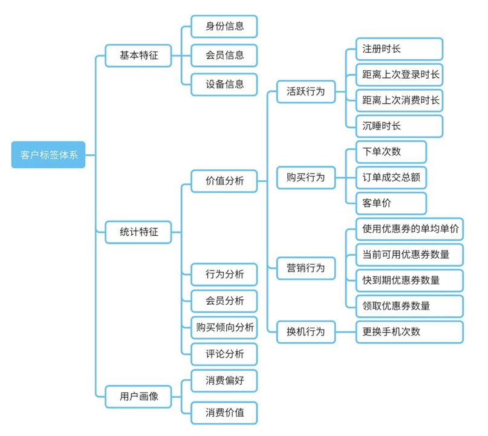

4. 应用数据层ADS

按照业务的需要从统一数仓层、标签数据层抽取数据，并面向业务的特殊需要加工业务特定数据，以满足业务及性能需求，向特定应用组装应用数据。

### 数据资产管理

数据资产管理包括对数据资产目录、元数据、数据质量、数据血缘、数据生命周期等进行管理和展示，以一种更直观的方式展现企业的数据资产，提升企业的数据意识。
数据资产对上支持以价值挖掘和业务赋能为导向的数据应用开发，对下依托大数据平台实现数据全生命周期的管理，并对企业数据资产的价值、质量进行评估，促进企业数据资产不断自我完善，持续向业务输出动力。

#### 数据治理

传统的数据治理通常包含数据标准管理、元数据管理、数据质量管理、数据安全管理、数据生命周期管理等内容。

## 数据服务体系

前面利用数据汇聚、数据开发建设企业的数据资产，利用数据管理展现企业的数据资产，但是并没有发挥数据的价值。数据服务体系就是把数据变为一种服务能力，通过数据服务让数据参与到业务，
快速开发企业的业务中台等。

### 查询服务

输入特定的查询条件，返回该条件下的数据，以API形式供上层应用调用。
1）支持配置查询标识，底层数据组织一般会对该标识建立索引，以加快查询速度
2）支持配置过滤项
3）支持查询结果配置，包括数据排序规则和分页规则。

### 分析服务

借助分析组件高效的大数据分析能力，对数据进行关联分析，分析结果通过API形式供上层应用调用。
1）支持多源数据接入：企业的数据经过清洗加工转换成数据资产后，最终通过服务作用于业务系统，基于企业异构存储的现状，要求分析服务能够支持与Hive、ES、Greenplum、MySQL、Oracle、本地文件等多种数据源进行连接。
2）高性能即席查询：随着企业数据爆发式增长，传统的数据分析工具遇到分析能力的瓶颈，也就是对大数据量的分析越来越乏力。因此，这就要求分析服务内置高速计算引擎，以对数据进行高性能的即席计算，实现亿级数据毫秒级（至多秒级）分析和计算，减少用户等待时间。
3）多维数据分析
分析服务除了支持常规的数据分析、上卷下钻、切片切块之外，还应该支持多维的数据分析以及深层次的数据挖掘，发现数据背后的关联关系。
4）灵活对接业务系统

### 推荐服务

按约定的格式提供历史日志行为数据和实时访问数据，推荐模型就会生成相应的推荐API，从而为上层应用提供推荐服务。
推荐服务即所谓的千人千面，对不同的人对物的行为进行数据挖掘，构建每个人与物之间的关系程度，来推荐人、物以满足用户的兴趣爱好，以提升用户对业务的粘性。每个人打开手机淘宝看到的内容都不一样，这就是一种基于人的兴趣爱好的推荐服务能力。
1）支持不同行业的推荐：不同行业背后的推荐逻辑是有区别的
2）支持不同场景的推荐：以内容资讯为例，在用户冷启动场景下，应该推荐哪些资讯？在用户已有浏览行为的场景下，又该为其推荐哪些资讯？
3）支持推荐效果优化：从导入的原始数据开始，经过推荐组件生成推荐数据，再根据用户的浏览数据不断修正推荐模型，从而使推荐效果不断优化

### 圈人服务

从全量用户数据中，基于标签组合筛选符合指定特征条件的人群，并通过API形式供上层应用调用。
1）支持人群圈选：通过SQL代码或标签取值组合等多种方式，实现人员查找，帮用户找到对的人群
2）支持人群计量：营销部门或者广告公司使用圈人服务圈选出目标人群后，往往还要考虑人群量是否符合预期，因为预算有限，不可能不计成本的对人群进行营销。
3）支持多渠道对接：将人群名单导出到相应的下游系统。最简单的名单导出方式是先下载文件，再由业务人员导入相应的业务系统中。或者直接对接到短信系统、微信投放接口、营销活动系统等。

## 离线平台

### 苏宁

[苏宁大数据离线任务开发调度平台实践](https://www.infoq.cn/article/suning-big-data)

[苏宁大数据离线任务开发调度平台实践：任务调度模块架构设计](https://www.infoq.cn/article/xTvBg1_9iUL0z5Pjf0Os)

苏宁离线平台产品功能图：

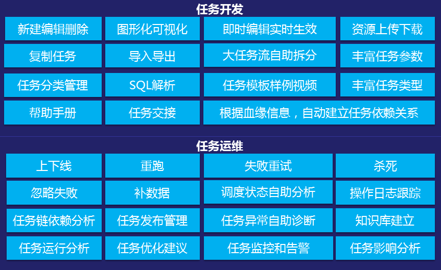

苏宁调度模块功能图：

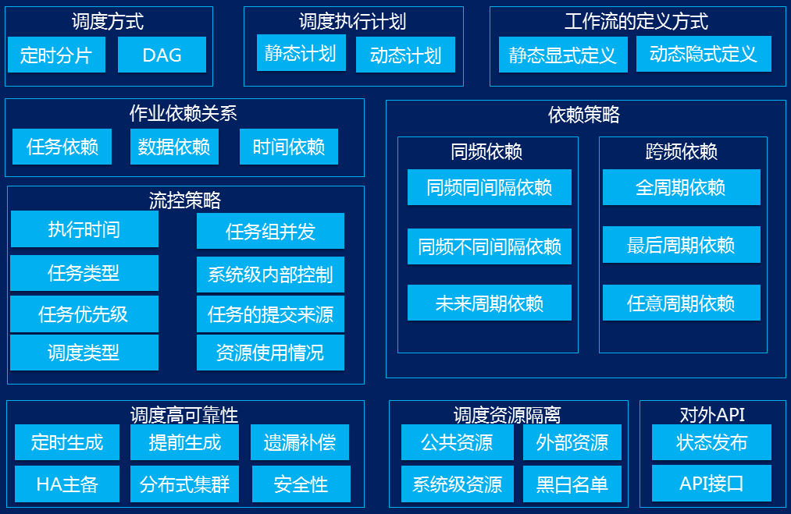

苏宁离线平台整体架构图：

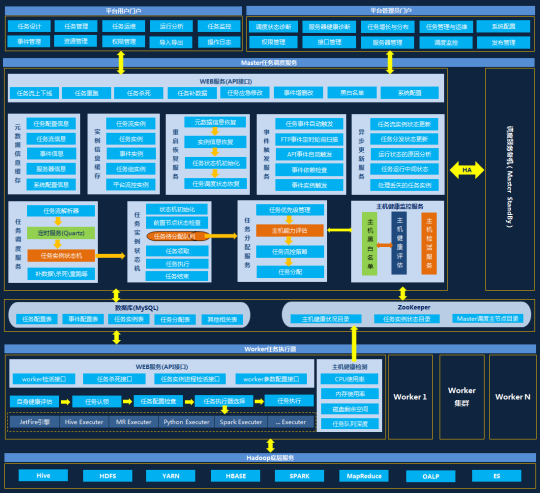

跨任务流依赖的实现：
FTP事件机制，即在 FTP 服务器上建立标识文件，一个事件对应一个标识文件地址，当 FTP 服务器上的标识文件生成的时候，我们认为业务系统已经完成作业，需要触发平台任务执行。

“华佗”平台，实施任务诊断：

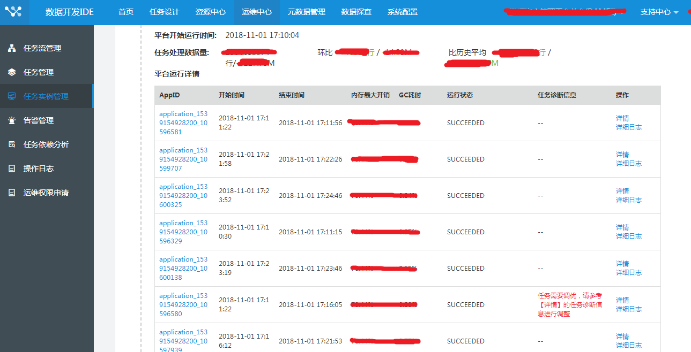

立即触发的任务，放入DelayQueue的队列头部
周期调度的任务，使用Quartz
依赖触发的任务，使用zk，各个子节点监听自己的父节点，所有父节点执行完毕则可触发执行

## 实时平台

### 美团点评


使用了Grafana，可以内嵌到自己的平台。

### bilibili

SQL化编程

DAG拖拽编程

一体化托管运维

实时平台由实时传输和实时计算两部分组成，平台底层统一管理元数据、血缘、权限以及作业运维等。实时传输主要负责将数据传入到大数据体系中。实时计算基于 BSQL 提供各种应用场景支持。

如下图所示，实时传输有 APP 日志、数据库 Binlog、服务端日志或系统日志。bilibili 内部的 Lancer 系统解决数据落地到 Kafka 或 HDFS。计算体系主要围绕 Saber 构建一套 BSQL，底层基于 YARN 进行调度管理。

上层核心基于 Flink 构建运行池。再向上一层满足多种维表场景，包括 MySQL、Redis、HBase。状态（State）部分在 RocksDB 基础上，还扩展了 MapDB、Redis。Flink 需要 IO 密集是很麻烦的问题，因为 Flink 的资源调度体系内有内存和 CPU，但 IO 单位未做统一管理。当某一个作业对 IO 有强烈的需求时，需要分配很多以 CPU 或内存为单位的资源，且未必能够很好的满足 IO 的扩展。所以本质上 bilibili 现阶段是将 IO 密集的资源的 State 转移到 Redis 上做缓解。数据经过 BSQL 计算完成之后传输到实时数仓，如 Kafka、HBase、ES 或 MySQL、TiDB。最终到 AI 或 BI、报表以及日志中心。

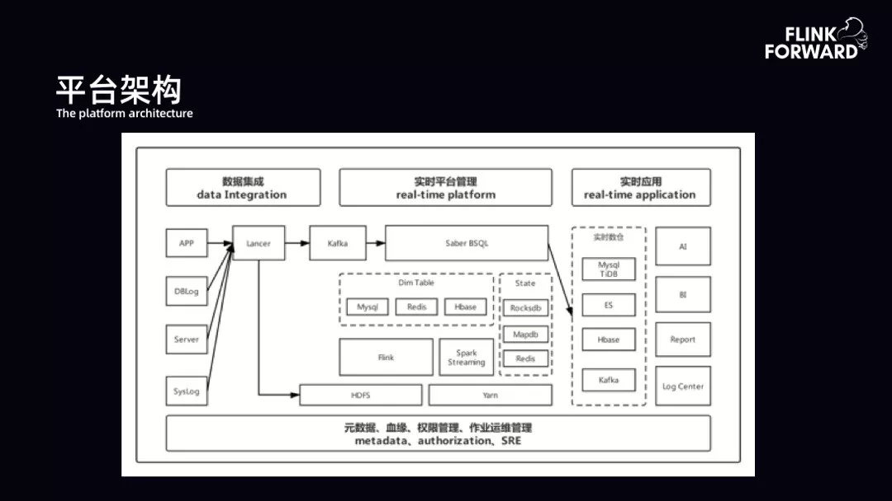

#### 场景

* AI工程方向，解决了广告、搜索、推荐的流式Joiner和维表Joiner
* 实时计算的特征支持，支持 Player 以及 CDN 的质量监控。包括直播、PCU、卡顿率、CDN 质量等；
* 用户增长，即如何借助实时计算进行渠道分析、调整渠道投放效果；
* 实时 ETL，包括 Boss 实时播报、实时大屏、看板等。

### 网易

目前网易流计算覆盖了绝大多数场景，包括广告、电商大屏、ETL、数据分析、推荐、风控、搜索、直播等。

#### 事件管理

对于分布式平台的任务操作而言，当前任务启动过程中只允许一个人操作，而不允许两个人同时操作，这就需要以下几个模块来共同配合：

* Server：事件执行的发起者，接受事件的请求，进行数据校验，拼装，将事件发送给 Kernel 执行。
* Kernel：事件具体逻辑的执行者，根据请求向集群发送指令(Shell 脚本方式)。
* Admin：事件执行结果的确认者，根据事件类型，获取事件的最终结果，保证结果的正确性。

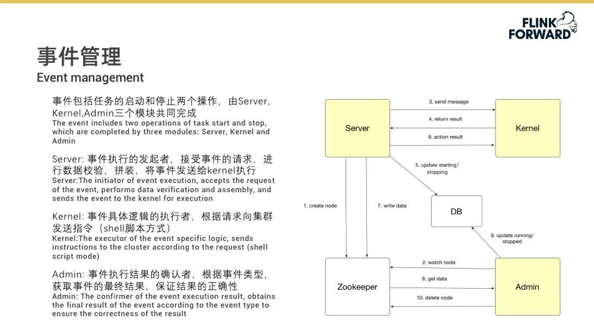

以启动场景为例：

首先，Server 会接收到来自用户的启动请求，之后会创建一个分布式锁，Admin 会监控这个锁。

然后， Server 向 Kernel 提交任务，提交之后会立即返回，返回之后就会立即更新数据库中的状态，将状态更新为启动中，这样在页面上用户就能够看到任务是启动中的状态了。

接下来，Server 就会等待内核的 Shell 脚本的执行结果，如果 Shell 脚本执行成功了，就会去写 Zookeeper，写完 Zookeeper 之后 Admin 模块就会马上检测到 Zookeeper 节点有状态发生了修改，Admin 会立即去获取 YARN 上的任务状态，如果获取到任务状态是运行中，就将数据库的任务状态更新为运行中，这会在前端看到任务就已经是运行状态了。

最后一步是 Admin 更为完数据库之后，会释放掉 Zookeeper 上的锁，其他人这时候就可以操作这个任务了。

Server、Kernel 和 Admin 这三个模块都是不可靠的，那么如何保证其稳定和高可用呢？Server 可以通过部署多个，水平扩展来实现，Kernel 则会由 Server 来进行监听，当发现 Kernel 挂了，可以由 Server 重新拉起或者重新创建。而 Admin 的高可用则是通过热备来实现的，如果主 Admin 挂掉了，可以马上迁移到备 Admin，备 Admin 可以迅速将元数据以及任务信息全部加载进来接替工作，进而实现高可用。

#### 平台任务状态管理

平台的任务状态主要由 Server 和 Admin 来控制。Server 主要控制初始状态的执行，Admin 则主要负责控制所有与 YARN 相关的状态交互。

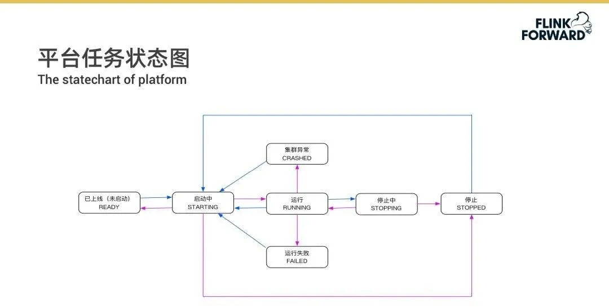

#### 任务调试

SQL 类型的任务支持调试功能，用户可以根据不同的 source 表和 dim 表，上传不同的 csv 文件作为输入数据，进行调试。调试执行由指定的 kernel 来完成，sloth-server 负责组装请求，调用 kernel，返回结果，搜集日志。

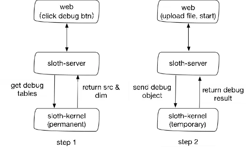

#### 日志检索

在 YARN 集群的每个节点上面部署 Filebeat，通过 Filebeat 将节点上面的任务日志写入到 Kafka 消息队列中，然后通过 Logstash 进行解析处理，之后写入 ES 集群中。主要用于两个用途，一个是通过界面 Kibana 来提供给开发和运维人员使用，另外一个就是将运行时状态的任务日志直接在界面上展示供用户进行搜索和查看。

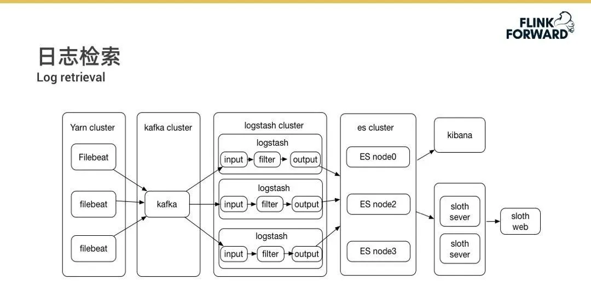

#### 监控

在监控方面，使用的是 influxdb metric report 组件对于指标进行监控。时序数据库使用的是网易自研的 ntsdb 时序数据库，其能够支持动态扩展和高可用等功能。监控指标的使用方式有两种：
一种是通过 Grafana 的界面来查看指标；
另外一种是报警模块会从Ntsdb中获取相关指标数据并进行监控报警。

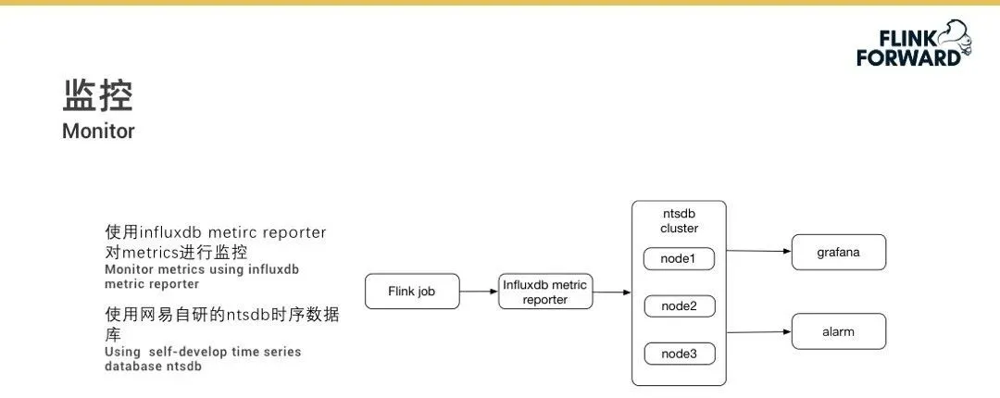

#### 报警

Sloth 流计算平台支持常见的任务失败，数据滞留延迟，failover 报警，也支持用户自定义规则报警，包括对于输入 QPS、输出 QPS，户自定义延迟的监控等。以输入 QPS 为例，可以设置当连续几个周期内 QPS 低于某一值时就触发报警。此外，报警方式也支持多样化的工具，比如各种网易内部的聊天工具、邮件、电话以及短信等，对于任务调试阶段，为了避免被骚扰，可以设置任务报警抑制时间间隔。

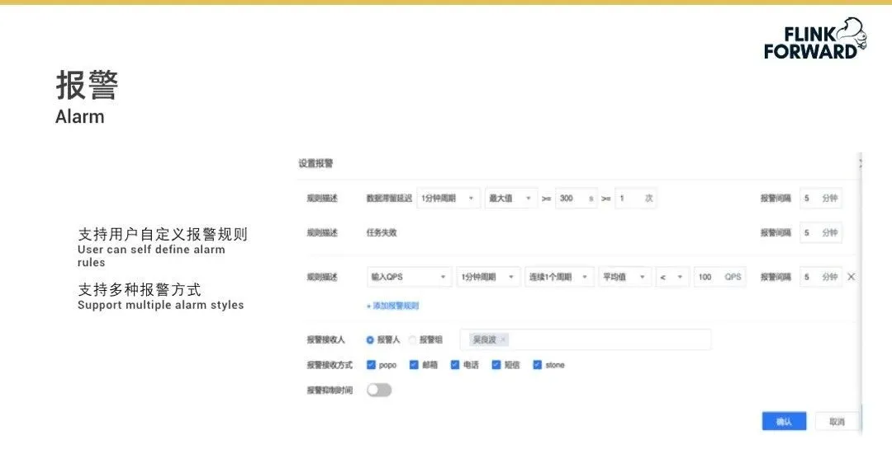

#### 实时数仓

目前网易很多产品已经开始实时数仓的建设了，但仍旧处于持续完善过程中。实时数仓的建设和离线数仓大致相同，只不过实时数仓是经过实时计算平台进行处理的。大致的过程就是首先收集日志、埋点数据等，将其写入到 Kafka 里面，经过实时计算平台进行处理，将 ODS 层中的明细数据抽取出来，在进行汇总以及维度关联等操作，将结果写入到 Redis，Kudu 等，再通过数据服务提供给前端的业务使用。x

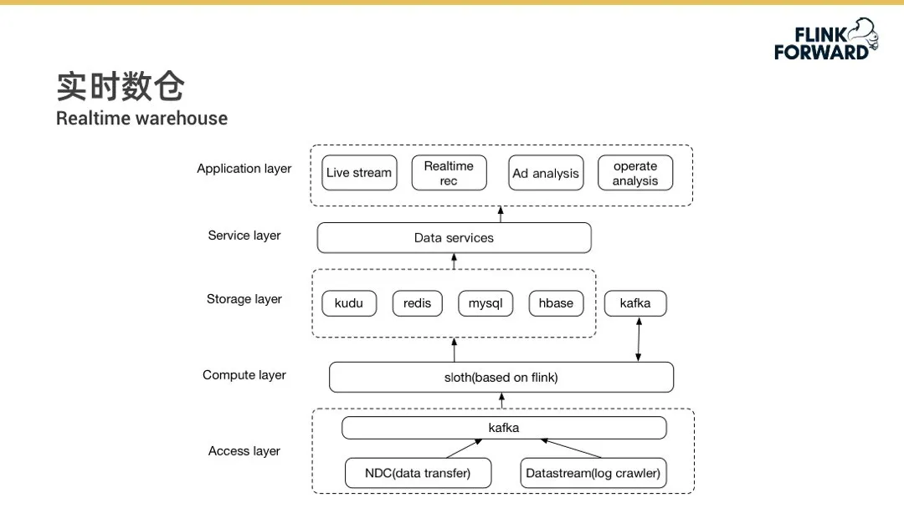

#### 电商应用-数据分析

实时活动分析、首页资源分析、流量漏斗以及实时毛利计算等。

#### 电商应用-搜索推荐

电商的搜索推荐场景则主要包括用户实时足迹、用户实时特征、商品实时特征、实时 CTR CVR 样本组建、首页 A 区轮播、B 区活动精选等 UV、PV 实时统计等。
网络营销中的常见名词解释：

``` c
CPC (Cost Per Click): 按点击计费
CPA (Cost Per Action): 按成果数计费
CPM (Cost Per Mille): 按千次展现计费
CVR (Click Value Rate): 转化率，衡量CPA广告效果的指标
CTR (Click Through Rate): 点击率
PV (Page View): 流量
ADPV (Advertisement Page View): 载有广告的pageview流量ADimp (ADimpression): 单个广告的展示次数
PV单价: 每PV的收入，衡量页面流量变现能力的指标
```

## 离线数仓与实时数仓

### 从0建设离线数仓

#### 建设数仓

数据仓库定义：在企业管理和决策中面向主题的、集成的、与时间相关的、不可修改的数据集合。
数据仓库目标：数据资产、决策信息。

* ETL过程：打通你的任督二脉（离线+实时），让数据在整个环节中流通起来
* 数据分层：一套低耦合、高内聚的层级，是十分重要的，总不想业务、数据等一变化，数仓像又投胎了一次
* 数据集成：多业务场景下，打破数据信息壁垒，避免数据歧义，统一数据服务
* 规范化：良好的流程化、规范化设计，易维护、高扩展
* 监控与辅助：质量监控、调度管理、元数据管理、信息安全管理
* 走向服务：对外api服务/自助查询平台/OLAP分析平台

#### ETL

业务数据往往涉及多种数据源，数据存储也常常会有多种选择。文本数据、日志数据、RMDB、Nosql等。则要求etl工具能够覆盖这些业务场景。
工具有datax/sqoop/kettle/informatica等等。
ETL一般为最开始的部分，凌晨之后的时间点。a：避免集中式的对某个jdbc海量同步，影响业务(部分从库可能提供查询服务)、b：明确调度的时间，应尽可能的在某个时间段内完成(不能仅依靠调度，实现任务流的串行；为后期的大作业空间，占用等待的系统资源)

#### 分层

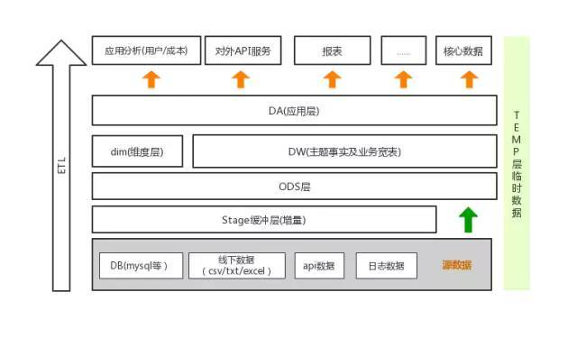

1. Stage缓冲层
事务性数据，每日增量方式进行数据同步。需要注意数据同步时的边界问题，避免脏数据。
对于非事务性数据，一般通过快照/全量更新。不对外开放数据查询。

2. ods层
一般场景下，我们认为该层数据与线上保持一致。实际处理过程中，为了处理时间维度上的数据变化，会记录数据的变化轨迹。对于该部分数据，应该有选择的实施，避免业务处理过程变得复杂和问题发生后难以回溯。

3. dim/dw层 (模型层)
dim：维度层
dw：主题事实及业务宽表
在ods基础上，设计一个宽表/模型层，通过维度建模的方式，实现维度数据与事实数据的分离（星型模型）。

4. da层（应用层）
面向不同的应用，聚合类的数据层。该层对于dim/dw层的使用，是对模型层的一个检视维度。

#### 代码规范

1. 脚本格式规范：脚本头部注释编码规范、注释规范、sql规范参考goole规范
2. 文件/表命名规范：一个文件中，只应该有一张表，其余只能是临时表；表名称应与文件名相同
3. 字段命名规范：去除多词同义，和同词多义的问题。尤其是在模型层（一般也叫做一致性维度）

### 区别

离线数仓主要基于sqoop、datax、hive等技术来构建 T+1 的离线数据，通过定时任务每天垃取增量数据导入到hive表中，然后创建各个业务相关的主题，对外提供T+1的数据查询接口。
实时数仓主要是基于数据采集工具，如canal等原始数据写入到kafka这样的数据通道中，最后一般都是写入到类似于HBase这样的OLAP存储系统中。对外提供分钟级别，甚至秒级别的查询方案。


数仓类型|准确性|实时性|稳定性
--|--|--|--
离线数仓|准确度高|时延一般在一天|稳定性好，方便重算
实时数仓|准确度低，数据延迟、数据乱序造成数据准确度低|分钟级延迟|稳定性差，需要考虑数据回溯处理

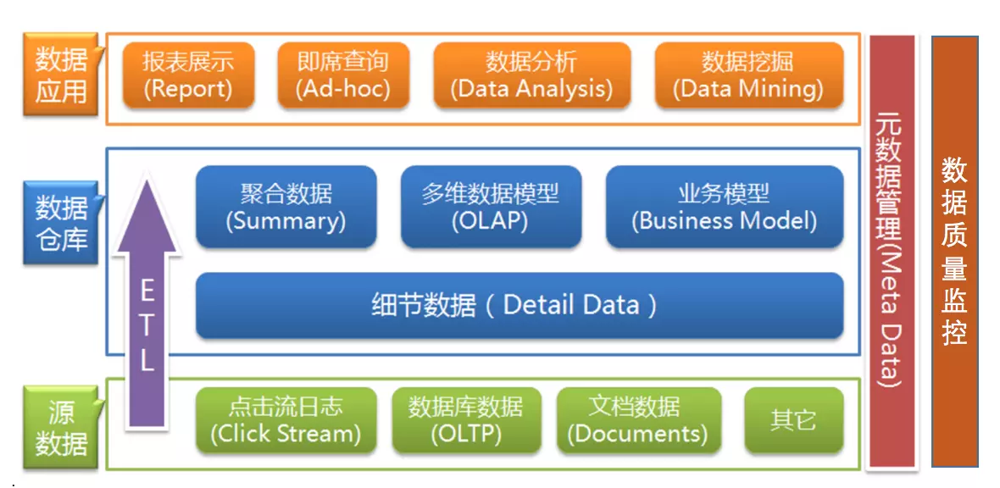

数据仓库的建设主要包括数据的采集、数据的处理、数据归档、数据应用四个方面。
当前主要的应用场景包括报表展示、即席查询、BI展示、数据分析、数据挖掘、模型训练等方面。
数据仓库的建设是面向主题的、集成性的、不可更新的、时许变化的。

实时数仓的实施关键点：

1. 端到端数据延迟、数据流量的监控
2. 故障的快速恢复能力
3. 数据的回溯处理，系统支持消费指定时间段内的数据
4. 实时数据从实时数仓中查询，T+1数据借助离线通道修正
5. 数据地图、数据血缘关系的梳理
6. 业务数据质量的实时监控，初期可以根据规则的方式来识别质量状况

其实，你需要的不是实时数仓，需要的是一款合适且强大的OLAP数据库。
在实时数仓的建设中，OLAP数据库的选型直接制约实时数仓的可用性和功能性。

原始层

明细层

汇总层

应用层

* ods：原始数据层，事实数据，存储在kafka中
* dwd：数据明细层，可以做一些join等加宽处理，可以存储在kafka和redis中
* dim：维度数据，如存储在HBase中的数据
* dm：MySQL -> 汇总指标模型；Greenplum -> 明细，多维分析关联；HBase -> 汇总指标(大量并发)；Redis -> 汇总、大列表TopN

## 数据中台解决方案

### 零售行业

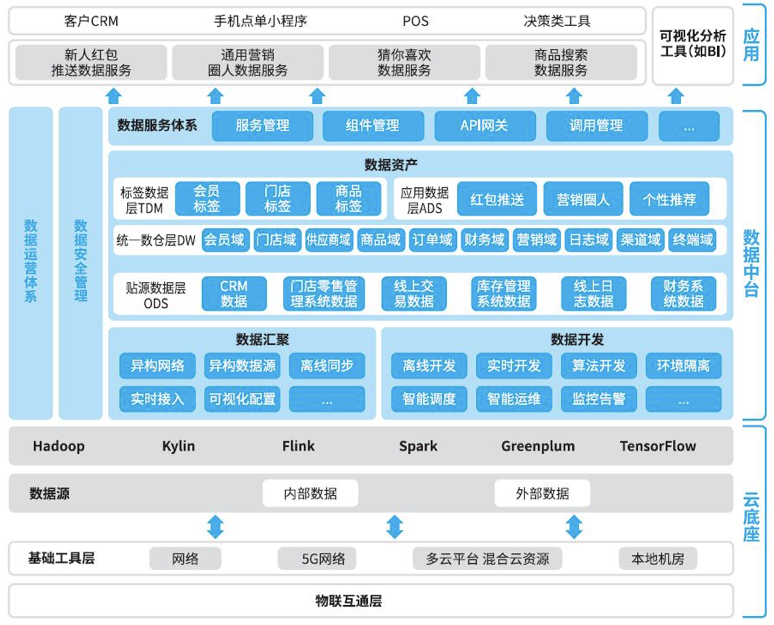

``` c
RPS (Revenue Per Search): 每搜索产生的收入，衡量搜索结果变现能力指标
```

　 ROI： 投资回报率（ROI）是指通过投资而应返回的价值，它涵盖了企业的获利目标。利润和投入的经营所必备的财产相关，因为管理人员必须通过投资和现有财产获得利润。又称会计收益率、投资利润率。
