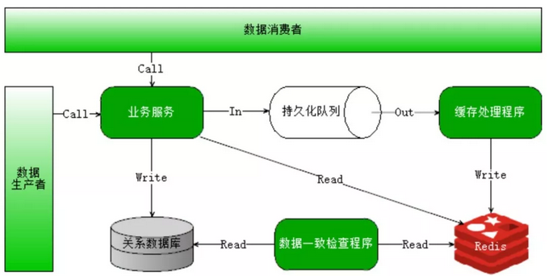

# 怎么理解分布式、高并发、多线程？

是不是很多人都认为分布式=高并发=多线程？

当面试官问到高并发系统可以采用哪些手段来解决，或者被问到分布式系统如何解决一致性的问题，是不是一脸懵逼？
 
一开始，不少人都会将三者混淆，误以为所谓的分布式高并发的系统就是能同时供海量用户访问，而采用多线程手段不就是可以提供系统的并发能力吗？实际上，**他们三个总是相伴而生，但侧重点又有不同。**

### 什么是分布式？

分布式更多的一个概念，**是为了解决单个物理服务器容量和性能瓶颈问题而采用的优化手段**。该领域需要解决的问题极多，在不同的技术层面上，又包括：分布式文件系统、分布式缓存、分布式数据库、分布式计算等，一些名词如Hadoop、zookeeper、MQ等都跟分布式有关。从理念上讲，分布式的实现有两种形式：
 
* 水平扩展：当一台机器扛不住流量时，就通过添加机器的方式，将流量平分到所有服务器上，所有机器都可以提供相当的服务；
 
* 垂直拆分：前端有多种查询需求时，一台机器扛不住，可以将不同的需求分发到不同的机器上，比如A机器处理余票查询的请求，B机器处理支付的请求。

### 什么是高并发？

**相对于分布式来讲，高并发在解决的问题上会集中一些，其反应的是同时有多少量**：比如在线直播服务，同时有上万人观看。

高并发可以通过分布式技术去解决，将并发流量分到不同的物理服务器上。但除此之外，还可以有很多其他优化手段：比如使用缓存系统，将所有的，静态内容放到CDN等；还可以使用多线程技术将一台服务器的服务能力最大化。

### 什么是多线程？

**多线程是指从软件或者硬件上实现多个线程并发执行的技术**，它更多的是解决CPU调度多个进程的问题，从而让这些进程看上去是同时执行（实际是交替运行的）。

这几个概念中，**多线程解决的问题是最明确的，手段也是比较单一的，基本上遇到的最大问题就是线程安全**。在JAVA语言中，需要对JVM内存模型、指令重排等深入了解，才能写出一份高质量的多线程代码。
 
### 总结一下：
 
* 分布式是从物理资源的角度去将不同的机器组成一个整体对外服务，技术范围非常广且难度非常大，有了这个基础，高并发、高吞吐等系统很容易构建；

* 高并发是从业务角度去描述系统的能力，实现高并发的手段可以采用分布式，也可以采用诸如缓存、CDN等，当然也包括多线程；
 
* 多线程则聚焦于如何使用编程语言将CPU调度能力最大化。
 
分布式与高并发系统，涉及到大量的概念和知识点，如果没有系统的学习，很容易会杂糅概念而辨识不清，在面试与实际工作中都会遇到困难。如果你从事Java开发，希望深入浅出了解Java分布式、高并发等技术要点，渴望实现技术和职业成长上的双重突破，那么以下福利就很适合