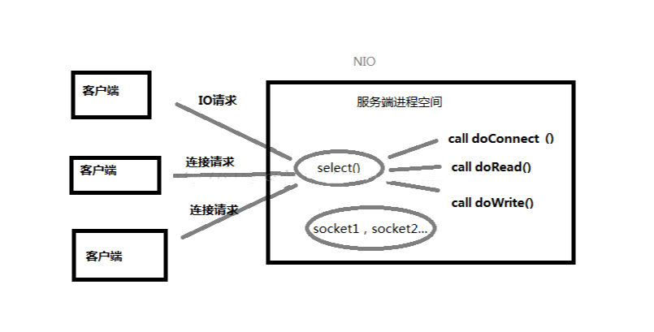

# 关于BIO和NIO的理解
摘要: 关于BIO和NIO的理解

最近大概看了ZooKeeper和Mina的源码发现都是用Java NIO实现的，所以有必要搞清楚什么是NIO。下面是我结合网络资料自己总结的，为了节约时间图示随便画的，能达意就行。

### 简介：

BIO：同步阻塞式IO，服务器实现模式为一个连接一个线程，即客户端有连接请求时服务器端就需要启动一个线程进行处理，如果这个连接不做任何事情会造成不必要的线程开销，当然可以通过线程池机制改善。 
NIO：同步非阻塞式IO，服务器实现模式为一个请求一个线程，即客户端发送的连接请求都会注册到多路复用器上，多路复用器轮询到连接有I/O请求时才启动一个线程进行处理。 
AIO(NIO.2)：异步非阻塞式IO，服务器实现模式为一个有效请求一个线程，客户端的I/O请求都是由OS先完成了再通知服务器应用去启动线程进行处理。 

### BIO 

同步阻塞式IO，相信每一个学习过操作系统网络编程或者任何语言的网络编程的人都很熟悉，在while循环中服务端会调用accept方法等待接收客户端的连接请求，一旦接收到一个连接请求，就可以建立通信套接字在这个通信套接字上进行读写操作，此时不能再接收其他客户端连接请求，只能等待同当前连接的客户端的操作执行完成。 

如果BIO要能够同时处理多个客户端请求，就必须使用多线程，即每次accept阻塞等待来自客户端请求，一旦受到连接请求就建立通信套接字同时开启一个新的线程来处理这个套接字的数据读写请求，然后立刻又继续accept等待其他客户端连接请求，即为每一个客户端连接请求都创建一个线程来单独处理，大概原理图就像这样： 

虽然此时服务器具备了高并发能力，即能够同时处理多个客户端请求了，但是却带来了一个问题，随着开启的线程数目增多，将会消耗过多的内存资源，导致服务器变慢甚至崩溃，NIO可以一定程度解决这个问题。

### NIO 
同步非阻塞式IO，关键是采用了事件驱动的思想来实现了一个多路转换器。 
NIO与BIO最大的区别就是只需要开启一个线程就可以处理来自多个客户端的IO事件，这是怎么做到的呢？ 
就是多路复用器，可以监听来自多个客户端的IO事件： 
A. 若服务端监听到客户端连接请求，便为其建立通信套接字(java中就是通道)，然后返回继续监听，若同时有多个客户端连接请求到来也可以全部收到，依次为它们都建立通信套接字。 
B. 若服务端监听到来自已经创建了通信套接字的客户端发送来的数据，就会调用对应接口处理接收到的数据，若同时有多个客户端发来数据也可以依次进行处理。 
C. 监听多个客户端的连接请求和接收数据请求同时还能监听自己时候有数据要发送。 

总之就是在一个线程中就可以调用多路复用接口（java中是select）阻塞同时监听来自多个客户端的IO请求，一旦有收到IO请求就调用对应函数处理。 

#### 轮询方式
如果将套接字读操作换成非阻塞的，那么只需要一个线程就可以同时处理套接字，每次检查一个套接字，有数据则读取，没有则检查下一个，因为是非阻塞的，所以执行read操作时若没有数据准备好则立即返回，不会发生阻塞。
#### I/O多路复用
这种轮询的方式缺点是浪费CPU资源，大部分时间可能都是无数据可读的，不必仍不间断的反复执行read操作，I/O多路复用（IOmultiplexing）是一种更好的方法，调用select函数时，其内部会维护一张监听的套接字的列表，其会一直阻塞直到其中某一个套接字有数据准备好才返回，并告诉是哪个套接字可读，这时再调用该套接字的read函数效率更高。

所以基本可以认为 “NIO = I/O多路复用 + 非阻塞式I/O”，大部分情况下是单线程，但也有超过一个线程实现NIO的情况

#### NIO三种模型

上面所讲到的只需要一个线程就可以同时处理多个套接字，这只是其中的一种单线程模型，是一种较为极端的情况，NIO主要包含三种线程模型：

1. Reactor单线程模型

2. Reactor多线程模型

3. 主从Reactor多线程模型

 

##### Reactor单线程模型：

单个线程完成所有事情包括接收客户端的TCP连接请求，读取和写入套接字数据等。

对于一些小容量应用场景，可以使用单线程模型。但是对于高负载、大并发的应用却不合适，主要原因如下：

1. 一个NIO线程同时处理成百上千的链路，性能上无法支撑，即便NIO线程的CPU负荷达到100%，也无法满足海量消息的编码、解码、读取和发送；

2. 当NIO线程负载过重之后，处理速度将变慢，这会导致大量客户端连接超时，超时之后往往会进行重发，这更加重了NIO线程的负载，最终会导致大量消息积压和处理超时，NIO线程会成为系统的性能瓶颈；

3. 可靠性问题：一旦NIO线程意外跑飞，或者进入死循环，会导致整个系统通信模块不可用，不能接收和处理外部消息，造成节点故障。

为了解决这些问题，演进出了Reactor多线程模型。

 

##### Reactor多线程模型：

Reactor多线程模型与单线程模型最大的区别就是有一组NIO线程处理真实的IO操作。

Reactor多线程模型的特点：

1. 有专门一个NIO线程-Acceptor线程用于监听服务端，接收客户端的TCP连接请求；

2. 网络IO操作-读、写等由一个NIO线程池负责，线程池可以采用标准的JDK线程池实现，它包含一个任务队列和N个可用的线程，由这些NIO线程负责消息的读取、解码、编码和发送；

3. 1个NIO线程可以同时处理N条链路，但是1个链路只对应1个NIO线程，防止发生并发操作问题。

在绝大多数场景下，Reactor多线程模型都可以满足性能需求；但是，在极特殊应用场景中，一个NIO线程负责监听和处理所有的客户端连接可能会存在性能问题。例如百万客户端并发连接，或者服务端需要对客户端的握手消息进行安全认证，认证本身非常损耗性能。在这类场景下，单独一个Acceptor线程可能会存在性能不足问题，为了解决性能问题，产生了第三种Reactor线程模型-主从Reactor多线程模型。

即从单线程中由一个线程即监听连接事件、读写事件、由完成数据读写，拆分为由一个线程专门监听各种事件，再由专门的线程池负责处理真正的IO数据读写。

 

##### 主从Reactor多线程模型

主从Reactor线程模型与Reactor多线程模型的最大区别就是有一组NIO线程处理连接、读写事件。

主从Reactor线程模型的特点是：服务端用于接收客户端连接的不再是个1个单独的NIO线程，而是一个独立的NIO线程池。Acceptor接收到客户端TCP连接请求处理完成后（可能包含接入认证等），将新创建的SocketChannel注册到IO线程池（sub reactor线程池）的某个IO线程上，由它负责SocketChannel的读写和编解码工作。Acceptor线程池仅仅只用于客户端的登陆、握手和安全认证，一旦链路建立成功，就将链路注册到后端subReactor线程池的IO线程上，由IO线程负责后续的IO操作。

即从多线程模型中由一个线程来监听连接事件和数据读写事件，拆分为一个线程监听连接事件，线程池的多个线程监听已经建立连接的套接字的数据读写事件，另外和多线程模型一样有专门的线程池处理真正的IO操作。

### 各自应用场景 

到这里你也许已经发现，一旦有请求到来(不管是几个同时到还是只有一个到)，都会调用对应IO处理函数处理，所以：

（1）NIO适合处理连接数目特别多，但是连接比较短（轻操作）的场景，Jetty，Mina，ZooKeeper等都是基于java nio实现。

（2）BIO方式适用于连接数目比较小且固定的场景，这种方式对服务器资源要求比较高，并发局限于应用中。

