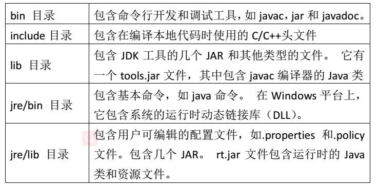
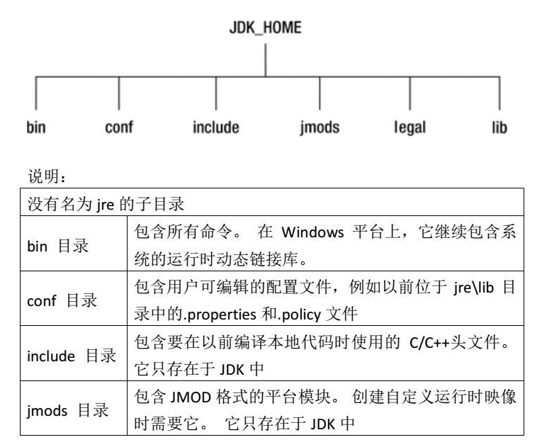
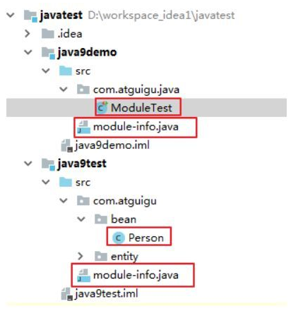
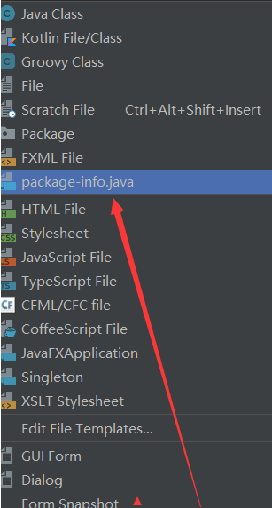
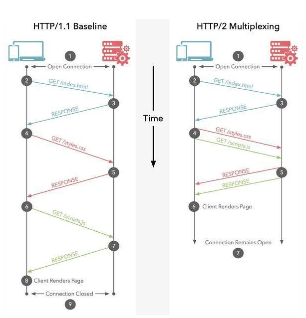

# Java 新特性总结

总结的这些新特性，都是自己觉得在开发中实际用得上的。
简单概括下就是：

* JAVA1.3：普通的原始的JAVA，基本语法相信大家都见过了
* JAVA1.4：assert关键字
* JAVA5：枚举类型、泛型、自动拆装箱
* JAVA6： @Override注解
* JAVA7： <>符号、ARM支持、支持多catch
* JAVA8：Lamda表达式，类型注解等
* JAVA9： 模块化、接口中的私有方法等
* JAVA10: 局部变量推断、整个JDK代码仓库、统一的垃圾回收接口、并行垃圾回收器G1、线程局部管控

## Java5  新特性总结

### 泛型 Generics

 引用泛型之后，允许指定集合里元素的类型，免去了强制类型转换，并且能在编译时刻进行类型检查的好处。Parameterized Type作为参数和返回值，Generic是vararg、annotation、enumeration、collection的基石。

泛型可以带来如下的好处总结如下：

1. 类型安全：抛弃List、Map，使用List、Map给它们添加元素或者使用Iterator遍历时，编译期就可以给你检查出类型错误
2. 方法参数和返回值加上了Type: 抛弃List、Map，使用List、Map
3. 不需要类型转换：List list=new ArrayList();
4. 类型通配符“?”： 假设一个打印List中元素的方法printList,我们希望任何类型T的List都可以被打印

### 枚举类型

引入了枚举类型

### 自动装箱拆箱（自动类型包装和解包）autoboxing & unboxing

简单的说是类型自动转换。自动装包：基本类型自动转为包装类（int ——Integer）自动拆包：包装类自动转为基本类型（Integer——int）

### 可变参数varargs(varargs number of arguments)

参数类型相同时，把重载函数合并到一起了。如：

```java
public void test(object... objs){
    for(Object obj:objs){
        System.out.println(obj);
    }
}
```

### Annotations（重要） 它是java中的metadata（注释）

注解在JAVA5中就引入了。这是非常重要的特性。现在注解的应用已经随处可见。不过JAVA5的注解还不成熟，没法自定义注解。

### 新的迭代语句

```java
for(int n:numbers){
//process
}
```

### 静态导入（import static ）

导入静态对象，可以省略些代码。不过这个也不常用。

```java
import static java.lang.System.out;//导入java.lang包下的System类的静态方法out;
public class HelloWorld{
    public static void main(String[] args){
        out.print("Hello World!");//既是在这里不用再写成System.out.println("Hello World!")了，因为已经导入了这个静态方法out。
    }
}
```

### 新的格式化方法java.util.Formatter）

```java
formatter.format("Remaining account balance: $%.2f", balance);
```

### 新的线程模型和并发库Thread Framework(重要)

最主要的就是引入了java.util.concurrent包，这个都是需要重点掌握的。

HashMap的替代者ConcurrentHashMap和ArrayList的替代者CopyOnWriteArrayList在大并发量读取时采用java.util.concurrent包里的一些类会让大家满意BlockingQueue、Callable、Executor、Semaphore

## Java6 新特性总结

### Web Services

优先支持编写 XML web service 客户端程序。你可以用过简单的annotaion将你的API发布成.NET交互的web services. Mustang 添加了新的解析和 XML 在 Java object-mapping APIs中, 之前只在Java EE平台实现或者Java Web Services Pack中提供.

### Scripting

现在你可以在Java源代码中混入JavaScript了，这对开发原型很有有用，你也可以插入自己的脚本引擎。

### JDBC4.0

JAVA6将联合绑定 Java DB (Apache Derby). JDBC 4.0 增加了许多特性例如支持XML作为SQL数据类型，更好的集成Binary Large OBjects (BLOBs) 和 Character Large OBjects (CLOBs) .

### UI优化

1. GUI 开发者可以有更多的技巧来使用 SwingWorker utility ，以帮助GUI应用中的多线程。, JTable 分类和过滤，以及添加splash闪屏。
2. Swing拥有更好的 look-and-feel , LCD 文本呈现, 整体GUI性能的提升。Java应用程序可以和本地平台更好的集成，例如访问平台的系统托盘和开始菜单。Mustang将Java插件技术和Java Web Start引擎统一了起来。

### 监控管理增强

添加更多的诊断信息，绑定了不是很知名的 memory-heap 分析工具Jhat 来查看内核导出。

### 编译API

compiler API提供编程访问javac，可以实现进程内编译，动态产生Java代码

### 自定义注解

Java tool和framework 提供商可以定义自己的 annotations ，并且内核支持自定义annotation的插件和执行处理器

### 安全性

XML-数字签名(XML-DSIG) APIs 用于创建和操纵数字签名); 新的方法来访问本地平台的安全服务，例如本地Microsoft Windows for secure authentication and communicationnative 的Public Key Infrastructure (PKI) 和 cryptographic services， Java Generic Security Services (Java GSS) 和 Kerberos services for authentication, 以及访问 LDAP servers 来认证用户.

## Java7 新特性总结

### switch中使用String

java7以前在switch中只能使用number或enum,现在可以使用string了。

示例：

```java
String s = "a";
switch (s) {
    case "a":
        System.out.println("is a");
        break;
    case "b":
        System.out.println("is b");
        break;
    default:
        System.out.println("is c");
        break;
}
```

### 异常处理

* Throwable类增加addSuppressed方法和getSuppressed方法，支持原始异常中加入被抑制的异常。
* 异常抑制：在try和finally中同时抛出异常时，finally中抛出的异常会在异常栈中向上传递，而try中产生的原始异常会消失。
* 在Java7之前的版本，可以将原始异常保存，在finally中产生异常时抛出原始异常：

```java
//java 7 以前
public void read(String filename) throws BaseException {  
    FileInputStream input = null;  
    IOException readException = null;  
    try {  
        input = new FileInputStream(filename);  
    } catch (IOException ex) {  
        readException = ex;   //保存原始异常  
    } finally {  
        if (input != null) {  
            try {  
                input.close();  
            } catch (IOException ex) {  
                if (readException == null) {  
                    readException = ex;  
                }  
            }  
        }  
        if (readException != null) {  
            throw new BaseException(readException);  
        }  
    }  
}

//在Java7中的版本，可以使用addSuppressed方法记录被抑制的异常：
public void read(String filename) throws IOException {  
    FileInputStream input = null;  
    IOException readException = null;  
    try {  
        input = new FileInputStream(filename);  
    } catch (IOException ex) {  
        readException = ex;  
    } finally {  
        if (input != null) {  
            try {  
                input.close();  
            } catch (IOException ex) {  
                if (readException != null) {    //此处的区别  
                    readException.addSuppressed(ex);  
                }  
                else {  
                    readException = ex;  
                }  
            }  
        }  
        if (readException != null) {  
            throw readException;  
        }  
    }  
}  
```

###  try-with-resources

java7以前对某些资源的操作是需要手动关闭，如InputStream，Writes，Sockets，Sql等，需要在finally中进行关闭资源的操作，现在不需要使用finally来保证打开的流被正确关闭，现在是自动完成的，会自动释放资源,确保每一个资源在处理完成后都会关闭，就不需要我们代码去close();

* 在采用try-with-resources方式后，不需要再次声明流的关闭。
* 可以使用try-with-resources的资源有：任何实现了java.lang.AutoCloseable接口和java.io.Closeable接口的对象。为了支持这个行为，所有可关闭的类将被修改为可以实现一个Closable（可关闭的）接口。

``` java
public interface Closeable extends AutoCloseable{}
public abstract class Reader implements Readable, Closeable{}
```

如果在try语句中写入了没有实现该接口的类，会提示：

>The resource type File does not implement java.lang.AutoCloseable

示例：

```java
//java 7 以前
OutputStream fos = null;
try {
    fos = new FileOutputStream("D:/file");
} finally {
    fos.close();
}
//java 7 以后
try(OutputStream fos = new FileOutputStream("D:/file");){
    // 不需要再次指明fos.close();
}
//try子句中可以管理多个资源
public void copyFile(String fromPath, String toPath) throws IOException {  
try ( InputStream input = new FileInputStream(fromPath);  
    OutputStream output = new FileOutputStream(toPath) ) {  
    byte[] buffer = new byte[8192];  
    int len = -1;  
    while( (len=input.read(buffer))!=-1 ) {  
        output.write(buffer, 0, len);  
        }  
    }
}  
```

### 捕获多个异常

 java7以前在一个方法抛出多个异常时，只能一个个的catch，这样代码会有多个catch,显得很不友好，现在只需一个catch语句，多个异常类型用"|"隔开。
 示例：

```java
//java 7 以前
try {
    result = field.get(obj);
} catch (IllegalArgumentException e) {
    e.printStackTrace();
} catch (IllegalAccessException e) {
    e.printStackTrace();
}
//java 7 以后
try {
    result = field.get(obj);
} catch (IllegalArgumentException | IllegalAccessException e) {
    e.printStackTrace();
}
```

### 泛型实例化类型自动推断

运用泛型实例化类型自动推断，对通用实例创建(diamond)的type引用进行了改进
示例：

```java
//java 7 以前
List<String> list = new ArrayList<String>();
//java 7 以后
List<String> list = new ArrayList<>();
```

### 增加二进制表示

Java7前支持十进制（123）、八进制（0123）、十六进制（0X12AB）

Java7增加二进制表示（0B11110001、0b11110001）
示例：

```java
int binary = 0b0001_1001;
System.out.println("binary is :"+binary);
                binary is :25
```

### 数字中可添加分隔符

Java7中支持在数字中间增加'_'作为分隔符，分隔长int以及long（也支持double,float），显示更直观，如（12_123_456）。

下划线只能在数字中间，编译时编译器自动删除数字中的下划线。

示例：

```java
int intOne = 1_000_000;
long longOne = 1_000_000;
double doubleOne = 1_000_000;
float floatOne = 1_000_000;
```

### 变长参数方法的优化

参数类型相同时，把重载函数合并到一起了
使用可变参数时，提升编译器的警告和错误信息

```java
public int sum(int... args) {  
    int result = 0;  
    for (int value : args) {  
        result += value;  
    }  
    return result;  
}  
```

### 集合类的语法支持

```java
//java 7 以前
List<String> list = new ArrayList<String>();
         list.add("item");
         String item = list.get(0);

         Set<String> set = new HashSet<String>();
         set.add("item");
         Map<String, Integer> map = new HashMap<String, Integer>();
         map.put("key", 1);
         int value = map.get("key");
//java 7 以后
List<String> list = ["item"];
         String item = list[0];

         Set<String> set = {"item"};

         Map<String, Integer> map = {"key" : 1};
         int value = map["key"];         
```

### 自动资源管理

Java中某些资源是需要手动关闭的，如InputStream，Writes，Sockets，Sql classes等。这个新的语言特性允许try语句本身申请更多的资源，这些资源作用于try代码块，并自动关闭。

```java
//java 7 以前
BufferedReader br = new BufferedReader(new FileReader(path));
try {
return br.readLine();
    } finally {
        br.close();
}
//java 7 以后
try (BufferedReader br = new BufferedReader(new FileReader(path)) {
    return br.readLine();
}
```

### 新增一些取环境信息的工具方法

```java
File System.getJavaIoTempDir() // IO临时文件夹  
File System.getJavaHomeDir() // JRE的安装目录  
File System.getUserHomeDir() // 当前用户目录  
File System.getUserDir() // 启动java进程时所在的目录
```

## Java8 新特性总结

Java8 新增了非常多的特性，我们主要讨论以下几个：

1. Lambda 表达式 − Lambda允许把函数作为一个方法的参数(函数作为参数传递进方法中)。
2. 方法引用 − 方法引用提供了非常有用的语法，可以直接引用已有Java类或对象（实例）的方法或构造器。与lambda联合使用，方法引用可以使语言的构造更紧凑简洁，减少冗余代码。
3. 默认方法 − 默认方法就是一个在接口里面有了一个实现的方法。
4. 新工具 − 新的编译工具，如：Nashorn引擎 jjs、 类依赖分析器jdeps。
5. Stream API −新添加的Stream API（java.util.stream） 把真正的函数式编程风格引入到Java中。
6. Date Time API − 加强对日期与时间的处理。
7. Optional 类 − Optional 类已经成为 Java 8 类库的一部分，用来解决空指针异常。
8. Nashorn, JavaScript 引擎 − Java 8提供了一个新的Nashorn javascript引擎，它允许我们在JVM上运行特定的javascript应用。

### Lambda表达式和函数式接口

Lambda表达式（也称为闭包）是Java 8中最大和最令人期待的语言改变。它允许我们将函数当成参数传递给某个方法，或者把代码本身当作数据处理：函数式开发者非常熟悉这些概念。很多JVM平台上的语言（Groovy、Scala等）从诞生之日就支持Lambda表达式，但是Java开发者没有选择，只能使用匿名内部类代替Lambda表达式。

Lambda的设计耗费了很多时间和很大的社区力量，最终找到一种折中的实现方案，可以实现简洁而紧凑的语言结构。最简单的Lambda表达式可由逗号分隔的参数列表、->符号和语句块组成，例如：

```java
Arrays.asList( "a", "b", "d" ).forEach( e -> System.out.println( e ) );
```

在上面这个代码中的参数e的类型是由编译器推理得出的，你也可以显式指定该参数的类型，例如：

```java
Arrays.asList( "a", "b", "d" ).forEach( ( String e ) -> System.out.println( e ) );
```

如果Lambda表达式需要更复杂的语句块，则可以使用花括号将该语句块括起来，类似于Java中的函数体，例如：

```java
Arrays.asList( "a", "b", "d" ).forEach( e -> {
    System.out.print( e );
    System.out.print( e );
} );
```

Lambda表达式可以引用类成员和局部变量（会将这些变量隐式得转换成final的），例如下列两个代码块的效果完全相同：

```java
String separator = ",";
Arrays.asList( "a", "b", "d" ).forEach( 
    ( String e ) -> System.out.print( e + separator ) );
//和
final String separator = ",";
Arrays.asList( "a", "b", "d" ).forEach( 
    ( String e ) -> System.out.print( e + separator ) );    
```

Lambda表达式有返回值，返回值的类型也由编译器推理得出。如果Lambda表达式中的语句块只有一行，则可以不用使用return语句，下列两个代码片段效果相同：

```java
Arrays.asList( "a", "b", "d" ).sort( ( e1, e2 ) -> e1.compareTo( e2 ) );
//和
Arrays.asList( "a", "b", "d" ).sort( ( e1, e2 ) -> {
    int result = e1.compareTo( e2 );
    return result;
} );
```

Lambda的设计者们为了让现有的功能与Lambda表达式良好兼容，考虑了很多方法，于是产生了函数接口这个概念。函数接口指的是只有一个函数的接口，这样的接口可以隐式转换为Lambda表达式。java.lang.Runnable和java.util.concurrent.Callable是函数式接口的最佳例子。在实践中，函数式接口非常脆弱：只要某个开发者在该接口中添加一个函数，则该接口就不再是函数式接口进而导致编译失败。为了克服这种代码层面的脆弱性，并显式说明某个接口是函数式接口，Java 8 提供了一个特殊的注解@FunctionalInterface（Java 库中的所有相关接口都已经带有这个注解了），举个简单的函数式接口的定义：

```java
@FunctionalInterface
public interface Functional {
    void method();
}
```

不过有一点需要注意，默认方法和静态方法不会破坏函数式接口的定义，因此如下的代码是合法的。

```java
@FunctionalInterface
public interface FunctionalDefaultMethods {
    void method();

    default void defaultMethod() {
        System.out.print("defaultMethod");
    }
    static void staticMethod(){
        System.out.print("staticMethod");
    }
}
```

Lambda表达式作为Java 8的最大卖点，它有潜力吸引更多的开发者加入到JVM平台，并在纯Java编程中使用函数式编程的概念。如果你需要了解更多Lambda表达式的细节，可以参考[官方文档](https://docs.oracle.com/javase/tutorial/java/javaOO/lambdaexpressions.html "官方文档")。

### 接口的默认方法和静态方法

Java 8使用两个新概念扩展了接口的含义：默认方法和静态方法。默认方法使得接口有点类似traits，不过要实现的目标不一样。默认方法使得开发者可以在 不破坏二进制兼容性的前提下，往现存接口中添加新的方法，即不强制那些实现了该接口的类也同时实现这个新加的方法。

默认方法和抽象方法之间的区别在于抽象方法需要实现，而默认方法不需要。接口提供的默认方法会被接口的实现类继承或者覆写，例子代码如下：

```java
private interface Defaulable {
    // Interfaces now allow default methods, the implementer may or 
    // may not implement (override) them.
    default String notRequired() { 
        return "Default implementation"; 
    }        
}

private static class DefaultableImpl implements Defaulable {
}

private static class OverridableImpl implements Defaulable {
    @Override
    public String notRequired() {
        return "Overridden implementation";
    }
}
```

Defaulable接口使用关键字default定义了一个默认方法notRequired()。DefaultableImpl类实现了这个接口，同时默认继承了这个接口中的默认方法；OverridableImpl类也实现了这个接口，但覆写了该接口的默认方法，并提供了一个不同的实现。

Java 8带来的另一个有趣的特性是在接口中可以定义静态方法，例子代码如下：

```java
private interface DefaulableFactory {
    // Interfaces now allow static methods
    static Defaulable create( Supplier< Defaulable > supplier ) {
        return supplier.get();
    }
}
```

下面的代码片段整合了默认方法和静态方法的使用场景：

```java
public static void main( String[] args ) {
    Defaulable defaulable = DefaulableFactory.create( DefaultableImpl::new );
    System.out.println( defaulable.notRequired() );

    defaulable = DefaulableFactory.create( OverridableImpl::new );
    System.out.println( defaulable.notRequired() );
}
```

这段代码的输出结果如下：
>Default implementation
>Overridden implementation

由于JVM上的默认方法的实现在字节码层面提供了支持，因此效率非常高。默认方法允许在不打破现有继承体系的基础上改进接口。该特性在官方库中的应用是：给java.util.Collection接口添加新方法，如stream()、parallelStream()、forEach()和removeIf()等等。

尽管默认方法有这么多好处，但在实际开发中应该谨慎使用：在复杂的继承体系中，默认方法可能引起歧义和编译错误。如果你想了解更多细节，可以参考[官方文档](https://docs.oracle.com/javase/tutorial/java/IandI/defaultmethods.html "官方文档")。

### 方法引用

方法引用使得开发者可以直接引用现存的方法、Java类的构造方法或者实例对象。方法引用和Lambda表达式配合使用，使得java类的构造方法看起来紧凑而简洁，没有很多复杂的模板代码。

西门的例子中，Car类是不同方法引用的例子，可以帮助读者区分四种类型的方法引用。

```java
public static class Car {
    public static Car create( final Supplier< Car > supplier ) {
        return supplier.get();
    }

    public static void collide( final Car car ) {
        System.out.println( "Collided " + car.toString() );
    }

    public void follow( final Car another ) {
        System.out.println( "Following the " + another.toString() );
    }

    public void repair() {   
        System.out.println( "Repaired " + this.toString() );
    }
}
```

第一种方法引用的类型是构造器引用，语法是Class::new，或者更一般的形式：Class<T>::new。注意：这个构造器没有参数。

```java
final Car car = Car.create( Car::new );
final List< Car > cars = Arrays.asList( car );
```

第二种方法引用的类型是静态方法引用，语法是Class::static_method。注意：这个方法接受一个Car类型的参数。

```java
cars.forEach( Car::collide );
```
第三种方法引用的类型是某个类的成员方法的引用，语法是Class::method，注意，这个方法没有定义入参：
```java
cars.forEach( Car::repair );
```

第四种方法引用的类型是某个实例对象的成员方法的引用，语法是instance::method。注意：这个方法接受一个Car类型的参数：

```java
final Car police = Car.create( Car::new );
cars.forEach( police::follow );
```

运行上述例子，可以在控制台看到如下输出（Car实例可能不同）：

>Collided com.javacodegeeks.java8.method.references.MethodReferences$Car@7a81197d
>Repaired com.javacodegeeks.java8.method.references.MethodReferences$Car@7a81197d
>Following the com.javacodegeeks.java8.method.references.MethodReferences$Car@7a81197d

如果想了解和学习更详细的内容，可以参考[官方文档](https://docs.oracle.com/javase/tutorial/java/javaOO/methodreferences.html "官方文档")。

### 重复注解

自从Java 5中引入注解以来，这个特性开始变得非常流行，并在各个框架和项目中被广泛使用。不过，注解有一个很大的限制是：在同一个地方不能多次使用同一个注解。Java 8打破了这个限制，引入了重复注解的概念，允许在同一个地方多次使用同一个注解。

在Java 8中使用@Repeatable注解定义重复注解，实际上，这并不是语言层面的改进，而是编译器做的一个trick，底层的技术仍然相同。可以利用下面的代码说明：

```java
package com.javacodegeeks.java8.repeatable.annotations;

import java.lang.annotation.ElementType;
import java.lang.annotation.Repeatable;
import java.lang.annotation.Retention;
import java.lang.annotation.RetentionPolicy;
import java.lang.annotation.Target;

public class RepeatingAnnotations {
    @Target( ElementType.TYPE )
    @Retention( RetentionPolicy.RUNTIME )
    public @interface Filters {
        Filter[] value();
    }

    @Target( ElementType.TYPE )
    @Retention( RetentionPolicy.RUNTIME )
    @Repeatable( Filters.class )
    public @interface Filter {
        String value();
    };

    @Filter( "filter1" )
    @Filter( "filter2" )
    public interface Filterable {
    }

    public static void main(String[] args) {
        for( Filter filter: Filterable.class.getAnnotationsByType( Filter.class ) ) {
            System.out.println( filter.value() );
        }
    }
}
```

正如我们所见，这里的Filter类使用@Repeatable(Filters.class)注解修饰，而Filters是存放Filter注解的容器，编译器尽量对开发者屏蔽这些细节。这样，Filterable接口可以用两个Filter注解注释（这里并没有提到任何关于Filters的信息）。

另外，反射API提供了一个新的方法：getAnnotationsByType()，可以返回某个类型的重复注解，例如Filterable.class.getAnnoation(Filters.class)将返回两个Filter实例，输出到控制台的内容如下所示：
>filter1
>filter2

如果想了解和学习更详细的内容，可以参考[官方文档](https://docs.oracle.com/javase/tutorial/java/annotations/repeating.html "官方文档")。

### 更好的类型推断

Java 8编译器在类型推断方面有很大的提升，在很多场景下编译器可以推导出某个参数的数据类型，从而使得代码更为简洁。例子代码如下：

```java
package com.javacodegeeks.java8.type.inference;

public class Value< T > {
    public static< T > T defaultValue() {
        return null;
    }

    public T getOrDefault( T value, T defaultValue ) {
        return ( value != null ) ? value : defaultValue;
    }
}
```

下列代码是Value<String>类型的应用：

```java
package com.javacodegeeks.java8.type.inference;

public class TypeInference {
    public static void main(String[] args) {
        final Value< String > value = new Value<>();
        value.getOrDefault( "22", Value.defaultValue() );
    }
}
```

参数Value.defaultValue()的类型由编译器推导得出，不需要显式指明。在Java 7中这段代码会有编译错误，除非使用Value.<String>defaultValue()。

### 拓宽注解的应用场景

Java 8拓宽了注解的应用场景。现在，注解几乎可以使用在任何元素上：局部变量、接口类型、超类和接口实现类，甚至可以用在函数的异常定义上。下面是一些例子：

```java
package com.javacodegeeks.java8.annotations;

import java.lang.annotation.ElementType;
import java.lang.annotation.Retention;
import java.lang.annotation.RetentionPolicy;
import java.lang.annotation.Target;
import java.util.ArrayList;
import java.util.Collection;

public class Annotations {
    @Retention( RetentionPolicy.RUNTIME )
    @Target( { ElementType.TYPE_USE, ElementType.TYPE_PARAMETER } )
    public @interface NonEmpty {
    }

    public static class Holder< @NonEmpty T > extends @NonEmpty Object {
        public void method() throws @NonEmpty Exception {
        }
    }

    @SuppressWarnings( "unused" )
    public static void main(String[] args) {
        final Holder< String > holder = new @NonEmpty Holder< String >();
        @NonEmpty Collection< @NonEmpty String > strings = new ArrayList<>();
    }
}
```

ElementType.TYPE_USER和ElementType.TYPE_PARAMETER是Java 8新增的两个注解，用于描述注解的使用场景。Java 语言也做了对应的改变，以识别这些新增的注解。

### Java编译器的新特性

为了在运行时获得Java程序中方法的参数名称，老一辈的Java程序员必须使用不同方法，例如Paranamer library。Java 8终于将这个特性规范化，在语言层面（使用反射API和Parameter.getName()方法）和字节码层面（使用新的javac编译器以及-parameters参数）提供支持。

```java
package com.javacodegeeks.java8.parameter.names;

import java.lang.reflect.Method;
import java.lang.reflect.Parameter;

public class ParameterNames {
    public static void main(String[] args) throws Exception {
        Method method = ParameterNames.class.getMethod( "main", String[].class );
        for( final Parameter parameter: method.getParameters() ) {
            System.out.println( "Parameter: " + parameter.getName() );
        }
    }
}
```

在Java 8中这个特性是默认关闭的，因此如果不带-parameters参数编译上述代码并运行，则会输出如下结果：
>Parameter: arg0
如果带-parameters参数，则会输出如下结果（正确的结果）：
>Parameter: args
如果你使用Maven进行项目管理，则可以在maven-compiler-plugin编译器的配置项中配置-parameters参数：

``` yml
<plugin>
    <groupId>org.apache.maven.plugins</groupId>
    <artifactId>maven-compiler-plugin</artifactId>
    <version>3.1</version>
    <configuration>
        <compilerArgument>-parameters</compilerArgument>
        <source>1.8</source>
        <target>1.8</target>
    </configuration>
</plugin>
```

### Optional

Java应用中最常见的bug就是空值异常。在Java 8之前，Google Guava引入了Optionals类来解决NullPointerException，从而避免源码被各种null检查污染，以便开发者写出更加整洁的代码。Java 8也将Optional加入了官方库。

Optional仅仅是一个容器：存放T类型的值或者null。它提供了一些有用的接口来避免显式的null检查，可以参考Java 8官方文档了解更多细节。

接下来看一点使用Optional的例子：可能为空的值或者某个类型的值：

```java
Optional< String > fullName = Optional.ofNullable( null );
System.out.println( "Full Name is set? " + fullName.isPresent() );
System.out.println( "Full Name: " + fullName.orElseGet( () -> "[none]" ) );
System.out.println( fullName.map( s -> "Hey " + s + "!" ).orElse( "Hey Stranger!" ) );
```

如果Optional实例持有一个非空值，则isPresent()方法返回true，否则返回false；orElseGet()方法，Optional实例持有null，则可以接受一个lambda表达式生成的默认值；map()方法可以将现有的Opetional实例的值转换成新的值；orElse()方法与orElseGet()方法类似，但是在持有null的时候返回传入的默认值。

上述代码的输出结果如下：

>Full Name is set? false
>Full Name: [none]
>Hey Stranger!

再看下另一个简单的例子：

```java
Optional< String > firstName = Optional.of( "Tom" );
System.out.println( "First Name is set? " + firstName.isPresent() );
System.out.println( "First Name: " + firstName.orElseGet( () -> "[none]" ) );
System.out.println( firstName.map( s -> "Hey " + s + "!" ).orElse( "Hey Stranger!" ) );
System.out.println();
```

如果想了解和学习更详细的内容，可以参考[官方文档](https://docs.oracle.com/javase/8/docs/api/java/util/Optional.html "官方文档")。

### Streams

新增的Stream API（java.util.stream）将生成环境的函数式编程引入了Java库中。这是目前为止最大的一次对Java库的完善，以便开发者能够写出更加有效、更加简洁和紧凑的代码。

Steam API极大得简化了集合操作（后面我们会看到不止是集合），首先看下这个叫Task的类：

```java
public class Streams  {
    private enum Status {
        OPEN, CLOSED
    };

    private static final class Task {
        private final Status status;
        private final Integer points;

        Task( final Status status, final Integer points ) {
            this.status = status;
            this.points = points;
        }

        public Integer getPoints() {
            return points;
        }

        public Status getStatus() {
            return status;
        }

        @Override
        public String toString() {
            return String.format( "[%s, %d]", status, points );
        }
    }
}
```

Task类有一个分数（或伪复杂度）的概念，另外还有两种状态：OPEN或者CLOSED。现在假设有一个task集合：

```java
final Collection< Task > tasks = Arrays.asList(
    new Task( Status.OPEN, 5 ),
    new Task( Status.OPEN, 13 ),
    new Task( Status.CLOSED, 8 ) 
);
```

首先看一个问题：在这个task集合中一共有多少个OPEN状态的点？在Java 8之前，要解决这个问题，则需要使用foreach循环遍历task集合；但是在Java 8中可以利用steams解决：包括一系列元素的列表，并且支持顺序和并行处理。

```java
// Calculate total points of all active tasks using sum()
final long totalPointsOfOpenTasks = tasks
    .stream()
    .filter( task -> task.getStatus() == Status.OPEN )
    .mapToInt( Task::getPoints )
    .sum();

System.out.println( "Total points: " + totalPointsOfOpenTasks );
```

运行这个方法的控制台输出是：
>Total points: 18
这里有很多知识点值得说。首先，tasks集合被转换成steam表示；其次，在steam上的filter操作会过滤掉所有CLOSED的task；第三，mapToInt操作基于每个task实例的Task::getPoints方法将task流转换成Integer集合；最后，通过sum方法计算总和，得出最后的结果。

在学习下一个例子之前，还需要记住一些steams（[点此更多细节](https://docs.oracle.com/javase/8/docs/api/java/util/Optional.html "点此更多细节")）的知识点。Steam之上的操作可分为中间操作和晚期操作。

中间操作会返回一个新的steam——执行一个中间操作（例如filter）并不会执行实际的过滤操作，而是创建一个新的steam，并将原steam中符合条件的元素放入新创建的steam。

晚期操作（例如forEach或者sum），会遍历steam并得出结果或者附带结果；在执行晚期操作之后，steam处理线已经处理完毕，就不能使用了。在几乎所有情况下，晚期操作都是立刻对steam进行遍历。

steam的另一个价值是创造性地支持并行处理（parallel processing）。对于上述的tasks集合，我们可以用下面的代码计算所有任务的点数之和：

```java
// Calculate total points of all tasks
final double totalPoints = tasks
   .stream()
   .parallel()
   .map( task -> task.getPoints() ) // or map( Task::getPoints ) 
   .reduce( 0, Integer::sum );

System.out.println( "Total points (all tasks): " + totalPoints );
```

这里我们使用parallel方法并行处理所有的task，并使用reduce方法计算最终的结果。控制台输出如下：
>Total points（all tasks）: 26.0

对于一个集合，经常需要根据某些条件对其中的元素分组。利用steam提供的API可以很快完成这类任务，代码如下：

```java
// Group tasks by their status
final Map< Status, List< Task > > map = tasks
    .stream()
    .collect( Collectors.groupingBy( Task::getStatus ) );
System.out.println( map );
```

控制台的输出如下：
>{CLOSED=[[CLOSED, 8]], OPEN=[[OPEN, 5], [OPEN, 13]]}

最后一个关于tasks集合的例子问题是：如何计算集合中每个任务的点数在集合中所占的比重，具体处理的代码如下：

```java
// Calculate the weight of each tasks (as percent of total points) 
final Collection< String > result = tasks
    .stream()                                        // Stream< String >
    .mapToInt( Task::getPoints )                     // IntStream
    .asLongStream()                                  // LongStream
    .mapToDouble( points -> points / totalPoints )   // DoubleStream
    .boxed()                                         // Stream< Double >
    .mapToLong( weigth -> ( long )( weigth * 100 ) ) // LongStream
    .mapToObj( percentage -> percentage + "%" )      // Stream< String> 
    .collect( Collectors.toList() );                 // List< String > 

System.out.println( result );
```

控制台输出结果如下：
>[19%, 50%, 30%]

最后，正如之前所说，Steam API不仅可以作用于Java集合，传统的IO操作（从文件或者网络一行一行得读取数据）可以受益于steam处理，这里有一个小例子：

```java
final Path path = new File( filename ).toPath();
try( Stream< String > lines = Files.lines( path, StandardCharsets.UTF_8 ) ) {
    lines.onClose( () -> System.out.println("Done!") ).forEach( System.out::println );
}
```

Stream的方法onClose 返回一个等价的有额外句柄的Stream，当Stream的close（）方法被调用的时候这个句柄会被执行。Stream API、Lambda表达式还有接口默认方法和静态方法支持的方法引用，是Java 8对软件开发的现代范式的响应。

[点此更多细节](https://docs.oracle.com/javase/8/docs/api/java/util/stream/package-summary.html "点此更多细节")

### Date/Time API(JSR 310)

Java 8引入了新的Date-Time API(JSR 310)来改进时间、日期的处理。时间和日期的管理一直是最令Java开发者痛苦的问题。java.util.Date和后来的java.util.Calendar一直没有解决这个问题（甚至令开发者更加迷茫）。

因为上面这些原因，诞生了第三方库Joda-Time，可以替代Java的时间管理API。Java 8中新的时间和日期管理API深受Joda-Time影响，并吸收了很多Joda-Time的精华。新的java.time包包含了所有关于日期、时间、时区、Instant（跟日期类似但是精确到纳秒）、duration（持续时间）和时钟操作的类。新设计的API认真考虑了这些类的不变性（从java.util.Calendar吸取的教训），如果某个实例需要修改，则返回一个新的对象。

我们接下来看看java.time包中的关键类和各自的使用例子。首先，Clock类使用时区来返回当前的纳秒时间和日期。Clock可以替代System.currentTimeMillis()和TimeZone.getDefault()。

```java
// Get the system clock as UTC offset 
final Clock clock = Clock.systemUTC();
System.out.println( clock.instant() );
System.out.println( clock.millis() );
```

这个例子的输出结果是：
>2014-04-12T15:19:29.282Z
>1397315969360

第二，关注下LocalDate和LocalTime类。LocalDate仅仅包含ISO-8601日历系统中的日期部分；LocalTime则仅仅包含该日历系统中的时间部分。这两个类的对象都可以使用Clock对象构建得到。

```java
// Get the local date and local time
final LocalDate date = LocalDate.now();
final LocalDate dateFromClock = LocalDate.now( clock );

System.out.println( date );
System.out.println( dateFromClock );

// Get the local date and local time
final LocalTime time = LocalTime.now();
final LocalTime timeFromClock = LocalTime.now( clock );

System.out.println( time );
System.out.println( timeFromClock );
```

上述例子的输出结果如下：
>2014-04-12
>2014-04-12
>11:25:54.568
>15:25:54.568

LocalDateTime类包含了LocalDate和LocalTime的信息，但是不包含ISO-8601日历系统中的时区信息。这里有一些关于LocalDate和LocalTime的例子：

```java
// Get the local date/time
final LocalDateTime datetime = LocalDateTime.now();
final LocalDateTime datetimeFromClock = LocalDateTime.now( clock );

System.out.println( datetime );
System.out.println( datetimeFromClock );
```

上述这个例子的输出结果如下：
>2014-04-12T11:37:52.309
>2014-04-12T15:37:52.309

如果你需要特定时区的data/time信息，则可以使用ZoneDateTime，它保存有ISO-8601日期系统的日期和时间，而且有时区信息。下面是一些使用不同时区的例子：

```java
// Get the zoned date/time
final ZonedDateTime zonedDatetime = ZonedDateTime.now();
final ZonedDateTime zonedDatetimeFromClock = ZonedDateTime.now( clock );
final ZonedDateTime zonedDatetimeFromZone = ZonedDateTime.now( ZoneId.of( "America/Los_Angeles" ) );

System.out.println( zonedDatetime );
System.out.println( zonedDatetimeFromClock );
System.out.println( zonedDatetimeFromZone );
```

这个例子的输出结果是：
>2014-04-12T11:47:01.017-04:00[America/New_York]
>2014-04-12T15:47:01.017Z
>2014-04-12T08:47:01.017-07:00[America/Los_Angeles]

最后看下Duration类，它持有的时间精确到秒和纳秒。这使得我们可以很容易得计算两个日期之间的不同，例子代码如下：

```java
// Get duration between two dates
final LocalDateTime from = LocalDateTime.of( 2014, Month.APRIL, 16, 0, 0, 0 );
final LocalDateTime to = LocalDateTime.of( 2015, Month.APRIL, 16, 23, 59, 59 );

final Duration duration = Duration.between( from, to );
System.out.println( "Duration in days: " + duration.toDays() );
System.out.println( "Duration in hours: " + duration.toHours() );
```

这个例子用于计算2014年4月16日和2015年4月16日之间的天数和小时数，输出结果如下：
>Duration in days: 365
>Duration in hours: 8783

对于Java 8的新日期时间的总体印象还是比较积极的，一部分是因为Joda-Time的积极影响，另一部分是因为官方终于听取了开发人员的需求。如果想了解和学习更详细的内容，可以参考[官方文档](https://docs.oracle.com/javase/tutorial/datetime/index.html "官方文档")。

###  Nashorn JavaScript引擎

Java 8提供了新的Nashorn JavaScript引擎，使得我们可以在JVM上开发和运行JS应用。Nashorn JavaScript引擎是javax.script.ScriptEngine的另一个实现版本，这类Script引擎遵循相同的规则，允许Java和JavaScript交互使用，例子代码如下：

```java
ScriptEngineManager manager = new ScriptEngineManager();
ScriptEngine engine = manager.getEngineByName( "JavaScript" );

System.out.println( engine.getClass().getName() );
System.out.println( "Result:" + engine.eval( "function f() { return 1; }; f() + 1;" ) );
```

这个代码的输出结果如下：
>jdk.nashorn.api.scripting.NashornScriptEngine
>Result: 2

### Base64

对Base64编码的支持已经被加入到Java 8官方库中，这样不需要使用第三方库就可以进行Base64编码，例子代码如下：

```java
package com.javacodegeeks.java8.base64;

import java.nio.charset.StandardCharsets;
import java.util.Base64;

public class Base64s {
    public static void main(String[] args) {
        final String text = "Base64 finally in Java 8!";

        final String encoded = Base64
            .getEncoder()
            .encodeToString( text.getBytes( StandardCharsets.UTF_8 ) );
        System.out.println( encoded );

        final String decoded = new String( 
            Base64.getDecoder().decode( encoded ),
            StandardCharsets.UTF_8 );
        System.out.println( decoded );
    }
}
```

这个例子的输出结果如下：
>QmFzZTY0IGZpbmFsbHkgaW4gSmF2YSA4IQ==
>Base64 finally in Java 8!

新的Base64API也支持URL和MINE的编码解码。
(Base64.getUrlEncoder() / Base64.getUrlDecoder(), Base64.getMimeEncoder() / Base64.getMimeDecoder())。

###  并行数组

Java8版本新增了很多新的方法，用于支持并行数组处理。最重要的方法是parallelSort()，可以显著加快多核机器上的数组排序。下面的例子论证了parallexXxx系列的方法：

```java
package com.javacodegeeks.java8.parallel.arrays;

import java.util.Arrays;
import java.util.concurrent.ThreadLocalRandom;

public class ParallelArrays {
    public static void main( String[] args ) {
        long[] arrayOfLong = new long [ 20000 ];

        Arrays.parallelSetAll( arrayOfLong,
            index -> ThreadLocalRandom.current().nextInt( 1000000 ) );
        Arrays.stream( arrayOfLong ).limit( 10 ).forEach(
            i -> System.out.print( i + " " ) );
        System.out.println();

        Arrays.parallelSort( arrayOfLong );
        Arrays.stream( arrayOfLong ).limit( 10 ).forEach(
            i -> System.out.print( i + " " ) );
        System.out.println();
    }
}
```

上述这些代码使用parallelSetAll()方法生成20000个随机数，然后使用parallelSort()方法进行排序。这个程序会输出乱序数组和排序数组的前10个元素。上述例子的代码输出的结果是：

>Unsorted: 591217 891976 443951 424479 766825 351964 242997 642839 119108 552378
>Sorted: 39 220 263 268 325 607 655 678 723 793

### 并发性

基于新增的lambda表达式和steam特性，为Java 8中为java.util.concurrent.ConcurrentHashMap类添加了新的方法来支持聚焦操作；另外，也为java.util.concurrentForkJoinPool类添加了新的方法来支持通用线程池操作

Java 8还添加了新的java.util.concurrent.locks.StampedLock类，用于支持基于容量的锁——该锁有三个模型用于支持读写操作（可以把这个锁当做是java.util.concurrent.locks.ReadWriteLock的替代者）。

在java.util.concurrent.atomic包中也新增了不少工具类，列举如下：

1. DoubleAccumulator
2. DoubleAdder
3. LongAccumulator
4. LongAdder

###  新的Java工具

#### Nashorn引擎：jjs

jjs是一个基于标准Nashorn引擎的命令行工具，可以接受js源码并执行。例如，我们写一个func.js文件，内容如下：

```javascript
function f() {
     return 1;
};

print( f() + 1 );
```

可以在命令行中执行这个命令：jjs func.js，控制台输出结果是：
>2

如果需要了解细节，可以参考[官方文档](https://docs.oracle.com/javase/8/docs/technotes/tools/unix/jjs.html "官方文档")。

#### 类依赖分析器：jdeps

jdeps是一个相当棒的命令行工具，它可以展示包层级和类层级的Java类依赖关系，它以.class文件、目录或者Jar文件为输入，然后会把依赖关系输出到控制台。

我们可以利用jedps分析下Spring Framework库，为了让结果少一点，仅仅分析一个JAR文件：org.springframework.core-3.0.5.RELEASE.jar。

```java
jdeps org.springframework.core-3.0.5.RELEASE.jar
```

这个命令会输出很多结果，我们仅看下其中的一部分：依赖关系按照包分组，如果在classpath上找不到依赖，则显示"not found".

``` s
org.springframework.core-3.0.5.RELEASE.jar -> C:\Program Files\Java\jdk1.8.0\jre\lib\rt.jar
   org.springframework.core (org.springframework.core-3.0.5.RELEASE.jar)
      -> java.io
      -> java.lang
      -> java.lang.annotation
      -> java.lang.ref
      -> java.lang.reflect
      -> java.util
      -> java.util.concurrent
      -> org.apache.commons.logging                         not found
      -> org.springframework.asm                            not found
      -> org.springframework.asm.commons                    not found
   org.springframework.core.annotation (org.springframework.core-3.0.5.RELEASE.jar)
      -> java.lang
      -> java.lang.annotation
      -> java.lang.reflect
      -> java.util
```

如果需要了解细节，可以参考[官方文档](https://docs.oracle.com/javase/8/docs/technotes/tools/unix/jdeps.html "官方文档")。

### JVM的新特性

使用Metaspace（JEP 122）代替持久代（PermGen space）。在JVM参数方面，使用-XX:MetaSpaceSize和-XX:MaxMetaspaceSize代替原来的-XX:PermSize和-XX:MaxPermSize。

## Java 9 新特性总结

1. 模块系统：模块是一个包的容器，Java 9 最大的变化之一是引入了模块系统（Jigsaw 项目）。
2. REPL (JShell)：交互式编程环境。
3. HTTP 2 客户端：HTTP/2标准是HTTP协议的最新版本，新的 HTTPClient API 支持 WebSocket 和 HTTP2 流以及服务器推送特性。
4. 改进的 Javadoc：Javadoc 现在支持在 API 文档中的进行搜索。另外，Javadoc 的输出现在符合兼容 HTML5 标准。
5. 多版本兼容 JAR 包：多版本兼容 JAR 功能能让你创建仅在特定版本的 Java 环境中运行库程序时选择使用的 class 版本。
6. 集合工厂方法：List，Set 和 Map 接口中，新的静态工厂方法可以创建这些集合的不可变实例。
7. 私有接口方法：在接口中使用private私有方法。我们可以使用 private 访问修饰符在接口中编写私有方法。
8. 进程 API: 改进的 API 来控制和管理操作系统进程。引进 java.lang.ProcessHandle 及其嵌套接口 Info 来让开发者逃离时常因为要获取一个本地进程的 PID 而不得不使用本地代码的窘境。
9. 改进的 Stream API：改进的 Stream API 添加了一些便利的方法，使流处理更容易，并使用收集器编写复杂的查询。
10. 改进 try-with-resources：如果你已经有一个资源是 final 或等效于 final 变量,您可以在 try-with-resources 语句中使用该变量，而无需在 try-with-resources 语句中声明一个新变量。
11. 改进的弃用注解 @Deprecated：注解 @Deprecated 可以标记 Java API 状态，可以表示被标记的 API 将会被移除，或者已经破坏。
12. 改进钻石操作符(Diamond Operator) ：匿名类可以使用钻石操作符(Diamond Operator)。
13. 改进 Optional 类：java.util.Optional 添加了很多新的有用方法，Optional 可以直接转为 stream。
14. 多分辨率图像 API：定义多分辨率图像API，开发者可以很容易的操作和展示不同分辨率的图像了。
15. 改进的 CompletableFuture API ： CompletableFuture 类的异步机制可以在 ProcessHandle.onExit 方法退出时执行操作。
16. 轻量级的 JSON API：内置了一个轻量级的JSON API
17. 响应式流（Reactive Streams) API: Java 9中引入了新的响应式流 API 来支持 Java 9 中的响应式编程。

### Java9 新特性之---目录结构

包含jdk8及以前的jdk版本，所有目录结构以及目录含义如图：


jdk9之后，目录结构发生变化如图：

这个新特性只要了解下就可以了，这个目录结构是方便为了接下来新特性做保证

### 模块化

一个大型的项目，比如淘宝商城等，都会包含多个模块，比如订单模块，前台模块，后台管理模块，广告位模块，会员模块.....等等，各个模块之间会相互调用，不过这种情况下会很少，只针对特殊情况，如果一个项目有30个模块系统进行开发，但是只要某个单独模块运行时，都会带动所有的模块，这样对于jvm来说在内存和性能上会很低，所以，java9提供了这一个特性，某一个模块运行的时候，jvm只会启动和它有依赖的模块，并不会加载所有的模块到内存中，这样性能大大的提高了。写法上如下：


一个项目中的两个模块，模块之间通过module-info.java来关联，在IDEA编辑器右键创建package-info.java

在这个两个模块java9Demo和java9Test中，java9demo编写一个实体类Person,在java9Test调用这样一个过程

这个是java9Demo 将 java9Test 模块需要的文件导出 exports 把它所在的包导出

```java
module java9Demo{
    requires com.mdxl.layer_cj.entity;
}
```

然后在java9Test模块中创建一个package-info.java,引入java9Demo模块导出包名

```java
module java9Test{
    requires java9Demo;
}
```

这样就可以直接在java9Test中引入Person实体类了，这只是一个简单的例子。exports 控制着那些包可以被模块访问，所以不被导出的包不能被其他模块访问

### JShell工具

怎么理解，怎么用呢？这个只是针对于java9来说，相当于cmd工具，你可以和cmd一样，直接写方法等等，不过我认为只是适用于初学者做一些最简单的运算和写一些方法：
在cmd中打开这个工具：

```s
$ jshell
|  Welcome to JShell -- Version 9-ea
|  For an introduction type: /help intro
jshell>
```

查看 JShell 命令

输入 /help 可以查看 JShell相关的命令：

``` s
jshell> /help
|  Type a Java language expression, statement, or declaration.
|  Or type one of the following commands:
|  /list [<name or id>|-all|-start]
|  list the source you have typed
|  /edit <name or id>
|  edit a source entry referenced by name or id
|  /drop <name or id>
|  delete a source entry referenced by name or id
|  /save [-all|-history|-start] <file>
|  Save snippet source to a file.
|  /open <file>
|  open a file as source input
|  /vars [<name or id>|-all|-start]
|  list the declared variables and their values
|  /methods [<name or id>|-all|-start]
|  list the declared methods and their signatures
|  /types [<name or id>|-all|-start]
|  list the declared types
|  /imports 
|  list the imported items
```

执行 JShell 命令

/imports 命令用于查看已导入的包：

``` s
jshell> /imports
|    import java.io.*
|    import java.math.*
|    import java.net.*
|    import java.nio.file.*
|    import java.util.*
|    import java.util.concurrent.*
|    import java.util.function.*
|    import java.util.prefs.*
|    import java.util.regex.*
|    import java.util.stream.*
jshell>
```

等等，我认为只适用于初学者学习java不用其他编辑工具就可以学习java

### HTTP 2 客户端

JDK9之前提供HttpURLConnection API来实现Http访问功能，但是这个类基本很少使用，一般都会选择Apache的Http Client，此次在Java 9的版本中引入了一个新的package:java.net.http，里面提供了对Http访问很好的支持，不仅支持Http1.1而且还支持HTTP2（什么是HTTP2？请参见HTTP2的时代来了...），以及WebSocket，据说性能特别好。


注意：新的 HttpClient API 在 Java 9 中以所谓的孵化器模块交付。也就是说，这套 API 不能保证 100% 完成。

### 改进 Javadoc

javadoc 工具可以生成 Java 文档， Java 9 的 javadoc 的输出现在符合兼容 HTML5 标准。

``` s
//java 9 之前
C:\JAVA>javadoc -d C:/JAVA Tester.java
//java 9 之后
C:\JAVA> javadoc -d C:/JAVA -html5 Tester.java
```

### 多版本兼容 jar 包

多版本兼容 JAR 功能能让你创建仅在特定版本的 Java 环境中运行库程序时选择使用的 class 版本。

通过 --release 参数指定编译版本。

具体的变化就是 META-INF 目录下 MANIFEST.MF 文件新增了一个属性：

>Multi-Release: true

然后 META-INF 目录下还新增了一个 versions 目录，如果是要支持 java9，则在 versions 目录下有 9 的目录。

``` s
multirelease.jar
├── META-INF
│   └── versions
│       └── 9
│           └── multirelease
│               └── Helper.class
├── multirelease
    ├── Helper.class
    └── Main.class
```

### 集合工厂方法

Java 9 List，Set 和 Map 接口中，新的静态工厂方法可以创建这些集合的不可变实例。

这些工厂方法可以以更简洁的方式来创建集合。

旧方法创建集合:

```java
import java.util.ArrayList;
import java.util.Collections;
import java.util.HashMap;
import java.util.HashSet;
import java.util.List;
import java.util.Map;
import java.util.Set;

public class Tester {
   public static void main(String []args) {
      Set<String> set = new HashSet<>();
      set.add("A");
      set.add("B");
      set.add("C");
      set = Collections.unmodifiableSet(set);
      System.out.println(set);
      List<String> list = new ArrayList<>();

      list.add("A");
      list.add("B");
      list.add("C");
      list = Collections.unmodifiableList(list);
      System.out.println(list);
      Map<String, String> map = new HashMap<>();

      map.put("A","Apple");
      map.put("B","Boy");
      map.put("C","Cat");
      map = Collections.unmodifiableMap(map);
      System.out.println(map);
   }
}
```

执行输出结果为：

``` s
[A, B, C]
[A, B, C]
{A=Apple, B=Boy, C=Cat}
```

新方法创建集合：

Java 9 中，以下方法被添加到 List，Set 和 Map 接口以及它们的重载对象。

```java
static <E> List<E> of(E e1, E e2, E e3);
static <E> Set<E>  of(E e1, E e2, E e3);
static <K,V> Map<K,V> of(K k1, V v1, K k2, V v2, K k3, V v3);
static <K,V> Map<K,V> ofEntries(Map.Entry<? extends K,? extends V>... entries)
```

* List 和 Set 接口, of(...) 方法重载了 0 ~ 10 个参数的不同方法 。
* Map 接口, of(...) 方法重载了 0 ~ 10 个参数的不同方法 。
* Map 接口如果超过 10 个参数, 可以使用 ofEntries(...) 方法。

新方法创建集合:

```java
import java.util.ArrayList;
import java.util.Collections;
import java.util.HashMap;
import java.util.HashSet;
import java.util.List;
import java.util.AbstractMap;
import java.util.Map;
import java.util.Set;

public class Tester {

   public static void main(String []args) {
      Set<String> set = Set.of("A", "B", "C");      
      System.out.println(set);
      List<String> list = List.of("A", "B", "C");
      System.out.println(list);
      Map<String, String> map = Map.of("A","Apple","B","Boy","C","Cat");
      System.out.println(map);
  
      Map<String, String> map1 = Map.ofEntries (
         new AbstractMap.SimpleEntry<>("A","Apple"),
         new AbstractMap.SimpleEntry<>("B","Boy"),
         new AbstractMap.SimpleEntry<>("C","Cat"));
      System.out.println(map1);
   }
}
```

输出结果为：

``` s
[A, B, C]
[A, B, C]
{A=Apple, B=Boy, C=Cat}
{A=Apple, B=Boy, C=Cat}
```

### 私有接口方法

在 Java 8之前，接口可以有常量变量和抽象方法。

我们不能在接口中提供方法实现。如果我们要提供抽象方法和非抽象方法（方法与实现）的组合，那么我们就得使用抽象类。

```java
public interface Tests{
    //java 7 及以前特性 常量 抽象方法
    String str='hello wrold';
    void show(T str);
    //java 8 特性 默认方法 静态方法
    default void def(){
        System.out.print("default method");
    }
    static void sta(){
        System.out.print("static method");
    }
    //java 9 特性 私有方法 私有静态方法
    private  void pri(){
        System.out.print("private method");
    }
    private static void pri_sta(){
        System.out.print("private static method");
    }
}
```

### 改进的进程 API
在 Java 9 之前，Process API 仍然缺乏对使用本地进程的基本支持，例如获取进程的 PID 和所有者，进程的开始时间，进程使用了多少 CPU 时间，多少本地进程正在运行等。

Java 9 向 Process API 添加了一个名为 ProcessHandle 的接口来增强 java.lang.Process 类。

ProcessHandle 接口的实例标识一个本地进程，它允许查询进程状态并管理进程。

ProcessHandle 嵌套接口 Info 来让开发者逃离时常因为要获取一个本地进程的 PID 而不得不使用本地代码的窘境。

我们不能在接口中提供方法实现。如果我们要提供抽象方法和非抽象方法（方法与实现）的组合，那么我们就得使用抽象类。

ProcessHandle 接口中声明的 onExit() 方法可用于在某个进程终止时触发某些操作。

```java
import java.time.ZoneId;
import java.util.stream.Stream;
import java.util.stream.Collectors;
import java.io.IOException;

public class Tester {
   public static void main(String[] args) throws IOException {
      ProcessBuilder pb = new ProcessBuilder("notepad.exe");
      String np = "Not Present";
      Process p = pb.start();
      ProcessHandle.Info info = p.info();
      System.out.printf("Process ID : %s%n", p.pid());
      System.out.printf("Command name : %s%n", info.command().orElse(np));
      System.out.printf("Command line : %s%n", info.commandLine().orElse(np));

      System.out.printf("Start time: %s%n",
         info.startInstant().map(i -> i.atZone(ZoneId.systemDefault())
         .toLocalDateTime().toString()).orElse(np));

      System.out.printf("Arguments : %s%n",
         info.arguments().map(a -> Stream.of(a).collect(
         Collectors.joining(" "))).orElse(np));

      System.out.printf("User : %s%n", info.user().orElse(np));
   }
}
```

以上实例执行输出结果为：

``` s
Process ID : 5800
Command name : C:\Windows\System32\notepad.exe
Command line : Not Present
Start time: 2017-11-04T21:35:03.626
Arguments : Not Present
User: administrator
```

### 改进的 Stream API

Java 9 改进的 Stream API 添加了一些便利的方法，使流处理更容易，并使用收集器编写复杂的查询。

Java 9 为 Stream 新增了几个方法：dropWhile、takeWhile、ofNullable，为 iterate 方法新增了一个重载方法。

#### takeWhile 方法 语法

```java
default Stream<T> takeWhile(Predicate<? super T> predicate)
```

takeWhile() 方法使用一个断言作为参数，返回给定 Stream 的子集直到断言语句第一次返回 false。如果第一个值不满足断言条件，将返回一个空的 Stream。

takeWhile() 方法在有序的 Stream 中，takeWhile 返回从开头开始的尽量多的元素；在无序的 Stream 中，takeWhile 返回从开头开始的符合 Predicate 要求的元素的子集。

```java
import java.util.stream.Stream;

public class Tester {
   public static void main(String[] args) {
      Stream.of("a","b","c","","e","f").takeWhile(s->!s.isEmpty())
         .forEach(System.out::print);
   }
}
```

以上实例 takeWhile 方法在碰到空字符串时停止循环输出，执行输出结果为：

```s
abc
```

#### dropWhile 方法 语法:

```java
default Stream<T> dropWhile(Predicate<? super T> predicate)
```

dropWhile 方法和 takeWhile 作用相反的，使用一个断言作为参数，直到断言语句第一次返回 true 才返回给定 Stream 的子集。

```java
import java.util.stream.Stream;

public class Tester {
   public static void main(String[] args) {
      Stream.of("a","b","c","","e","f").dropWhile(s-> !s.isEmpty())
         .forEach(System.out::print);
   }
}
```

以上实例 dropWhile 方法在碰到空字符串时开始循环输出，执行输出结果为：

```s
ef
```

#### iterate 方法 语法:

```java
static <T> Stream<T> iterate(T seed, Predicate<? super T> hasNext, UnaryOperator<T> next)
```

方法允许使用初始种子值创建顺序（可能是无限）流，并迭代应用指定的下一个方法。 当指定的 hasNext 的 predicate 返回 false 时，迭代停止。

```java
java.util.stream.IntStream;

public class Tester {
   public static void main(String[] args) {
      IntStream.iterate(3, x -> x < 10, x -> x+ 3).forEach(System.out::println);
   }
}
``` 

执行输出结果为：

``` s
3
6
9
```

#### ofNullable 方法 语法:

```java
static <T> Stream<T> ofNullable(T t)
```

ofNullable 方法可以预防 NullPointerExceptions 异常， 可以通过检查流来避免 null 值。

如果指定元素为非 null，则获取一个元素并生成单个元素流，元素为 null 则返回一个空流。

```java
import java.util.stream.Stream;

public class Tester {
   public static void main(String[] args) {
      long count = Stream.ofNullable(100).count();
      System.out.println(count);
  
      count = Stream.ofNullable(null).count();
      System.out.println(count);
   }
}
```

执行输出结果为：

``` s
1
0
```

### 改进的 try-with-resources

try-with-resources 是 JDK 7 中一个新的异常处理机制，它能够很容易地关闭在 try-catch 语句块中使用的资源。所谓的资源（resource）是指在程序完成后，必须关闭的对象。try-with-resources 语句确保了每个资源在语句结束时关闭。所有实现了 java.lang.AutoCloseable 接口（其中，它包括实现了 java.io.Closeable 的所有对象），可以使用作为资源。

try-with-resources 声明在 JDK 9 已得到改进。如果你已经有一个资源是 final 或等效于 final 变量,您可以在 try-with-resources 语句中使用该变量，而无需在 try-with-resources 语句中声明一个新变量。

```java
import java.io.BufferedReader;
import java.io.IOException;
import java.io.Reader;
import java.io.StringReader;

public class Tester {
   public static void main(String[] args) throws IOException {
      System.out.println(readData("test"));
   }
   static String readData(String message) throws IOException {
      Reader inputString = new StringReader(message);
      BufferedReader br = new BufferedReader(inputString);
      try (BufferedReader br1 = br) {
         return br1.readLine();
      }
   }
}
```

输出结果为：

``` s
test
```

以上实例中我们需要在 try 语句块中声明资源 br1，然后才能使用它。
在 Java 9 中，我们不需要声明资源 br1 就可以使用它，并得到相同的结果。

```java
import java.io.BufferedReader;
import java.io.IOException;
import java.io.Reader;
import java.io.StringReader;

public class Tester {
   public static void main(String[] args) throws IOException {
      System.out.println(readData("test"));
   }
   static String readData(String message) throws IOException {
      Reader inputString = new StringReader(message);
      BufferedReader br = new BufferedReader(inputString);
      try (br) {
         return br.readLine();
      }
   }
}
```

执行输出结果为：
``` s
test
```

在处理必须关闭的资源时，使用try-with-resources语句替代try-finally语句。 生成的代码更简洁，更清晰，并且生成的异常更有用。 try-with-resources语句在编写必须关闭资源的代码时会更容易，也不会出错，而使用try-finally语句实际上是不可能的。

### 改进的 @Deprecated 注解

注解 @Deprecated 可以标记 Java API 状态，可以是以下几种：

使用它存在风险，可能导致错误
可能在未来版本中不兼容
可能在未来版本中删除
一个更好和更高效的方案已经取代它。
Java 9 中注解增加了两个新元素：since 和 forRemoval。

* since: 元素指定已注解的API元素已被弃用的版本。
* forRemoval: 元素表示注解的 API 元素在将来的版本中被删除，应该迁移 API。

### 钻石操作符的升级

钻石操作符是在 java 7 中引入的，可以让代码更易读，但它不能用于匿名的内部类。

在 java 9 中， 它可以与匿名的内部类一起使用，从而提高代码的可读性。

```java
//java6 及之前
Map<String,String> map6=new HashMap<String,String>();
//java7和8 <>没有了数据类型
Map<String,String> map6=new HashMap<>();
//java9 添加了匿名内部类的功能 后面添加大括号{} 可以做一些细节操作
Map<String,String> map6=new HashMap<>(){};
```

### 改进的 Optional 类

Optional 类在 Java 8 中引入，Optional 类的引入很好的解决空指针异常。。在 java 9 中, 添加了三个方法来改进它的功能：

* stream()
* ifPresentOrElse()
* or()

#### stream() 方法 语法:

```java
public Stream<T> stream()
```

stream 方法的作用就是将 Optional 转为一个 Stream，如果该 Optional 中包含值，那么就返回包含这个值的 Stream，否则返回一个空的 Stream（Stream.empty()）。

```java
import java.util.Arrays;
import java.util.List;
import java.util.Optional;
import java.util.stream.Collectors;
import java.util.stream.Stream;

public class Tester {
public static void main(String[] args) {
   List<Optional<String>> list = Arrays.asList (
      Optional.empty(), 
      Optional.of("A"), 
      Optional.empty(), 
      Optional.of("B"));

      //filter the list based to print non-empty values
  
      //if optional is non-empty, get the value in stream, otherwise return empty
      List<String> filteredList = list.stream()
         .flatMap(o -> o.isPresent() ? Stream.of(o.get()) : Stream.empty())
         .collect(Collectors.toList());

      //Optional::stream method will return a stream of either one 
      //or zero element if data is present or not.
      List<String> filteredListJava9 = list.stream()
         .flatMap(Optional::stream)
         .collect(Collectors.toList());

      System.out.println(filteredList);
      System.out.println(filteredListJava9);
   }  
}
```

执行输出结果为：

``` s
[A, B]
[A, B]
```

#### ifPresentOrElse() 方法 语法:

```java
public void ifPresentOrElse(Consumer<? super T> action, Runnable emptyAction)
```

ifPresentOrElse 方法的改进就是有了 else，接受两个参数 Consumer 和 Runnable。

ifPresentOrElse 方法的用途是，如果一个 Optional 包含值，则对其包含的值调用函数 action，即 action.accept(value)，这与 ifPresent 一致；与 ifPresent 方法的区别在于，ifPresentOrElse 还有第二个参数 emptyAction —— 如果 Optional 不包含值，那么 ifPresentOrElse 便会调用 emptyAction，即 emptyAction.run()。

```java
import java.util.Optional;

public class Tester {
   public static void main(String[] args) {
      Optional<Integer> optional = Optional.of(1);

      optional.ifPresentOrElse( x -> System.out.println("Value: " + x),() -> 
         System.out.println("Not Present."));

      optional = Optional.empty();

      optional.ifPresentOrElse( x -> System.out.println("Value: " + x),() -> 
         System.out.println("Not Present."));
   }  
}
```

执行输出结果为：

``` s
Value: 1
Not Present.
```

#### or() 方法 语法:

```java
public Optional<T> or(Supplier<? extends Optional<? extends T>> supplier)
```

如果值存在，返回 Optional 指定的值，否则返回一个预设的值。

```java
import java.util.Optional;
import java.util.function.Supplier;

public class Tester {
   public static void main(String[] args) {
      Optional<String> optional1 = Optional.of("Mahesh");
      Supplier<Optional<String>> supplierString = () -> Optional.of("Not Present");
      optional1 = optional1.or( supplierString);
      optional1.ifPresent( x -> System.out.println("Value: " + x));
      optional1 = Optional.empty();    
      optional1 = optional1.or( supplierString);
      optional1.ifPresent( x -> System.out.println("Value: " + x));  
   }  
}
```

执行输出结果为：

``` s
Value: Mahesh
Value: Not Present
```

### 多分辨率图像 API

Java 9 定义多分辨率图像 API，开发者可以很容易的操作和展示不同分辨率的图像了。

以下是多分辨率图像的主要操作方法：

* Image getResolutionVariant(double destImageWidth, double destImageHeight) − 获取特定分辨率的图像变体-表示一张已知分辨率单位为DPI的特定尺寸大小的逻辑图像，并且这张图像是最佳的变体。。

* List<Image> getResolutionVariants() − 返回可读的分辨率的图像变体列表。

### 改进的 CompletableFuture API

Java 8 引入了 CompletableFuture<T> 类，可能是 java.util.concurrent.Future<T> 明确的完成版（设置了它的值和状态），也可能被用作java.util.concurrent.CompleteStage 。支持 future 完成时触发一些依赖的函数和动作。Java 9 引入了一些CompletableFuture 的改进：

Java 9 对 CompletableFuture 做了改进：

* 支持 delays 和 timeouts
* 提升了对子类化的支持
* 新的工厂方法

#### 支持 delays 和 timeouts

```java
public CompletableFuture<T> completeOnTimeout(T value, long timeout, TimeUnit unit)
```

在 timeout（单位在 java.util.concurrent.Timeunits units 中，比如 MILLISECONDS ）前以给定的 value 完成这个 CompletableFutrue。返回这个 CompletableFutrue。

```java
public CompletableFuture<T> orTimeout(long timeout, TimeUnit unit)
```

如果没有在给定的 timeout 内完成，就以 java.util.concurrent.TimeoutException 完成这个 CompletableFutrue，并返回这个 CompletableFutrue

#### 增强了对子类化的支持

做了许多改进使得 CompletableFuture 可以被更简单的继承。比如，你也许想重写新的 public Executor defaultExecutor() 方法来代替默认的 executor。

另一个新的使子类化更容易的方法是：

```java
public <U> CompletableFuture<U> newIncompleteFuture()
```

### 新的工厂方法

``` s
Java 8引入了 <U> CompletableFuture<U> completedFuture(U value) 工厂方法来返回一个已经以给定 value 完成了的 CompletableFuture。Java 9以 一个新的 <U> CompletableFuture <U> failedFuture(Throwable ex) 来补充了这个方法，可以返回一个以给定异常完成的 CompletableFuture。

除此以外，Java 9 引入了下面这对 stage-oriented 工厂方法，返回完成的或异常完成的 completion stages:

* <U> CompletionStage<U> completedStage(U value): 返回一个新的以指定 value 完成的CompletionStage ，并且只支持 CompletionStage 里的接口。
* <U> CompletionStage<U> failedStage(Throwable ex): 返回一个新的以指定异常完成的CompletionStage ，并且只支持 CompletionStage 里的接口。
```
## Java 10 新特性
1. 局部变量推断
2. 整个JDK代码仓库
3. 统一的垃圾回收接口
4. 并行垃圾回收器G1
5. 线程局部管控

### 局部变量推断

它向   Java   中引入在其他语言中很常见的  var   ，比如   JavaScript   。只要编译器可以推断此种类型，你不再需要专门声明一个局部变量的类型。

开发者将能够声明变量而不必指定关联的类型。比如：

``` java
List <String> list = new ArrayList <String>();
Stream <String> stream = getStream();
```
它可以简化为：
``` java
var list = new ArrayList();
var stream = getStream();
```

局部变量类型推断将引入“ var ”关键字的使用，而不是要求明确指定变量的类型，我们俗称“语法糖”。

这就消除了我们之前必须执行的 ArrayList<String> 类型定义的重复。

其实我们在JDK7，我们需要：
``` java
List <String> list = new ArrayList <String>();
```
但是在JDK8，我们只需要：
``` java
List <String> list = new ArrayList <>();
```

所以这是一个逐步的升级。也是人性化的表现与提升。

有趣的是，需要注意 var 不能成为一个关键字，而是一个保留字。这意味着你仍然可以使用 var 作为一个变量，方法或包名，但是现在（尽管我确定你绝不会）你不能再有一个类被调用。

局部变量类型推荐仅限于如下使用场景：
* 局部变量初始化
* for循环内部索引变量
* 传统的for循环声明变量
Java官方表示，它不能用于以下几个地方：
* 方法参数
* 构造函数参数
* 方法返回类型
* 字段
* 捕获表达式（或任何其他类型的变量声明）

注意：

Java的var和JavaScript的完全不同，不要这样去类比。Java的var是用于局部类型推断的，而不是JS那样的动态类型，所以下面这个样子是不行的：

``` java
var a = 10;
a = "abc"; //error!
```

其次，这个var只能用于局部变量声明，在其他地方使用都是错误的。

``` java
class C {
    public var a = 10; //error
    public var f() { //error
        return 10;
    }
}
```

### 整合 JDK 代码仓库

为了简化开发流程，Java 10 中会将多个代码库合并到一个代码仓库中。

在已发布的 Java 版本中，JDK 的整套代码根据不同功能已被分别存储在多个 Mercurial 存储库，这八个 Mercurial 存储库分别是：root、corba、hotspot、jaxp、jaxws、jdk、langtools、nashorn。

虽然以上八个存储库之间相互独立以保持各组件代码清晰分离，但同时管理这些存储库存在许多缺点，并且无法进行相关联源代码的管理操作。其中最重要的一点是，涉及多个存储库的变更集无法进行原子提交 （atomic commit）。例如，如果一个 bug 修复时需要对独立存储两个不同代码库的代码进行更改，那么必须创建两个提交：每个存储库中各一个。这种不连续性很容易降低项目和源代码管理工具的可跟踪性和加大复杂性。特别是，不可能跨越相互依赖的变更集的存储库执行原子提交这种多次跨仓库的变化是常见现象。

为了解决这个问题，JDK 10 中将所有现有存储库合并到一个 Mercurial 存储库中。这种合并的一次生效应，单一的 Mercurial 存储库比现有的八个存储库要更容易地被镜像(作为一个 Git 存储库)，并且使得跨越相互依赖的变更集的存储库运行原子提交成为可能，从而简化开发和管理过程。虽然在整合过程中，外部开发人员有一些阻力，但是 JDK 开发团队已经使这一更改成为 JDK 10 的一部分。

### 统一的垃圾回收接口

在当前的 Java 结构中，组成垃圾回收器（GC）实现的组件分散在代码库的各个部分。尽管这些惯例对于使用 GC 计划的 JDK 开发者来说比较熟悉，但对新的开发人员来说，对于在哪里查找特定 GC 的源代码，或者实现一个新的垃圾收集器常常会感到困惑。更重要的是，随着 Java modules 的出现，我们希望在构建过程中排除不需要的 GC，但是当前 GC 接口的横向结构会给排除、定位问题带来困难。

为解决此问题，需要整合并清理 GC 接口，以便更容易地实现新的 GC，并更好地维护现有的 GC。Java 10 中，hotspot/gc 代码实现方面，引入一个干净的 GC 接口，改进不同 GC 源代码的隔离性，多个 GC 之间共享的实现细节代码应该存在于辅助类中。这种方式提供了足够的灵活性来实现全新 GC 接口，同时允许以混合搭配方式重复使用现有代码，并且能够保持代码更加干净、整洁，便于排查收集器问题。

### 并行垃圾回收器 G1

大家如果接触过 Java 性能调优工作，应该会知道，调优的最终目标是通过参数设置来达到快速、低延时的内存垃圾回收以提高应用吞吐量，尽可能的避免因内存回收不及时而触发的完整 GC（Full GC 会带来应用出现卡顿）。

G1 垃圾回收器是 Java 9 中 Hotspot 的默认垃圾回收器，是以一种低延时的垃圾回收器来设计的，旨在避免进行 Full GC，但是当并发收集无法快速回收内存时，会触发垃圾回收器回退进行 Full GC。之前 Java 版本中的 G1 垃圾回收器执行 GC 时采用的是基于单线程标记扫描压缩算法（mark-sweep-compact）。为了最大限度地减少 Full GC 造成的应用停顿的影响，Java 10 中将为 G1 引入多线程并行 GC，同时会使用与年轻代回收和混合回收相同的并行工作线程数量，从而减少了 Full GC 的发生，以带来更好的性能提升、更大的吞吐量。

Java 10 中将采用并行化 mark-sweep-compact 算法，并使用与年轻代回收和混合回收相同数量的线程。具体并行 GC 线程数量可以通过：-XX：ParallelGCThreads 参数来调节，但这也会影响用于年轻代和混合收集的工作线程数。


### 线程局部管控

在已有的 Java 版本中，JVM 线程只能全部启用或者停止，没法做到对单独某个线程的操作。为了能够对单独的某个线程进行操作，Java 10 中线程管控引入 JVM 安全点的概念，将允许在不运行全局 JVM 安全点的情况下实现线程回调，由线程本身或者 JVM 线程来执行，同时保持线程处于阻塞状态，这种方式使得停止单个线程变成可能，而不是只能启用或停止所有线程。通过这种方式显著地提高了现有 JVM 功能的性能开销，并且改变了到达 JVM 全局安全点的现有时间语义。

增加的参数为：-XX:ThreadLocalHandshakes (默认为开启)，将允许用户在支持的平台上选择安全点。

[参考]("https://segmentfault.com/a/1190000018588495")
