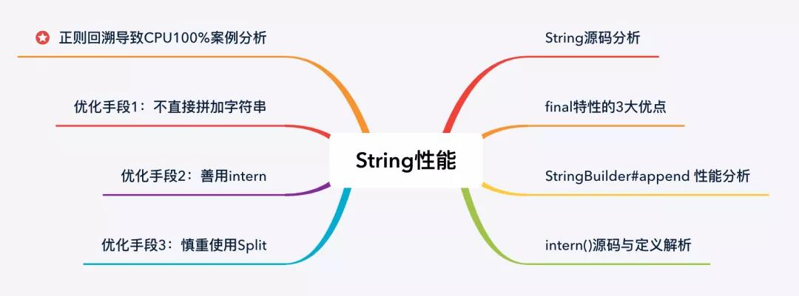

# String性能提升10倍的几个方法

String 类型是我们使用最频繁的数据类型，没有之一。那么提高 String 的运行效率，无疑是提升程序性能的最佳手段。
我们本文将从 String 的源码入手，一步步带你实现字符串优化的小目标。**不但教你如何有效的使用字符串，还为你揭晓这背后的深层次原因。**

本文涉及的知识点，如下图所示：



在看如何优化 String 之前，我们先来了解一下 String 的特性，毕竟知己知彼，才能百战不殆。

## 字符串的特性
想要了解 String 的特性就必须从它的源码入手，如下所示：

``` java
// 源码基于 JDK 1.8
public final class String
    implements java.io.Serializable, Comparable<String>, CharSequence {
    // String 值的实际存储容器
    private final char value[];
    public String() {
        this.value = "".value;
    }
    public String(String original) {
        this.value = original.value;
        this.hash = original.hash;
    }
    // 忽略其他信息
}
```

从他的源码我们可以看出，String 类以及它的 value[] 属性都被 final 修饰了，其中 value[] 是实现字符串存储的最终结构，而  final 则表示“最后的、最终的”。
我们知道，被 final 修饰的类是不能被继承的，也就是说此类将不能拥有子类，而被 final 修饰的变量即为常量，**它的值是不能被改变的。这也就说当 String 一旦被创建之后，就不能被修改了。**

## String 为什么不能被修改？

String 的类和属性 value[] 都被定义为 final 了，这样做的好处有以下三点：

* 安全性：当你在调用其他方法时，比如调用一些系统级操作指令之前，可能会有一系列校验，如果是可变类的话，可能在你校验过后，它的内部的值又被改变了，这样有可能会引起严重的系统崩溃问题，所以迫使 String 设计为 final 类的一个重要原因就是出于安全考虑；
* 高性能：String 不可变之后就保证的 hash 值的唯一性，这样它就更加高效，并且更适合做 HashMap 的 key- value 缓存；
* 节约内存：String 的不可变性是它实现字符串常量池的基础，字符串常量池指的是字符串在创建时，先去“常量池”查找是否有此“字符串”，如果有，则不会开辟新空间创作字符串，而是直接把常量池中的引用返回给此对象，这样就能更加节省空间。例如，通常情况下 String 创建有两种方式，直接赋值的方式，如 String str="Java"；另一种是 new 形式的创建，如 String str = new String("Java")。当代码中使用第一种方式创建字符串对象时，JVM 首先会检查该对象是否在字符串常量池中，如果在，就返回该对象引用，否则新的字符串将在常量池中被创建。这种方式可以减少同一个值的字符串对象的重复创建，节约内存。String str = new String("Java") 这种方式，首先在编译类文件时，“Java”常量字符串将会放入到常量结构中，在类加载时，“Java”将会在常量池中创建；其次，在调用 new 时，JVM 命令将会调用 String 的构造函数，同时引用常量池中的“Java”字符串，在堆内存中创建一个 String 对象，最后 str 将引用 String 对象。

## 不要直接+=字符串

通过上面的内容，我们知道了 String 类是不可变的，那么在使用 String 时就不能频繁的 += 字符串了。

优化前代码：

``` java
public static String doAdd() {
    String result = "";
    for (int i = 0; i < 10000; i++) {
        result += (" i:" + i);
    }
    return result;
}
```

有人可能会问，我的业务需求是这样的，那我该如何实现？
官方为我们提供了两种字符串拼加的方案：StringBuffer 和 StringBuilder，其中 StringBuilder 为非线程安全的，而 StringBuffer 则是线程安全的，StringBuffer 的拼加方法使用了关键字 synchronized 来保证线程的安全，源码如下：

``` java
@Override
public synchronized StringBuffer append(CharSequence s) {
    toStringCache = null;
    super.append(s);
    return this;
}
```

也因为使用 synchronized 修饰，所以 StringBuffer 的拼加性能会比 StringBuilder 低。
那我们就用 StringBuilder 来实现字符串的拼加，优化后代码：

``` java
public static String doAppend() {
    StringBuilder sb = new StringBuilder();
    for (int i = 0; i < 10000; i++) {
        sb.append(" i:" + i);
    }
    return sb.toString();
}
```

我们通过代码测试一下，两个方法之间的性能差别：

``` java
public class StringTest {
    public static void main(String[] args) {
        for (int i = 0; i < 5; i++) {
            // String
            long st1 = System.currentTimeMillis(); // 开始时间
            doAdd();
            long et1 = System.currentTimeMillis(); // 开始时间
            System.out.println("String 拼加，执行时间：" + (et1 - st1));
            // StringBuilder
            long st2 = System.currentTimeMillis(); // 开始时间
            doAppend();
            long et2 = System.currentTimeMillis(); // 开始时间
            System.out.println("StringBuilder 拼加，执行时间：" + (et2 - st2));
            System.out.println();
        }
    }
    public static String doAdd() {
        String result = "";
        for (int i = 0; i < 10000; i++) {
            result += ("Java中文社群:" + i);
        }
        return result;
    }
    public static String doAppend() {
        StringBuilder sb = new StringBuilder();
        for (int i = 0; i < 10000; i++) {
            sb.append("Java中文社群:" + i);
        }
        return sb.toString();
    }
}

```

以上程序的执行结果如下：

``` 
String 拼加，执行时间：429
StringBuilder 拼加，执行时间：1
String 拼加，执行时间：325
StringBuilder 拼加，执行时间：1
String 拼加，执行时间：287
StringBuilder 拼加，执行时间：1
String 拼加，执行时间：265
StringBuilder 拼加，执行时间：1
String 拼加，执行时间：249
StringBuilder 拼加，执行时间：1
```
从结果可以看出，优化前后的性能相差很大。

>注意：此性能测试的结果与循环的次数有关，也就是说循环的次数越多，他们性能相除的结果也越大。

接下来，我们要思考一个问题：**为什么 StringBuilder.append() 方法比 += 的性能高？而且拼接的次数越多性能的差距也越大？**

当我们打开 StringBuilder 的源码，就可以发现其中的“小秘密”了，StringBuilder 父类 AbstractStringBuilder 的实现源码如下：

``` java
abstract class AbstractStringBuilder implements Appendable, CharSequence {
    char[] value;
    int count;
    @Override
    public AbstractStringBuilder append(CharSequence s, int start, int end) {
        if (s == null)
            s = "null";
        if ((start < 0) || (start > end) || (end > s.length()))
            throw new IndexOutOfBoundsException(
                "start " + start + ", end " + end + ", s.length() "
                + s.length());
        int len = end - start;
        ensureCapacityInternal(count + len);
        for (int i = start, j = count; i < end; i++, j++)
            value[j] = s.charAt(i);
        count += len;
        return this;
    }
    // 忽略其他信息...
}
```

而 StringBuilder 使用了父类提供的 char[] 作为自己值的实际存储单元，每次在拼加时会修改 char[] 数组，StringBuilder toString() 源码如下：

``` java
@Override
public String toString() {
    // Create a copy, don't share the array
    return new String(value, 0, count);
}
```

综合以上源码可以看出：**StringBuilder 使用了 char[] 作为实际存储单元，每次在拼加时只需要修改 char[] 数组即可，只是在 toString() 时创建了一个字符串；而 String 一旦创建之后就不能被修改，因此在每次拼加时，都需要重新创建新的字符串，所以 StringBuilder.append() 的性能就会比字符串的 += 性能高很多。**

## 善用 intern 方法

善用 String.intern() 方法可以有效的节约内存并提升字符串的运行效率，先来看 intern() 方法的定义与源码：

``` java
/**
* Returns a canonical representation for the string object.
* <p>
* A pool of strings, initially empty, is maintained privately by the
* class {@code String}.
* <p>
* When the intern method is invoked, if the pool already contains a
* string equal to this {@code String} object as determined by
* the {@link #equals(Object)} method, then the string from the pool is
* returned. Otherwise, this {@code String} object is added to the
* pool and a reference to this {@code String} object is returned.
* <p>
* It follows that for any two strings {@code s} and {@code t},
* {@code s.intern() == t.intern()} is {@code true}
* if and only if {@code s.equals(t)} is {@code true}.
* <p>
* All literal strings and string-valued constant expressions are
* interned. String literals are defined in section 3.10.5 of the
* <cite>The Java&trade; Language Specification</cite>.
*
* @return  a string that has the same contents as this string, but is
*          guaranteed to be from a pool of unique strings.
*/
public native String intern();
```

可以看出 intern() 是一个高效的本地方法，它的定义中说的是，当调用 intern 方法时，如果字符串常量池中已经包含此字符串，则直接返回此字符串的引用，如果不包含此字符串，先将字符串添加到常量池中，再返回此对象的引用。
那什么情况下适合使用 intern() 方法？
Twitter 工程师曾分享过一个 String.intern() 的使用示例，Twitter 每次发布消息状态的时候，都会产生一个地址信息，以当时 Twitter 用户的规模预估，服务器需要 32G 的内存来存储地址信息。

``` java
public class Location {
    private String city;
    private String region;
    private String countryCode;
    private double longitude;
    private double latitude;
}
```

考虑到其中有很多用户在地址信息上是有重合的，比如，国家、省份、城市等，这时就可以将这部分信息单独列出一个类，以减少重复，代码如下：

``` java
public class SharedLocation {

  private String city;
  private String region;
  private String countryCode;
}

public class Location {

  private SharedLocation sharedLocation;
  double longitude;
  double latitude;
}
```

通过优化，数据存储大小减到了 20G 左右。但对于内存存储这个数据来说，依然很大，怎么办呢？
Twitter 工程师使用 String.intern() 使重复性非常高的地址信息存储大小从 20G 降到几百兆，从而优化了 String 对象的存储。
实现的核心代码如下：

``` java
SharedLocation sharedLocation = new SharedLocation();
sharedLocation.setCity(messageInfo.getCity().intern());    
sharedLocation.setCountryCode(messageInfo.getRegion().intern());
sharedLocation.setRegion(messageInfo.getCountryCode().intern());
```

从 JDK1.7 版本以后，常量池已经合并到了堆中，所以不会复制字符串副本，只是会把首次遇到的字符串的引用添加到常量池中。此时只会判断常量池中是否已经有此字符串，如果有就返回常量池中的字符串引用。
这就相当于以下代码：

``` java
String s1 = new String("Java中文社群").intern();
String s2 = new String("Java中文社群").intern();
System.out.println(s1 == s2);
```
执行的结果为：true
此处如果有人问为什么不直接赋值（使用 String s1 = "Java中文社群"），是因为这段代码是简化了上面 Twitter 业务代码的语义而创建的，他使用的是对象的方式，而非直接赋值的方式。

## 慎重使用 Split 方法

之所以要劝各位慎用 Split 方法，是因为 Split 方法大多数情况下使用的是正则表达式，这种分割方式本身没有什么问题，但是由于正则表达式的性能是非常不稳定的，使用不恰当会引起回溯问题，很可能导致 CPU 居高不下。

例如以下正则表达式：

``` java
String badRegex = "^([hH][tT]{2}[pP]://|[hH][tT]{2}[pP][sS]://)(([A-Za-z0-9-~]+).)+([A-Za-z0-9-~\\\\/])+$";
String bugUrl = "http://www.apigo.com/dddp-web/pdf/download?request=6e7JGxxxxx4ILd-kExxxxxxxqJ4-CHLmqVnenXC692m74H38sdfdsazxcUmfcOH2fAfY1Vw__%5EDadIfJgiEf";
if (bugUrl.matches(badRegex)) {
    System.out.println("match!!");
} else {
    System.out.println("no match!!");
}
```

执行效果如下图所示：


可以看出，此代码导致了 CPU 使用过高。

**Java 正则表达式使用的引擎实现是 NFA（Non deterministic Finite Automaton，不确定型有穷自动机）自动机，这种正则表达式引擎在进行字符匹配时会发生回溯（backtracking），而一旦发生回溯，那其消耗的时间就会变得很长，有可能是几分钟，也有可能是几个小时，时间长短取决于回溯的次数和复杂度。**

为了更好地解释什么是回溯，我们使用以下面例子进行解释：

``` java
text = "abbc";
regex = "ab{1,3}c";
```

上面的这个例子的目的比较简单，匹配以 a 开头，以 c 结尾，中间有 1-3 个 b 字符的字符串。
NFA 引擎对其解析的过程是这样子的：

* 首先，读取正则表达式第一个匹配符 a 和 字符串第一个字符 a 比较，匹配上了，于是读取正则表达式第二个字符；
* 读取正则表达式第二个匹配符 b{1,3} 和字符串的第二个字符 b 比较，匹配上了。但因为 b{1,3} 表示 1-3 个 b 字符串，以及 NFA 自动机的贪婪特性（也就是说要尽可能多地匹配），所以此时并不会再去读取下一个正则表达式的匹配符，而是依旧使用 b{1,3} 和字符串的第三个字符 b 比较，发现还是匹配上了，于是继续使用 b{1,3} 和字符串的第四个字符 c 比较，发现不匹配了，此时就会发生回溯；
* 发生回溯后，我们已经读取的字符串第四个字符 c 将被吐出去，指针回到第三个字符串的位置，之后程序读取正则表达式的下一个操作符 c，然后再读取当前指针的下一个字符 c 进行对比，发现匹配上了，于是读取下一个操作符，然后发现已经结束了。

这就是正则匹配执行的流程和简单的回溯执行流程，而上面的示例在匹配到“com/dzfp-web/pdf/download?request=6e7JGm38jf.....”时因为贪婪匹配的原因，所以程序会一直读后面的字符串进行匹配，最后发现没有点号，于是就一个个字符回溯回去了，于是就会导致了 CPU 运行过高。

**所以我们应该慎重使用 Split() 方法，我们可以用 String.indexOf() 方法代替 Split() 方法完成字符串的分割。如果实在无法满足需求，你就在使用 Split() 方法时，对回溯问题加以重视就可以了。**

## 总结

本文通过 String 源码分析，发现了 String 的不可变特性，以及不可变特性的 3 大优点讲解；然后讲了字符串优化的三个手段：不要直接 += 字符串、善用 intern() 方法和慎重使用 Split() 方法。并且通过 StringBuilder 的源码分析，了解了 append() 性能高的主要原因，以及正则表达式不稳定性导致回溯问题，进入导致 CPU 使用过高的案例分析，希望可以切实的帮助到你。
