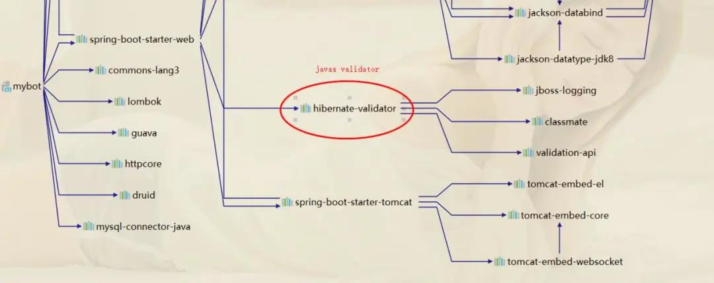

# Validator 注解使用

## 为什么要用validator

* javax.validation的一系列注解可以帮我们完成参数校验,免去繁琐的串行校验

不然我们的代码就像下面这样:

``` java
/**
     * 走串行校验
     *
     * @param userVO
     * @return
     */
    @PostMapping("/save/serial")
    public Object save(@RequestBody UserVO userVO) {
        String mobile = userVO.getMobile();

        //手动逐个 参数校验~ 写法
        if (StringUtils.isBlank(mobile)) {
            return RspDTO.paramFail("mobile:手机号码不能为空");
        } else if (!Pattern.matches("^[1][3,4,5,6,7,8,9][0-9]{9}$", mobile)) {
            return RspDTO.paramFail("mobile:手机号码格式不对");
        }

        //抛出自定义异常等~写法
        if (StringUtils.isBlank(userVO.getUsername())) {
            throw new BizException(Constant.PARAM_FAIL_CODE, "用户名不能为空");
        }

        // 比如写一个map返回
        if (StringUtils.isBlank(userVO.getSex())) {
            Map<String, Object> result = new HashMap<>(5);
            result.put("code", Constant.PARAM_FAIL_CODE);
            result.put("msg", "性别不能为空");
            return result;
        }
        //.........各种写法 ...
        userService.save(userVO);
        return RspDTO.success();
  }

```

这被大佬看见,一定说,都9102了还这么写,然后被劝退了

* 什么是javax.validation
>JSR303 是一套JavaBean参数校验的标准，它定义了很多常用的校验注解，我们可以直接将这些注解加在我们JavaBean的属性上面(面向注解编程的时代)，就可以在需要校验的时候进行校验了,在SpringBoot中已经包含在starter-web中,再其他项目中可以引用依赖,并自行调整版本:

``` java
<!--jsr 303-->
<dependency>
    <groupId>javax.validation</groupId>
    <artifactId>validation-api</artifactId>
    <version>1.1.0.Final</version>
</dependency>
<!-- hibernate validator-->
<dependency>
    <groupId>org.hibernate</groupId>
    <artifactId>hibernate-validator</artifactId>
    <version>5.2.0.Final</version>
</dependency>
```


* 注解说明

``` java
1.@NotNull：不能为null，但可以为empty(""," ","   ")
2.@NotEmpty：不能为null，而且长度必须大于0 (" ","  ")
3.@NotBlank：只能作用在String上，不能为null，而且调用trim()后，长度必须大于0("test")    即：必须有实际字符

```


验证注解|验证的数据类型|说明
--|:--:|--:
@AssertFalse|Boolean,boolean|验证注解的元素值是false
@AssertTrue|Boolean,boolean|验证注解的元素值是true
@NotNull|任意类型|验证注解的元素值不是null
@Null|任意类型|验证注解的元素值是null
@Min(value=值)|BigDecimal，BigInteger, byte,short, int, long，等任何Number或CharSequence（存储的是数字）子类型|验证注解的元素值大于等于@Min指定的value值
@Max（value=值）|和@Min要求一样|验证注解的元素值小于等于@Max指定的value值
@DecimalMin(value=值)|和@Min要求一样|验证注解的元素值大于等于@ DecimalMin指定的value值
@DecimalMax(value=值)|和@Min要求一样|验证注解的元素值小于等于@ DecimalMax指定的value值
@Digits(integer=整数位数, fraction=小数位数)|和@Min要求一样|验证注解的元素值的整数位数和小数位数上限
@Size(min=下限, max=上限)|字符串、Collection、Map、数组等|验证注解的元素值的在min和max（包含）指定区间之内，如字符长度、集合大小
@Past|java.util.Date,java.util.Calendar;Joda Time类库的日期类型|验证注解的元素值（日期类型）比当前时间早
@Future|与@Past要求一样|验证注解的元素值（日期类型）比当前时间晚
@NotBlank|CharSequence子类型|验证注解的元素值不为空（不为null、去除首位空格后长度为0），不同于@NotEmpty，@NotBlank只应用于字符串且在比较时会去除字符串的首位空格
@Length(min=下限, max=上限)|CharSequence子类型|验证注解的元素值长度在min和max区间内
@NotEmpty|CharSequence子类型、Collection、Map、数组|验证注解的元素值不为null且不为空（字符串长度不为0、集合大小不为0）
@Range(min=最小值, max=最大值)|BigDecimal,BigInteger,CharSequence, byte, short, int, long等原子类型和包装类型|验证注解的元素值在最小值和最大值之间
@Email(regexp=正则表达式,flag=标志的模式)|CharSequence子类型（如String）|验证注解的元素值是Email，也可以通过regexp和flag指定自定义的email格式
@Pattern(regexp=正则表达式,flag=标志的模式)|String，任何CharSequence的子类型|验证注解的元素值与指定的正则表达式匹配
@Valid|任何非原子类型|指定递归验证关联的对象如用户对象中有个地址对象属性，如果想在验证用户对象时一起验证地址对象的话，在地址对象上加@Valid注解即可级联验证


此处只列出Hibernate Validator提供的大部分验证约束注解，请参考hibernate validator官方文档了解其他验证约束注解和进行自定义的验证约束注解定义。

## 实战演练

* @Validated 声明要检查的参数

这里我们在控制器层进行注解声明

``` java
/**
     * 走参数校验注解
     *
     * @param userDTO
     * @return
     */
    @PostMapping("/save/valid")
    public RspDTO save(@RequestBody @Validated UserDTO userDTO) {
        userService.save(userDTO);
        return RspDTO.success();
    }

```

* 对参数的字段进行注解标注

``` java
import lombok.Data;
import org.hibernate.validator.constraints.Length;

import javax.validation.constraints.*;
import java.io.Serializable;
import java.util.Date;

/**
 * @author LiJing
 * @ClassName: UserDTO
 * @Description: 用户传输对象
 * @date 2019/7/30 13:55
 */
@Data
public class UserDTO implements Serializable {

    private static final long serialVersionUID = 1L;

    /*** 用户ID*/
    @NotNull(message = "用户id不能为空")
    private Long userId;

    /** 用户名*/
    @NotBlank(message = "用户名不能为空")
    @Length(max = 20, message = "用户名不能超过20个字符")
    @Pattern(regexp = "^[\\u4E00-\\u9FA5A-Za-z0-9\\*]*$", message = "用户昵称限制：最多20字符，包含文字、字母和数字")
    private String username;

    /** 手机号*/
    @NotBlank(message = "手机号不能为空")
    @Pattern(regexp = "^[1][3,4,5,6,7,8,9][0-9]{9}$", message = "手机号格式有误")
    private String mobile;

    /**性别*/
    private String sex;

    /** 邮箱*/
    @NotBlank(message = "联系邮箱不能为空")
    @Email(message = "邮箱格式不对")
    private String email;

    /** 密码*/
    private String password;

    /*** 创建时间 */
    @Future(message = "时间必须是将来时间")
    private Date createTime;

}

```

* 在全局校验中增加校验异常
> MethodArgumentNotValidException是springBoot中进行绑定参数校验时的异常,需要在springBoot中处理,其他需要 处理ConstraintViolationException异常进行处理.

  * 为了优雅一点,我们将参数异常,业务异常,统一做了一个全局异常,将控制层的异常包装到我们自定义的异常中
  * 为了优雅一点,我们还做了一个统一的结构体,将请求的code,和msg,data一起统一封装到结构体中,增加了代码的复用性

``` java
import com.boot.lea.mybot.dto.RspDTO;
import org.slf4j.Logger;
import org.slf4j.LoggerFactory;
import org.springframework.dao.DuplicateKeyException;
import org.springframework.web.bind.MethodArgumentNotValidException;
import org.springframework.web.bind.annotation.ExceptionHandler;
import org.springframework.web.bind.annotation.RestControllerAdvice;
import org.springframework.web.servlet.NoHandlerFoundException;

import javax.validation.ConstraintViolationException;
import javax.validation.ValidationException;


/**
 * @author LiJing
 * @ClassName: GlobalExceptionHandler
 * @Description: 全局异常处理器
 * @date 2019/7/30 13:57
 */
@RestControllerAdvice
public class GlobalExceptionHandler {

    private Logger logger = LoggerFactory.getLogger(getClass());

    private static int DUPLICATE_KEY_CODE = 1001;
    private static int PARAM_FAIL_CODE = 1002;
    private static int VALIDATION_CODE = 1003;

    /**
     * 处理自定义异常
     */
    @ExceptionHandler(BizException.class)
    public RspDTO handleRRException(BizException e) {
        logger.error(e.getMessage(), e);
        return new RspDTO(e.getCode(), e.getMessage());
    }

    /**
     * 方法参数校验
     */
    @ExceptionHandler(MethodArgumentNotValidException.class)
    public RspDTO handleMethodArgumentNotValidException(MethodArgumentNotValidException e) {
        logger.error(e.getMessage(), e);
        return new RspDTO(PARAM_FAIL_CODE, e.getBindingResult().getFieldError().getDefaultMessage());
    }

    /**
     * ValidationException
     */
    @ExceptionHandler(ValidationException.class)
    public RspDTO handleValidationException(ValidationException e) {
        logger.error(e.getMessage(), e);
        return new RspDTO(VALIDATION_CODE, e.getCause().getMessage());
    }

    /**
     * ConstraintViolationException
     */
    @ExceptionHandler(ConstraintViolationException.class)
    public RspDTO handleConstraintViolationException(ConstraintViolationException e) {
        logger.error(e.getMessage(), e);
        return new RspDTO(PARAM_FAIL_CODE, e.getMessage());
    }

    @ExceptionHandler(NoHandlerFoundException.class)
    public RspDTO handlerNoFoundException(Exception e) {
        logger.error(e.getMessage(), e);
        return new RspDTO(404, "路径不存在，请检查路径是否正确");
    }

    @ExceptionHandler(DuplicateKeyException.class)
    public RspDTO handleDuplicateKeyException(DuplicateKeyException e) {
        logger.error(e.getMessage(), e);
        return new RspDTO(DUPLICATE_KEY_CODE, "数据重复，请检查后提交");
    }


    @ExceptionHandler(Exception.class)
    public RspDTO handleException(Exception e) {
        logger.error(e.getMessage(), e);
        return new RspDTO(500, "系统繁忙,请稍后再试");
    }
}

```

* 测试

如下文:确实做到了参数校验时返回异常信息和对应的code,方便了我们不再繁琐的处理参数校验


## 自定义参数注解

* 比如我们来个 自定义身份证校验 注解

``` java
@Documented
@Target({ElementType.PARAMETER, ElementType.FIELD})
@Retention(RetentionPolicy.RUNTIME)
@Constraint(validatedBy = IdentityCardNumberValidator.class)
public @interface IdentityCardNumber {

    String message() default "身份证号码不合法";

    Class<?>[] groups() default {};

    Class<? extends Payload>[] payload() default {};
}

```

这个注解是作用在Field字段上，运行时生效，触发的是IdentityCardNumber这个验证类。

  >message 定制化的提示信息，主要是从ValidationMessages.properties里提取，也可以依据实际情况进行定制

  >groups 这里主要进行将validator进行分类，不同的类group中会执行不同的validator操作

  >payload 主要是针对bean的，使用不多。

* 然后自定义Validator

这个是真正进行验证的逻辑代码：

``` java
public class IdentityCardNumberValidator implements ConstraintValidator<IdentityCardNumber, Object> {

    @Override
    public void initialize(IdentityCardNumber identityCardNumber) {
    }

    @Override
    public boolean isValid(Object o, ConstraintValidatorContext constraintValidatorContext) {
        return IdCardValidatorUtils.isValidate18Idcard(o.toString());
    }
}

```
* 使用自定义的注解

``` java
    @NotBlank(message = "身份证号不能为空")
    @IdentityCardNumber(message = "身份证信息有误,请核对后提交")
    private String clientCardNo;
```

* 使用groups的校验

有的宝宝说同一个对象要复用,比如UserDTO在更新时候要校验userId,在保存的时候不需要校验userId,在两种情况下都要校验username,那就用上groups了:

>先定义groups的分组接口Create和Update

``` java
import javax.validation.groups.Default;

public interface Create extends Default {
}

import javax.validation.groups.Default;

public interface Update extends Default{
}

```

>再在需要校验的地方@Validated声明校验组

```java
/**
     * 走参数校验注解的 groups 组合校验
     *
     * @param userDTO
     * @return
     */
    @PostMapping("/update/groups")
    public RspDTO update(@RequestBody @Validated(Update.class) UserDTO userDTO) {
        userService.updateById(userDTO);
        return RspDTO.success();
    }

```

> 在DTO中的字段上定义好groups = {}的分组类型

``` java
@Data
public class UserDTO implements Serializable {

    private static final long serialVersionUID = 1L;

    /*** 用户ID*/
    @NotNull(message = "用户id不能为空", groups = Update.class)
    private Long userId;

    /**
     * 用户名
     */
    @NotBlank(message = "用户名不能为空")
    @Length(max = 20, message = "用户名不能超过20个字符", groups = {Create.class, Update.class})
    @Pattern(regexp = "^[\\u4E00-\\u9FA5A-Za-z0-9\\*]*$", message = "用户昵称限制：最多20字符，包含文字、字母和数字")
    private String username;

    /**
     * 手机号
     */
    @NotBlank(message = "手机号不能为空")
    @Pattern(regexp = "^[1][3,4,5,6,7,8,9][0-9]{9}$", message = "手机号格式有误", groups = {Create.class, Update.class})
    private String mobile;

    /**
     * 性别
     */
    private String sex;

    /**
     * 邮箱
     */
    @NotBlank(message = "联系邮箱不能为空")
    @Email(message = "邮箱格式不对")
    private String email;

    /**
     * 密码
     */
    private String password;

    /*** 创建时间 */
    @Future(message = "时间必须是将来时间", groups = {Create.class})
    private Date createTime;

}

```

注意:在声明分组的时候尽量加上 extend javax.validation.groups.Default否则,在你声明@Validated(Update.class)的时候,就会出现你在默认没添加groups = {}的时候的校验组@Email(message = "邮箱格式不对"),会不去校验,因为默认的校验组是groups = {Default.class}.

* restful风格用法

> 在多个参数校验,或者@RequestParam 形式时候,需要在controller上加注@Validated

``` java
@GetMapping("/get")
public RspDTO getUser(@RequestParam("userId") @NotNull(message = "用户id不能为空") Long userId) {
    User user = userService.selectById(userId);
    if (user == null) {
        return new RspDTO<User>().nonAbsent("用户不存在");
    }
    return new RspDTO<User>().success(user);
}


@RestController
@RequestMapping("user/")
@Validated
public class UserController extends AbstractController {
  @GetMapping("/get")
  public RspDTO getUser(@RequestParam("userId") @NotNull(message = "用户id不能为空") Long userId) {
    User user = userService.selectById(userId);
    if (user == null) {
        return new RspDTO<User>().nonAbsent("用户不存在");
    }
    return new RspDTO<User>().success(user);
  }
}
```

