# kubernetes 控制平面组件

- kube-scheduler
- Controller Manager
- kubelet
- CRI
- CNI
- CSI

## kuber-scheduler

kube-scheduler负责分配调度Pod到集群内的节点上，它监听kube-apiserver,查询还未分配Node的Pod,然后根据调度策略为这些Pod分配节点（更新Pod的NodeName字段）。

- 公平调度
- 资源高效利用
- Qos
- affinity和anti-affinity
- 数据本地化（inter-workload interference）
- deadlines

### 调度器

kube-scheduler调度分为两个阶段，predicate和priority

- predicate：过滤不符合条件的节点
- priority: 优先级排序，选择优先级最高的节点

#### Predicates 策略

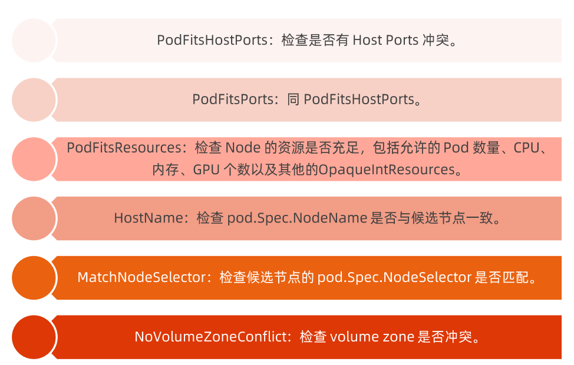
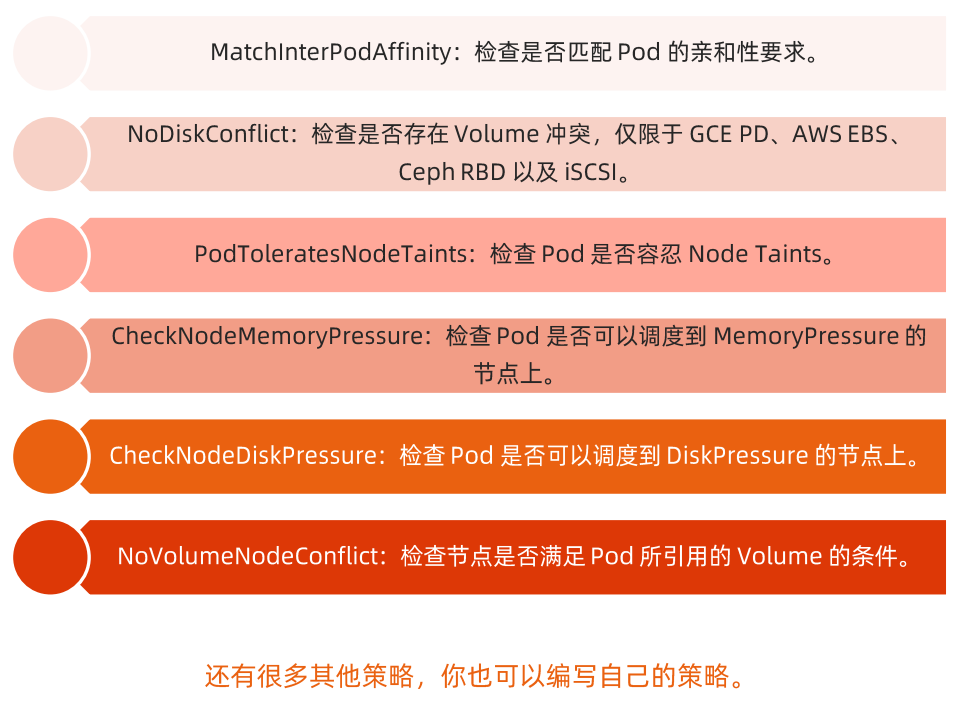

#### Priorities plugin工作原理

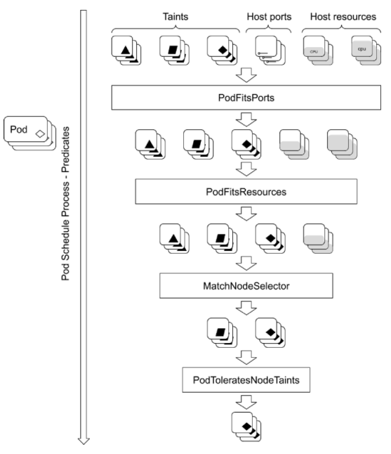

#### Priorities策略

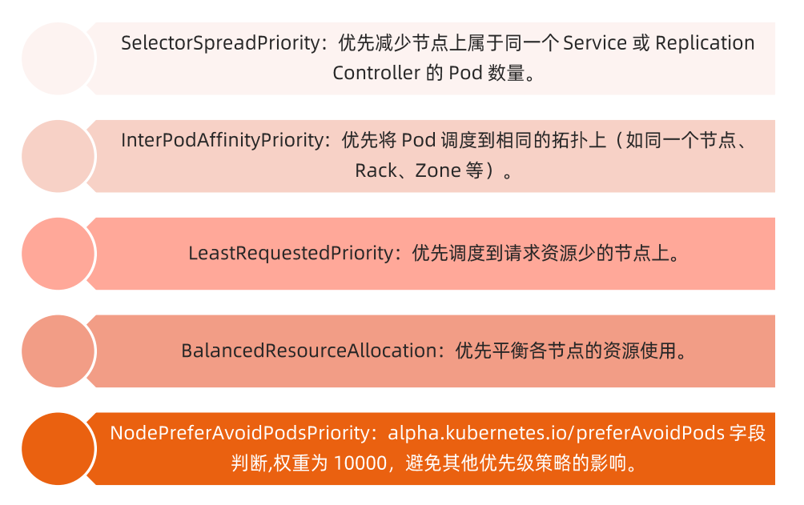
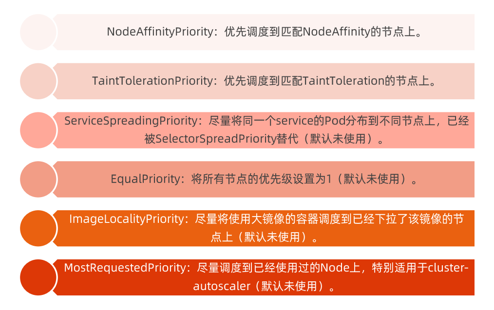

### 资源需求

- CPU
    - requests
        - Kubernetes调度Pod时，会判断当前节点正在运行的Pod的CPU Request的总和，再加上当前调度Pod的CPU request，计算其是否超过节点的CPU的可分配资源
    - limits
        - 配置cgroup以限制资源上限
- 内存        
    - requests
        - 判断节点的剩余内存是否满足Pod的内存请求量，以确定是否可以将Pod调度到该节点
    - limits
        - 配置cgroup以限制资源上限
- 磁盘资源需求
    - 容器临时存储（epheme「凯storage）包含日志和可写层数据，可以通过定义Pod Spec中的 Limits.ephemeral-storage 和 requests. ephemevL-stonage 来申请
    - Pod调度完成后,计算节点对临时存储的限制不是基于CGroup的，而是由kubelet定时获取容器的日志 和容器可写层的磁盘使用情况，如果超过限制，则会对Pod进行驱逐

### Init Container的资源需求

- 当kube-scheduleri|§度带有多个init:容器的Pod时，只计算cpu.request最多的init容器，而不是计算所有的init容器总和。
- 由于多个init容器按顺序执行，并且执行完成立即退出，所以申请最多的资源init容器中的所需资源, 即可满足所有init容器需求。
- kube-scheduler在计算该节点被占用的资源时，init容器的资源依然会被纳入计算。因为init容器在 特定情况下可能会被再次执行，比如由于更换镜像而引起Sandbox重建时。

### 把Pod调度到指定Node上

- 可以通过 nodeSeLector、nodeAffinitys podAffinity 以及Taints和tolerations等来将Pod调度动需要的Node 上。
- 也可以通过设置nodeName参数，将Pod调度到指定node节点上。

比如，使用nodeselector,首先给Node加上标签: kubectl label nodes <your-node-name> disktype=ssd 接着，指定该Pod只想运行在带有disktype=ssd标签的 Node上

```yaml
apiVersion: vl 
kind: Pod 
metadata:
    name: nginx
    labels:
        env: test
spec:
    containers:
        -name: nginx
        image: nginx 
        imagePullPolicy: IfNotPresent 
nodeSelector:
    disktype: ssd
```

### nodeSelector

首先给Node打上标签：
    kubectl label nodes node-01 disktype=ss

然后在 daemonset 中指定 nodeselector 为 disktype=ssd:

spec:
    nodeSelector:
    disktype: ssd

### NodeAffinity

NodeAffinity 目前支持两种：requiredDuringSchedulinglgnoredDuringExecution 和 preferredDuringSchedulinglgnoredDuringExecution,分别代表必须满足条件和优选条件。

比如下面的例子代表调度到包含标签Kubernetes.io/e2e-az-name并且值为e2e-az1或e2e-az2的 Node 上,并且优选还帯自标签 another-node-label-key=another-node-label-value 的 Node。

``` yaml
apiVersion: vl
kind: Pod
metadata:
    name: with-node-affinity
spec:
    affin ity:
        no deAffi nity:
            requiredDuri ngSchedulinglg no redDuringExecution:
                no deSelectorTerms:
                    -matchExpressions:
                        -key: kubernetes.io/e2e-az-name
                        operator: In
                        values:
                            -e2e-azl
                            -e2e-az2
preferredDuringSchedulinglgnoredDuringExecution:
    -weight: 1
    pref ere nee:
        matchExpressi ons:
            -key: another-node-label-key 
            operator: In 
            values:
                -ano ther-no de-label-value               
    containers:
    -name: with-node-affinity
    image: gcr.io/google_c ontain ers/pause:2.0                            
```

### podAffinity

podAffinity基于Pod的标签来选择Nod巳仅调度到满足条件Pod所在的Node上，支持 podAffinity和podAntiAffinity。这个功能比较绕'以下面的例子为例：

如果一个“Node所在zone中包含至少一个带有security=Sl标签且运行中的Pod” ,那么可以调度 到该Nod巳不调度到“包含至少一个带有security=S2标签且运行中Pod〃的Node上。

### podAffinity 示例

``` yaml
apiVersion: vl
kind: Pod
metadata:
    name: with-pod-affinity
spec:
    affinity:
        podAffinity:
            requiredDuringSchedulinglgnoredDuringExecution:
                -labelselector:
                    matchExpressi ons:
                    -key: security
                        operator: In
                        values:
                            -SI
                    topologyKey: failure-domain.beta.kubernetes.io/zone
        podAntiAffinity:
            preferredDuringSchedulinglgnoredDuringExecution:
                -weight: 100
                    podAffinityTerm:
                        labelselector:
                            matchExpressions:
                                -key: security
                                    operator: In
                                    values:
                                        -S2
                        topologyKey: kubernetes.io/hostname
containers:
    -name: with-pod-affinity
        image: gcr.io/google_containers/pause:2.0
```

### Taints 和 Tolerations

Taints和Tolerations用于保证Pod不被调度到不合适的Node上,其中Taint应用于Node上，而 Toleration则应用于Pod上。

目前支持的Taint类型：

- NoSchedule:新的Pod不调度到该Node ±,不影响正在运行的Pod;

- PreferNoSchedule: soft版的 NoSchedule,尽量不调度到该 Node 上;

- NoExecute:新的Pod不调度到该Node±,并且删除(evict)已在运行的Pod。Pod可以 增加一个时间(tolerationSeconds)。

然而，当Pod的Tolerations匹配Node的所有Taints的时候可以调度到该Node±;当Pod是已 经运行的时候，也不会被删除(evicted)，另外对于NoExecute,如果Pod增加了一个 tolerationSeconds,则会在该时间之后才删除Pod

### 多租户Kubernetes集群-计算资源隔离

Kubernetes集群一般是通用集群，可被所有用户共享，用户无需关心计算节点细节。

但往往某些自带计算资源的客户要求：

- 带着计算资源加入Kubernetes集群；
- 要求资源隔离。

实现方案：

- 将要隔离的计算节点打上Taints;

- 在用户创建创建Pod时，定义tolerations来指定要调度到nodetaints0

该方案有漏洞吗？如何堵住？

- 其他用户如果可以get nodes或者pods,可以看到taints信息，也可以用用同的tolerations占用资源。

- 不让用户get node detail?

- 不让用户get别人的pod detail?

- 企业内部，也可以通过规范管理，通过统计数据看谁占用了哪些node;

- 数据平面上的隔离还需要其他方案配合。

### 来自生产系统的经验

- 用户会忘记打tolerance,导致pod无法调度，pending;

- 新员工常犯的错误，通过聊天机器人的Q&A解决；

- 其他用户会get node detail,查到Taints,偷用资源。

- 通过dashboard,能看到哪些用户的什么应用跑在哪些节点上;

- 对于违规用户'批评教育为主。

### 优先级调度

从v1.8开始，kube-scheduler支持定义Pod的优先级，从而保证高优先级的Pod优先调度。开启方法为：

apiserve配置--feature-gates=PodPriority=true --runtime-config=scheduling.k8s.io/v1alpha1=true

kube-scheduler配置--feature-gates=PodPriority=true

### Priorityclass

在指定Pod的优先级之前需要先定义一个Priorityclass （非namespace资源）,如：

``` yaml
apiVersion: vl
kind: PriorityCless
metadata:
    name: high-priority
    value: 1000000
globalDefault: false
description: "This priority class should be used for XYZ service pods only."
```

### 为Pod设置priority

 ```yaml
apiVersion: v1
kind: Pod
metadata:
    name: nginx
    labels:
        env: test
spec:
    containers:
    - name: nginx
        image: nginx
        imagePullPolicy: IfNotPresent
    priorityClassName: high-priority
 ```

### 多调度器

如果默认的调度器不满足要求，还可以部署自定义的调度器。并且，在整个集群中还可以同时运行多个调度器实例，通过podSpec.schedulerName来选择使用哪一个调度器（默认使用内置的调度器）。

### 来自生产的一些经验

调度器可以说是运营过程中稳定性最好的组件之一，基本没有太大的维护effort

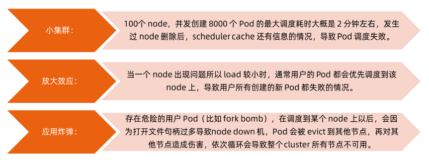

## Controller Manager

### 控制工作流程

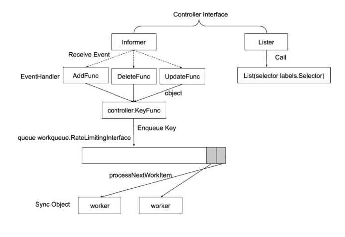

### Informer 的内部机制

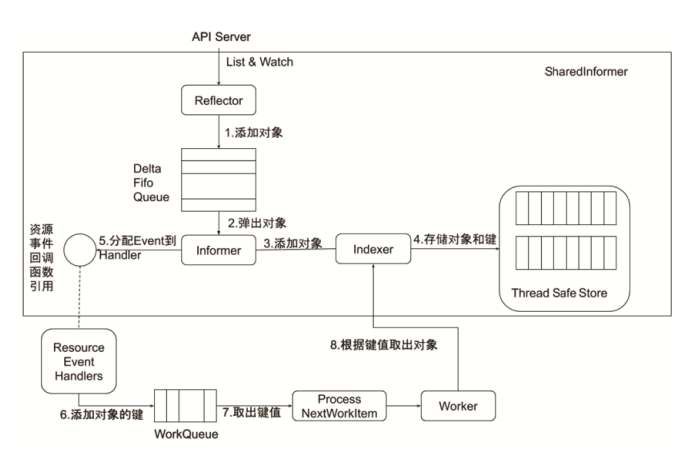

### 控制器的协同工作原理

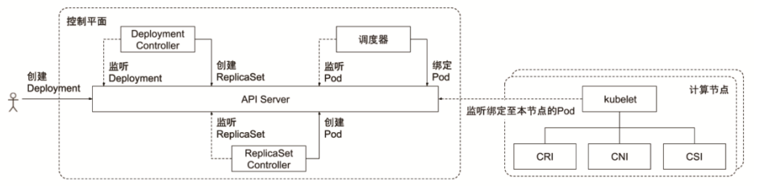

### 通用 Controller

- Job Controller:处理 job。

- Pod AutoScaler:处理pod为自动缩容/扩容。

- RelicaSet:依据 ReplicasetSpec 创建 Pod。

- Service Controller:为 LoadBalancertype 的 service 创建 LB VIP

- ServiceAccount Controller:确保 serviceaccount在当前 namespace存在。

- StatefulSet Controller:处理 statefulset 中的 pod。

- Volume Controller:依据 PV spec 创建 volume。

- Resource quota Controller:在用户使用资源之后，更新状态。

- Namespace Controller:保证namespace删除时，该namespace下的所有资源都先被删除

- Replication Controller:创建 RC 后，负责创建 Pod。

- Node Controller:维护node状态，处理evict请求等。

- Daemon Controller:依据 damonset 创建 Pod。

- Deployment Controller:依据 deployment spec 创建 replicaset。

- Endpoint Controller:依据 service spec 创建 endpoint,依据 podip 更新 endpoint。

- Garbage Collector:处理级联删除，比如删除deployment的同时删除replicaset以及Pod

- Cronjob Controller:处理 cronjob

### Cloud Controller Manager

什么时候需要 cloud controller manager?

Cloud Controller Manager 自 Kubernetesl.6 开始，从 kube-controller-manager 中分离出来,主 要因为 Cloud Controller Manager 往往需要跟企业 cloud 做深度集成,release cycle 跟Kubernetes 相对独立。

与Kubernetes核心管理组件一起升级是一件费时费力的事。

通常 cloud controller manager 需要：

- 认证授权：企业cloud往往需要认证信息，Kubernetes要与Cloud API通信，需要获取 cloud系统里的 ServiceAccount;

- Cloud controller manager 本身作为一个用户态的 component,需要在 Kubernetes 中有 正确的RBAC设置，获得资源操作权限；

- 高可用：需要通过leader election来确保cloud controller manger高可用。

### Cloud controller manager 的配置

- cloud controller manager是从老版本的APIServer分离出来的。
    - Kube-APIServer 和 kube-controller-manager 中一定不能指定 cloud-provider,否则会加载 内置的cloud controller manager
    - Kubelet 要配置--cloud-provider=external

- Cloud Controller Manager 主要支持：
    - Node controller:访问cloud API,来更新node状态；在cloud删除该节点以后，从
    - kubernetes 删除 node;
    - Service controller:负责配置为loadbalancer类型的服务配置LB VIP;
    - Route Controller:在 cloud 环境配置路由；
    - 可以自定义任何需要的Cloud Controller。

### 需要定制的Cloud controller

- Ingress controller;
- Service Controller;
- 自主研发的controller,比如之前提到的:
    - RBAC controller;
    - Accountcontroller。

### 来自生产的经验

- 保护好controller manager 的 kubeconfig：
    - 此kubeconfig拥有所有资源的所有操作权限，防止普通用户通过kubectl exec kube-controller-manager cat 获取该文件。
    - 用户可能做任何你想象不到的操作，然后来找你support
- Podevict后IP发生变化,但endpoint中的address更新失败：
    - 分析 stacktrace 发现 endpoint 在更新 LoadBalancer 时调用 gophercloud 连接 hang 住，导 致endpoint worker线程全部卡死。

### 确保scheduler和controller的高可用

Leader Election

Kubenetes 提供基于 configmap 和 endpoint 的 leader election 类库

Kubernetes采用leader election模式启动component后，会创建对应endpoint,并把当前的 leader 信息、annotate 到 endponit 上

```yaml
apiVersion: vl
kind: Endpoints
metadata:
    annotations:
        control-plane.alpha.kuber netes.io/leader:
            ‘{"holderldentity":"minikube"/"leaseDurationSeconds":15/"acquireTimen:"2023-04-
05T17:31:29Z","renewTime":"2023-04-07T07:31:29Z”，“leaderTransitions”:0}'
        creationTimestamp: 2023-04-05T17:31:29Z
        name：kube-scheduler
        namespace: kube-system
        resourceversion: "138930"
        selfLink: /api/vl/namespaces/kube-system/endpoints/kube-scheduler
        uid: 2d12578d-38f7-11 e8-8df0-0800275259e5
    subsets: null
```

### Leader Election

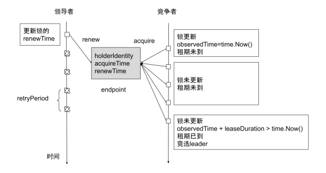

## kubelet

### kubelet构架

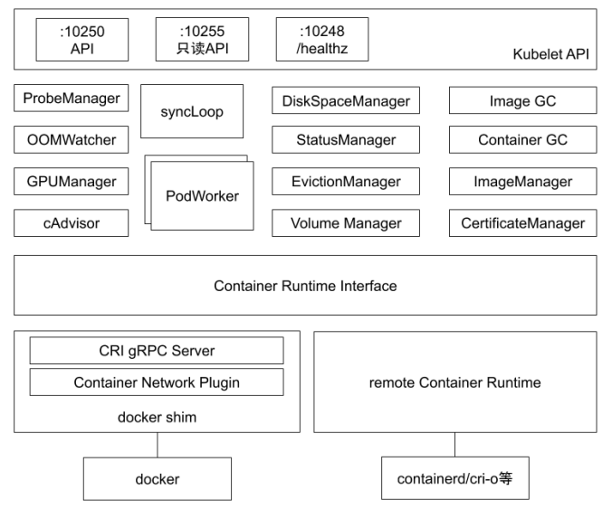

### kubelet管理Pod的核心流程

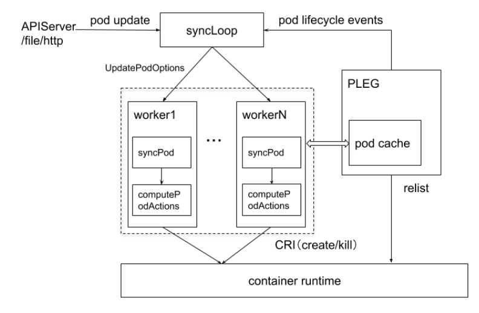

### Kuberlet

每个节点上都运行一个kubelet服务进程，默认监听10250端口。

- 接收并执行master发来的指令；
- 管理Pod及Pod中的容器；
- 每个kubelet进程会在API Server上注册节点自身信息，定期向master节点汇报节点的资 源使用情况，并通过cAdvisor监控节点和容器的资源。

### 节点管理

节点管理主要是节点自注册和节点状态更新：

- Kubelet可以通过设置启动参数-register-node来确定是否向API Server注册自己
- 如果Kubelet没有选择自注册模式，则需要用户自己配置Node资源信息，同时需要告知Kubelet集群上的API Server的位置；
- Kubelet在启动时通过API Server注册节点信息,并定时向API Server发送节点新消息，API Server在接收到新消息后，将信息写入etcd。

### Pod管理

获取Pod清单：

- 文件：启动参数--config指定的配置目录下的文件(默认/etc/Kubernetes/manifests/)。该文件每20秒重新检查一次(可配置)。
- HTTP endpoint (URL):启动参数一manifest-url设置。每20秒检查一次这个端点(可配置 )。
- API Server:通过 API Server 监听 etcd 目录，同步 Pod 清单。
- HTTP server: kubelet侦听HTTP请求，并响应简单的API以提交新的Pod清单。

### Pod启动流程

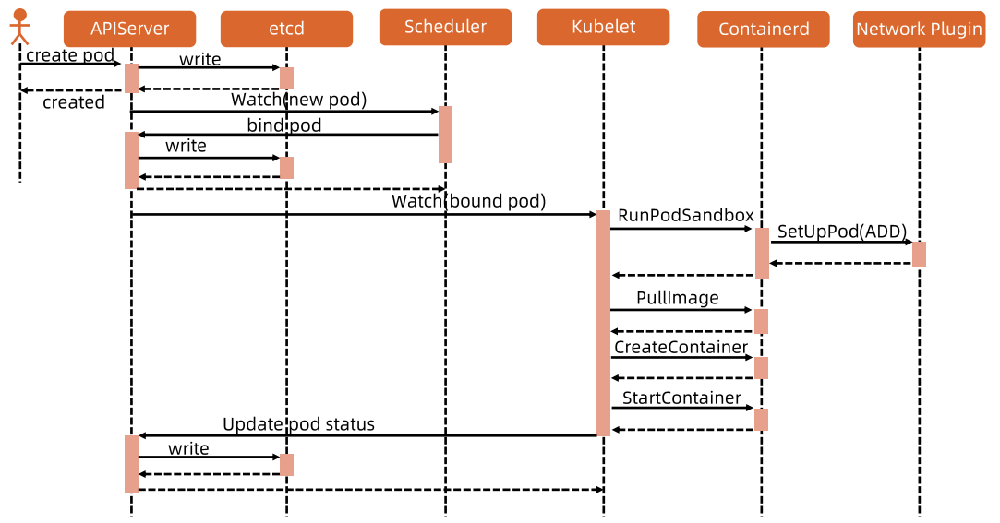

### Kubelet启动Pod流程

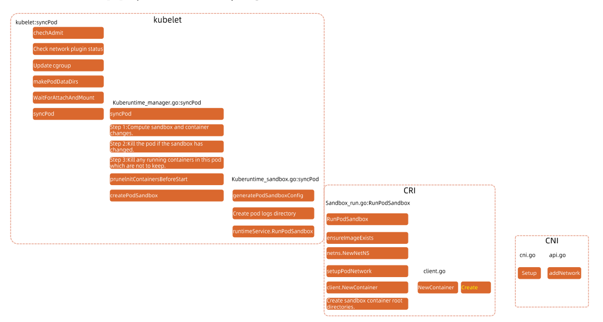

## CRI

容器运行时(Container Runtime),运行于Kubernetes (k8s)集群的每个节点中,负责容器的整 个生命周期。其中Docker是目前应用最广的。随着容器云的发展，越来越多的容器运行时涌现。为了 解决这些容器运行时和Kubernetes的集成问题，在Kubernetes 1.5版本中，社区推出了 CRI ( Container Runtime Interface,容器运行时接口)以支持更多的容器运行时。

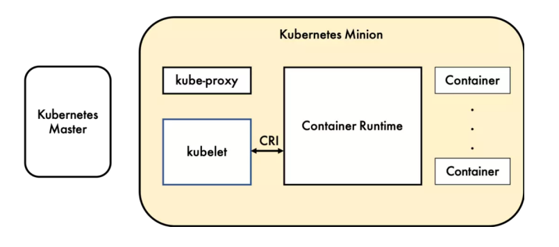

CRI是Kubernetes定义的一组gRPC服务。kubelet作为客户端，基于gRPC框架，通过Socket和 容器运行时通信。它包括两类服务：镜像服务(Image Service)和运行时服务(Runtime Service) o镜像服务提供下载、检查和删除镜像的远程程序调用。运行时服务包含用于管理容器生命周期，以 及与容器交互的调用(exec/attach/port-forward)的远程程序调用。

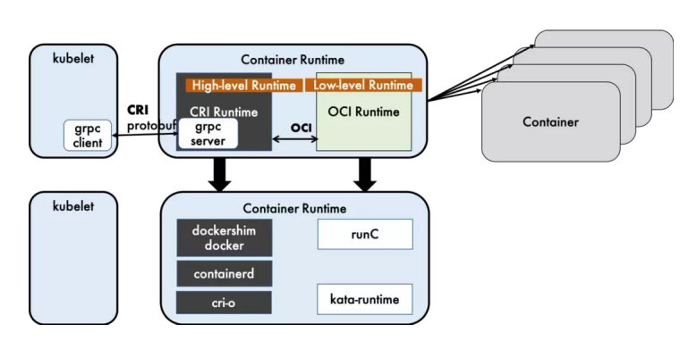

### 运行时的层级

Dockershim, containerd和CRI-0都是遵循CRI的容器运行时，我们称他们为高层级运行时
(High-Level Runtime)。
OCI (Open Container Initiative,开放容器计划)定义了创建容器的格式和运行时的开源行业标准， 包括镜像规范(Image Spec币cation)和运行时规范(Runtime Spec币cation)。
镜像规范定义了 OCI镜像的标准。高层级运行时将会下载一个OCI镜像，并把它解压成OCI运行时文 件系统包(filesystem bundle)。
运行时规范则描述了如何从OCI运行时文件系统包运行容器程序’并且定义它的配置、运行环境和生 命周期。如何为新容器设置命名空间(namepsaces)和控制组(cgroups),以及挂载根文件系统 等等操作，都是在这里定义的。它的一个参考实现是runC。我们称其为低层级运行时(Low-level R untime)。除runC以外，也有很多其他的运行时遵循OCI标准，例如kata-runtime。


容器运行时是真正起删和管理容器的组件。容器运行时可以分为高层和低层的运行时。高层运行时主要包括Docker, containerd和CRI-O,低层的运行时，包含了 runc, kata,以及gVisor。低层运行时kata和gVisor都还处于小 规模落地或者实验阶段，其生态成熟度和使用案例都比较欠缺，所以除非有特殊的需求，否则runc几乎是必然的选择。因此在对容器运行时的选择上，主要是聚焦于上层运行时的选择。
Docker内部关于容器运行时功能的核心组件是containerd,后来containerd也可直接和kubelet通过CRI对接， 独立在Kubernetes中使用。相对于Docker而言，containerd减少了 Docker所需的处理模块Dockerd和 Docker-shim,并且对Docker支持的存储驱动进行了优化，因此在容器的创建启动停止和删除，以及对镜像的拉取上，都具有性能上的优势。架构的简化同时也带来了维护的便利。当然Docker也具有很多containerd不具有的功能，例如支持zfs存储驱动，支持对日志的大小和文件限制，在以overlayfs2做存储驱动的情况下，可以通过 xfs_quota来对容器的可写层进行大小限制等。尽管如此，containerd目前也基本上能够满足容器的众多管理需求, 所以将它作为运行时的也越来越多。

CRI

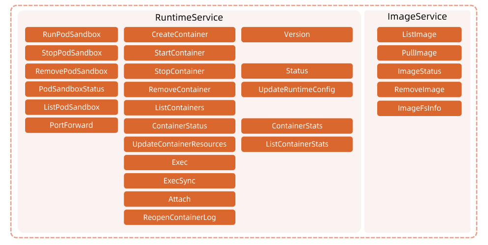
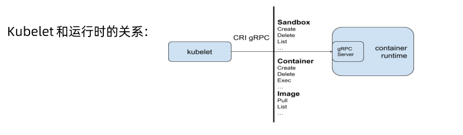

### 开源运行时的比较

Docker的多层封装和调用，导致其在可维护性上略逊一筹，增加了线上问题的定位难度；几乎除了重 启Docker,我们就毫无施法了。
containerd和CRI-O的方案比起Docker简洁很多。

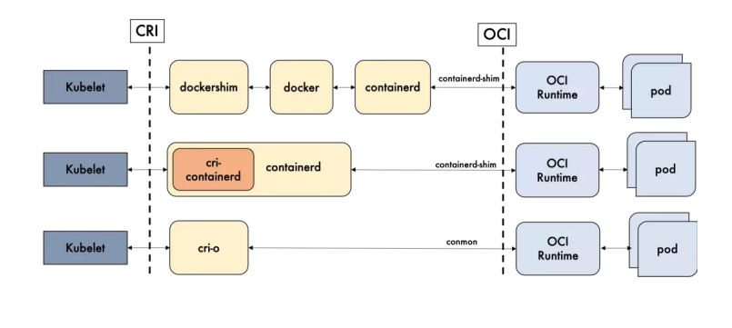

### Docker和containerd差异细节

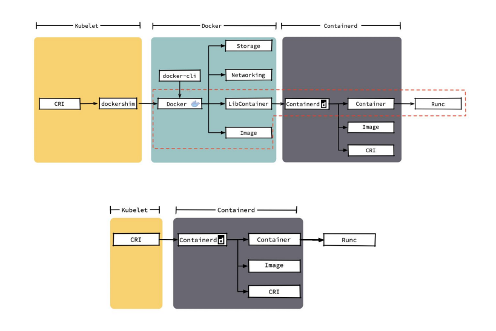

### 多种运行时的性能比较

containerd在各个方面都表现良好，除了启动容器这项。从总用时来看，containerd的用时还是要比 CRI-O要短的  

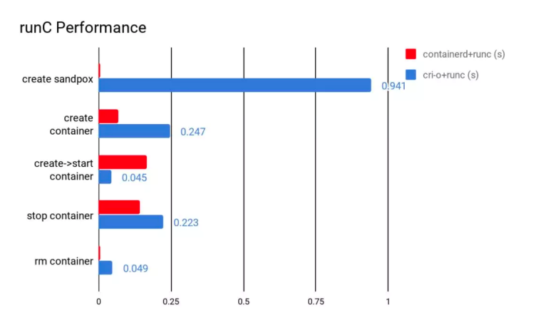

### 运行时优劣对比

功能性来讲,containerd和CRI-O都符合CRI和OCI的标准;
在稳定性上，containerd略胜一筹；
从性能上讲，containerd胜出.

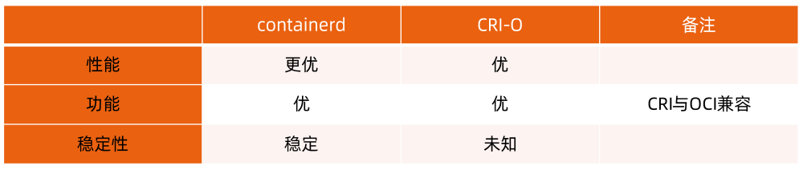

## CNI

Kubernetes网络模型设计的基础原则是：

- 所有的Pod能够不通过NAT就能相互访问。
- 所有的节点能够不通过NAT就能相互访问。
- 容器内看见的IP地址和外部组件看到的容器IP是一样的。

Kubernetes的集群里，IP地址是以Pod为单位进行分配的，每个Pod都拥有一个独立的IP地址。一 个Pod内部的所有容器共享一个网络栈，即宿主机上的一个网络命名空间’包括它们的IP地址、网络 设备、配置等都是共享的。也就是说，Pod里面的所有容器能通过localhost:port来连接对方。在 Kubernetes中，提供了一个轻量的通用容器网络接口 CNI (Container Network Interface),专门 用于设置和删除容器的网络连通性。容器运行时通过CNI调用网络插件来完成容器的网络设置。

### CNI插件分类和常见插件

- IPAM： IP地址分配
- 主插件：网卡设置
    - bridge:创建一个网桥，并把主机端口和容器端口插入网桥
    - ipvlan:为容器添加ipvlan网口
    - loopback:设置Loopback网口
- Meta:附加功能
    - portmap:设置主机端口和容器端口映射
    - bandwidth:利用Linux Traffic Control限流
    - firewall:通过iptdbles或firewaHd为容器设置防火墙规则

https://qithub.com/containernetworkinq/pluqins

### CNI插件运行机制

容器运行时在启动时会从CNI的配置目录中读取JSON格式的配置文件，文件后缀为".conf" ".conflist",".json"。如果配置目录中包含多个文件，一般情况下,会以名字排序选用第一个配置文件作为默认的网络配置，并加载获取其中指定的CNI插件名称和配置参数。

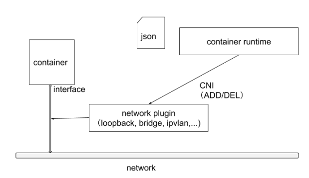

### CNI的运行机制

关于容器网络管理，容器运行时一般需要配置两个参--cni-bin-dir和--cni-conf-dir。有一种特殊情况，kubelet内置的Docker作为容器运行时，是由kubelet来查找CNI插件的，运行插件来为容器 设置网络，这两个参数应该配置在kubelet处：

- cni-bin-dir:网络插件的可执行文件所在目录。默认是/opt/cni/bin
- cni-conf-dir:网络插件的配置文件所在目录。默认是/etc/cni/net.d

### CNI 插件设计考量

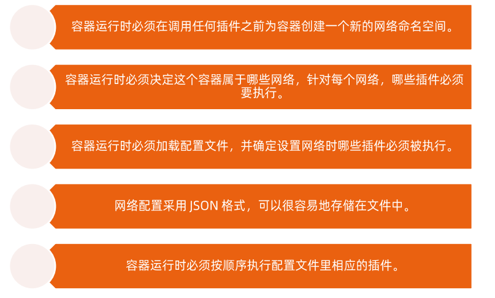
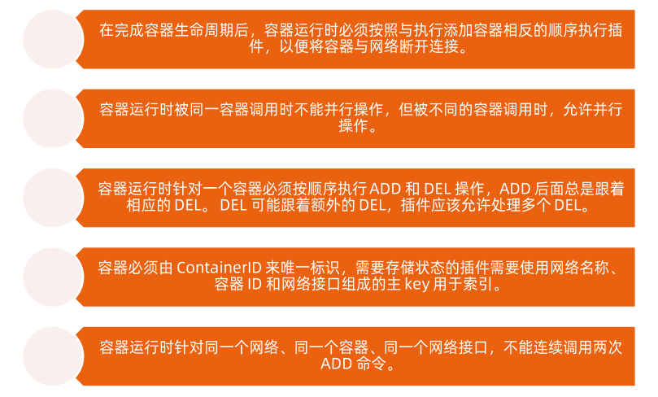

### 打通主机层网络

CNI插件外，Kubernetes还需要标准的CNI插件Lo,最低版本为0.2.0版本。网络插件除支持设置和 清理Pod网络接口外，该插件还需要支持lptables。如果Kube-proxy工作在Iptables模式，网络插件需要确保容器流量能使用Iptables转发。例如，如果网络插件将容器连接到Linux网桥，必须将net/bridge/bridge-nf-call-iptables参数sysctl设置为1,网桥上数据包将遍历Iptables规则。如果插件不使用Linux桥接器（而是类似Open vSwitch或其他某种机制的插件）,则应确保容器流量被正确设置了路由。

### CNI Plugin

ContainerNetworking 组维护了一些 CNI 插件，包括网络接口创建的 bridge, ipvlan. Loopback, macvlan、ptp、host-device 等，IP 地址分酉己的 DHCP、host-local 和 static,其他的 Flannel, tunning、portmaps firewall等。
社区还有些第三方网络策略方面的插件，例如Calico. Cilium和Weave等。可用选项的多样性意味 着大多数用户将能够找到适合其当前需求和部署环境的CNI插件，并在情况变化时迅捷转换解决方案。

### Flannel

Flannel是由CoreOS开发的项目，是CNI插件早期的入门产品,简单易用。
Flannel使用Kubernetes集群的现有etcd集群来存储其状态信息，从而不必提供专用的数据存储，只需要在每个节点上运行 flanneld来守护进程。
每个节点都被分配一个子网，为该节点上的Pod分配IP地址。
同一主机内的Pod可以使用网桥进行通信，而不同主机上的Pod将通过fbanneld将其流量封装在UDP数据包中，以路由到适当的目的地。
封装方式默认和推荐的方法是使用VxLAN,因为它具有良好的性能，并且比其他选项要少些人为干预。虽然使用VxLAN之类的技术 封装的解决方案效果很好，但缺点就是该过程使流量跟踪变得困难。
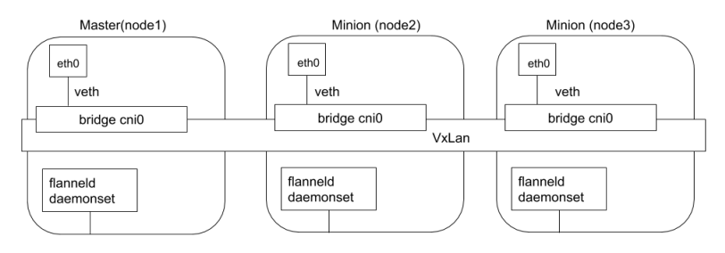

### Calico

Calico以其性能、灵活性和网络策略而闻名，不仅涉及在主机和Pod之间提供网络连接，而且还涉及网络安全性和 策略管理。

对于同网段通信，基于第3层，Calico使用BGP路由协议在主机之间路由数据包，使用BGP路由协议也意味着数据 包在主机之间移动时不需要包装在额外的封装层中。

对于跨网段通信，基于IPinlP使用虚拟网卡设备tunlO,用一个IP数据包封装另一个IP数据包，外层IP数据包头的 源地址为隧道入口设备的IP地址，目标地址为隧道出口设备的IP地址。

网络策略是Calico最受欢迎的功能之一，使用ACLs协议和kube-proxy来创建iptables过滤规则，从而实现隔离 容器网络的目的。

此外，Calico还可以与服务网格Istio集成，在服务网格层和网络基础结构层上解释和实施集群中工作负载的策略。 这意味着您可以配置功能强大的规则，以描述Pod应该如何发送和接收流量，提高安全性及加强对网络环境的控制。

Calico属于完全分布式的横向扩展结构，允许开发人员和管理员快速和平稳地扩展部署规模。对于性能和功能（如 网络策略）要求高的环境，Calico是一个不错选择。

### Calico组件

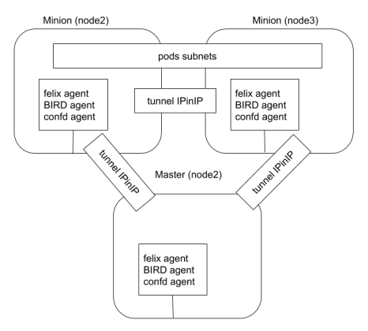

### Calico初始化

配置和CNI二进制文件由initContainer推送

``` yaml
-comma nd:
-/opt/cni/bin/install
env:
-name: CNI_CONF_NAME
value: 10-calico.conflist
-name: SLEEP
value: "false"
-name: CNI_NET_DIR
value: /etc/cni/net.d
-name: CNI_NETWORK_CONFIG valueFrom:
con figMapKeyRef:
key: config name: cni-config
-name:
KUBERNETES_SERVICE_HOST
value: 10.96.0.1
-name:
KUBERNETES_SERVICE_PORT
value: "443"
image: docker.io/calico/cni:vM.20.1 imagePullPolicy: IfNotPresent name: install-cni
```

### Calico配置一览
``` json
"name": "kSs-pod-network",
"cniVersion": "0.3.1",
"plugins":[
{
"type": "calico",
"datastore_type": "kubernetes",
"mtu": 0,
"noden ame_file_opti on al": false,
"log_level": "Info",
"log_file_path": "/var/log/calico/cni/cni.log",
:ype": "calico-ipam", "assign ipv4" : "true", a Ise"},
"container_settings": {
"allow ip forwarding": false
},
"policy": {
"type": "k8s"
},
"kubernetes": { "k8s_api_root":"https://10.96.0.1:443",
"kubeconfig": "/etc/cni/net.d/calico-kubeconfig"
}
{
"type": "bandwidth",
"capabilities": {"bandwidth": true}
},
{"type": "portmap", "snat": true, "capabilities": {"portMappings": true}}
```

### Calico VXLan

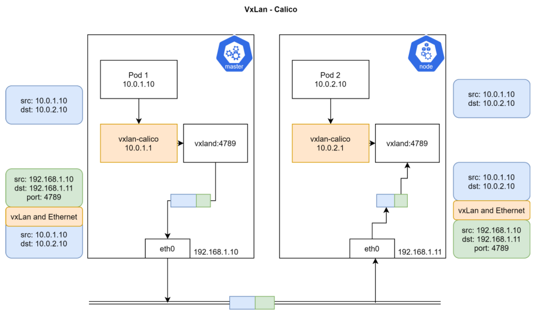

### IPPool

IPPool用来定义一个集群的预定义IP段 apiVersion: crd.projectcalico.org/vl kind: IPPool

``` yaml
metadata:
name: default-ipv4-ippool
spec:
blocksize: 26
cidr: 192.168.0.0/16
ipipMode: Never
natOutgoing: true nodeSelector: all() vxlanMode: CrossSubnet
```

### IPAMBlock

IPAMBLock用来定义每个主机预分配的IP段

```yaml
apiVersion: crd.projectcalico.org/vl kind: IPAMBlock
metadata:
anno tations:
name: 192-168-119-64-26
spec:
affinity: host:cadmin
allocati ons:
-null
-0
-null
-1
-2
-3
attributes:
-handle_id: vxlan-tunnel-addr-cadmin
secondary:
no de: cadmin
type: vxlanTunnelAddress
-handle_id: k8s-pod-network.6680d3883d6150e75ffbd031f86c689a97a5be0f260c6442b2bb46b567c2ca40
secondary:
namespace: calico-apiserver
node: cadmin
pod: calico-apiserver-77dffffcdf-g2tcx
timestamp: 2021 -09-30 09:46:57.45651816 +0000 UTC
-handle_id: k8s-pod-network.bl0d7702bf334fc55a5e399a731 ab3201 ea9990扪e?bc79894abddd712646699
secondary:
namespace: calico-system
node: cadmin
pod: calico-kube-controllers-bdd5f97c5-554z5
timestamp: 2021 -09-30 09:46:57.502351 346 +0000 UTC
```

### IPAMHandle

IPAMHandle用来记录IP分配的具体细节

``` yaml
apiVersion: crd.projectcalico.org/vl
kind: IPAMHancILe
metadata:
name: k8s-pod-network.8d75b941 d85c4998016b72c83f9c5a75512c82c052357daf0ec8e67365635d93
spec:
block:
192.168.119.64/26： 1
deleted: false
handlelD: k8s-pod-network.8d75b941 d85c4998016b72c83f9c5a75512c82c052357daf0ec8e67365635d93
```

### 创建Pod并查看IP配置情况

容器 namespace

``` shell
nsenter -t 720702 -n ip a
1: lo: <LOOPBACK/UP,LOWER_UP> mtu 65536 qdisc noqueue state UNKNOWN group default qlen 1000
Link/loopback 00:00:00:00:00:00 brd 00:00:00:00:00:00
inet 127.0.0.1 /8 scope host lo
valid_lft forever preferred_lft forever
3: eth0@if27: vBROADCAST,MULTICAST,UP丄OWER_UPA mtu 1450 qdisc noqueue state UP group default
link/ether f2:86:d2:4f:1f:30 brd ff:ff:ff:ff:ff:ff link-netnsid 0
inet 192.168.119.84/32 brd 192.168.119.84 scope global ethO
valid_lft forever preferred_lft forever
nsenter -t 720702 -n ip r
default via 169.254.1.1 dev ethO
169.254.1.1 dev ethO scope Link
nsenter -t 720702 -n arp
Address HWtype HWaddress Flags Mask Iface
169.254.1.1 ether ee:ee:ee:ee:ee:ee C ethO
10.0.2.15 ether ee:ee:ee:ee:ee:ee C ethO
```

主机 Namespace

``` shell
ip link
27: cali23a582ef038@if3:
《BROADCAST,MULTICAST,UP丄OWER_UP> mtu 1450 qdisc no queue state UP group default
link/ether ee:ee:ee:ee:ee:ee brd link-netnsid 9
inet6 fe80::ecee:eeff:feee:eeee/64 scope link
validjft forever preferred」ft forever
ip route
192.168.119.84 dev cali23a582ef038 scope link
```

### CNI Plugin的对比

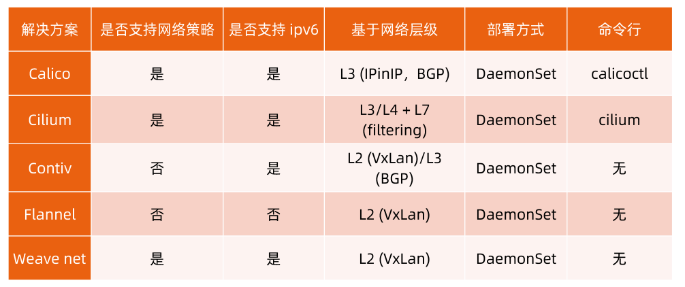

## CSI

### 容器运行时存储

- 除外挂存储卷外，容器启动后，运行时所需文件 系统性能直接影响容器性能；
- 早期的Docker采用Device Mapper作为容器 运行时存储驱动，因为0verlayFS尚未合并进 Kernel;
- 目前Docker和containerd都默认以 OverlayFS作为运行时存储驱动；
- OverlayFS目前已经有非常好的性能，与 DeviceMapper相比优20%,与操作主机文件 性能几乎一致。

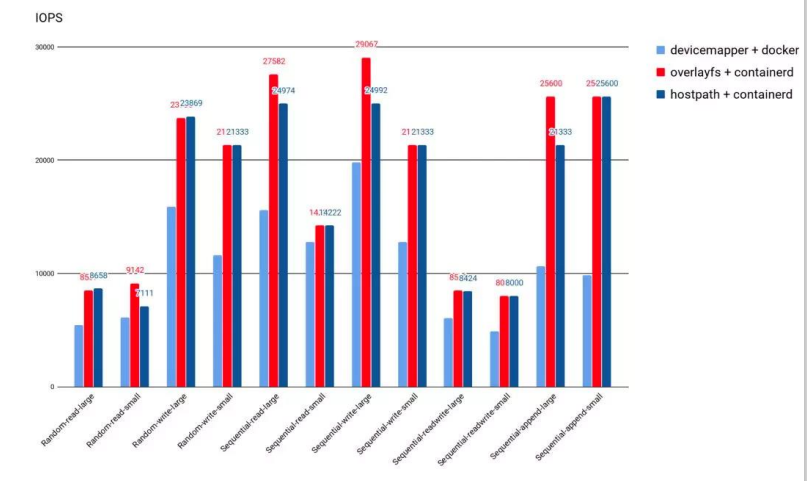

### 存储卷插件管理

Kubernetes支持以插件的形式来实现对不同存储的支持和扩展，这些扩展基于如下三种方式:

- in-tree 插件:Kubernetes社区已不再接受 新的in-tree存储插件，新的存储必须通过out-of-tree插件进行支持
- out-of-tree FlexVolume 插件:FlexVolume 是指 Kubernetes 通过调用计算节点的本地可执行文件与存储插件进行交互FlexVolume插件需要宿主机用root权限来安装插件驱动FlexVolume存储驱动需要宿主机安装attach、mount等工具，也需要具有root访问权限。
- out-of-tree CSI插件

#### out-of-tree CSI插件

- CSI通过RPC与存储驱动进行交互。

- 在设计CSI的时候，Kubernetes对CSI存储驱动的打包和部署要求很少，主要定义了 Kubernetes的两个相关模块：
    - kube-controller-manager :
        - kube-controller-manager模块用于感知CSI驱动存在。
        - Kubernetes的主控模块通过Unix domain socket (而不是CSI驱动)或者其他方式进行直接地 交互。
        - Kubernetes的主控模块只与Kubernetes相关的API进行交互。
        - 因此CSI驱动若有依赖于Kubernetes API的操作，例如卷的创建、卷的attach、卷的快照等，需要在CSI驱动里面通过Kubernetes的API,来触发相关的CSI操作。

    - kubelet:
        - kubelet模块用于与CSI驱动进行交互。
        - kubelet 通过 Unix domain socket 向 CSI 驱动发起 CSI 调用(如 NodeStageVolume、NodePublishVolume等),再发起 mount 卷和 umount 卷。
        - kubelet通过插件注册机制发现CSI驱动及用于和CSI驱动交互的Unix Domain Socket。
        - 所有部署在Kubernetes集群中的CSI驱动都要通过kubelet的插件注册机制来注册自己。

### CSI驱动

CSI 的驱动一般包含 externaL-attacher、external-provisioner、external-resizer、 external- snapshotter、node-driver-register、CSI driver等模块，可以根据实际的存储类型和需求进行不同方式的部署。

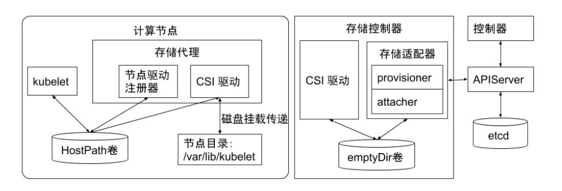

### 临时存储

常见的临时存储主要就是emptyDir卷。

emptyDir是一种经常被用户使用的卷类型，顾名思义，〃卷〃最初是空的。当Pod从节点上删除时’ emptyDir卷中的数据也会被永久删除。但当Pod的容器因为某些原因退出再重启时，emptyDir卷内的数据并不会丢失。

默认情况下，emptyDir卷存储在支持该节点所使用的存储介质上，可以是本地磁盘或网络存储。 emptyDir也可以通过将emptyDir.medium字段设置为"Memory"来通知Kubernetes为容器安装tmpfs,此时数据被存储在内存中，速度相对于本地存储和网络存储快很多。但是在节点重启的时候，内存数据会被清除；而如果存在磁盘上，则重启后数据依然存在。另外，使用tmpfs的内存也会计入容器的使用内存总量中，受系统的Cgroup限制。

emptyDir设计的初衷主要是给应用充当缓存空间，或者存储中间数据，用于快速恢复。然而,这并不 是说满足以上需求的用户都被推荐使用emptyDir,我们要根据用户业务的实际特点来判断是否使用 emptyDir。因为emptyDir的空间位于系统根盘，被所有容器共享’所以在磁盘的使用率较高时会触 发Pod的eviction操宿 从而影响业务的稳定。

### 半持久化存储

常见的半持久化存储主要是hostPath卷。hostPath卷能将主机节点文件系统上的文件或目录挂载到指 定Pod中。对普通用户而言一般不需要这样的卷，但是对很多需要获取节点系统信息的Pod而言，却 是非常必要的。

例如，hostPath的用法举例如下：

- 某个Pod需要获取节点上所有Pod的tog7可以通过hostPath访问所有Pod的stdout输出 存储目录’例如/var/tog/pods路径。

- 某个Pod需要统计系统相关的信息’可以通过hostPath访问系统的/proc目录。

使用hostPath的时候，除设置必需的path属性外，用户还可以有选择性地为hostPath卷指定类型, 支持类型包含目录、字符设备、块设备等。

### hostPath卷需要注意

使用同一个目录的Pod可能会由于调度到不同的节点，导致目录中的内容有所不同。

Kubernetes在调度时无法顾及由hostPath使用的资源。

Pod被删除后，如果没有特别处理，那么hostPath±写的数据会遗留到节点上，占用磁盘空间。

### 持久化存储

支持持久化的存储是所有分布式系统所必备的特性。针对持久化存储，Kubernetes引入了 Storageclass、Volume、PVC (Persistent Volume Claim) 、PV (Persitent Volume)的概念，将存储独立于Pod的生命周期来进行管理。

Kuberntes目前支持的持久化存储包含各种主流的块存储和文件存储，譬如awsElasticBlockStore、azureDisk、cinder、 NFS、cephfs、 iscsi等，在大类上可以将其分为网络存储和本地存储两种类型。

### StorageCLass

Storageclass用于指示存储的类型，不同的存储类型可以通过不同的StorageCLass来为用户提供服务。 Storageclass主要包含存储插件provisioned、卷的创建和mount参数等字段。

``` yaml
allowVolumeExpansion: true
apiVersion: storage.k8s.io/v1
kind: Storageclass
metadata:
 annotations:
  storageclass.kubernetes.io/is-default-class: "false"
 name: rook-ceph-block
parameters:
 clusterlD: rook-ceph
 csi.storage.k8s.io/controller-expand-secret-name: rook-csi-rbd-provisioner
 csi.storage.k8s.io/controller-expand-secret-namespace: rook-ceph
 csi.storage.k8s.io/fstype: ext4
 csi.storage.k8s.io/node-stage-secret-name: rook-csi-rbd-node
 csi.storage.k8s.io/no de-stage-secret-n amespace: rook-ceph
 csi.storage.k8s.io/provisioner-secret-name: rook-csi-rbd-provisioner
 csi.storage.k8s.io/provisioner-secret-namespace: rook-ceph
 imageFeatures: layering
 imageFormat: "2"
 pool: replicapool
provisioner: rook-ceph.rbd.csi.ceph.com
reclaimPolicy: Delete
volumeBindingMode: Immediate
```

### PVC

由用户创建，代表用户对存储需求的声明，主要包含需要的存储大小、存储卷的访问模式、 StroageClass等类型，其中存储卷的访问模式必须与存储的类型一致

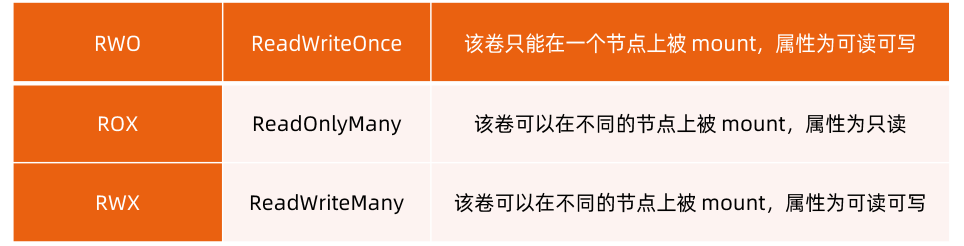

### PV

由集群管理员提前创建’或者根据PVC的申请需求动态地创建,它代表系统后端的真实的存储空间, 可以称之为卷空间。

### 存储对象关系

用户通过创建PVC来申请存储。控制器通过PVC的storageclass和请求的大小声明来存储后端创建 卷，进而创建PV, Pod通过指定PVC来引用存储。

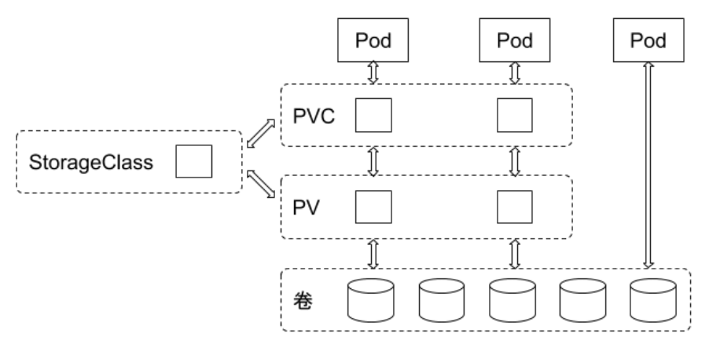

### 生产实践经验分享

不同介质类型的磁盘'需要设置不同的Storageclass,以便让用户做区分。Storageclass需要设置磁盘介质的类 型，以便用户了解该类存储的属性。

在本地存储的PV静态部署模式下，每个物理磁盘都尽量只创建一个PV,而不是划分为多个分区来提供多个本地存 储PV,避免在使用时分区之间的I/O干扰。

本地存储需要配合磁盘检测来使用。当集群部署规模化后，每个集群的本地存储PV可能会超过几万个，如磁盘损坏 将是频发事件。此时，需要在检测到磁盘损坏、丢盘等问题后，对节点的磁盘和相应的本地存储PV进行特定的处理, 例如触发告警、自动cordon节点、自动通知用户等。

对于提供本地存储节点的磁盘管理，需要做到灵活管理和自动化。节点磁盘的信息可以归一、集中化管理。在 local-volume-provisioner中增加部署逻辑，当容器运行起来时，拉取该节点需要提供本地存储的磁盘信息，例如 磁盘的设备路径，以Filesystem或Block的模式提供本地存储，或者是否需要加入某个LVM的虚拟组(VG)等。 local-volume-provisioner根据获取的磁盘信息对磁盘进行格式化，或者加入到某个VG,从而形成对本地存储支 持的自动化闭环。

### 独占的 Local Volume

- 创建 PV:通过Local-volume-provisioner DaemonSet 创建本地存储 的PV。
- 创建PVC:用户创建PVC,由于它处于pending状态，所以kube-controller-manager并不会对该PVC做任何操作。
- 创建Pod:用户创建Pod。
- Pod挑选节点:kube-scheduler开始调度Pod,通过PVC的 resources.request.storage 和 volumeMode 选择满足条件的 PV, 并且为Pod选择一个合适的节点。
- 更新 PV: kube-scheduler 将 PV 的 pv.Spec.claimRef 设置为对应的 PVC,并且设置 dnnotdtion pv.kubernetes.io/bound-by- controller 的值为"yes"。
- PVC和PV绑定:pv_controller同步PVC和PV的状态，并将PVC和 PV进行绑定。
- 监听PVC对象：kube-scheduler等待PVC的状态变成Bound状态。
- Pod调度到节点：如果PVC的状态变为Bound则说明调度成功，而 如果PVC 一直处于pending状态，超时后会再次进行调度。
- Mount卷启动容器：kubelet监听到有Pod已经调度到节点上，对本 地存储进行mount操作，并启动容器。

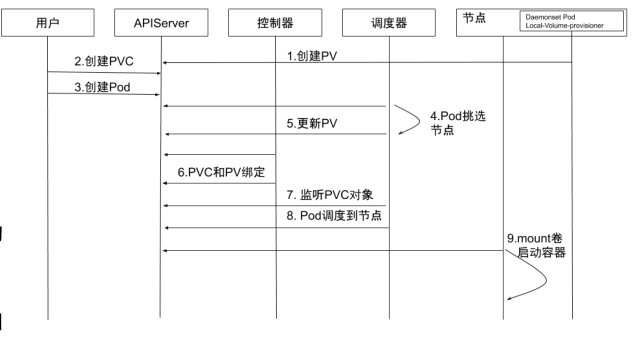

### Dynamic Local Volume

CSI驱动需要汇报节点上相关存储的资源信息，以便用于调度

但是机器的厂家不同，汇报方式也不同。

例如，有的厂家的机器节点上具有NVMe、SSD、HDD等多种存储介质，希望将这些存储介质分别进 行汇报。

这种需求有别于其他存储类型的CSI驱动对接口的需求，因此如何汇报节点的存储信息，以及如何让节 点的存储信息应用于调度，目前并没有形成统一的意见。

集群管理员可以基于节点存储的实际情况对开源CSI驱动和调度进行一些代码修改,再进行部署和使用

### Local Dynamic的挂载流程

- 创建PVC:用户创建PVC, PVC处于pending状态。
- 创建Pod:用户创建Pod。
- Pod选择节点：kube-scheduLer开始调度Pod,通过PVC的 pvc.spec.resources.request.storage 等选择满足条件的节点。
- 更新PVC:选择节点后，kube-scheduler会给PVC添加包含节 点信息的 annotation: volume.kubernetes.io/selected- node: ＜节点名字〉。
- 创建卷：运行在节点上的容器external-provisioner监听到 PVC带有该节点相关的annotation,向相应的CSI驱动申请分 配卷。
- 创建PV: PVC申请到所需的存储空间后，external-provisioner 创建PV,该PV的pv.Spec.claimRef设置为对应的PVCO
- PVC和PV绑定：kube-controller-manager 将 PVC 和 PV 进行 绑定，状态修改为Bound0
- 监听PVC状态：kube-scheduler等待PVC变成Bound状态。
- Pod调度到节点：当PVC的状态为Bound时，Pod才算真正调 度成功了。如果PVC-直处于Pending状态，超时后会再次进 行调度。
- Mount卷：kubelet监听到有Pod已经调度到节点上，对本地存 储进行mount操作。
- 启动容器：启动容器。

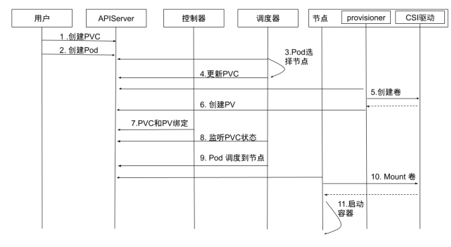

### Local Dynamic 的挑战

如果将磁盘空间作为一个存储池（例如LVM）来动态分配，那么在分配出来的逻辑卷空间的使用上, 可能会受到其他逻辑卷的I/O干扰，因为底层的物理卷可能是同一个。

如果PV后端的磁盘空间是一块独立的物理磁盘，则I/O就不会受到干扰。

### 生产实践经验分享

不同介质类型的磁盘，需要设置不同的StorageCLass,以便让用户做区分。Storageclass需要设置磁 盘介质的类型，以便用户了解该类存储的属性。

在本地存储的PV静态部署模式下，每个物理磁盘都尽量只创建一个PV,而不是划分为多个分区来提供 多个本地存储PV,避免在使用时分区之间的I/O干扰。

本地存储需要配合磁盘检测来使用。当集群部署规模化后’每个集群的本地存储PV可能会超过几万个, 如磁盘损坏将是频发事件。此时，需要在检测到磁盘损坏、丢盘等问题后，对节点的磁盘和相应的本地 存储PV进行特定的处理，例如触发告警、自动cordon节点、自动通知用户等。

对于提供本地存储节点的磁盘管理，需要做到灵活管理和自动化。节点磁盘的信息可以归一、集中化管 理。在local-volume-provisioner中增加部署逻辑’当容器运行起来时，拉取该节点需要提供本地存 储的磁盘信息，例如磁盘的设备路径，以Filesystem或Block的模式提供本地存储，或者是否需要加 入某个LVM的虚拟组(VG)等。local-volume-provisioner根据获取的磁盘信息对磁盘进行格式化， 或者加入到某个VG,从而形成对本地存储支持的自动化闭环。

### Rook

Rook是一款云原生环境下的开源分布式存储编排系统，目前支持Ceph、NFS、EdgeFS.

Cassandra. CockroachDB等存储系统。它实现了一个自动管理的、自动扩容的、自动修复的分布 式存储服务。Rook支持自动部署、启动、配置、分配、扩容/缩容、升级、迁移、灾难恢复、监控以 及资源管理。

### Rook 构架

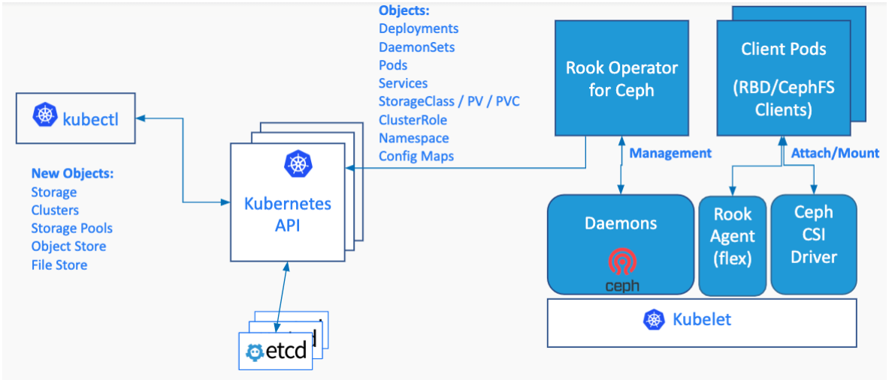

### Rook Operator

Rook Operater 是 Rook 的大脑，以 deployment 形式存在。

其利用Kubernetes的controller-runtime框架实现了 CRD,并进而接受Kubernetes创建资源的请 求并创建相关资源（集群，pool,块存储服务，文件存储服务等）。

Rook Operater监控存储守护进程，来确保存储集群的健康。

监听Rook Discovers收集到的存储磁盘设备，并创建相应服务（Ceph的话就是OSD 了）。

### Rook Discover

Rook Discover是以DaemonSet形式部署在所有的存储机上的，其检测挂接到存储节点上的存储设 备。把符合要求的存储设备记录下来，这样Rook Operate感知到以后就可以基于该存储设备创建相应 服务了。

``` shell
## discover device

$ Isblk --all --noheadings --list --output KNAME
$ Isblk /dev/vdd --bytes --nodeps --pairs --paths --output SIZE,ROTA,RO,TYPE,PKNAME,NAME,KNAME
$ udevadm info --query二property /dev/vdd
$ Isblk —noheadings —pairs /dev/vdd
## discover ceph inventory
$ ceph-volume inventory —format json
if device has ceph inv, device.CephVolumeData = CVData
## put device info into con figmap per node
```

### CSIDriver 发现

CSI驱动发现：

如果一个CSI驱动创建CSIDriver对象'Kubernetes用户可以通过get CSIDriver命令发现它们;

CSI对象有如下特点：

- 自定义的Kubernetes逻辑；

- Kubernetes对存储卷有一些列操作，这些CSIDriver可以自定义支持哪些操作？

### Provisioner

CSI external-provisioner 是一个监控 Kubernetes PVC 对象的 Sidecar 容器。

当用户创建PVC后，Kubernetes会监测PVC对应的Storageclass,如果Storageclass中的provisioner与某 插件匹配，该容器通过CSI Endpoint （通常是unix socket）调用CreateVolume方法。

如果 CreateVolume 方法调用成功,则 Provisioner sidecar 创建 Kubernetes PV 对象。

### CSI External Provisioner

```yaml
containers:
 -args:
  - --csi-address=$(ADDRESS)
  - --v=0
  - --timeout=150s
  - --retry-i ntervdL-st<art=500ms
env:
 -name: ADDRESS
  value: unix:///csi/csi-provisioner.sock
 image: quay.io/k8scsi/csi-provisioner:v1.6.0
name: csi-provisioner
 resources: {}
volumeM oun ts:
 -mountPath: /csi
  name: socket-dir
 -mountPath: /var/run/secrets/kubernetes.io/serviceaccount 
  name: rook-csi-rbd-provisioner-sa-token-mxv84 
  readOrdy: true
-args:
 - --no deid=$(NODE」D)
 - --endpoint=$(CSI_ENDPOINT)
 - --v=0
 - --type=rbd
 - --con trollerserver=true
 - --driver name=rook-ceph.rbd.csi.ceph.com
env:
 -name: CSI_ENDPOINT
  value: unix:///csi/csi-provisioner.sock
 image: quay.io/cephcsi/cephcsi:v3.0.0
 name: csi-rbdplugin
-emptyDir:
 medium: Memory
 name: socket-dir  
```

### Provisoner 代码

``` go
controller/controller.go
    syneClaim -> provisionClaimOperation-> provisioner.Provision 
        pkg/operator/ceph/provisioner/provisioner.go
            Provision-> createVolume
                ceph.Createlmage
        pkg/daem on/ceph/clie nt/image.go
        rbd create poolName/ndme -size sizeMB
    volume Sto re. Sto reVolume
        controller/volume_store.go
            doSaveVolume
                client.CoreV1().PersistentVolumes().Create(volume)
```
### Provisioner log

``` log
10816 10:17:32.535207 1 connection.go:153] Connecting to unix:///csi/csi-provisi on er.sock
10816 10:17:54.361911 1 volume_store.go:97] Starting save volume queue
10816 10:17:54.461930 1 controller.go:!284] provision "defauIt/mysqI-pv-cLaim" class"rook-ceph-block": started
10816 10:17:54.462078 1 controller.go:848] Started provisi on er controller rook-ceph.rbd.csi.ceph.com_csi-rbdplugin-provisioner-677577c77c-vwkzz_ca5971ab-2293-4e52- 9bc9-c490f7f50b07! - ~
10816 10:17:54.465752 1 event.go:281]Event(v1 .ObjectReferencefKind/'PersistentVolumeClaim", Namespace:"default", Name:"mysql-pv-claim"y UID:"24449707-6738-425c-ac88-de3c470cf91 a"z APIVersion:"v1", Resourceversion:"45668", FieldPath:""})： type: 'Normal' reason: 'Provisioning' External provisioner is provisioning volume for claim "defauIt/mysqI-pv-claim"
```

### Rook Agent

Rook Agent是以DaemonSet形式部署在所有的存储机上的’其处理所有的存储操作’例如挂卸载存 储卷以及格式化文件系统等。

### CSI插件注册

``` yaml
spec:
 hostNetwork: true
  hostPID: true
 -args:
  - --v=0
  - --csi-address=/csi/csi.sock
  - --kubelet-registrati on-pdth=/vdr/lib/kubeLet/plugins/ro ok-ceph. rbd.csi.ceph.com/csi.sock 
  image: quay.io/k8scsi/csi-node-driver-registrar:v1.2.0
  name: driver-registrar
  resources: {}
  securitycontext:
   privileged: true
  volumeM oun ts:
  -mountPath: /csi
   name: plugin-dir
  -mountPath: /registration
   name: registration-dir
```

### CSI Driver

```yaml
apiVersion: storage.k8s.io/v1
kind: CSIDriver
metadata:
 name: rook-ceph.rbd.csi.ceph.com
spec:
 attachRequired: true
 podlnfoOnMount: false
 volumeLifecycleModes:
 -Persistent
ls /var/lib/kubelet/plugins/rook-ceph.rbd.csi.ceph.com
csi.sock
-args:
 - --nodeid=$(NODE_ID)
 - --endpoint=$(CSlbDPOINT)
 - --v=0
 - --type=rbd
 - --no deserver=true
 - --driver name=rook-ceph. rbd.csi.ceph.com
 - --pidlimit=-1
 - --metricsport=9090
 - --metricspath=/metrics
 - --en ablegrpcmetrics=true
 env:
 -name: CSI_ENDPOINT
  value: unix:///csi/csi.sock
 image: quay.io/cephcsi/cephcsi:v3.0.0
 name: csi-rbdplugin
 securitycontext:
  allowPrivilegeEscalation: true
  capabilities:
   add:
   - SYS_ADMIN
  privileged: true
-hostPath:
  path: /var/lib/kubelet/plugins/rook-ceph.rbd.csi.ceph.com 
  type: DirectoryOrCreate
 name: plugin-dir
```

### Agent

```go
pkg/daem on/ceph/agent/agent.go
    flexvolume.NewController(a.context, volumeAttachmentController, volumeManager) 
    rpc.Register(flexvolumeController)
    flexvolumeServer.Start
```

### Cluster

针对不同ceph cluster, rook启动一组管理 组件，包括：
mon, mgr, osd, mds, rgw

``` yaml
apiVersion: ceph.rook.io/vl 
kind: CephCluster 
metadata:
 name: rook-ceph
 namespace: rook-ceph
spec:
 cephVersion:
  image: ceph/ceph:vl4.2.10 
  dataDirHostPath: /var/lib/rook 
 mon:
  count: 3
  allowMultiplePerNode: false 
 mgr:
  modules:
  -name: pg_autoscaler 
   enabled: true
 dashboard:
  enabled: true
 storage:  
  useAUNodes: true 
  useAUDevices: true
```

### Pool

—个ceph cluster可以有多个pool, 定义副本数量，故障域等多个属性。

```yaml
apiVersion: ceph.rook.io/vl 
kind: CephBlockPool 
metadata:
 name: replicapool 
 namespace: rook-ceph 
spec:
 compressionMode: ""
 crushRoot: ""
 deviceclass: “” 
 erasureCoded:
  algorithm: “”
  codingChunks: 0 
  dataChunks: 0 
 failureDomain: host 
 replicated:
  requireSafeReplicaSize: false 
  size: 1
  targetSizeRatio: 0
status:
 phase: Ready
```

### Storage Class

Storageclass是Kubernetes用来自动创建PV的对象。

```yaml
allowVolumeExpansion: true
apiVersion: storage.k8s.io/v1
 kind: Storageclass
name: rook-ceph-block
parameters:
 clusterlD: rook-ceph
 csi.storage.k8s.io/controller-expand-secret-name: rook-csi-rbd-provisioner
 csi.storage.k8s.io/controller-expand-secret-namespace: rook-ceph
 csi.storage.k8s.io/fstype: ext4
 csi.storage.k8s.io/node-stage-secret-name: rook-csi-rbd-node
 csi.storage.k8s.io/node-stage-secret-namespace: rook-ceph
 csi.storage.k8s.io/provisioner-secret-name: rook-csi-rbd-provisioner
 csi.storage.k8s.io/provisioner-secret-namespace: rook-ceph
 imageFeatures: layering
 imageFormat: "2"
 pool: replicapool
provisioner: rook-ceph.rbd.csi.ceph.com
reclaimPolicy: Delete
volumeBindingMode: Immediate
```

[参考资料](https://dramasamy.medium.com/life-of-a-packet-i n-kuber netes-p3rt-2-307f5bf0ff14)
