# Kubernetes 控制平面组件：etcd

## etcd

Etcd是CoreOS基于Raft开发的分布式key-value存储，可用于服务发现、共享配置以及一致性
保障（如数据库选主、分布式锁等）。

在分布式系统中，如何管理节点间的状态一直是一个难题，etcd像是专门为集群环境的服务发现
和注册而设计，它提供了数据TTL失效、数据改变监视、多值、目录监听、分布式锁原子操作等
功能，可以方便的跟踪并管理集群节点的状态。

- 键值对存储：将数据存储在分层组织的目录中，如同在标准文件系统中
- 监测变更：监测特定的键或目录以进行更改，并对值的更改做出反应
- 简单:curl可访问的用户的API（HTTP+JSON）
- 安全: 可选的SSL客户端证书认证
- 快速: 单实例每秒 1000 次写操作，2000+次读操作
- 可靠: 使用Raft算法保证一致性


### 主要功能

- 基本的key-value存储
- 监听机制
- key的过期及续约机制，用于监控和服务发现
- 原子Compare And Swap和Compare And Delete，用于分布式锁和leader选举


### 使用场景

- 也可以用于键值对存储，应用程序可以读取和写入etcd中的数据
- etcd比较多的应用场景是用于服务注册与发现
- 基于监听机制的分布式异步系统


### 键值对存储

etcd是一个 **键值存储** 的组件，其他的应用都是基于其键值存储的功能展开。

- 采用kv型数据存储，一般情况下比关系型数据库快。
- 支持动态存储(内存)以及静态存储(磁盘)。
- 分布式存储，可集成为多节点集群。
- 存储方式，采用类似目录结构。（B+tree）
    - 只有叶子节点才能真正存储数据，相当于文件。
    - 叶子节点的父节点一定是目录，目录不能存储数据。


### 服务注册与发现

- 强一致性、高可用的服务存储目录。
    - 基于Raft 算法的etcd 天生就是这样一个强一致性、高可用的服务存储目录。
- 一种注册服务和服务健康状况的机制。
    - 用户可以在etcd中注册服务，并且对注册的服务配置 key TTL，定时保持服务的心跳以达
       到监控健康状态的效果。


### 消息发布与订阅

- 在分布式系统中，最适用的一种组件间通信方式就是消息发布与订阅。
- 即构建一个配置共享中心，数据提供者在这个配置中心发布消息，而消息使用者则订阅他们
    关心的主题，一旦主题有消息发布，就会实时通知订阅者。
- 通过这种方式可以做到分布式系统配置的集中式管理与动态更新。
- 应用中用到的一些配置信息放到etcd上进行集中管理。
- 应用在启动的时候主动从etcd获取一次配置信息，同时，在etcd节点上注册一个Watcher并
    等待，以后每次配置有更新的时候，etcd都会实时通知订阅者，以此达到获取最新配置信息
    的目的。

### Etcd的安装

下载安装包，参考https://github.com/etcd-io/etcd/releases

- ETCD_VER=v3.4.
- DOWNLOAD_URL=https://github.com/etcd-io/etcd/releases/download
- rm -f /tmp/etcd-${ETCD_VER}-linux-amd64.tar.gz
- rm -rf /tmp/etcd-download-test && mkdir-p /tmp/etcd-download-test
- curl -L ${DOWNLOAD_URL}/${ETCD_VER}/etcd-${ETCD_VER}-linux-amd64.tar.gz -o /tmp/etcd-${ETCD_VER}-
    linux-amd64.tar.gz
- tar xzvf/tmp/etcd-${ETCD_VER}-linux-amd64.tar.gz -C /tmp/etcd-download-test --strip-components=
- rm -f /tmp/etcd-${ETCD_VER}-linux-amd64.tar.gz

更多信息

https://github.com/cncamp/101/blob/master/module5/1.etcd-member-list.MD


### 第三方库和客户端工具

目前有很多支持etcd的库和客户端工具

- 命令行客户端工具etcdctl
- Go客户端go-etcd
- Java客户端jetcd
- Python客户端python-etcd


### etcd 命令

查看集群成员状态

etcdctlmember list --write-out=table

+------------------+---------+---------+-----------------------+-----------------------+------------+

| ID | STATUS | NAME | PEER ADDRS | CLIENT ADDRS | IS LEARNER |

+------------------+---------+---------+-----------------------+-----------------------+------------+

| 8e9e05c52164694d | started | default | [http://localhost:2380](http://localhost:2380) | [http://localhost:2379](http://localhost:2379) | false |

+------------------+---------+---------+-----------------------+-----------------------+------------+

基本的数据读写操作

- 写入数据

etcdctl--endpoints=localhost:12379 put /a b

OK

- 读取数据

etcdctl--endpoints=localhost:12379 get /a

/a

b

- 按key的前缀查询数据

etcdctl--endpoints=localhost:12379 get --prefix /

- 只显示键值

etcdctl--endpoints=localhost:12379 get --prefix / --keys-only--debug


### 核心：TTL & CAS

TTL（timeto live）指的是给一个key设置一个有效期，到期后这个key就会被自动删掉，这在
很多分布式锁的实现上都会用到，可以保证锁的实时有效性。

Atomic Compare-and-Swap（CAS）指的是在对key进行赋值的时候，客户端需要提供一些条
件，当这些条件满足后，才能赋值成功。这些条件包括：

- prevExist：key当前赋值前是否存在
- prevValue：key当前赋值前的值
- prevIndex：key当前赋值前的Index

这样的话，key的设置是有前提的，需要知道这个key当前的具体情况才可以对其设置。


## Raft协议


### Raft协议概览

Raft协议基于quorum机制，即大多数同意原则，任何的变更都需超过半数的成员确认

### 理解Raft协议

[http://thesecretlivesofdata.com/raft/](http://thesecretlivesofdata.com/raft/)


### learner

Raft 4.2.1引入的新角色

当出现一个etcd集群需要增加节点时，新节点与
Leader的数据差异较大，需要较多数据同步才能跟
上leader的最新的数据。

此时Leader的网络带宽很可能被用尽，进而使得
leader无法正常保持心跳。

进而导致follower重新发起投票。

进而可能引发etcd集群不可用。

Learner角色只接收数据而不参与投票，因此增加
learner节点时，集群的quorum不变。

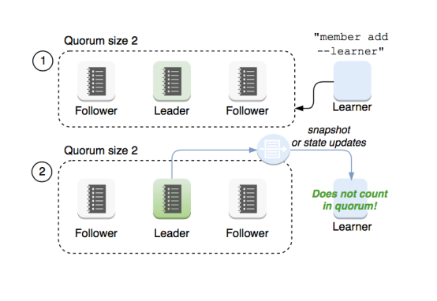

### etcd基于Raft的一致性

选举方法

- 初始启动时，节点处于follower状态并被设定一个election timeout，如果在这一时间周期内没有收到
    来自leader 的heartbeat，节点将发起选举：将自己切换为candidate 之后，向集群中其它follower
    节点发送请求，询问其是否选举自己成为 leader。
- 当收到来自集群中过半数节点的接受投票后，节点即成为 leader，开始接收保存client 的数据并向其它
    的follower 节点同步日志。如果没有达成一致，则candidate随机选择一个等待间隔（150ms ~
    300ms）再次发起投票，得到集群中半数以上follower接受的candidate将成为leader
- leader节点依靠定时向 follower 发送heartbeat来保持其地位。
- 任何时候如果其它follower 在election timeout 期间都没有收到来自leader 的heartbeat，同样会将
    自己的状态切换为candidate 并发起选举。每成功选举一次，新 leader 的任期（Term）都会比之前
    leader 的任期大 1 。


### 日志复制

当接Leader收到客户端的日志（事务请求）后先把该日志追加到本地的Log中，然后通过
heartbeat把该Entry同步给其他Follower，Follower接收到日志后记录日志然后向Leader发送
ACK，当Leader收到大多数（n/2+1）Follower的ACK信息后将该日志设置为已提交并追加到
本地磁盘中，通知客户端并在下个heartbeat中Leader将通知所有的Follower将该日志存储在自
己的本地磁盘中。


### 安全性

安全性是用于保证每个节点都执行相同序列的安全机制，如当某个Follower在当前Leader
commit Log时变得不可用了，稍后可能该Follower又会被选举为Leader，这时新Leader可能
会用新的Log覆盖先前已committed的Log，这就是导致节点执行不同序列；Safety就是用于保
证选举出来的Leader一定包含先前committed Log的机制；

选举安全性（Election Safety）：每个任期（Term）只能选举出一个Leader

Leader完整性（Leader Completeness）：指Leader日志的完整性，当Log在任期Term1被
Commit后，那么以后任期Term2、Term3...等的Leader必须包含该Log；Raft在选举阶段就使
用Term的判断用于保证完整性：当请求投票的该Candidate的Term较大或Term相同Index更大
则投票，否则拒绝该请求。


### 失效处理

1) Leader失效：其他没有收到heartbeat的节点会发起新的选举，而当Leader恢复后由于步进
数小会自动成为follower（日志也会被新leader的日志覆盖）

2 ）follower节点不可用：follower 节点不可用的情况相对容易解决。因为集群中的日志内容始
终是从leader 节点同步的，只要这一节点再次加入集群时重新从 leader 节点处复制日志即可。

3 ）多个candidate：冲突后candidate将随机选择一个等待间隔（150ms ~ 300ms）再次发起
投票，得到集群中半数以上follower接受的candidate将成为leader


### wal日志

wal日志是二进制的，解析出来后是以上数据结构LogEntry。其中第一个字段type，只有两种，
一种是 0 表示Normal， 1 表示ConfChange（ConfChange表示 Etcd本身的配置变更同步，比
如有新的节点加入等）。第二个字段是term，每个term代表一个主节点的任期，每次主节点变
更term就会变化。第三个字段是index，这个序号是严格有序递增的，代表变更序号。第四个字
段是二进制的data，将raft request对象的pb结构整个保存下。etcd 源码下有个tools/etcd-
dump-logs，可以将wal日志dump成文本查看，可以协助分析Raft协议。

Raft协议本身不关心应用数据，也就是data中的部分，一致性都通过同步wal日志来实现，每个
节点将从主节点收到的data apply到本地的存储，Raft只关心日志的同步状态，如果本地存储实
现的有bug，比如没有正确的将data apply到本地，也可能会导致数据不一致。

## etcd v3 存储，Watch以及过期机制

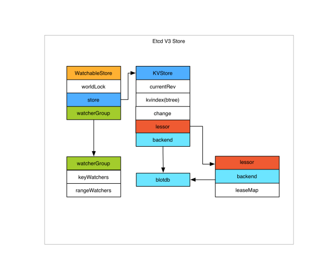

### 存储机制

etcdv3 store 分为两部分，一部分是内存中的索引，kvindex，是基于Google开源的一个
Golang的btree实现的，另外一部分是后端存储。按照它的设计，backend可以对接多种存储，
当前使用的boltdb。boltdb是一个单机的支持事务的kv存储，etcd 的事务是基于boltdb的事务
实现的。etcd 在boltdb中存储的key是reversion，value是 etcd 自己的key-value组合，也就
是说etcd 会在boltdb中把每个版本都保存下，从而实现了多版本机制。

reversion主要由两部分组成，第一部分main rev，每次事务进行加一，第二部分sub rev，同一
个事务中的每次操作加一。

etcd 提供了命令和设置选项来控制compact，同时支持put操作的参数来精确控制某个key的历
史版本数。

内存kvindex保存的就是key和reversion之前的映射关系，用来加速查询。

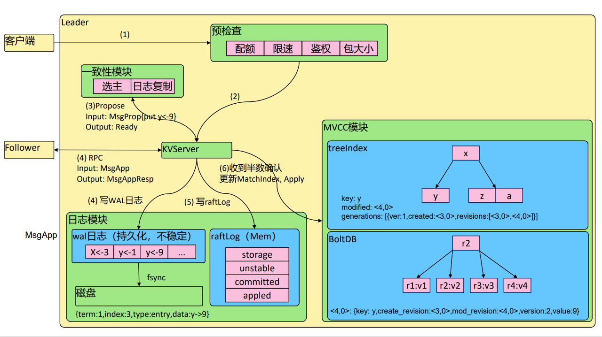

### Watch机制

etcdv3 的watch机制支持watch某个固定的key，也支持watch一个范围（可以用于模拟目录的
结构的watch），所以 watchGroup包含两种watcher，一种是 key watchers，数据结构是每
个key对应一组watcher，另外一种是 range watchers, 数据结构是一个IntervalTree，方便通
过区间查找到对应的watcher。

同时，每个WatchableStore 包含两种 watcherGroup，一种是synced，一种是unsynced，
前者表示该group的watcher数据都已经同步完毕，在等待新的变更，后者表示该group的
watcher数据同步落后于当前最新变更，还在追赶。

当etcd 收到客户端的watch请求，如果请求携带了revision参数，则比较请求的revision和
store当前的revision，如果大于当前revision，则放入synced组中，否则放入unsynced组。同
时etcd会启动一个后台的goroutine持续同步unsynced的watcher，然后将其迁移到synced组。
也就是这种机制下，etcd v3 支持从任意版本开始watch，没有v2的 1000 条历史event表限制的
问题（当然这是指没有compact的情况下）


## etcd 命令

查看集群成员状态

etcdctlmember list --write-out=table

+------------------+---------+---------+-----------------------+-----------------------+-----
-------+

| ID | STATUS | NAME | PEER ADDRS | CLIENT ADDRS | IS
LEARNER |

+------------------+---------+---------+-----------------------+-----------------------+-----
-------+

| 8e9e05c52164694d | started | default | [http://localhost:2380](http://localhost:2380) | [http://localhost:2379](http://localhost:2379) |
false |

+------------------+---------+---------+-----------------------+-----------------------+-----
-------+

- 启动新etcd集群

docker run -d registry.aliyuncs.com/google_containers/etcd:3.5.0-0 /usr/local/bin/etcd

- 进入etcd容器

dockerps|grepetcd

docker exec –it <containerid> sh

- 存入数据

etcdctlput x 0

- 读取数据

etcdctlget x -w=json

{"header":{"cluster_id":14841639068965178418,"member_id":10276657743932975437,"r
evision":2,"raft_term":2},"kvs":[{"key":"eA==","create_revision":2,"mod_revision":2,"versi
on":1,"value":"MA=="}],"count":1}

- 修改值

etcdctlput x 1

- 查询最新值

etcdctlget x

x

1

- 查询历史版本值

etcdctlget x --rev=2

x

0


## etcd 成员重要参数

成员相关参数

```
--name 'default'
Human-readable name for this member.
--data-dir'${name}.etcd'
Path to the data directory.
--listen-peer-urls 'http://localhost:2380'
List of URLs to listen on for peer traffic.
--listen-client-urls 'http://localhost:2379'
List of URLs to listen on for client traffic.
```

集群相关参数

```
--initial-advertise-peer-urls 'http://localhost:2380'
List of this member's peer URLs to advertise to the rest of the cluster.
--initial-cluster 'default=http://localhost:2380'
Initial cluster configuration for bootstrapping.
--initial-cluster-state 'new'
Initial cluster state ('new' or 'existing').
--initial-cluster-token 'etcd-cluster'
Initial cluster token for the etcd cluster during bootstrap.
--advertise-client-urls 'http://localhost:2379'
List of this member's client URLs to advertise to the public.
```

etcd安全相关参数

```
--cert-file ''
Path to the client server TLS cert file.
--key-file ''
Path to the client server TLS key file.
--client-crl-file ''
Path to the client certificate revocation list file.
--trusted-ca-file ''
Path to the client server TLS trusted CA cert file.
--peer-cert-file ''
Path to the peer server TLS cert file.
--peer-key-file ''
Path to the peer server TLS key file.
--peer-trusted-ca-file ''
Path to the peer server TLS trusted CA file.
```

## 灾备

- 创建Snapshot

```
etcdctl--endpoints https://127.0.0.1:3379 --cert /tmp/etcd-certs/certs/127.0.0.1.pem --
key /tmp/etcd-certs/certs/127.0.0.1-key.pem --cacert/tmp/etcd-certs/certs/ca.pem
snapshot save snapshot.db
```

- 恢复数据

```
etcdctlsnapshot restore snapshot.db\
--name infra2 \
--data-dir=/tmp/etcd/infra2 \
--initial-cluster
infra0=http://127.0.0.1:3380,infra1=http://127.0.0.1:4380,infra2=http://127.0.0.1:5380 \
--initial-cluster-token etcd-cluster- 1 \
--initial-advertise-peer-urls http://127.0.0.1:5380
```

## 容量管理

单个对象不建议超过1.5M

默认容量2G

不建议超过8G


## Alarm & Disarm Alarm

- 设置etcd存储大小

$ etcd--quota-backend-bytes =$((16 * 1024 * 1024))

- 写爆磁盘

$ while [ 1 ]; do dd if=/dev/urandombs=1024 count=1024 | ETCDCTL_API=3 etcdctlput key || break; done

- 查看endpoint状态

$ ETCDCTL_API **=3** etcdctl--write-out **=** table endpoint status

- 查看alarm

$ ETCDCTL_API **=3** etcdctlalarm list

- 清理碎片

$ ETCDCTL_API **=3** etcdctldefrag

- 清理alarm

$ ETCDCTL_API **=3** etcdctlalarm disarm

- 碎片整理

//keep one hour of history

$ etcd --auto-compaction-retention=1

//compact up to revision 3

$ etcdctlcompact 3

$ etcdctl defrag

Finished defragmenting etcd member [127.0.0.1:2379]

## 高可用etcd解决方案

etcd-operator: coreos开源的，基于kubernetes CRD完成etcd集群配置。Archived

https://github.com/coreos/etcd-operator

Etcdstatefulset Helm chart: Bitnami(powered by vmware)

https://bitnami.com/stack/etcd/helm

https://github.com/bitnami/charts/blob/master/bitnami/etcd

### Etcd Operator

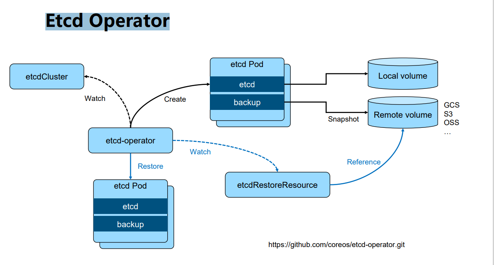

https://github.com/coreos/etcd-operator.git

### 基于 Bitnami 安装etcd高可用集群

- 安装helm

https://github.com/helm/helm/releases

- 通过helm安装etcd

helm repo add bitnamihttps://charts.bitnami.com/bitnami

helm install my-release bitnami/etcd

- 通过客户端与serve交互

kubectlrun my-release-etcd-client --restart='Never' --image
docker.io/bitnami/etcd:3.5.0-debian- 10 - r94 --env ROOT_PASSWORD=$(kubectlget
secret --namespace default my-release-etcd -o jsonpath="{.data.etcd-root-password}" |
base64 --decode) --env ETCDCTL_ENDPOINTS="my-release-
etcd.default.svc.cluster.local:2379" --namespace default --command --sleep infinity


## Kubernetes如何使用etcd

etcd是kubernetes的后端存储

对于每一个kubernetesObject，都有对应的storage.go负责对象的存储操作

- pkg/registry/core/pod/storage/storage.go

API server 启动脚本中指定etcdservers集群

```yaml
spec:
    containers:
    - command:
        - kube-apiserver
        - --advertise-address=192.168.34.2
        - --enable-bootstrap-token-auth=true
        - --etcd-cafile=/etc/kubernetes/pki/etcd/ca.crt
        - --etcd-certfile=/etc/kubernetes/pki/apiserver-etcd-client.crt
        - --etcd-keyfile=/etc/kubernetes/pki/apiserver-etcd-client.key
        - --etcd-servers=https://127.0.0.1:2379
```

早期APIserver 对etcd做简单的Ping check，现在已经改为真实的etcd api call


## Kubernets对象在etcd中的存储路径

- ksexec -it etcd-cadmin sh
- ETCDCTL_API=3
- alias ectl='etcdctl --endpoints https://127.0.0.1:2379 \
    --cacert/etc/kubernetes/pki/etcd/ca.crt \
    --cert /etc/kubernetes/pki/etcd/server.crt \
    --key /etc/kubernetes/pki/etcd/server.key

- ectlget --prefix --keys-only /
/registry/namespaces/calico-apiserver
/registry/networkpolicies/calico-apiserver/allow-apiserver
/registry/operator.tigera.io/tigerastatuses/apiserver
/registry/pods/calico-apiserver/calico-apiserver-77dffffcdf-g2tcx
/registry/pods/default/toolbox-68f79dd5f8-4664n

## etcd在集群中所处的位置

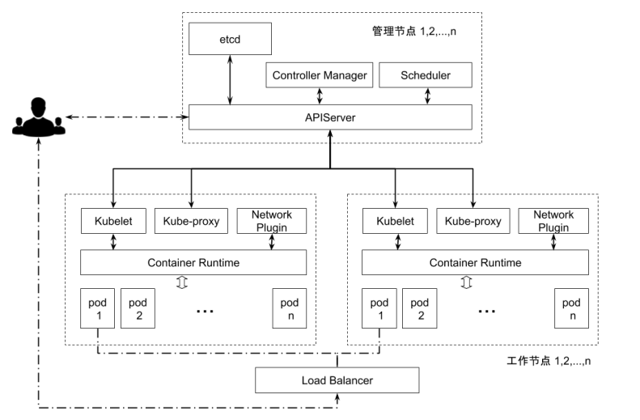

## Kubernetes如何使用etcd

etcd是kubernetes的后端存储

对于每一个kubernetes Object，都有对应的storage.go 负责对象的存储操作

- pkg/registry/core/pod/storage/storage.go

API server 启动脚本中指定etcd servers集群

- /usr/local/bin/kube-apiserver --etcd_servers=https://localhost:4001 --etcd-
    cafile=/etc/ssl/kubernetes/ca.crt--storage-backend=etcd3 --etcd-servers-
    overrides=/events#https:// localhost:4002


### 堆叠式etcd集群的高可用拓扑

- 这种拓扑将相同节点上的控制平面和etcd成员耦合在一起。优点在于建立起来非常容易，并且
    对副本的管理也更容易。但是，堆叠式存在耦合失败的风险。如果一个节点发生故障，则etcd
    成员和控制平面实例都会丢失，并且集群冗余也会受到损害。可以通过添加更多控制平面节点
    来减轻这种风险。因此为实现集群高可用应该至少运行三个堆叠的Master节点。

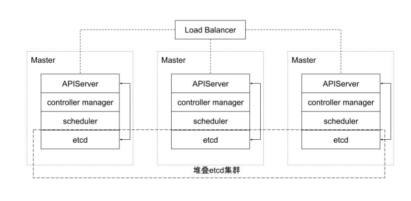

### 外部etcd集群的高可用拓扑

- 该拓扑将控制平面和etcd成员解耦。如果丢失一个Master节点，对etcd成员的影响较小，并
    且不会像堆叠式拓扑那样对集群冗余产生太大影响。但是，此拓扑所需的主机数量是堆叠式拓
    扑的两倍。具有此拓扑的群集至少需要三个主机用于控制平面节点，三个主机用于etcd集群。

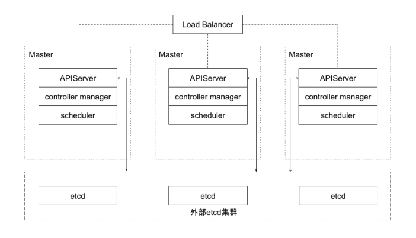

### 实践 - etcd集群高可用

多少个peer最适合？

- 1 个？ 3 个？ 5 个？
- 保证高可用是首要目标
- 所有写操作都要经过leader
- peer多了是否能提升集群并读操作的并发能力？
    ➢ apiserver的配置只连本地的etcd peer
    ➢ apiserver的配置指定所有etcd peers，但只有当前连接的etcd member异常，
       apiserver才会换目标
- 需要动态flexup吗？

保证apiserver和etcd之间的高效性通讯

- apiserver和etcd部署在同一节点
- apiserver和etcd之间的通讯基于gRPC
    ➢ 针对每一个object，apiserver和etcd之间的Connection -> stream共享
    ➢ http2的特性
       ➢ Streamquota
       ➢ 带来的问题？对于大规模集群，会造成链路阻塞
       ➢ 10000 个pod，一次list操作需要返回的数据可能超过100M
          ➢ k get pod --all-namespaces|wc–l
          ➢ 8520
          ➢ k get pod -oyaml--all-namespaces>pods
          ➢ ls -l pods
          ➢ -rw-r--r--1 root root 75339736 Apr 5 03:13 pods

### 实践 – etcd存储规划

- 本地vs远程？
    ➢ RemoteStorage
       ➢ 优势是假设永远可用，现实真是如此吗？
       ➢ 劣势是IO效率，可能带来的问题？
    ➢ 最佳实践：
       ➢ LocalSSD
       ➢ 利用localvolume分配空间
- 多少空间？
    ➢ 与集群规模相关，思考：为什么每个member的DB size不一致？


### etcd 安全性

➢ peer和peer之间的通讯加密
    ➢ 是否有需求
        ➢ TLS的额外开销
        ➢ 运营复杂度增加
    ➢ 数据加密
        ➢ 是否有需求？
        ➢ Kubernetes提供了针对secret的加密
            ➢ https://kubernetes.io/docs/tasks/administer-cluster/encrypt-data/

事件分离

- 对于大规模集群，大量的事件会对etcd造成压力
- API server 启动脚本中指定etcdservers集群
    ➢ /usr/local/bin/kube-apiserver --etcd_servers=https://localhost:4001 --etcd-
       cafile=/etc/ssl/kubernetes/ca.crt--storage-backend=etcd3 --etcd-servers-
       overrides=/events#https://localhost:4002

如何监控?

### 减少网络延迟

减少网络延迟

- 数据中心内的RTT大概是数毫秒，国内的典型RTT约为50ms，两大洲之间的RTT可能慢至
    400ms。因此建议etcd集群尽量同地域部署。
- 当客户端到Leader的并发连接数量过多，可能会导致其他Follower节点发往Leader的请求因
    为网络拥塞而被延迟处理。在Follower节点上，可能会看到这样的错误：
    ➢ dropped MsgPropto 247ae21ff9436b2d since streamMsg'ssending buffer is
       full
- 可以在节点上通过流量控制工具（Traffic Control）提高etcd成员之间发送数据的优先级来避
    免。

### 减少磁盘I/O延迟

对于磁盘延迟，典型的旋转磁盘写延迟约为 10 毫秒。对于SSD（Solid State Drives，固态硬
盘），延迟通常低于 1 毫秒。HDD（Hard Disk Drive，硬盘驱动器）或者网盘在大量数据读写
操作的情况下延时会不稳定。因此强烈建议使用SSD。

同时为了降低其他应用程序的I/O操作对etcd的干扰，建议将etcd的数据存放在单独的磁盘内。
也可以将不同类型的对象存储在不同的若干个etcd集群中，比如将频繁变更的event对象从主
etcd集群中分离出来，以保证主集群的高性能。在APIServer处这是可以通过参数配置的。这些
etcd集群最好也分别能有一块单独的存储磁盘。

如果不可避免地，etcd和其他的业务共享存储磁盘，那么就需要通过下面ionice命令对etcd服务
设置更高的磁盘I/O优先级，尽可能避免其他进程的影响。

```
$ ionice -c2 -n0 -p 'pgrepetcd'
```

### 保持合理的日志文件大小

etcd以日志的形式保存数据，无论是数据创建还是修改，它都将操作追加到日志文件，因此日志
文件大小会随着数据修改次数而线性增长。

当Kubernetes集群规模较大时，其对etcd集群中的数据更改也会很频繁，集群日记文件会迅速
增长。

为了有效降低日志文件大小，etcd会以固定周期创建快照保存系统的当前状态，并移除旧日志文
件。另外当修改次数累积到一定的数量（默认是 10000 ，通过参数“--snapshot-count”指
定），etcd也会创建快照文件。

如果etcd的内存使用和磁盘使用过高，可以先分析是否数据写入频度过大导致快照频度过高，确
认后可通过调低快照触发的阈值来降低其对内存和磁盘的使用。

### 设置合理的存储配额

存储空间的配额用于控制etcd数据空间的大小。合理的存储配额可保证集群操作的可靠性。如果
没有存储配额，也就是etcd可以利用整个磁盘空间，etcd的性能会因为存储空间的持续增长而
严重下降，甚至有耗完集群磁盘空间导致不可预测集群行为的风险。如果设置的存储配额太小，
一旦其中一个节点的后台数据库的存储空间超出了存储配额，etcd就会触发集群范围的告警，并
将集群置于只接受读和删除请求的维护模式。只有在释放足够的空间、消除后端数据库的碎片和
清除存储配额告警之后，集群才能恢复正常操作。

### 自动压缩历史版本

etcd会为每个键都保存了历史版本。为了避免出现性能问题或存储空间消耗完导致写不进去的问
题，这些历史版本需要进行周期性地压缩。压缩历史版本就是丢弃该键给定版本之前的所有信息，
节省出来的空间可以用于后续的写操作。etcd支持自动压缩历史版本。在启动参数中指定参数
“--auto-compaction”，其值以小时为单位。也就是etcd会自动压缩该值设置的时间窗口之
前的历史版本。

### 定期消除碎片化

压缩历史版本，相当于离散地抹去etcd存储空间某些数据，etcd存储空间中将会出现碎片。这
些碎片无法被后台存储使用，却仍占据节点的存储空间。因此定期消除存储碎片，将释放碎片化
的存储空间，重新调整整个存储空间。

### 数据备份

- 备份方案
    ➢ 基于事件重放
    ➢ etcd备份：备份完整的集群信息，灾难恢复
       ➢ etcdctlsnapshot save
- 频度？
    ➢ 时间间隔太长：
       ➢ 能否接受userdatalost？
       ➢ 如果有外部资源配置，如负载均衡等，能否接受数据丢失导致的leak？
    ➢ 时间间隔太短：
       ➢ 对etcd的影响
          ➢ 做snapshot的时候，etcd会锁住当前数据
          ➢ 并发的写操作需要开辟新的空间进行增量写，导致磁盘空间增长
- 如何保证备份的时效性，同时防止磁盘爆掉？
    ➢ Autodefrag？

### 优化运行参数

当网络延迟和磁盘延迟固定的情况下，可以优化etcd运行参数来提升集群的工作效率。etcd基于Raft
协议进行Leader选举，当Leader选定以后才能开始数据读写操作，因此频繁的Leader选举会导致数
据读写性能显著降低。可以通过调整心跳周期（HeatbeatInterval）和选举超时时间（Election
Timeout），来降低Leader选举的可能性。

心跳周期是控制Leader以何种频度向Follower发起心跳通知。心跳通知除表明Leader活跃状态之外，
还带有待写入数据信息，Follower依据心跳信息进行数据写入，默认心跳周期是100ms。选举超时时
间定义了当Follower多久没有收到Leader心跳，则重新发起选举，该参数的默认设置是1000ms。

如果etcd集群的不同实例部署在延迟较低的相同数据中心，通常使用默认配置即可。如果不同实例部
署在多数据中心或者网络延迟较高的集群环境，则需要对心跳周期和选举超时时间进行调整。建议心
跳周期参数推荐设置为接近etcd多个成员之间平均数据往返周期的最大值，一般是平均RTT的0.55-
1.5倍。如果心跳周期设置得过低，etcd会发送很多不必要的心跳信息，从而增加CPU和网络的负担。
如果设置得过高，则会导致选举频繁超时。选举超时时间也需要根据etcd成员之间的平均RTT时间来
设置。选举超时时间最少设置为etcd成员之间RTT时间的 10 倍，以便对网络波动。

心跳间隔和选举超时时间的值必须对同一个etcd集群的所有节点都生效，如果各个节点配置不同，就
会导致集群成员之间协商结果不可预知而不稳定。

### etcd备份存储

etcd的默认工作目录下会生成两个子目录：wal和snap。wal是用于存放预写式日志，其最大的
作用是记录整个数据变化的全部历程。所有数据的修改在提交前，都要先写入wal中。

snap是用于存放快照数据。为防止wal文件过多，etcd会定期（当wal中数据超过 10000 条记录
时，由参数“--snapshot-count”设置）创建快照。当快照生成后，wal中数据就可以被删除了。

如果数据遭到破坏或错误修改需要回滚到之前某个状态时，方法就有两个：一是从快照中恢复数
据主体，但是未被拍入快照的数据会丢失；而是执行所有WAL中记录的修改操作，从最原始的
数据恢复到数据损坏之前的状态，但恢复的时间较长。

### 备份方案实践

官方推荐etcd集群的备份方式是定期创建快照。和etcd内部定期创建快照的目的不同，该备份方式依赖外部
程序定期创建快照，并将快照上传到网络存储设备以实现etcd数据的冗余备份。上传到网络设备的数据，都
应进行了加密。即使当所有etcd实例都丢失了数据，也能允许etcd集群从一个已知的良好状态的时间点在任
一地方进行恢复。根据集群对etcd备份粒度的要求，可适当调节备份的周期。在生产环境中实测，拍摄快照
通常会影响集群当时的性能，因此不建议频繁创建快照。但是备份周期太长，就可能导致大量数据的丢失。

这里可以使用增量备份的方式。如图 3 - 8 所示，备份程序每 30 分钟触发一次快照的拍摄。紧接着它从快照结
束的版本（Revision）开始，监听etcd集群的事件，并每 10 秒钟将事件保存到文件中，并将快照和事件文件
上传到网络存储设备中。 30 分钟的快照周期对集群性能影响甚微。当大灾难来临时，也至多丢失 10 秒的数据。
至于数据修复，首先把数据从网络存储设备中下载下来，然后从快照中恢复大块数据，并在此基础上依次应
用存储的所有事件。这样就可以将集群数据恢复到灾难发生前。

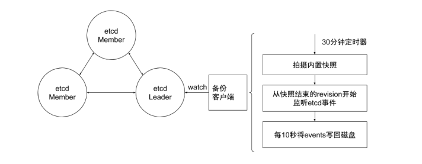

## etcd 常见问题

### 多少个peer最适合？

- 1 个？ 3 个？ 5 个？
- 保证高可用是首要目标
- 所有写操作都要经过leader
- peer多了是否能提升集群并读操作的并发能力？
    ➢ apiserver的配置只连本地的etcd peer
    ➢ apiserver的配置指定所有etcd peers，但只有当前连接的etcd member异常，
       apiserver才会换目标
- 需要动态flexup吗？

### 保证apiserver和etcd之间的高效性通讯

保证apiserver和etcd之间的高效性通讯

- apiserver和etcd部署在同一节点
- apiserver和etcd之间的通讯基于gRPC
    ➢ 针对每一个object，apiserver和etcd之间的Connection -> stream共享
    ➢ HTTP/2的特性
       ➢ Streamquota
       ➢ 带来的问题？对于大规模集群，会造成链路阻塞
       ➢ 10000 个pod，一次list操作需要返回的数据可能超过100M
          ➢ k get pod --all-namespaces|wc–l
          ➢ 8520
          ➢ k get pod -oyaml--all-namespaces>pods
          ➢ ls -l pods
          ➢ -rw-r--r--1 root root 75339736 Apr 5 03:13 pods

## 增强版backup方案

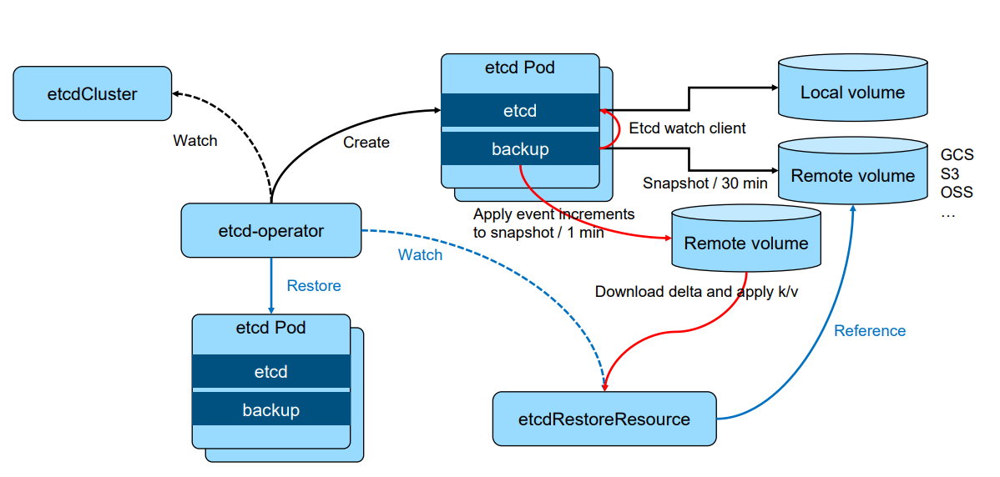

## etcd数据加密

➢ https://kubernetes.io/docs/tasks/administer-cluster/encrypt-data/

``` yaml
apiVersion: API Server.config.k 8 s.io/v 1
kind: EncryptionConfiguration
resources:
    - secrets
    providers:
    - identity: {}
    - aesgcm:
       keys:
       - name: key 1
          secret: c 2 VjcmV 0 IGlzIHNlY 3 VyZQ==
       - name: key 2
          secret: dGhpcyBpcyBwYXNzd 29 yZA==
    - aescbc:
       keys:
       - name: key 1
          secret: c 2 VjcmV 0 IGlzIHNlY 3 VyZQ==
    - secretbox:
       keys:
       - name: key 1
          secret: YWJjZGVmZ 2 hpamtsbW 5 vcHFyc 3 R 1 dnd 4 eXoxMjM 0 NTY=
    - kms:
       name : myKmsPlugin
       endpoint: unix:///tmp/socketfile.sock
       cachesize: 100
```

## Kubernetes中数据分离

- 对于大规模集群，大量的事件会对etcd造成压力
- API server 启动脚本中指定etcd servers集群

/usr/local/bin/kube-apiserver--etcd-servers=https://localhost:4001 --etcd-
cafile=/etc/ssl/kubernetes/ca.crt--storage-backend=etcd3 --etcd-servers-
overrides=/events#https://localhost:4002

## 查询APIServer

返回某namespace中的所有Pod

GET /api/v1/namespaces/test/pods

---

200 OK

Content-Type: application/json

{
"kind": "PodList",
"apiVersion": "v1",
"metadata": {"resourceVersion":"10245"},
"items": [...]
}

## 从 12345 版本开始，监听所有对象变化

GET /api/v1/namespaces/test/pods?watch=1&resourceVersion=10245
---

200 OK
Transfer-Encoding: chunked

Content-Type: application/json

{
"type": "ADDED",
"object": {"kind": "Pod", "apiVersion": "v1", "metadata": {"resourceVersion": "10596", ...}, ...}

}
{
"type": "MODIFIED",
"object": {"kind": "Pod", "apiVersion": "v1", "metadata": {"resourceVersion": "11020", ...}, ...}
}
...

## 分页查询

GET /api/v1/pods?limit=500
---

200 OK
Content-Type: application/json

{

"kind": "PodList",
"apiVersion": "v1",
"metadata": {
"resourceVersion":"10245",
"continue": "ENCODED_CONTINUE_TOKEN",
},
"items": [...] // returns pods 1- 500
}


GET
/api/v1/pods?limit=500&continue=ENCODED_CONTINUE_TOKEN
---
200 OK
Content-Type: application/json

{
"kind": "PodList",
"apiVersion": "v1",
"metadata": {
"resourceVersion":"10245",
"continue": "ENCODED_CONTINUE_TOKEN_2",
},
"items": [...] // returns pods 501- 1000
}

## ResourceVersion

- 单个对象的resourceVersion
    - 对象的最后修改resourceVersion
- List对象的resourceVersion
    - 生成listresponse时的resourceVersion
- List行为
    - List对象时，如果不加resourceVersion，意味着需要MostRecent数据，请求会击穿
       APIServer缓存，直接发送至etcd
    - APIServer通过Label过滤对象查询时，过滤动作是在APIServer端，APIServer需要向
       etcd发起全量查询请求

## 遭遇到的陷阱

频繁的leaderelection

etcd 分裂

etcd 不响应

与apiserver之间的链路阻塞

磁盘暴涨

## 少数etcd 成员Down

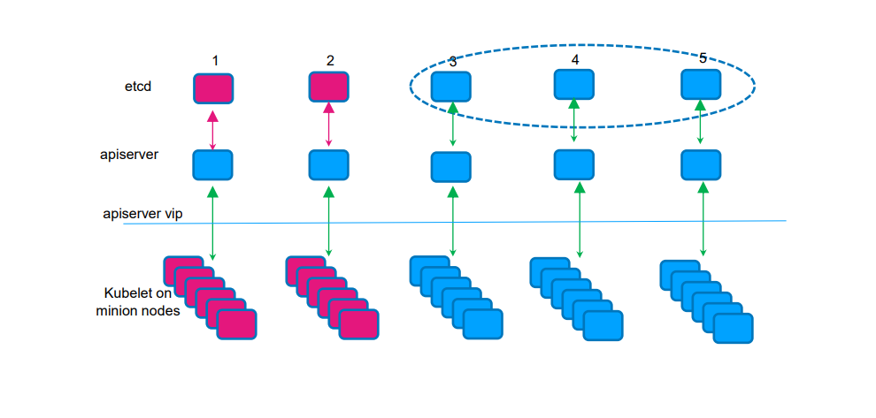

## Master节点出现网络分区

**Case: 网络分区出现**
Group#1: master-1, master- 2
Group#2: master-3, master-4, master- 5

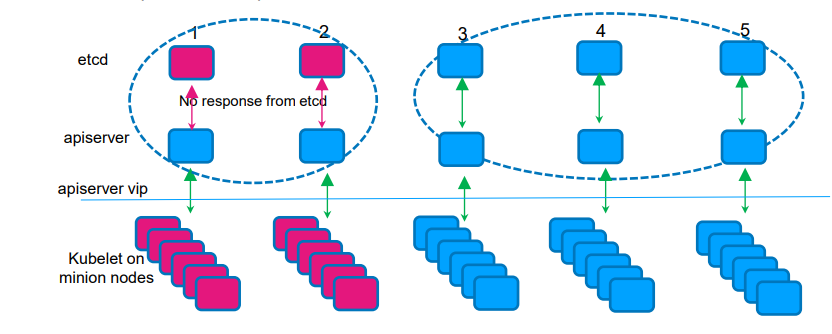

## 参考资料

B树和B+树

https://segmentfault.com/a/1190000020416577
