# Kubernet

## Kubernetes 架构原则和对象设计

### 什么是云计算

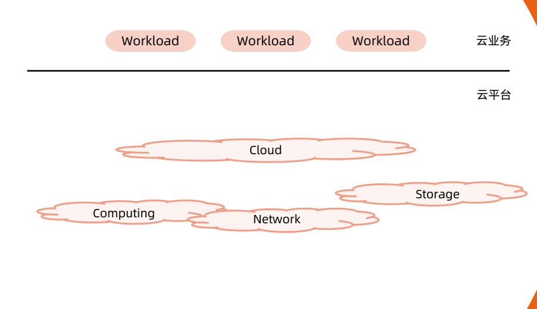

#### 云计算平台的分类

以Openstack为典型的虚拟化平台

- 虚拟机构建和业务代码部署分离。
- 可变的基础架构使后续维护风险变大。

以谷歌borg为典型的基于进程的作业调度平台

- 技术的迭代引发borg的换代需求。
- 早期的隔离依靠chrootjail实现，一些不合理的设计需要在新产品中改进。
    - 对象之间的强依赖job和task是强包含关系，不利于重组。
    - 所有容器共享IP，会导致端口冲突，隔离困难等问题。
    - 为超级用户添加复杂逻辑导致系统过于复杂。

#### Kubernetes 架构基础

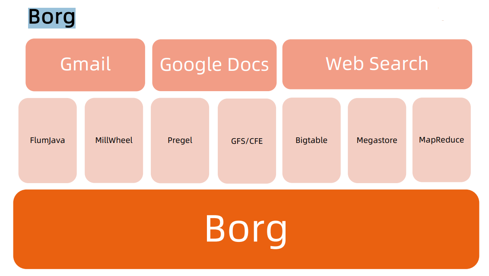

#### Google Borg 简介

特性

- 物理资源利用率高。
- 服务器共享，在进程级别做隔离。
- 应用高可用，故障恢复时间短。
- 调度策略灵活。
- 应用接入和使用方便，提供了完备的Job描述语言，服务发现，实时状态监控和诊断工具。

优势

- 对外隐藏底层资源管理和调度、故障处理等。
- 实现应用的高可靠和高可用。
- 足够弹性，支持应用跑在成千上万的机器上。

##### 基本概念

Workload

- prod：在线任务，长
    期运行、对延时敏感、
    面向终端用户等，比如
    Gmail, Google Docs,
    WebSearch服务等。
- non-prod ：离线任
    务，也称为批处理任务
    （Batch），比如一些
    分布式计算服务等。

Cell

- 一个 Cell 上跑一个集
    群管理系统Borg。
- 通过定义 Cell 可以让
    Borg 对服务器资源进
    行统一抽象，作为用户
    就无需知道自己的应用
    跑在哪台机器上，也不
    用关心资源分配、程序
    安装、依赖管理、健康
    检查及故障恢复等。

Job和Task Naming

- 用户以 Job 的形式提
    交应用部署请求。一个
    Job 包含一个或多个相
    同的Task，每个Task
    运行相同的应用程序，
    Task 数量就是应用的
    副本数。
- 每个 Job 可以定义属
    性、元信息和优先级，
    优先级涉及到抢占式调
    度过程。
       - Borg 的服务发现通过
          BNS （ Borg Name
          Service）来实现。
       - 50 .jfoo.ubar.cc.borg
          .google.com 可表示
          在一个名为 cc 的 Cell
          中由用户 uBar 部署的
          一个名为 jFoo 的 Job
          下的第 50 个Task。

#### Borg 架构

Borgmaster主进程：

- 处理客户端RPC请求，比如创建Job，查询Job等。
- 维护系统组件和服务的状态，比如服务器、Task等。
- 负责与Borglet通信。

Scheduler进程：

- 调度策略
    - WorstFit
    - BestFit
    - Hybrid
- 调度优化
    - Scorecaching: 当服务器或者任务的状态未发生变更或者变更很少时，直接采用缓存数据，避免重复计算。
    - Equivalenceclasses:调度同一Job下多个相同的Task只需计算一次。
    - Relaxedrandomization:引入一些随机性，即每次随机选择一些机器，只要符合需求的服务器数量达到一定值时，就可
       以停止计算，无需每次对Cell中所有服务器进行feasibilitychecking。

Borglet：
    Borglet是部署在所有服务器上的Agent，负责接收Borgmaster进程的指令。

#### 应用高可用

- 被抢占的non-prod任务放回pendingqueue，等待重新调度。
- 多副本应用跨故障域部署。所谓故障域有大有小，比如相同机器、相同机架或相同电源插座等，一挂全挂。
- 对于类似服务器或操作系统升级的维护操作，避免大量服务器同时进行。
- 支持幂等性，支持客户端重复操作。
- 当服务器状态变为不可用时，要控制重新调度任务的速率。因为Borg 无法区分是节点故障还是出现了短暂的
    网络分区，如果是后者，静静地等待网络恢复更利于保障服务可用性。
- 当某种“任务 @ 服务器”的组合出现故障时，下次重新调度时需避免这种组合再次出现，因为极大可能会再
    次出现相同故障。
- 记录详细的内部信息，便于故障排查和分析。
- 保障应用高可用的关键性设计原则：无论何种原因，即使 Borgmaster 或者 Borglet 挂掉、失联，都不能杀
    掉正在运行的服务（Task）。


#### Borg 系统自身高可用

- Borgmaster组件多副本设计。
- 采用一些简单的和底层（low-level）的工具来部署Borg系统实例，避免引入过多的外部依赖。
- 每个Cell的Borg均独立部署，避免不同Borg系统相互影响。


#### 资源利用率

- 通过将在线任务（prod）和离线任务（non-prod，Batch）混合部署，空闲时，离线任务可以充分利用计
    算资源；繁忙时，在线任务通过抢占的方式保证优先得到执行，合理地利用资源。
- 98 %的服务器实现了混部。
- 90 %的服务器中跑了超过 25 个Task和 4500 个线程。
- 在一个中等规模的 Cell 里，在线任务和离线任务独立部署比混合部署所需的服务器数量多出约 20 %- 30 %。
    可以简单算一笔账，Google 的服务器数量在千万级别，按 20 % 算也是百万级别，大概能省下的服务器采
    购费用就是百亿级别了，这还不包括省下的机房等基础设施和电费等费用。


#### Brog 调度原理

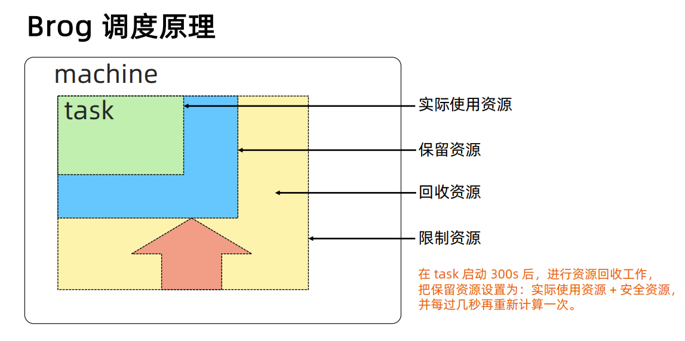

#### 隔离性

安全性隔离：

- 早期采用Chrootjail，后期版本基于Namespace。
性能隔离：
- 采用基于Cgroup的容器技术实现。
- 在线任务（prod）是延时敏感（latency-sensitive）型的，优先级高，而离线任务（non-prod，
Batch）优先级低。
- Borg通过不同优先级之间的抢占式调度来优先保障在线任务的性能，牺牲离线任务。
- Borg将资源类型分成两类：
- 可压榨的（compressible），CPU是可压榨资源，资源耗尽不会终止进程；
- 不可压榨的（non-compressible），内存是不可压榨资源，资源耗尽进程会被终止。

### 什么是 Kubernetes（K8s）

Kubernetes是谷歌开源的容器集群管理系统，是Google多年大规模容器管理技术Borg的开源版本，主要功能包括：

- 基于容器的应用部署、维护和滚动升级；
- 负载均衡和服务发现；
- 跨机器和跨地区的集群调度；
- 自动伸缩；
- 无状态服务和有状态服务；
- 插件机制保证扩展性。

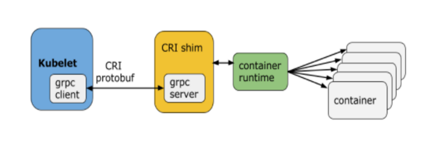

#### 命令式（ Imperative）vs 声明式（ Declarative）

命令式系统关注 “如何做”

- 在软件工程领域，命令式系统是写出解决某个问题、
完成某个任务或者达到某个目标的明确步骤。此方法
明确写出系统应该执行某指令，并且期待系统返回期
望结果。

声明式系统关注“做什么”

- 在软件工程领域，声明式系统指程序代码描述系统应该
做什么而不是怎么做。仅限于描述要达到什么目的，如
何达到目的交给系统。

#### 声明式（Declaritive）系统规范

命令式：

- 我要你做什么，怎么做，请严格按照我说的做。

声明式：

- 我需要你帮我做点事，但是我只告诉你我需要你做什么，不是你应该怎么做。
- 直接声明：我直接告诉你我需要什么。
- 间接声明：我不直接告诉你我的需求，我会把我的需求放在特定的地方，请在方便的时候拿出来处理。

幂等性：

- 状态固定，每次我要你做事，请给我返回相同结果。

面向对象的：

- 把一切抽象成对象。

#### Kubernetes：声明式系统

Kubernetes的所有管理能力构建在对象抽象的基础上，核心对象包括：

- Node：计算节点的抽象，用来描述计算节点的资源抽象、健康状态等。
- Namespace：资源隔离的基本单位，可以简单理解为文件系统中的目录结构。
- Pod：用来描述应用实例，包括镜像地址、资源需求等。 Kubernetes 中最核心
    的对象，也是打通应用和基础架构的秘密武器。
- Service：服务如何将应用发布成服务，本质上是负载均衡和域名服务的声明。

#### Kubernetes 采用与 Borg 类似的架构

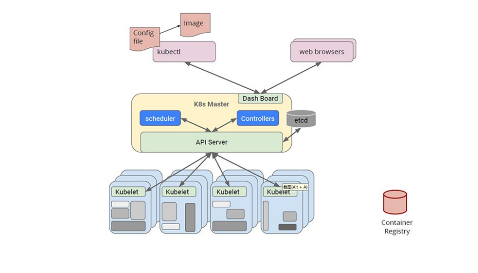

#### 主要组件

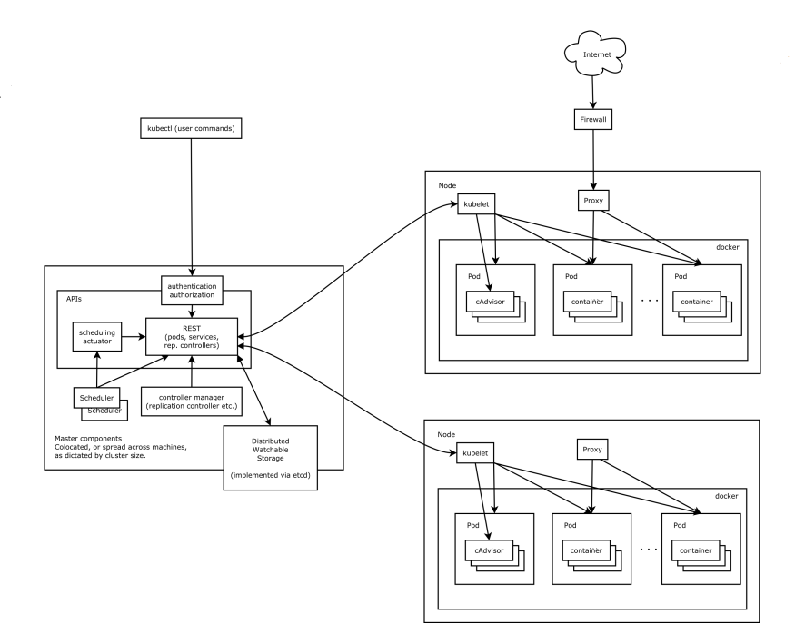

#### Kubernetes 的主节点（Master Node）

API服务器API Server:

- 这是Kubernetes控制面板中唯一带有用户可访问API以及用户可交互的组件。API服
务器会暴露一个RESTful的Kubernetes API并使用JSON格式的清单文件（manifest
files）。

群的数据存储Cluster Data Store:

- Kubernetes 使用“etcd”。这是一个强大的、稳定的、高可用的键值存储，被
Kubernetes用于长久储存所有的API对象。

控制管理器ControllerManager:

- 被称为“kube-controller manager”，它运行着所有处理集群日常任务的控制器。包
括了节点控制器、副本控制器、端点（endpoint）控制器以及服务账户等。

调度器Scheduler:

- 调度器会监控新建的pods（一组或一个容器）并将其分配给节点。

#### Kubernetes 的工作节点（Worker Node）

Kubelet:

- 负责调度到对应节点的Pod 的生命周期管理，执行任务并将Pod状态报告给主节
点的渠道，通过容器运行时（拉取镜像、启动和停止容器等）来运行这些容器。它
还会定期执行被请求的容器的健康探测程序。

Kube-proxy:

- 它负责节点的网络，在主机上维护网络规则并执行连接转发。它还负责对正在服务
的pods进行负载平衡。

#### etcd

etcd 是 CoreOS 基于 Raft 开发的分布式 key-value 存储，可用于服务发现、共享配置以及一致性保障（如
数据库选主、分布式锁等）。

- 基本的key-value存储；
- 监听机制；
- key的过期及续约机制，用于监控和服务发现；
- 原子CAS和CAD，用于分布式锁和leader选举。

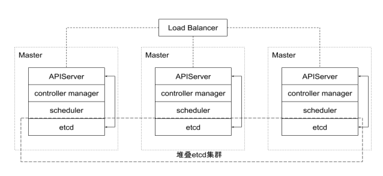

直接访问 etcd 的数据:

- 通过etcd进程查看启动参数
- 进入容器
    - ps-ef|grepetcd
    - sh: ps: command not found
- 怎么办？到主机Namespace查看cert信息
- 进入容器查询数据

``` shell
export ETCDCTL_API=3

etcdctl--endpoints https://localhost:2379 --cert /etc/kubernetes/pki/etcd/server.crt--key
/etc/kubernetes/pki/etcd/server.key--cacert/etc/kubernetes/pki/etcd/ca.crtget --keys-only --prefix /
```

- 监听对象变化

``` shell
etcdctl--endpoints https://localhost:2379 --cert /etc/kubernetes/pki/etcd/server.crt--key
/etc/kubernetes/pki/etcd/server.key--cacert/etc/kubernetes/pki/etcd/ca.crtwatch --prefix
/registry/services/specs/default/mynginx
```

#### APIServer

Kube-APIServer是Kubernetes最重要的核心组件之一，主要提供以下功能：

- 提供集群管理的RESTAPI接口，包括:
    - 认证Authentication；
    - 授权Authorization；
    - 准入Admission（Mutating&Valiating）。
- 提供其他模块之间的数据交互和通信的枢纽（其他模块通过APIServer查询或
    修改数据，只有APIServer才直接操作etcd）。
- APIServer提供etcd数据缓存以减少集群对etcd的访问。

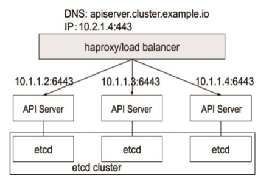

##### APIServer 展开

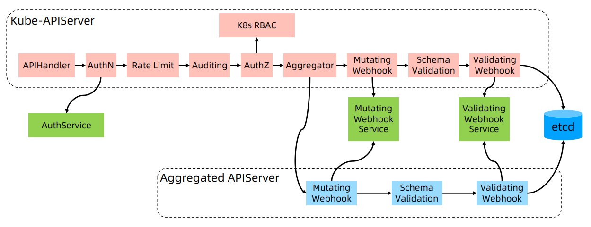

#### Controller Manager

- ControllerManager是集群的大脑，是确保整个集群动起来的关键；
- 作用是确保 Kubernetes遵循声明式系统规范，确保系统的真实状态（Actual
    State）与用户定义的期望状态（DesiredState）一致；
- Controller Manager是多个控制器的组合，每个Controller 事实上都是一个
    controlloop，负责侦听其管控的对象，当对象发生变更时完成配置；
- Controller 配置失败通常会触发自动重试，整个集群会在控制器不断重试的机
    制下确保最终一致性（EventualConsistency）。

##### 控制器的工作流程

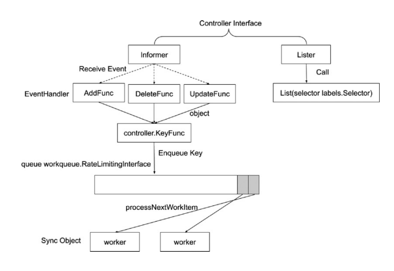

##### Informer 的内部机制

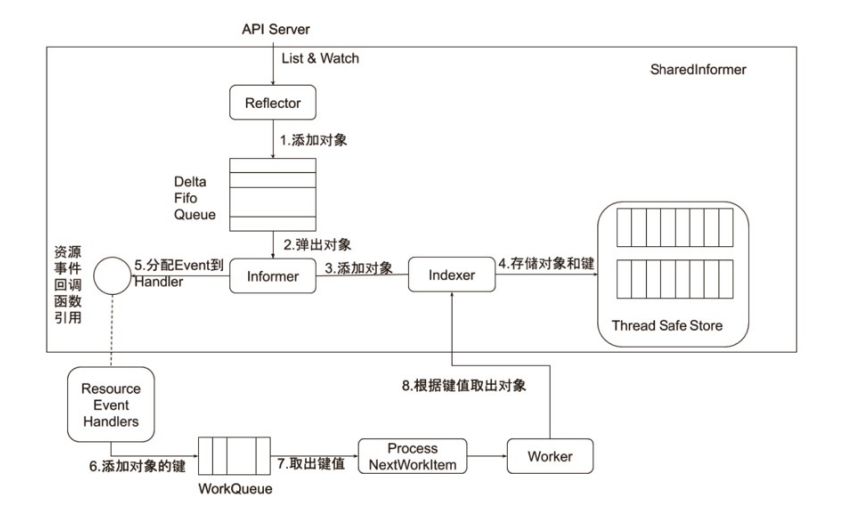

##### 控制器的协同工作原理

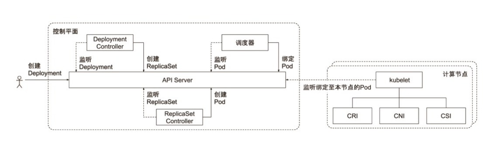

#### Scheduler

特殊的Controller，工作原理与其他控制器无差别。

Scheduler 的特殊职责在于监控当前集群所有未调度的 Pod，并且获取当前集群所有节点的健康状况和资源
使用情况，为待调度Pod选择最佳计算节点，完成调度。

调度阶段分为：

- Predict：过滤不能满足业务需求的节点，如资源不足、端口冲突等。
- Priority：按既定要素将满足调度需求的节点评分，选择最佳节点。
- Bind：将计算节点与Pod绑定，完成调度。

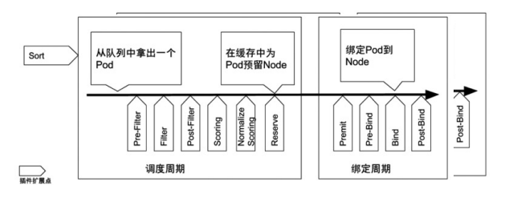

#### Kubelet

Kubernetes的初始化系统（initsystem）

- 从不同源获取Pod清单，并按需求启停Pod的核心组件：
  - Pod清单可从本地文件目录，给定的HTTPServer或Kube-APIServer等源头获取；
  - Kubelet将运行时，网络和存储抽象成了CRI，CNI，CSI。
- 负责汇报当前节点的资源信息和健康状态；
- 负责Pod的健康检查和状态汇报。

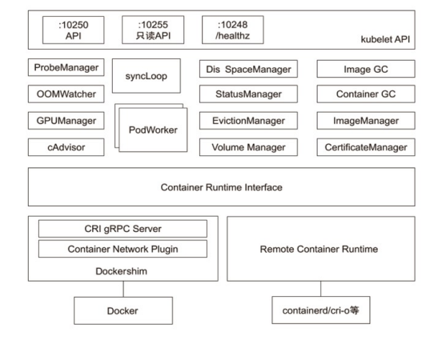

#### Kube-Proxy

- 监控集群中用户发布的服务，并完成负载均衡配置。
- 每个节点的 Kube-Proxy 都会配置相同的负载均衡策略，使得整个集群的服务发现建立在分布式负载均衡器之上，服务调用无需经过额外的网络跳转（NetworkHop）。
- 负载均衡配置基于不同插件实现：
  - userspace。
  - 操作系统网络协议栈不同的Hooks点和插件：
    - iptables；
    - ipvs。


#### 推荐的 Add-ons

- kube-dns：负责为整个集群提供DNS服务；
- IngressController：为服务提供外网入口；
- MetricsServer：提供资源监控；
- Dashboard：提供GUI；
- Fluentd-Elasticsearch：提供集群日志采集、存储与查询。

### 了解 kubectl

#### Kubectl 命令和 kubeconfig

- kubectl是一个Kubernetes的命令行工具，它允许Kubernetes用户以命令行的方式与Kubernetes交
互，其默认读取配置文件~/.kube/config。

- kubectl会将接收到的用户请求转化为rest调用以rest client的形式与apiserver通讯。

- apiserver的地址，用户信息等配置在 kubeconfig。

``` yaml
apiVersion: v1
clusters:
- cluster:
    certificate-authority-data: REDACTED
    server: https://127.0.0.1:54729
name: kind-kind
contexts:
- context:
    cluster: kind-kind
    user: kind-kind
    name: kind-kind
current-context: kind-kind
kind: Config
users:
- name: kind-kind
user:
    client-certificate-data: REDACTED
    client-key-data: REDACTED
```

#### kubectl 常用命令

kubectl get po –oyaml -w

kubectl 可查看对象。

- oyaml 输出详细信息为yaml格式。
- wwatch 该对象的后续变化。
- owide 以详细列表的格式查看对象。

#### Kubectl describe

kubectldescribe展示资源的详细信息和相关Event。

```shell
kubectldescribe po ubuntu-6fcf6c67db-xvmjh
....
Events:
Type Reason Age From Message
---- ------ ---- ---- -------
Normal Scheduled 8m13s default-scheduler Successfully assigned ubuntu-6fcf6c67db-xvmjh to k8smaster
Normal Pulling 7m56s kubelet, k8smaster pulling image "ubuntu:16.04"
Normal Pulled 7m50s kubelet, k8smaster Successfully pulled image "ubuntu:16.04"
Normal Created 7m50s kubelet, k8smaster Created container
Normal Started 7m50s kubelet, k8smaster Started container
```

#### kubectl exec

kubectlexec提供进入运行容器的通道，可以进入容器进行debug操作。

``` shell
# kubectlexec -it ubuntu-6fcf6c67db-xvmjh bash
root@ubuntu-6fcf6c67db-xvmjh:/# hostname -f
ubuntu-6fcf6c67db-xvmjh
root@ubuntu-6fcf6c67db-xvmjh:/#
...
```

#### kubectl logs

Kubectllogs可查看pod的标准输入（stdout, stderr），与tail用法类似。
```shell
**jianqli:~# kubectl logs ubuntu-6fcf6c67db-xvmjh
Mon Mar 25 14:56:02 UTC 2019
Mon Mar 25 14:56:05 UTC 2019
Mon Mar 25 14:56:08 UTC 2019
Mon Mar 25 14:56:11 UTC 2019
Mon Mar 25 14:56:14 UTC 2019
...**
```

### 深入理解 Kubernetes

#### 云计算的传统分类

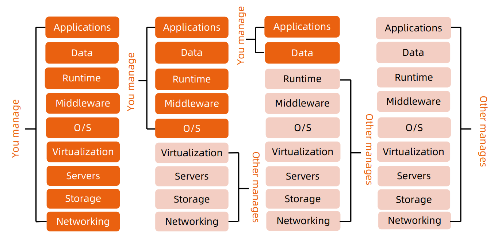

#### Kubernetes 生态系统

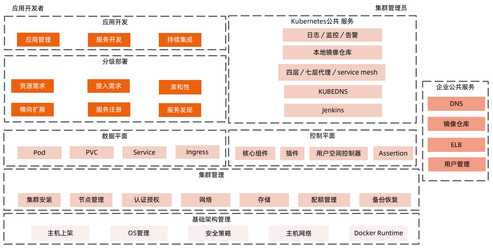

#### Kubernetes 设计理念

可扩展性:

- 基于CRD的扩展
- 插件化的生态系统

可移植性:

- 可移植性
- 多种基础架构的选择
- 多云和混合云

高可用:

- 基于 replicaset，statefulset 的应用高可用
- Kubernetes 组件本身高可用

安全:

- 基于 TLS 提供服务
- Serviceaccount 和 user
- 基于 Namespace 的隔离
- secret
- Taints，psp， networkpolicy


#### Kubernetes Master

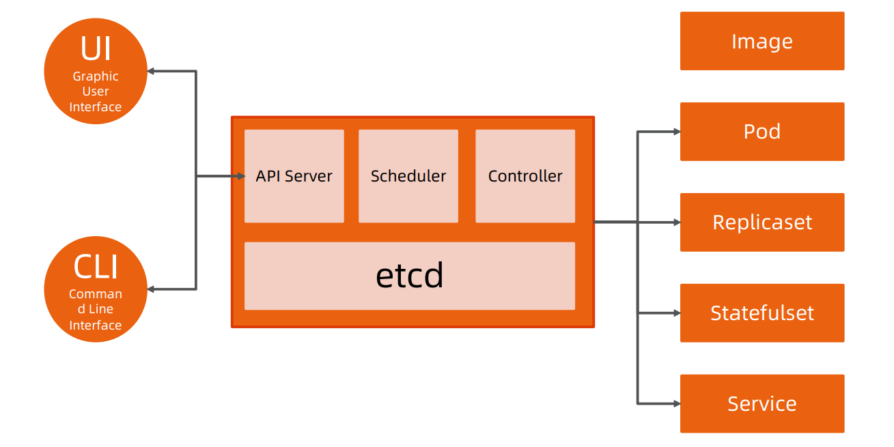

#### 分层架构

- 核心层：Kubernetes最核心的功能，对外提供API构建高层的应用，对内提供插件式应用执行环境。
- 应用层：部署（无状态应用、有状态应用、批处理任务、集群应用等）和路由（服务发现、DNS 解析
    等）。
- 管理层：系统度量（如基础设施、容器和网络的度量）、自动化（如自动扩展、动态 Provision 等）、
    策略管理（RBAC、Quota、PSP、NetworkPolicy等）。
- 接口层：Kubectl命令行工具、客户端SDK以及集群联邦。
- 生态系统：在接口层之上的庞大容器集群管理调度的生态系统，可以划分为两个范畴：
  - Kubernetes 外部：日志、监控、配置管理、CI、CD、Workflow、FaaS、OTS 应用、
       ChatOps等；
  - Kubernetes内部：CRI、CNI、CVI、镜像仓库、CloudProvider、集群自身的配置和管理等。

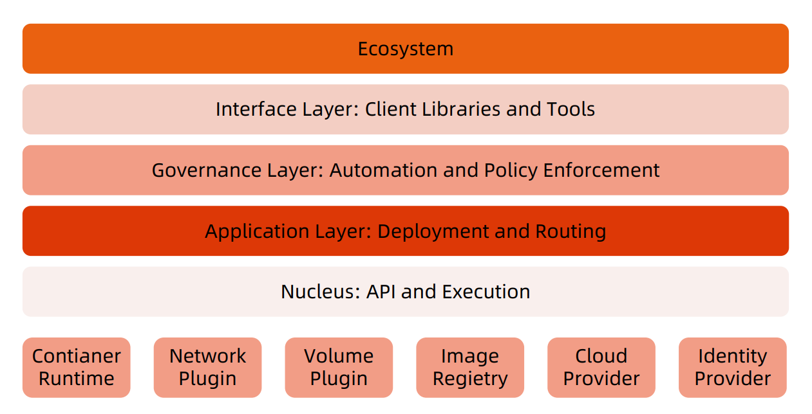

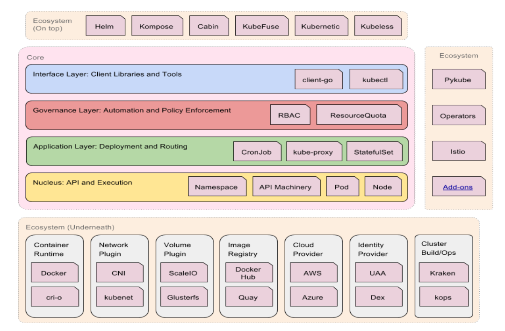

#### API 设计原则

- 所有API都应是声明式的
    - 相对于命令式操作，声明式操作对于重复操作的效果是稳定的，这对于容易出现数据丢失或重复的分布式环境来说是很重要的。
    - 声明式操作更易被用户使用，可以使系统向用户隐藏实现的细节，同时也保留了系统未来持续优化的可能性。
    - 此外，声明式的API还隐含了所有的API对象都是名词性质的，例如Service、Volume这些API都是名词，这些名词描述了用户所
       期望得到的一个目标对象。
- API对象是彼此互补而且可组合的
    - 这实际上鼓励API对象尽量实现面向对象设计时的要求，即“高内聚，松耦合”，对业务相关的概念有一个合适的分解，提高分解出
       来的对象的可重用性。
- 高层API以操作意图为基础设计
    - 如何能够设计好 API，跟如何能用面向对象的方法设计好应用系统有相通的地方，高层设计一定是从业务出发，而不是过早的从技术
       实现出发。
    - 因此，针对Kubernetes的高层API设计，一定是以Kubernetes的业务为基础出发，也就是以系统调度管理容器的操作意图为基础
       设计。

- 低层 API根据高层API的控制需要设计
    - 设计实现低层 API 的目的，是为了被高层API 使用，考虑减少冗余、提高重用性的目的，低层API
       的设计也要以需求为基础，要尽量抵抗受技术实现影响的诱惑。
- 尽量避免简单封装，不要有在外部API无法显式知道的内部隐藏的机制
    - 简单的封装，实际没有提供新的功能，反而增加了对所封装API的依赖性。
    - 例如 StatefulSet 和 ReplicaSet，本来就是两种Pod 集合，那么Kubernetes就用不同 API 对象
       来定义它们，而不会说只用同一个 ReplicaSet，内部通过特殊的算法再来区分这个 ReplicaSet 是
       有状态的还是无状态。

- API操作复杂度与对象数量成正比
    - API的操作复杂度不能超过O(N)，否则系统就不具备水平伸缩性了。
- API对象状态不能依赖于网络连接状态
    - 由于众所周知，在分布式环境下，网络连接断开是经常发生的事情，因此要保证API对象状态能应
       对网络的不稳定，API对象的状态就不能依赖于网络连接状态。
- 尽量避免让操作机制依赖于全局状态
    - 因为在分布式系统中要保证全局状态的同步是非常困难的。

#### Kubernetes 如何通过对象的组合完成业务描述

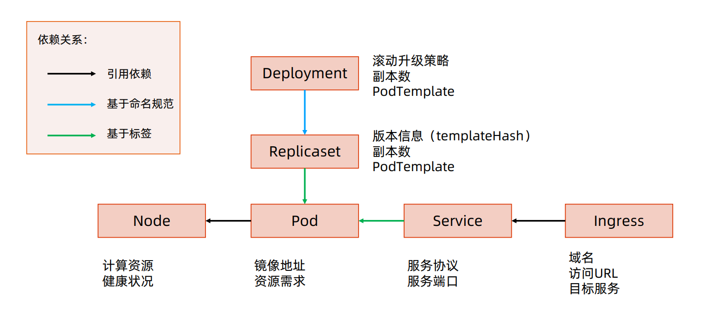


#### 架构设计原则

- 只有APIServer可以直接访问etcd存储，其他服务必须通过KubernetesAPI来访问集群状态；
- 单节点故障不应该影响集群的状态；
- 在没有新请求的情况下，所有组件应该在故障恢复后继续执行上次最后收到的请求比如网络分区或服务重启等）；
- 所有组件都应该在内存中保持所需要的状态，APIServer将状态写入etcd存储，而其他组件则通过APIServer更新并监听所有的变化；
- 优先使用事件监听而不是轮询。


#### 引导（Bootstrapping）原则

- Self-hosting是目标。
- 减少依赖，特别是稳态运行的依赖。
- 通过分层的原则管理依赖。
- 循环依赖问题的原则：
    - 同时还接受其他方式的数据输入（比如本地文件等），这样在其他服务不可
       用时还可以手动配置引导服务；
    - 状态应该是可恢复或可重新发现的；
    - 支持简单的启动临时实例来创建稳态运行所需要的状态，使用分布式锁或文
       件锁等来协调不同状态的切换（通常称为pivoting技术）；
    - 自动重启异常退出的服务，比如副本或者进程管理器等。


### 核心技术概念和 API 对象

API对象是Kubernetes集群中的管理操作单元。

Kubernetes集群系统每支持一项新功能，引入一项新技术，一定会新引入对应的API对象，支持对该功能的管理操
作。

每个API对象都有四大类属性：

- TypeMeta
- MetaData
- Spec
- Status

#### TypeMeta

Kubernetes对象的最基本定义，它通过引入GKV（Group，Kind，Version）模型定义了一个对象的类型。

1.Group：

- Kubernetes定义了非常多的对象，如何将这些对象进行归类是一门学问，将对象依据其功能范围归入不同的分组，
比如把支撑最基本功能的对象归入core组，把与应用部署有关的对象归入apps组，会使这些对象的可维护性和可
理解性更高。

2.Kind：

- 定义一个对象的基本类型，比如Node、Pod、Deployment等。

3.Version：

- 社区每个季度会推出一个Kubernetes版本，随着Kubernetes版本的演进，对象从创建之初到能够完全生产化就
绪的版本是不断变化的。与软件版本类似，通常社区提出一个模型定义以后，随着该对象不断成熟，其版本可能会
从v1alpha1到v1alpha2，或者到v1beta1，最终变成生产就绪版本v1。


#### Metadata

Metadata中有两个最重要的属性：Namespace和Name，分别定义了对象的
Namespace归属及名字，这两个属性唯一定义了某个对象实例。

Label：
顾名思义就是给对象打标签，一个对象可以有任意对标签，其存在形式是键值对。
Label定义了对象的可识别属性，Kubernetes API支持以Label作为过滤条件
查询对象。

- Label是识别Kubernetes对象的标签，以key/value的方式附加到对象上。
- key最长不能超过 63 字节，value可以为空，也可以是不超过 253 字节的字符串。
- Label不提供唯一性，并且实际上经常是很多对象（如Pods）都使用相同的label来标志具
    体的应用。
- Label定义好后其他对象可以使用Label Selector来选择一组相同label的对象
- Label Selector支持以下几种方式：
    - 等式，如app=nginx和env!=production；
    - 集合，如env in (production, qa)；
    - 多个label（它们之间是AND关系），如app=nginx,env=test。

Annotation：

Annotation与Label一样用键值对来定义，但Annotation是作为属性扩展，
更多面向于系统管理员和开发人员，因此需要像其他属性一样做合理归类。


- Annotations是key/value形式附加于对象的注解。
- 不同于 Labels 用于标志和选择对象，Annotations 则是用来记录一些附加信息，用来辅助应用部署、安
    全策略以及调度策略等。
- 比如deployment使用annotations来记录rollingupdate的状态。

Finalizer：

- Finalizer本质上是一个资源锁，Kubernetes在接收某对象的删除请求时，会检
查Finalizer是否为空，如果不为空则只对其做逻辑删除，即只会更新对象中的
metadata.deletionTimestamp字段。

ResourceVersion：

- ResourceVersion可以被看作一种乐观锁，每个对象在任意时刻都有其
ResourceVersion，当Kubernetes对象被客户端读取以后，ResourceVersion
信息也被一并读取。此机制确保了分布式系统中任意多线程能够无锁并发访问对
象，极大提升了系统的整体效率。


#### Spec 和 Status

- Spec和Status才是对象的核心。
- Spec是用户的期望状态，由创建对象的用户端来定义。
- Status是对象的实际状态，由对应的控制器收集实际状态并更新。
- 与TypeMeta和Metadata等通用属性不同，Spec和Status是每个对象独有的。


#### 常用 Kubernetes 对象及其分组

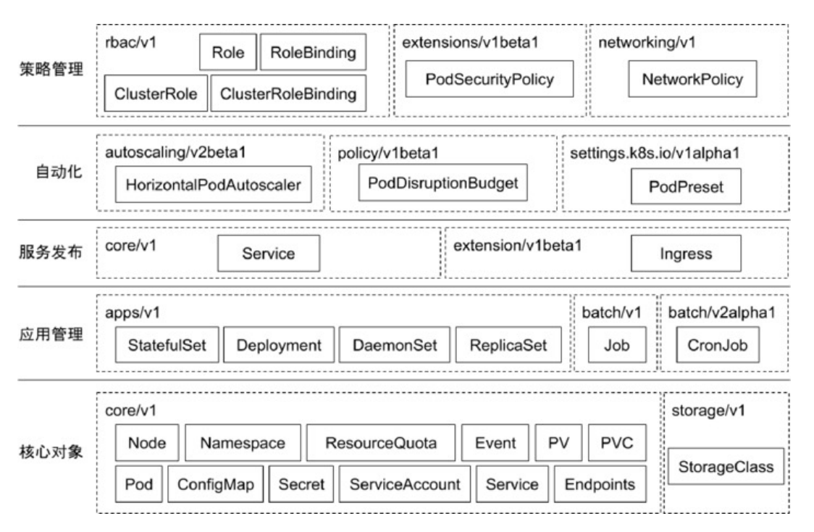

### 核心对象概览


#### Node

- Node是Pod真正运行的主机，可以物理机，也可以是虚拟机。
- 为了管理Pod，每个Node节点上至少要运行container runtime

（比如Docker或者Rkt）、Kubelet和Kube-proxy服务。

#### Namespace

Namespace是对一组资源和对象的抽象集合，比如可以用来将系统内部的对
象划分为不同的项目组或用户组。

常见的pods, services, replication controllers和deployments等都是属于
某一个Namespace的（默认是default），而Node, persistentVolumes
等则不属于任何Namespace。

#### 什么是 Pod

- Pod是一组紧密关联的容器集合，它们共享PID、IPC、Network和UTS namespace，是Kubernetes
    调度的基本单位。
- Pod的设计理念是支持多个容器在一个Pod中共享网络和文件系统，可以通过进程间通信和文件共享这
    种简单高效的方式组合完成服务。
- 同一个Pod中的不同容器可共享资源：
    - 共享网络Namespace；
    - 可通过挂载存储卷共享存储；
    - 共享SecurityContext。

#### 如何通过 Pod 对象定义支撑应用运行

- 环境变量：
    - 直接设置值；
    - 读取PodSpec的某些属性；
    - 从ConfigMap读取某个值；
    - 从Secret读取某个值。

#### 存储卷

- 通过存储卷可以将外挂存储挂载到Pod内部使用。
- 存储卷定义包括两个部分: Volume和VolumeMounts。
    - Volume：定义Pod可以使用的存储卷来源；
    - VolumeMounts：定义存储卷如何Mount到容器内部。

#### Pod 网络

Pod的多个容器是共享网络Namespace的，这意味着：

- 同一个Pod中的不同容器可以彼此通过Loopback地址访问：
    - 在第一个容器中起了一个服务http://127.0.0.1。
    - 在第二个容器内，是可以通过httpGethttp://172.0.0.1访问到该地址的。
- 这种方法常用于不同容器的互相协作。

#### 资源限制

Kubernetes通过Cgroups提供容器资源管理的功能，可以限制每个容器的
CPU和内存使用，比如对于刚才创建的deployment，可以通过下面的命令限制
nginx容器最多只用50%的CPU和128MB的内存：

```shell
$ kubectl set resources deployment nginx-app -c=nginx--
limits=cpu=500m,memory=128Mi

deployment "nginx" resource requirements updated
```

等同于在每个 Pod 中设置 resources limits

``` yaml
apiVersion:v 1
kind:Pod
metadata:
    labels:
    app:nginx
    name:nginx
spec:
containers:
- image:nginx
    name:nginx
    resources:
       limits:
          cpu:" 500 m"
          memory:" 128 Mi"

```

#### 健康检查

Kubernetes作为一个面向应用的集群管理工具，需要确保容器在部署后确实处在正常的运行状态。

1.探针类型：

- LivenessProbe
    - 探测应用是否处于健康状态，如果不健康则删除并重新创建容器。
- ReadinessProbe
    - 探测应用是否就绪并且处于正常服务状态，如果不正常则不会接收来自Kubernetes Service 的流量。
- StartupProbe
    - 探测应用是否启动完成，如果在failureThreshold*periodSeconds周期内未就绪，则会应用进程会被重启。

2.探活方式：

- Exec
- TCP socket
- HTTP

健康检查 spec

```yaml
apiVersion:extensions/v 1 beta 1
kind:Deployment
metadata:
labels:
app:nginx
name:nginx-default
spec:
replicas: 3
selector:
matchLabels:
app:nginx
template:
metadata:
labels:
app:nginx
```

``` yaml
spec:
containers:
- image:nginx
    imagePullPolicy:Always
    name:http
    resources:{}
    terminationMessagePath:
/dev/termination-log
terminationMessagePolicy:File
resources:
limits:
cpu:" 500 m"
memory:" 128 Mi"

``` yaml
livenessProbe:
httpGet:
path: /
port: 80
initialDelaySeconds: 15
timeoutSeconds: 1
readinessProbe:
httpGet:
path: /ping
port: 80
initialDelaySeconds: 5
timeoutSeconds: 1
```

#### ConfigMap

- ConfigMap用来将非机密性的数据保存到键值对中。
- 使用时，Pods可以将其用作环境变量、命令行参数或者存储卷中的配置文件。
- ConfigMap将环境配置信息和容器镜像解耦，便于应用配置的修改。

#### 密钥对象（Secret）

- Secret是用来保存和传递密码、密钥、认证凭证这些敏感信息的对象。
- 使用Secret的好处是可以避免把敏感信息明文写在配置文件里。
- Kubernetes集群中配置和使用服务不可避免的要用到各种敏感信息实现登录、认
    证等功能，例如访问AWS存储的用户名密码。
- 为了避免将类似的敏感信息明文写在所有需要使用的配置文件中，可以将这些信息
    存入一个Secret对象，而在配置文件中通过Secret对象引用这些敏感信息。
- 这种方式的好处包括：意图明确，避免重复，减少暴漏机会。

#### 用户（User Account）& 服务帐户（Service Account）

- 顾名思义，用户帐户为人提供账户标识，而服务账户为计算机进程和Kubernetes集群中运行的Pod提供
    账户标识。
- 用户帐户和服务帐户的一个区别是作用范围：
    - 用户帐户对应的是人的身份，人的身份与服务的Namespace无关，所以用户账户是跨
       Namespace的；
    - 而服务帐户对应的是一个运行中程序的身份，与特定Namespace是相关的。


#### Service

Service是应用服务的抽象，通过labels为应用提供负载均衡和服务发现。匹
配labels的PodIP和端口列表组成endpoints，由Kube-proxy负责将服务
IP负载均衡到这些endpoints上。

每个 Service 都会自动分配一个 cluster IP（仅在集群内部可访问的虚拟地址）
和DNS名，其他容器可以通过该地址或DNS来访问服务，而不需要了解后端
容器的运行。

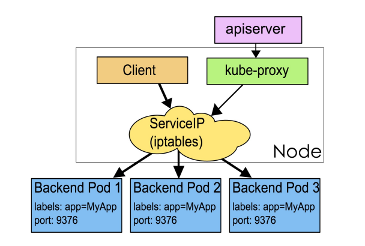


#### Service Spec

``` yaml
apiVersion: v1
kind: Service
metadata:
name: nginx
spec:
ports:
- port: 8078 # the port that this service should serve on
    name: http
    # the container on each pod to connect to, can be a name
    # (e.g. 'www') or a number (e.g. 80)
    targetPort: 80
    protocol: TCP
selector:
    app: nginx
```

#### 副本集（Replica Set）

- Pod只是单个应用实例的抽象，要构建高可用应用，通常需要构建多个同样的副本，提供同一个服务。
- Kubernetes为此抽象出副本集ReplicaSet，其允许用户定义Pod的副本数，每一个Pod都会被当作一
    个无状态的成员进行管理，Kubernetes保证总是有用户期望的数量的Pod正常运行。
- 当某个副本宕机以后，控制器将会创建一个新的副本。
- 当因业务负载发生变更而需要调整扩缩容时，可以方便地调整副本数量。

#### 部署（Deployment）

- 部署表示用户对Kubernetes集群的一次更新操作。
- 部署是一个比RS应用模式更广的API对象，可以是创建一个新的服务，更新一个新的服务，也可以是滚动升级一个服务。
- 滚动升级一个服务，实际是创建一个新的RS，然后逐渐将新RS中副本数增加到理想状态，将旧RS中的副本数减小到 0 的
    复合操作。
- 这样一个复合操作用一个RS是不太好描述的，所以用一个更通用的Deployment来描述。
- 以Kubernetes的发展方向，未来对所有长期伺服型的的业务的管理，都会通过Deployment来管理。

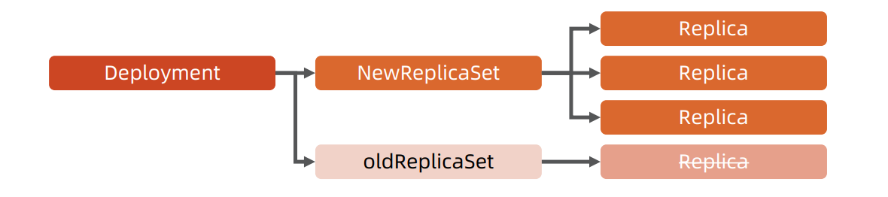


#### 有状态服务集（StatefulSet）

- 对于StatefulSet中的Pod，每个Pod挂载自己独立的存储，如果一个Pod出现故障，从其他节点启动一个同样名字的
    Pod，要挂载上原来Pod的存储继续以它的状态提供服务。
- 适合于StatefulSet的业务包括数据库服务MySQL和PostgreSQL，集群化管理服务ZooKeeper、etcd等有状态服务。
- 使用StatefulSet，Pod仍然可以通过漂移到不同节点提供高可用，而存储也可以通过外挂的存储来提供高可靠性，
    StatefulSet 做的只是将确定的Pod与确定的存储关联起来保证状态的连续性。

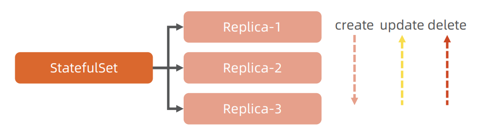

#### Statefulset 与 Deployment 的差异

- 身份标识
    - StatefulSetController为每个Pod编号，序号从 0 开始。
- 数据存储
    - StatefulSet允许用户定义volumeClaimTemplates，Pod被创建的同时，Kubernetes会以
       volumeClaimTemplates中定义的模板创建存储卷，并挂载给Pod。
- StatefulSet的升级策略不同
    - onDelete
    - 滚动升级
    - 分片升级


#### 任务（Job）

- Job是Kubernetes用来控制批处理型任务的API对象。
- Job管理的Pod根据用户的设置把任务成功完成后就自动退出。
- 成功完成的标志根据不同的spec.completions策略而不同：
    - 单Pod型任务有一个Pod成功就标志完成；
    - 定数成功型任务保证有N个任务全部成功；
    - 工作队列型任务根据应用确认的全局成功而标志成功。

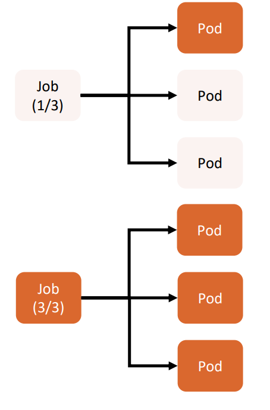


#### 后台支撑服务集（DaemonSet）

- 长期伺服型和批处理型服务的核心在业务应用，可能有些节点运行多个同类业务的Pod，有些节点上又没有这类Pod运行；
- 而后台支撑型服务的核心关注点在Kubernetes集群中的节点（物理机或虚拟机），要保证每个节点上都有一个此类Pod运行。
- 节点可能是所有集群节点也可能是通过nodeSelector选定的一些特定节点。
- 典型的后台支撑型服务包括存储、日志和监控等在每个节点上支撑Kubernetes集群运行的服务。

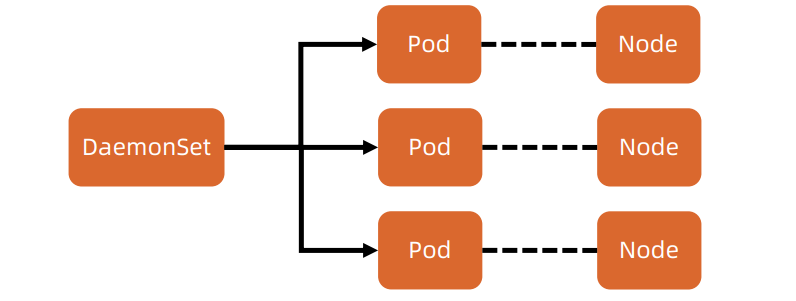

#### 存储 PV 和 PVC

- PersistentVolume（PV）是集群中的一块存储卷，可以由管理员手动设置，
    或当用户创建PersistentVolumeClaim（PVC）时根据StorageClass动
    态设置。
- PV和PVC与Pod生命周期无关。也就是说，当Pod中的容器重新启动、
    Pod重新调度或者删除时，PV和PVC不会受到影响，Pod存储于PV里
    的数据得以保留。
- 对于不同的使用场景，用户通常需要不同属性（例如性能、访问模式等）
    的PV。


#### CustomResourceDefinition

- CRD就像数据库的开放式表结构，允许用户自定义Schema。
- 有了这种开放式设计，用户可以基于CRD定义一切需要的模型，满足不同
    业务的需求。
- 社区鼓励基于CRD的业务抽象，众多主流的扩展应用都是基于CRD构建
    的，比如Istio、Knative。
- 甚至基于CRD推出了Operator Mode和Operator SDK，可以以极低的
    开发成本定义新对象，并构建新对象的控制器。
