# 深入理解Kube-APIServer


目录
- 认证
- 鉴权
- 准入
    Mutating
    Validating
    Admission
- 限流
- APIServer对象的实现


## API Server

kube-apiserver是Kubernetes最重要的核心组件之一，主要提供以下的功能

- 提供集群管理的REST API接口，包括认证授权、数据校验以及集群状态变更
    等
- 提供其他模块之间的数据交互和通信的枢纽（其他模块通过API Server查询或
    修改数据，只有API Server才直接操作etcd）

## 访问控制概览

Kubernetes API的每个请求都会经过多阶段的访问控制之后才会被接受，这包括认证、授权以及
准入控制（Admission Control）等。

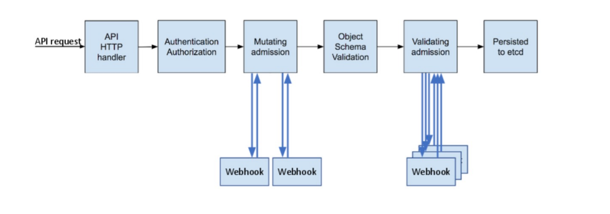

## 访问控制细节

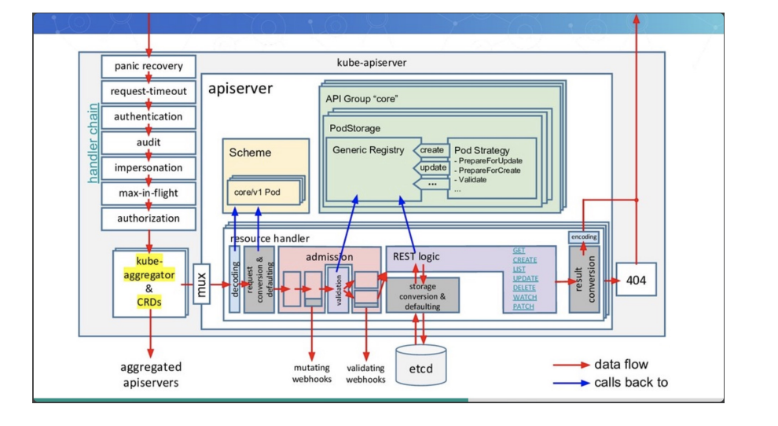

## 认证

开启TLS时，所有的请求都需要首先认证。Kubernetes支持多种认证机制，并支持同时

开启多个认证插件（只要有一个认证通过即可）。如果认证成功，则用户的username会

传入授权模块做进一步授权验证；而对于认证失败的请求则返回HTTP 401。

### 认证插件

- X509证书
    - 使用X509客户端证书只需要API Server启动时配置--client-ca-file=SOMEFILE。在证书认证时，其CN域用作用户名，而组织
       机构域则用作group名。
- 静态Token文件
    - 使用静态Token文件认证只需要APIServer启动时配置--token-auth-file=SOMEFILE。
    - 该文件为csv格式，每行至少包括三列token,username,userid，
token,user,uid,"group1,group2,group3”
- 引导Token
    - 为了支持平滑地启动引导新的集群，Kubernetes 包含了一种动态管理的持有者令牌类型，称作启动引导令牌（Bootstrap
       Token）。
    - 这些令牌以Secret 的形式保存在kube-system名字空间中，可以被动态管理和创建。
    - 控制器管理器包含的TokenCleaner控制器能够在启动引导令牌过期时将其删除。
    - 在使用kubeadm部署Kubernetes时，可通过kubeadmtoken list命令查询。
- 静态密码文件
    - 需要APIServer启动时配置--basic-auth-file=SOMEFILE，文件格式为csv，每行至少三列password, user, uid，后面是可选
       的group名
          password,user,uid,"group1,group2,group3”
- ServiceAccount
    - ServiceAccount是Kubernetes自动生成的，并会自动挂载到容器的/run/secrets/kubernetes.io/serviceaccount目录中。
- OpenID
    - OAuth 2.0的认证机制
- Webhook 令牌身份认证
    - --authentication-token-webhook-config-file指向一个配置文件，其中描述如何访问远程的Webhook 服务。
    - --authentication-token-webhook-cache-ttl用来设定身份认证决定的缓存时间。默认时长为 2 分钟。
- 匿名请求
    - 如果使用AlwaysAllow以外的认证模式，则匿名请求默认开启，但可用--anonymous-auth=false禁止匿名请求。

### 基于webhook的认证服务集成

https://github.com/appscode/guard


#### 构建符合Kubernetes规范的认证服务

需要依照Kubernetes规范，构建认证服务，用来认证tokenreviewrequest

构建认证服务

- 认证服务需要满足如下Kubernetes的规范
    ➢ URL：https://authn.example.com/authenticate
    ➢ Method：POST
    ➢ Input:
    ➢ Output:

```  json  
    { "apiVersion": "authentication.k8s.io/v1beta1", "kind": "TokenReview",
"spec": { "token": "(BEARERTOKEN)" } }

    {
       "apiVersion": "authentication.k8s.io/v1beta1",
       "kind": "TokenReview",
       "status": {
          "authenticated": true,
          "user": {
             "username": "janedoe@example.com",
             "uid": "42",
             "groups": [
                "developers",
                "qa"
             ]}}
    }
```

#### 开发认证服务

解码认证请求

``` go
decoder := json.NewDecoder(r.Body)
var tr authentication.TokenReview
err := decoder.Decode(&tr)
if err != nil {
    log.Println("[Error]", err.Error())
    w.WriteHeader(http.StatusBadRequest)
    json.NewEncoder(w).Encode(map[string]interface{}{
        "apiVersion": "authentication.k8s.io/v1beta1",
        "kind": "TokenReview",
        "status": authentication.TokenReviewStatus{
        Authenticated: false,
        },
    })
    return
}
```

转发认证请求至认证服务器

``` go
//CheckUser
ts:=oauth2.StaticTokenSource(
&oauth2.Token{AccessToken:tr.Spec.Token},
)
tc:=oauth2.NewClient(oauth2.NoContext,ts)
client:=github.NewClient(tc)
user,_,err:=client.Users.Get(context.Background(),"")
iferr!=nil{
log.Println("[Error]",err.Error())
w.WriteHeader(http.StatusUnauthorized)
json.NewEncoder(w).Encode(map[string]interface{}{
    "apiVersion":"authentication.k8s.io/v1beta1",
    "kind": "TokenReview",
    "status":authentication.TokenReviewStatus{
    Authenticated:false,
    },
})
return
}
```

认证结果返回给APIServer

``` go
w.WriteHeader(http.StatusOK)
trs := authentication.TokenReviewStatus{
    Authenticated: true,
    User: authentication.UserInfo{
    Username: *user.Login,
    UID: *user.Login,
    },
}
json.NewEncoder(w).Encode(map[string]interface{}{
    "apiVersion": "authentication.k8s.io/v1beta1",
    "kind": "TokenReview",
    "status": trs,
    })
```

#### 配置认证服务


``` json
{
    "kind": "Config",
    "apiVersion": "v1",
    "preferences": {},
    "clusters": [
        {
        "name": "github-authn",
        "cluster": {
            "server": "http://localhost:3000/authenticate"
        }
    }],
    "users": [
    {
        "name": "authn-apiserver",
        "user": {
            "token": "secret"
            }
    }],
    "contexts": [
    {
        "name": "webhook",
        "context": {
            "cluster": "github-authn",
            "user": "authn-apiserver"
        }
    }],
    "current-context": "webhook"
}
```

#### 配置apiserver

可以是任何认证系统

- 但在用户认证完成后，生成代表用户身份的token
- 该token通常是有失效时间的
- 用户获取该token以后以后，将token配置进
    kubeconfig

修改apiserver设置，开启认证服务，apiserver保证将所有收到的
请求中的token信息，发给认证服务进行验证

- --authentication-token-webhook-config-file，该
    文件描述如何访问认证服务
- --authentication-token-webhook-cache-ttl，默
    认 2 分钟

配置文件需要mount进Pod

配置文件中的服务器地址需要指向authService

```json
{
"kind": "Config",
"apiVersion": "v1",
"preferences": {},
"clusters": [
{
    "name": "github-authn",
    "cluster": {
        "server": "http://localhost:3000/authenticate"
    }
}],
"users": [
{
"name": "authn-apiserver",
"user": {
    "token": "secret"
    }
}],
"contexts": [
{
"name": "webhook",
"context": {
    "cluster": "github-authn",
    "user": "authn-apiserver"
    }
}],
"current-context": "webhook"
}
```

### 生产系统中遇到的陷阱

```
基于Keystone的认证插件导致Keystone故障且无法恢复
Keystone是企业关键服务
Kubernetes以Keystone作为认证插件
Keystone在出现故障后会抛出 401 错误
Kubernetes发现 401 错误后会尝试重新认证
大多数controller都有指数级backoff，重试间隔越来越慢
但gophercloud针对过期token会一直retry
大量的request积压在Keystone导致服务无法恢复
Kubernetes成为压死企业认证服务的最后一根稻草
```
解决方案？

- Circuitbreak
- Ratelimit

## 2. 鉴权

### 授权

授权主要是用于对集群资源的访问控制，通过检查请求包含的相关属性值，与相对应的访问策略相比较，API请求必须满足某
些策略才能被处理。跟认证类似，Kubernetes也支持多种授权机制，并支持同时开启多个授权插件（只要有一个验证通过即
可）。如果授权成功，则用户的请求会发送到准入控制模块做进一步的请求验证；对于授权失败的请求则返回HTTP 403。

Kubernetes授权仅处理以下的请求属性：

- user, group, extra
- API、请求方法（如get、post、update、patch和delete）和请求路径（如/api）
- 请求资源和子资源
- Namespace
- API Group

目前，Kubernetes支持以下授权插件：

- ABAC
- RBAC
- Webhook
- Node


### RBAC vs ABAC

ABAC（Attribute Based Access Control）本来是不错的概念，但是在Kubernetes 中的实现比较
难于管理和理解，而且需要对Master 所在节点的SSH 和文件系统权限，要使得对授权的变更成
功生效，还需要重新启动API Server。

而RBAC 的授权策略可以利用kubectl 或者Kubernetes API 直接进行配置。RBAC 可以授权给用户，
让用户有权进行授权管理，这样就可以无需接触节点，直接进行授权管理。RBAC 在Kubernetes
中被映射为API 资源和操作。

#### RBAC老图

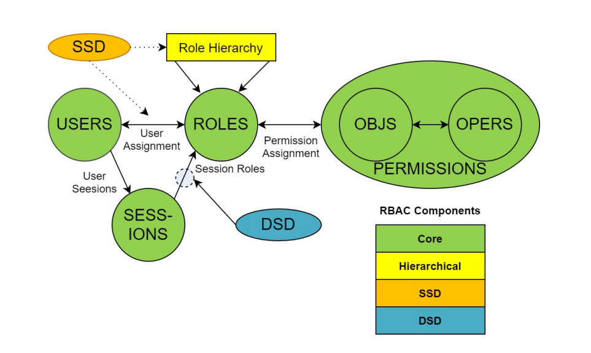

#### RBAC新解

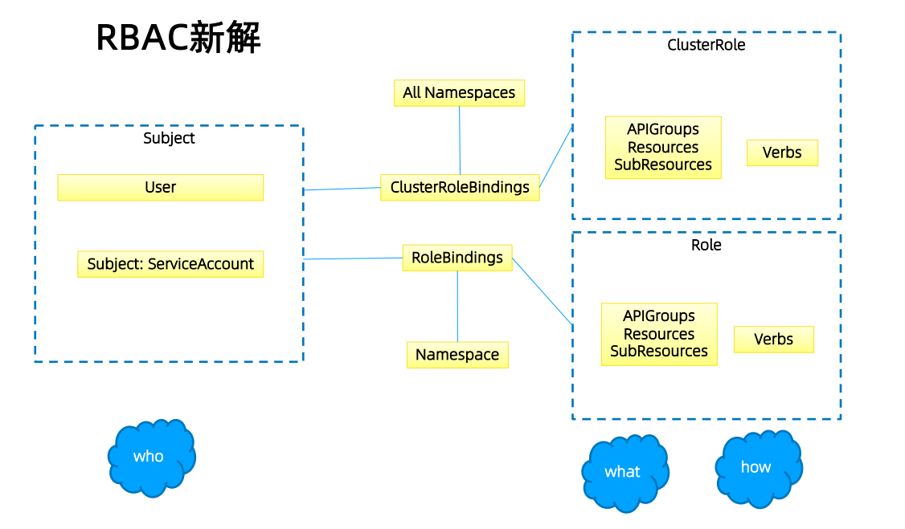

### Role与ClusterRole

Role（角色）是一系列权限的集合，例如一个角色可以包含读取Pod 的权限和列出Pod 的权限。
Role只能用来给某个特定namespace中的资源作鉴权，对多namespace和集群级的资源或者是非
资源类的API（如/healthz）使用ClusterRole。

``` yaml
# Role示例
kind: Role
apiVersion: rbac.authorization.k8s.io/v1
metadata:
    namespace: default
    name: pod-reader
rules:
-   apiGroups: [""] # "" indicates the core API group
    resources: ["pods"]
    verbs: ["get", "watch", "list"]

# ClusterRole示例
kind: ClusterRole
apiVersion: rbac.authorization.k8s.io/v1
metadata:
#   "namespace" omitted since ClusterRoles are not namespaced
    name: secret-reader
rules:
-   apiGroups: [""]
    resources: ["secrets"]
    verbs: ["get", "watch", "list"]
```

#### binding

``` yaml
# RoleBinding示例（引用ClusterRole）
# This role binding allows "dave" to read secrets in the "development"
namespace.
kind: RoleBinding
apiVersion: rbac.authorization.k8s.io/v1
metadata:
name: read-secrets
namespace: development # This only grants permissions within the
"development" namespace.
subjects:
-   kind: User
    name: dave
    apiGroup: rbac.authorization.k8s.io
roleRef:
    kind: ClusterRole
    name: secret-reader
    apiGroup: rbac.authorization.k8s.io
```

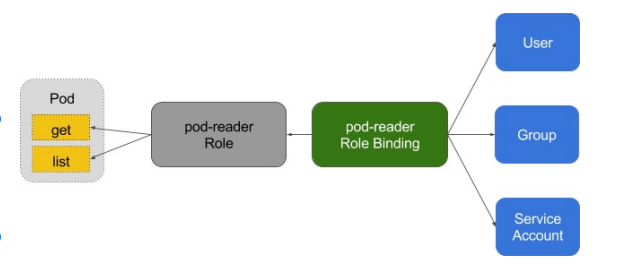

### 账户／组的管理

角色绑定（Role Binding）是将角色中定义的权限赋予一个或者一组用户。

它包含若干主体（用户、组或服务账户）的列表和对这些主体所获得的角色的引用。

组的概念：

- 当与外部认证系统对接时，用户信息（UserInfo）可包含Group信息，授权可针对用户群组
- 当对ServiceAccount授权时，Group代表某个Namespace下的所有ServiceAccount

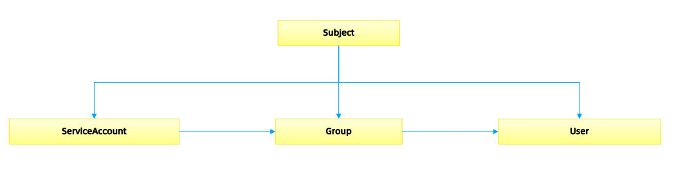

### 针对群租授权

``` yaml
apiVersion: rbac.authorization.k8s.io/v1
kind: ClusterRoleBinding
metadata:
    name: read-secrets-global
subjects:
    - kind: Group
    name: manager # 'name' 是区分大小写的
    apiGroup: rbac.authorization.k8s.io
roleRef:
    kind: ClusterRole
    name: secret-reader
    apiGroup: rbac.authorization.k8s.io


apiVersion: rbac.authorization.k8s.io/v1
kind: ClusterRoleBinding
metadata:
    name: read-secrets-global
subjects:
    - kind: Group
    name: system:serviceaccounts:qa
    apiGroup: rbac.authorization.k8s.io
roleRef:
    kind: ClusterRole
    name: secret-reader
    apiGroup: rbac.authorization.k8s.io    
```

### 规划系统角色

User

- 管理员
    ➢所有资源的所有权限？？
- 普通用户
    ➢ 是否有该用户创建的namespace下的所有object的操作权限？
    ➢ 对其他用户的namespace资源是否可读，是否可写？

SystemAccount

- SystemAccount是开发者（kubernetesdeveloper或者domaindeveloper）创建应用后，应
    用于apiserver通讯需要的身份
- 用户可以创建自定的ServiceAccount，kubernetes也为每个namespace创建default
    ServiceAccount
- DefaultServiceAccount通常需要给定权限以后才能对apiserver做写操作

### 实现方案

在cluster创建时，创建自定义的role，比如namespace-creator

Namespace-creatorrole定义用户可操作的对象和对应的读写操作。

创建自定义的namespaceadmissioncontroller

- 当namespace创建请求被处理时，获取当前用户信息并annotate到namespace

创建RBAC controller

- Watchnamespace的创建事件
- 获取当前namespace的创建者信息
- 在当前namespace创建rolebinding对象，并将namespace-creator 角色和用户绑定

### 与权限相关的其他最佳实践

ClusterRole是非namespace绑定的，针对整个集群生效

通常需要创建一个管理员角色，并且绑定给开发运营团队成员

ThirdPartyResource和CustomResourceDefinition是全局资源，普通用户创建
ThirdPartyResource以后，需要管理员授予相应权限后才能真正操作该对象

针对所有的角色管理，建议创建spec，用源代码驱动

- 虽然可以通过edit操作来修改权限，但后期会导致权限管理混乱，可能会有很多临时创建出来的
    角色和角色绑定对象，重复绑定某一个资源权限

权限是可以传递的，用户A可以将其对某对象的某操作，抽取成一个权限，并赋给用户B

防止海量的角色和角色绑定对象，因为大量的对象会导致鉴权效率低，同时给apiserver增加负担

ServiceAccount也需要授权的，否则你的component可能无法操作某对象

Tips：SSH到master节点通过insecureport访问apiserver可绕过鉴权，当需要做管理操作又没
有权限时可以使用（不推荐）


### 运营过程中出现的陷阱

案例1:

- 研发人员为提高系统效率，将update方法修改为patch
- 研发人员本地非安全测试环境测试通过
- 上生产，发现不work
- 原因：忘记更新rolebinding，对应的serviceaccount没有patch权限

案例2:

- 研发人员创建CRD，并针对该CRD编程
- 上生产后不工作
- 原因，该CRD未授权，对应的组件get不到对应的CRD资源

## 3. 准入

### 准入控制

为资源增加自定义属性

- 作为多租户集群方案中的一环，我们需要在namespace的准入控制中，获取用户信息，并将用
    户信息更新的namespace的annotation

只有当namespace中有有效用户信息时，我们才可以在namespace创建时，自动绑定用户权限，
namespace才可用。

准入控制（Admission Control）在授权后对请求做进一步的验证或添加默认参数。不同于授权
和认证只关心请求的用户和操作，准入控制还处理请求的内容，并且仅对创建、更新、删除或连
接（如代理）等有效，而对读操作无效。

准入控制支持同时开启多个插件，它们依次调用，只有全部插件都通过的请求才可以放过进入系
统。

### 准入控制插件

AlwaysAdmit: 接受所有请求。

AlwaysPullImages: 总是拉取最新镜像。在多租户场景下非常有用。

DenyEscalatingExec: 禁止特权容器的exec和attach操作。

ImagePolicyWebhook: 通过webhook决定image策略，需要同时配置--admission-control-
config-file

ServiceAccount：自动创建默认ServiceAccount，并确保Pod引用的ServiceAccount已经存在

SecurityContextDeny：拒绝包含非法SecurityContext配置的容器

ResourceQuota：限制Pod的请求不会超过配额，需要在namespace中创建一个
ResourceQuota对象

LimitRanger：为Pod设置默认资源请求和限制，需要在namespace中创建一个LimitRange对
象

InitialResources：根据镜像的历史使用记录，为容器设置默认资源请求和限制

NamespaceLifecycle：确保处于termination状态的namespace不再接收新的对象创建请求，
并拒绝请求不存在的namespace

DefaultStorageClass：为PVC设置默认StorageClass

DefaultTolerationSeconds：设置Pod的默认forgivenesstoleration为 5 分钟

PodSecurityPolicy：使用PodSecurity Policies时必须开启

NodeRestriction：限制kubelet仅可访问node、endpoint、pod、service以及secret、
configmap、PV和PVC等相关的资源

除默认的准入控制插件以外，Kubernetes预留了准入控制插件的扩展点，用户可自定义准入控制
插件实现自定义准入功能

MutatingWebhookConfiguration：变形插件，支持对准入对象的修改

ValidatingWebhookConfiguration：校验插件，只能对准入对象合法性进行校验，不能修改

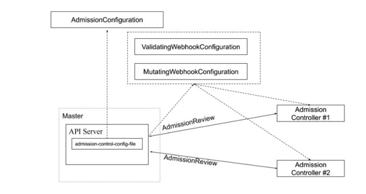


``` yaml
# {{if eq .k8snode_validating "enabled"}}
apiVersion: 
admissionregistration.k8s.io/v1beta1
kind: MutatingWebhookConfiguration
metadata:
    name: ns-mutating.webhook.k8s.io
webhooks:
    - clientConfig:
    caBundle: {{.serverca_base64}}
    url: https://admission.local.tess.io/apis/admissio
n.k8s.io/v1alpha1/ ns-mutating
    failurePolicy: Fail
    name: ns-mutating.webhook.k8s.io
    namespaceSelector: {}
rules:
- apiGroups:
    - ""
    apiVersions:
    - '*'
    operations:
    - CREATE
    resources:
    - nodes
sideEffects: Unknown
# {{end}}
```

准入控制

配额管理

- 原因：资源有限，如何限定某个用户有多少资源？

方案：

- 预定义每个Namespace的ResourceQuota，并把spec保存为configmap
    ➢ 用户可以创建多少个Pod
        ➢BestEffortPod
        ➢ QoSPod
    ➢ 用户可以创建多少个service
    ➢ 用户可以创建多少个ingress
    ➢ 用户可以创建多少个serviceVIP
- 创建ResourceQuotaController
    ➢ 监控namespace创建事件，当namespace创建时，在该namespace创建对应的
       ResourceQuota对象
- apiserver中开启ResourceQuota的admissionplugin

## 4. 限流

### 计数器固定窗口算法

原理就是对一段固定时间窗口内的请求进行计数，如果请求数超过了阈值，则舍弃该请求；

如果没有达到设定的阈值，则接受该请求，且计数加 1 。

当时间窗口结束时，重置计数器为 0 。

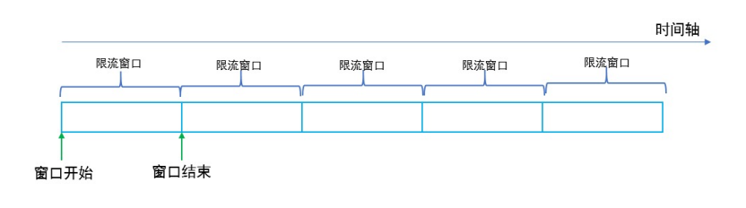

### 计数器滑动窗口算法

在固定窗口的基础上，将一个计时窗口分成了若干个小窗口，然后每个小窗口维护一个独立的计
数器。

当请求的时间大于当前窗口的最大时间时，则将计时窗口向前平移一个小窗口。

平移时，将第一个小窗口的数据丢弃，然后将第二个小窗口设置为第一个小窗口，同时在最后面
新增一个小窗口，将新的请求放在新增的小窗口中。

同时要保证整个窗口中所有小窗口的请求数目之后不能超过设定的阈值。

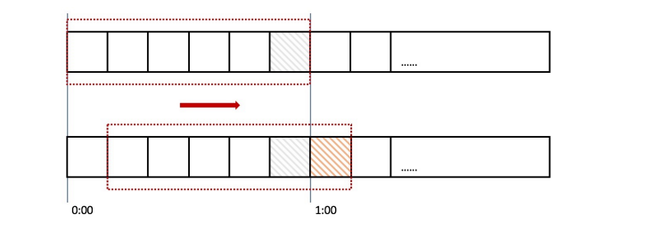

### 漏斗算法

漏斗算法的原理也很容易理解。请求来了之后会首先进到漏斗里，然后漏斗以恒定的速率将请求
流出进行处理，从而起到平滑流量的作用。

当请求的流量过大时，漏斗达到最大容量时会溢出，此时请求被丢弃。

在系统看来，请求永远是以平滑的传输速率过来，从而起到了保护系统的作用。

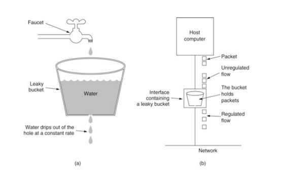

### 令牌桶算法

令牌桶算法是对漏斗算法的一种改进，除了能够起到限流的作用外，还允许一定程度的流量突发。

在令牌桶算法中，存在一个令牌桶，算法中存在一种机制以恒定的速率向令牌桶中放入令牌。

令牌桶也有一定的容量，如果满了令牌就无法放进去了。

当请求来时，会首先到令牌桶中去拿令牌，如果拿到了令牌，则该请求会被处理，并消耗掉拿到
的令牌；

如果令牌桶为空，则该请求会被丢弃。

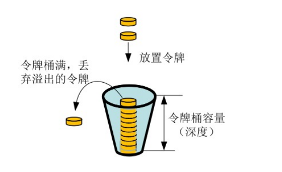

### APIServer中的限流

max-requests-inflight：在给定时间内的最大non-mutating 请求数

max-mutating-requests-inflight：在给定时间内的最大mutating 请求数，调整apiserver的
流控qos

代码
staging/src/k8s.io/apiserver/pkg/server/filters/maxinflight.go:WithMaxInFlightLimit()

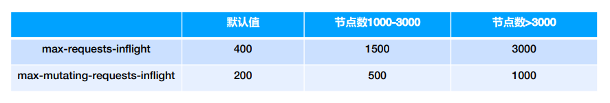

### 传统限流方法的局限性

- 粒度粗
    - 无法为不同用户，不同场景设置不通的限流
- 单队列
    - 共享限流窗口/桶，一个坏用户可能会将整个系统堵塞，其他正常用户的请求无法被及时处
       理
- 不公平
    - 正常用户的请求会被排到队尾，无法及时处理而饿死
- 无优先级
    - 重要的系统指令一并被限流，系统故障难以恢复


### API Priority and Fairness

- APF 以更细粒度的方式对请求进行分类和隔离。
- 它还引入了空间有限的排队机制，因此在非常短暂的突发情况下，API 服务器不会拒绝任何请
    求。
- 通过使用公平排队技术从队列中分发请求，这样， 一个行为不佳的控制器就不会饿死其他控制
    器（即使优先级相同）。
- APF的核心
    - 多等级
    - 多队列
- APF 的实现依赖两个非常重要的资源FlowSchema, PriorityLevelConfiguration
- APF 对请求进行更细粒度的分类，每一个请求分类对应一个FlowSchema(FS)
- FS 内的请求又会根据distinguisher 进一步划分为不同的Flow.
- FS 会设置一个优先级(Priority Level, PL)，不同优先级的并发资源是隔离的。所以不同优先级的资源不会相互排挤。特定优先级的请求可以被高优处理。
- 一个PL 可以对应多个FS，PL 中维护了一个QueueSet，用于缓存不能及时处理的请求，请求不会因为超出PL 的并发限制而被丢弃。
- FS 中的每个Flow 通过shuffle sharding算法从QueueSet选取特定的queues 缓存请求。
- 每次从QueueSet中取请求执行时，会先应用fair queuing 算法从QueueSet中选中一个queue，然后从这个queue中取出oldest 请求执行。所以即使是同一个PL 内的请求，也不会出现一个Flow 内的请求一直占用资源的不公平现象。

### 概念

- 传入的请求通过FlowSchema按照其属性分类，并分配优先级。
- 每个优先级维护自定义的并发限制，加强了隔离度，这样不同优先级的请求，就不会相互饿死。
- 在同一个优先级内，公平排队算法可以防止来自不同flow的请求相互饿死。
- 该算法将请求排队，通过排队机制，防止在平均负载较低时，通信量突增而导致请求失败。

### 优先级

- 如果未启用APF，API 服务器中的整体并发量将受到kube-apiserver的参数--max-
    requests-inflight和--max-mutating-requests-inflight的限制。
- 启用 APF 后，将对这些参数定义的并发限制进行求和，然后将总和分配到一组可配置的 优先
    级中。每个传入的请求都会分配一个优先级；
- 每个优先级都有各自的配置，设定允许分发的并发请求数。
- 例如，默认配置包括针对领导者选举请求、内置控制器请求和Pod 请求都单独设置优先级。
    这表示即使异常的Pod 向API 服务器发送大量请求，也无法阻止领导者选举或内置控制器的
    操作执行成功。

### 排队

- 即使在同一优先级内，也可能存在大量不同的流量源。
- 在过载情况下，防止一个请求流饿死其他流是非常有价值的（尤其是在一个较为常见的场景中，一个有故
    障的客户端会疯狂地向kube-apiserver发送请求，理想情况下，这个有故障的客户端不应对其他客户端
    产生太大的影响）。
- 公平排队算法在处理具有相同优先级的请求时，实现了上述场景。
- 每个请求都被分配到某个流中，该流由对应的FlowSchema的名字加上一个流区分项（Flow
    Distinguisher）来标识。
- 这里的流区分项可以是发出请求的用户、目标资源的名称空间或什么都不是。
- 系统尝试为不同流中具有相同优先级的请求赋予近似相等的权重。
- 将请求划分到流中之后，APF 功能将请求分配到队列中。
- 分配时使用一种称为混洗分片（Shuffle-Sharding）的技术。该技术可以相对有效地利用队列隔离低强
    度流与高强度流。
- 排队算法的细节可针对每个优先等级进行调整，并允许管理员在内存占用、公平性（当总流量超标时，各
    个独立的流将都会取得进展）、突发流量的容忍度以及排队引发的额外延迟之间进行权衡。


### 豁免请求

某些特别重要的请求不受制于此特性施加的任何限制。这些豁免可防止不当的流控配置完全禁用
API 服务器。


### 默认配置

- system
    - 用于system:nodes组（即kubelets）的请求；kubelets必须能连上API 服务器，以便工作负
       载能够调度到其上。
- leader-election
    - 用于内置控制器的领导选举的请求（特别是来自kube-system名称空间中system:kube-
       controller-manager和system:kube-scheduler用户和服务账号，针对endpoints、
       configmaps或leases的请求）。
    - 将这些请求与其他流量相隔离非常重要，因为领导者选举失败会导致控制器发生故障并重新启动，
       这反过来会导致新启动的控制器在同步信息时，流量开销更大。
- workload-high
    - 优先级用于内置控制器的请求。
- workload-low
    - 优先级适用于来自任何服务帐户的请求，通常包括来自Pods 中运行的控制器的所有请求。
- global-default
    - 优先级可处理所有其他流量，例如：非特权用户运行的交互式kubectl命令。
- exempt
    - 优先级的请求完全不受流控限制：它们总是立刻被分发。特殊的exemptFlowSchema
       把system:masters组的所有请求都归入该优先级组。
- catch-all
    - 优先级与特殊的catch-allFlowSchema结合使用，以确保每个请求都分类。
    - 一般不应该依赖于catch-all的配置，而应适当地创建自己的catch-allFlowSchema和
       PriorityLevelConfigurations（或使用默认安装的global-default配置）。
    - 为了帮助捕获部分请求未分类的配置错误，强制要求catch-all优先级仅允许 5 个并发份额，
       并且不对请求进行排队，使得仅与catch-allFlowSchema匹配的流量被拒绝的可能性更高，
       并显示HTTP 429 错误。

### PriorityLevelConfiguration

一个PriorityLevelConfiguration表示单个隔离类型。
每个PriorityLevelConfigurations对未完成的请求数有各自的限制，对排队中的请求数也有限制。

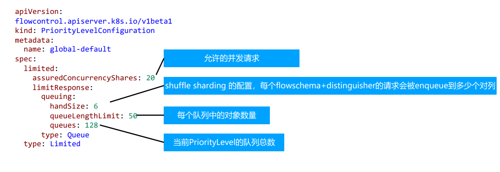

### FlowSchema

FlowSchema匹配一些入站请求，并将它们分配给优先级。

每个入站请求都会对所有FlowSchema测试是否匹配，首先从matchingPrecedence数值最低的匹配开始
（我们认为这是逻辑上匹配度最高），然后依次进行，直到首个匹配出现

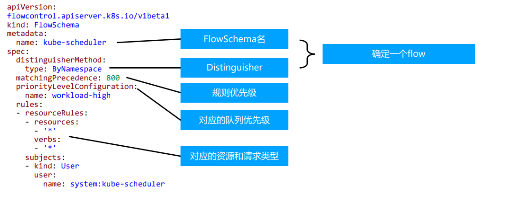

### 调试

- /debug/api_priority_and_fairness/dump_priority_levels——所有优先级及其当前状态
    的列表

kubectlget --raw /debug/api_priority_and_fairness/dump_priority_levels

- /debug/api_priority_and_fairness/dump_queues——所有队列及其当前状态的列表

kubectlget --raw /debug/api_priority_and_fairness/dump_queues

- /debug/api_priority_and_fairness/dump_requests——当前正在队列中等待的所有请求
    的列表

kubectlget --raw /debug/api_priority_and_fairness/dump_requests


## 5. 高可用APIServer


### 启动apiserver示例

``` shell
kube-apiserver--feature-gates=AllAlpha=true --runtime-config=api/all=true \
--requestheader-allowed-names=front-proxy-client \
--client-ca-file=/etc/kubernetes/pki/ca.crt \
--allow-privileged=true \
--experimental-bootstrap-token-auth=true \
--storage-backend=etcd3 \
--requestheader-username-headers=X-Remote-User \
--requestheader-extra-headers-prefix=X-Remote-Extra-\
--service-account-key-file=/etc/kubernetes/pki/sa.pub \
--tls-cert-file=/etc/kubernetes/pki/apiserver.crt \
--tls-private-key-file=/etc/kubernetes/pki/apiserver.key\
--kubelet-client-certificate=/etc/kubernetes/pki/apiserver-kubelet-client.crt \
--requestheader-client-ca-file=/etc/kubernetes/pki/front-proxy-ca.crt \
--enabled-hooks=NamespaceLifecycle,LimitRanger,ServiceAccount,PersistentVolumeLabel,DefaultStorageClass,ResourceQuota \
--requestheader-group-headers=X-Remote-Group \
--kubelet-client-key=/etc/kubernetes/pki/apiserver-kubelet-client.key\
--secure-port=6443 \
--kubelet-preferred-address-types=InternalIP,ExternalIP,Hostname\
--service-cluster-ip-range=10.96.0.0/12 \
--advertise-address=192.168.0.20 --etcd-servers=http://127.0.0.1:2379
```

### 构建高可用的多副本apiserver

apiserver是无状态的RestServer

无状态所以方便ScaleUp／down

负载均衡

- 在多个apiserver实例之上，配置负载均衡
- 证书可能需要加上LoadbalancerVIP重新生成


### 预留充足的CPU、内存资源

随着集群中节点数量不断增多，APIServer对CPU和内存的开销也不断增大。过少的CPU资源会降
低其处理效率，过少的内存资源会导致Pod被OOMKilled，直接导致服务不可用。在规划
APIServer资源时，不能仅看当下需求，也要为未来预留充分。


### 善用速率限制（RateLimit）

APIServer的参数“--max-requests-inflight”和“--max-mutating-requests-inflight”支持
在给定时间内限制并行处理读请求（包括Get、List和Watch操作）和写请求（包括Create、
Delete、Update和Patch操作）的最大数量。当APIServer接收到的请求超过这两个参数设定的
值时，再接收到的请求将会被直接拒绝。通过速率限制机制，可以有效地控制APIServer内存的使
用。如果该值配置过低，会经常出现请求超过限制的错误，如果配置过高，则APIServer可能会因
为占用过多内存而被强制终止，因此需要根据实际的运行环境，结合实时用户请求数量和
APIServer的资源配置进行调优。

客户端在接收到拒绝请求的返回值后，应等待一段时间再发起重试，无间隔的重试会加重
APIServer的压力，导致性能进一步降低。针对并行处理请求数的过滤颗粒度太大，在请求数量比
较多的场景，重要的消息可能会被拒绝掉，自1.18版本开始，社区引入了优先级和公平保证
（Priority and Fairness）功能，以提供更细粒度地客户端请求控制。该功能支持将不同用户或
不同类型的请求进行优先级归类，保证高优先级的请求总是能够更快得到处理，从而不受低优先
级请求的影响。


### 设置合适的缓存大小

APIServer与etcd之间基于gRPC协议进行通信，gRPC协议保证了二者在大规模集群中的数据高速
传输。gRPC基于连接复用的HTTP/2协议，即针对相同分组的对象，APIServer和etcd之间共享相
同的TCP连接，不同请求由不同的stream传输。

一个HTTP/2连接有其stream配额，配额的大小限制了能支持的并发请求。APIServer提供了集
群对象的缓存机制，当客户端发起查询请求时，APIServer默认会将其缓存直接返回给客户端。缓
存区大小可以通过参数“--watch-cache-sizes”设置。针对访问请求比较多的对象，适当设置
缓存的大小，极大降低对etcd的访问频率，节省了网络调用，降低了对etcd集群的读写压力，从
而提高对象访问的性能。

但是APIServer也是允许客户端忽略缓存的，例如客户端请求中ListOption中没有设置
resourceVersion，这时APIServer直接从etcd拉取最新数据返回给客户端。客户端应尽量避免此
操作，应在ListOption中设置resourceVersion为 0 ，APIServer则将从缓存里面读取数据，而不
会直接访问etcd。


### 客户端尽量使用长连接

当查询请求的返回数据较大且此类请求并发量较大时，容易引发TCP链路的阻塞，导致其他查询
操作超时。因此基于Kubernetes开发组件时，例如某些DaemonSet和Controller，如果要查询
某类对象，应尽量通过长连接ListWatch监听对象变更，避免全量从APIServer获取资源。如果在
同一应用程序中，如果有多个Informer监听APIServer资源变化，可以将这些Informer合并，减
少和APIServer的长连接数，从而降低对APIServer的压力。


### 如何访问APIServer

对外部客户（user/client/admin)，永远只通过LoadBalancer访问

只有当负载均衡出现故障时，管理员才切换到apiserverIP进行管理

内部客户端，优先访问cluster IP？（是否一定如此？）

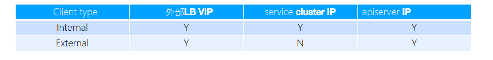

### 搭建多租户的Kubernetes集群

授信

- 认证：
    ➢ 禁止匿名访问，只允许可信用户做操作。
- 授权：
    ➢ 基于授信的操作，防止多用户之间互相影响，比如普通用户删除Kubernetes核心服务，或者A用户删除或修改B用户
       的应用。

隔离

- 可见行隔离：
    ➢ 用户只关心自己的应用，无需看到其他用户的服务和部署。
- 资源隔离：
    ➢ 有些关键项目对资源需求较高，需要专有设备，不与其他人共享。
- 应用访问隔离：
    ➢ 用户创建的服务，按既定规则允许其他用户访问。

资源管理

- Quota管理
    ➢ 谁能用多少资源？


### 认证

与企业现有认证系统集成

- 很多企业基于MicrosoftActiveDirectory提供认证服务

选择认证插件
    ➢ 选择webhook作为认证插件（*以此为例展开）
    ➢ 也可以选择Keystone作为认证插件，以MicrosoftAd作为backend搭建keystone服务

一旦认证完成，Kubernetes即可获取当前用户信息（主要是用户名），并针对该用户做授权。授权和准入控
制完成后，该用户的请求完成。


### 注册APIService

``` yaml
apiVersion: apiregistration.k8s.io/v1
kind: APIService
metadata:
labels:
    kube-aggregator.kubernetes.io/automanaged: onstart
name: v1.
spec:
    groupPriorityMinimum: 18000
    version: v1
    versionPriority: 1
status:
    conditions:
    - lastTransitionTime: "2020- 08 - 16T05:35:33Z"
        message: Local APIServices are always available
        reason: Local
        status: "True"
        type: Available
```

### 授权

ABAC有期局限性，针对每个account都需要做配置，并且需要重启apiserver

RBAC更灵活，更符合我们通常熟知的权限管理

### RBAC


### 规划系统角色

User

- 管理员
    ➢ 所有资源的所有权限？？
- 普通用户
    ➢ 是否有该用户创建的namespace下的所有object的操作权限？
    ➢ 对其他用户的namespace资源是否可读，是否可写？

SystemAccount

- SystemAccount是开发者（kubernetesdeveloper或者domaindeveloper）创建应用后，应
    用于apiserver通讯需要的身份
- 用户可以创建自定的ServiceAccount，kubernetes也为每个namespace创建default
    ServiceAccount
- DefaultServiceAccount通常需要给定权限以后才能对apiserver做写操作

### 实现方案

在cluster创建时（kube-up.sh），创建自定义的role，比如namespace-creator

namespace-creatorrole定义用户可操作的对象和对应的读写操作。

创建自定义的namespaceadmissioncontroller

- 当namespace创建请求被处理时，获取当前用户信息并annotate（注释）到namespace

创建RBAC controller

- Watchnamespace的创建事件
- 获取当前namespace的创建者信息
- 在当前namespace创建rolebinding对象，并将namespace-creator 角色和用户绑定


### 与权限相关的其他最佳实践

ClusterRole是非namespace绑定的，针对整个集群生效

通常需要创建一个管理员角色，并且绑定给开发运营团队成员

ThirdPartyResource和CustomResourceDefinition是全局资源，普通用户创建ThirdPartyResource以后，
需要管理员授予相应权限后才能真正操作该对象

针对所有的角色管理，建议创建spec，用源代码驱动

- 虽然可以通过edit操作来修改权限，但后期会导致权限管理混乱，可能会有很多临时创建出来的
    角色和角色绑定对象，重复绑定某一个资源权限

权限是可以传递的，用户A可以将其对某对象的某操作，抽取成一个权限，并赋给用户B

防止海量的角色和角色绑定对象，因为大量的对象会导致鉴权效率低，同时给apiserver增加负担

ServiceAccount也需要授权的，否则你的component可能无法操作某对象

Tips：SSH到master节点通过insecureport访问apiserver可绕过鉴权，当需要做管理操作又没有权限时可以
使用（不推荐）


## apimachinery

**https://github.com/kubernetes/apimachineryhttps://github.com/kubernetes/kubernetes/blob/master/staging/src/k8s.io/apimachinery->.**


### 回顾GKV

Group

Kind

Version

- Internelversion和Externalversion
- 版本转换


### 如何定义Group

pkg/apis/core/register.go
定义group
GroupName
定义groupversion
``` go
var SchemeGroupVersion = schema.GroupVersion{Group: GroupName, Version:
runtime.APIVersionInternal}
```
定义SchemeBuilder
``` go
var (
SchemeBuilder = runtime.NewSchemeBuilder(addKnownTypes)
AddToScheme = SchemeBuilder.AddToScheme
)
```
将对象加入SchemeBuild
``` go
func addKnownTypes(scheme *runtime.Scheme) error {
if err := scheme.AddIgnoredConversionType(&metav1.TypeMeta{}, &metav1.TypeMeta{}); err != nil {
return err
}
scheme.AddKnownTypes(SchemeGroupVersion,
&Pod{},
&PodList{},
}}
```

### 定义对象类型 types.go

List

单一对象数据结构

- TypeMeta
- ObjectMeta
- Spec
- Status


### 代码生成Tags

GlobalTags

- 定义在doc.go中
    ➢ // +k8s:deepcopy-gen=package

LocalTags

- 定义在types.go中的每个对象里
    ➢ // +k8s:deepcopy-gen:interfaces=k8s.io/apimachinery/pkg/runtime.Object
    ➢ // +genclient
       // +genclient:nonNamespaced
       // +genclient:noVerbs
       // +genclient:onlyVerbs=create,delete
       //
       +genclient:skipVerbs=get,list,create,update,patch,delete,deleteCollection,watc
       h
       //
       +genclient:method=Create,verb=create,result=k8s.io/apimachinery/pkg/apis/
       meta/v1.Status


### 实现etcd storage

pkg/registry/core/configmap/storage/storage.go
``` go
funcNewREST(optsGetter generic.RESTOptionsGetter) *REST {
store := &genericregistry.Store{
NewFunc: func() runtime.Object { return&api.ConfigMap{} },
NewListFunc: func() runtime.Object { return&api.ConfigMapList{} },
DefaultQualifiedResource: api.Resource("configmaps"),
CreateStrategy: configmap.Strategy,
UpdateStrategy: configmap.Strategy,
DeleteStrategy: configmap.Strategy,
TableConvertor: printerstorage.TableConvertor{TableGenerator: printers.NewTableGenerator().With(printersinternal.AddHandlers)},
}
options := &generic.StoreOptions{RESTOptions: optsGetter}
if err := store.CompleteWithOptions(options); err != nil {
panic(err) // TODO: Propagate error up
}
return &REST{store}
}
```

### 创建和更新对象时的业务逻辑-Strategy
``` go
func (strategy) PrepareForCreate(ctx context.Context, obj runtime.Object) {

_ = obj.(*api.ConfigMap)
}

func (strategy) Validate(ctx context.Context, obj runtime.Object) field.ErrorList {
cfg := obj.(*api.ConfigMap)

return validation.ValidateConfigMap(cfg)
}
func (strategy) PrepareForUpdate(ctx context.Context, newObj, oldObj runtime.Object) {
_ = oldObj.(*api.ConfigMap)
_ = newObj.(*api.ConfigMap)
}
```

### subresource

什么是subresource，内嵌在kubernetes对象中，有独立的操作逻辑的属性集合，如podstatus

``` go
statusStore.UpdateStrategy = pod.StatusStrategy

var StatusStrategy = podStatusStrategy{Strategy}

func (podStatusStrategy) PrepareForUpdate(ctx context.Context, obj, old runtime.Object)
{
newPod := obj.(*api.Pod)
oldPod := old.(*api.Pod)
newPod.Spec = oldPod.Spec
newPod.DeletionTimestamp = nil
// don't allow the pods/status endpoint to touch owner references since old
kubelets corrupt them in a way
// that breaks garbage collection
newPod.OwnerReferences = oldPod.OwnerReferences
}
```

### 注册APIGroup

定义Storage
``` go
configMapStorage := configmapstore.NewREST(restOptionsGetter)

restStorageMap := map[string]rest.Storage{

"configMaps": configMapStorage,

}
```

定义对象的StorageMap
``` go
apiGroupInfo.VersionedResourcesStorageMap["v1"] = restStorageMap
```
将对象注册至APIServer（挂载handler）
``` go
if err :=
m.GenericAPIServer.InstallLegacyAPIGroup(genericapiserver.DefaultLegacyAPIPrefix,
&apiGroupInfo); err != nil {

klog.Fatalf("Error in registering group versions: %v", err)
}
```

### 代码生成

```
deepcopy-gen
```
- 为对象生成DeepCopy方法，用于创建对象副本
client-gen
- 创建Clientset，用于操作对象的CRUD
informer-gen
- 为对象创建Informer框架，用于监听对象变化
lister-gen
- 为对象构建Lister框架，用于为Get和List操作，构建客户端缓存
coversion-gen
- 为对象构建Conversion方法，用于内外版本转换以及不同版本号的转换

**https://github.com/kubernetes/code-generator**^83


### hack/update-codegen.sh

依赖

BUILD_TARGETS=(
vendor/k8s.io/code-generator/cmd/client-gen
vendor/k8s.io/code-generator/cmd/lister-gen
vendor/k8s.io/code-generator/cmd/informer-gen
)

生成命令

${GOPATH}/bin/deepcopy-gen --input-dirs{versioned-package-pach}

- O zz_generated.deepcopy\
--bounding-dirs{output-package-path} \
--go-header-file ${SCRIPT_ROOT}/hack/boilerplate.go.txt


### APIServer代码走读

https://cncamp.notion.site/kube-apiserver-10d5695cbbb14387b60c6d622005583d


