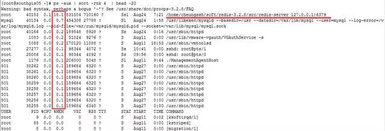
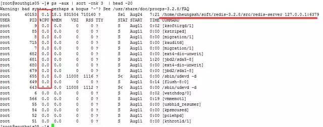

#逼格高又实用的 Linux 命令，开发、运维一定要懂！

### 实用的 xargs 命令

在平时的使用中，我认为xargs这个命令还是较为重要和方便的。我们可以通过使用这个命令，将命令输出的结果作为参数传递给另一个命令。

比如说我们想找出某个路径下以 .conf 结尾的文件，并将这些文件进行分类，那么普通的做法就是先将以 .conf 结尾的文件先找出来，然后输出到一个文件中，接着cat这个文件，并使用file文件分类命令去对输出的文件进行分类。这个普通的方法还的确是略显麻烦，那么这个时候xargs命令就派上用场了。

例1：找出 / 目录下以.conf 结尾的文件，并进行文件分类

命令：
``` shell
find / -name *.conf -type f -print | xargs file
```
输出结果如下所示：


### 命令或脚本后台运行

有时候我们进行一些操作的时候，不希望我们的操作在终端会话断了之后就跟着断了，特别是一些数据库导入导出操作，如果涉及到大数据量的操作，我们不可能保证我们的网络在我们的操作期间不出问题，所以后台运行脚本或者命令对我们来说是一大保障。

比如说我们想把数据库的导出操作后台运行，并且将命令的操作输出记录到文件，那么我们可以这么做：

```
nohup mysqldump -uroot -pxxxxx --all-databases > ./alldatabases.sql &（xxxxx是密码）
```
当然如果你不想密码明文，你还可以这么做：
```
nohup mysqldump -uroot -p --all-databases > ./alldatabases.sql  （后面不加&符号）
```
执行了上述命令后，会提示叫你输入密码，输入密码后，该命令还在前台运行，但是我们的目的是后天运行该命令，这个时候你可以按下Ctrl+Z，然后在输入bg就可以达到第一个命令的效果，让该命令后台运行，同时也可以让密码隐蔽输入。

命令后台执行的结果会在命令执行的当前目录下留下一个 nohup.out 文件，查看这个文件就知道命令有没有执行报错等信息。

### 找出当前系统内存使用量较高的进程

在很多运维的时候，我们发现内存耗用较为严重，那么怎么样才能找出内存消耗的进程排序呢？

命令：
```
ps -aux | sort -rnk 4  | head -20
```

输出的第4列就是内存的耗用百分比。最后一列就是相对应的进程。

### 找出当前系统CPU使用量较高的进程

在很多运维的时候，我们发现CPU耗用较为严重，那么怎么样才能找出CPU消耗的进程排序呢？

命令：
```
ps -aux | sort -rnk 3  | head -20
```


输出的第3列为CPU的耗用百分比，最后一列就是对应的进程。

我想大家应该也发现了，sort 命令后的3、4其实就是代表着第3列进行排序、第4列进行排序。

### 同时查看多个日志或数据文件

在日常工作中，我们查看日志文件的方式可能是使用tail命令在一个个的终端查看日志文件，一个终端就看一个日志文件。包括我在内也是，但是有时候也会觉得这种方式略显麻烦，其实有个工具叫做 multitail 可以在同一个终端同时查看多个日志文件。

首先安装 multitail：

```
# wget ftp://ftp.is.co.za/mirror/ftp.rpmforge.net/redhat/el6/en/x86_64/dag/RPMS/multitail-5.2.9-1.el6.rf.x86_64.rpm
# yum -y localinstall multitail-5.2.9-1.el6.rf.x86_64.rpm
```
multitail 工具支持文本的高亮显示，内容过滤以及更多你可能需要的功能。

如下就来一个有用的例子：

此时我们既想查看secure的日志指定过滤关键字输出，又想查看实时的网络ping情况：

命令如下：
```
# multitail -e "Accepted" /var/log/secure  -l "ping baidu.com"
```


是不是很方便？如果平时我们想查看两个日志之间的关联性，可以观察日志输出是否有触发等。如果分开两个终端可能来回进行切换有点浪费时间，这个multitail工具查看未尝不是一个好方法。

### 持续 ping 并将结果记录到日志


这个时候你去ping几个包把结果丢出来，人家会反驳你，刚刚那段时间有问题而已，现在业务都恢复正常了，网络肯定正常啊，这个时候估计你要气死。

你要是再拿出zabbix等网络监控的数据，这个时候就不太妥当了，zabbix的采集数据间隔你不可能设置成1秒钟1次吧？小编就遇到过这样的问题，结果我通过以下的命令进行了ping监控采集。然后再有人让我背锅的时候，我把出问题时间段的ping数据库截取出来，大家公开谈，结果那次被我叼杠回去了，以后他们都不敢轻易甩锅了，这个感觉好啊。

命令：

```
ping api.jpush.cn  | awk '{ print $0"\t" strftime("%Y-%m-%d %H:%M:%S",systime()) } ' >> /tmp/jiguang.log &`
```

输出的结果会记录到/tmp/jiguang.log 中，每秒钟新增一条ping记录，如下：


### ssh实现端口转发

可能很多的朋友都听说过ssh是linux下的远程登录安全协议，就是通俗的远程登录管理服务器。但是应该很少朋友会听说过ssh还可以做端口转发。其实ssh用来做端口转发的功能还是很强大的，下面就来做示范。

实例背景：我们公司是有堡垒机的，任何操作均需要在堡垒机上进行，有写开发人员需要访问ELasticSearch的head面板查看集群状态，但是我们并不想将ElasticSearch的9200端口映射出去，依然想通过堡垒机进行访问。

所以才会将通往堡垒机（192.168.1.15）的请求转发到服务器ElasticSearch（192.168.1.19）的9200上。

例子：
将发往本机（192.168.1.15）的9200端口访问转发到192.168.1.19的9200端口

```
ssh -p 22 -C -f -N -g -L 9200:192.168.1.19:9200 ihavecar@192.168.1.19`
```
记住：前提是先进行秘钥传输。

命令执行完后，访问192.168.1.15:9200端口则真实是访问192.168.1.19:9200端口。

###  grep命令进阶

grep命令是一种强大的文本搜索工具，它能使用正则表达式搜索文本，并把匹 配的行打印出来

grep搜索成功，则返回0，如果搜索不成功，则返回1，如果搜索的文件不存在，则返回2。

* grep的规则表达式（正则一定要转义）

``` shell
^    #锚定行的开始 如：'^grep'匹配所有以grep开头的行。    
$    #锚定行的结束 如：'grep$'匹配所有以grep结尾的行。 
.    #匹配一个非换行符的字符 如：'gr.p'匹配gr后接一个任意字符，然后是p。
*    #匹配零个或多个先前字符 如：'*grep'匹配所有一个或多个空格后紧跟grep的行。  
.*   #一起用代表任意字符。   
[]   #匹配一个指定范围内的字符，如'[Gg]rep'匹配Grep和grep。    
[^]  #匹配一个不在指定范围内的字符
\(..\)  #标记匹配字符，如'\(love\)'，love被标记为1。    
\<      #锚定单词的开始，如:'\<grep'匹配包含以grep开头的单词的行。    
\>      #锚定单词的结束，如'grep\>'匹配包含以grep结尾的单词的行。    
x\{m\}  #重复字符x，m次，如：'0\{5\}'匹配包含5个o的行。    
x\{m,\} #重复字符x,至少m次，如：'o\{5,\}'匹配至少有5个o的行。    
x\{m,n\}#重复字符x，至少m次，不多于n次，如：'o\{5,10\}'匹配5--10个o的行。   
\w    #匹配文字和数字字符，也就是[A-Za-z0-9]，
\W    #\w的反置形式，匹配一个或多个非单词字符，如点号句号等。   
\b    #单词锁定符，如: '\bgrep\b'只匹配grep。 
```

* grep常见命令参数

``` shell
-n  打印行号
    grep -n ".*" h.txt        所有打印行号
    grep -n "root" h.txt    匹配的内容显示行号
-v  不包括
-E  表示过滤 多个参数
    grep -Ev "sshd|network|crond|sysstat|"
-o:仅打印你需要的东西，默认打印正行
     grep -o "hello" h.txt
-i:忽略大小写
    grep -i "hello" h.txt
-c: 用于统计文中出现的次数
--color=auto  过滤字段添加颜色
    利用正则打印特定字符
\b：作为边界符，边界只包含特定字符的行
    grep "\boldboy\b" /etc/passwd   -->只过滤包含oldboy的行
```

* Linux egrep命令详解

``` shell
egrep: == grep -E 用于显示文件中符合条件的字符
          env|egrep "USER|MAIL|PWD|LOGNAME"
          用的表达式不一样 ，egerp更加规范
egrep -o "oldboy|hello" h.txt   -->仅仅输出 oldboy 和 hello
```

* 常用的命令展示

``` shell
#查找指定关键字个数
grep '\bboot\b' logs_bak.txt 【\b单词锁定符，只匹配boot】
#输出logs_bak.txt 文件中含有从logs.txt文件中读取出的关键词的内容行
cat logs_bak.txt 
    cat logs.txt 
    cat logs.txt | grep -nf logs_bak.txt
#从多个文件中查找关键词
grep "omc" /etc/passwd /etc/shadow 【多文件查询时，会用冒号前添加文件名】
#打印IP信息
ifconfig eth0|grep -E "([0-9]{1,3}\.){3}" 【-E 表达式匹配，用小括号括起来表示一个整体】
#同时过滤多个关键字
cat /etc/passwd|grep -E "boy|omc"
   ==> cat /etc/passwd|egrep "omc|boy" 【用 | 划分多个关键字】
#显示当前目录下面以.txt 结尾的文件中的所有包含每个字符串至少有7个连续小写字符的字符串的行
grep '\w\{7\}' *.txt
   ==> grep '[a-z]\{7\}' *.txt 【注意特殊字符的转义】       
```

*  上下文的控制(了解)           

``` shell
# A   查询匹配内容的一行之外，后n行的显示
    # B   查询匹配内容的一行之外，前n行的显示
    # C   查询匹配内容的一行之外，显示上下n行
grep -n 'yum' -A 3 logs_bak.txt
```
