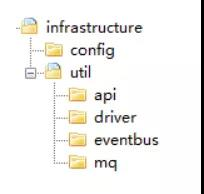
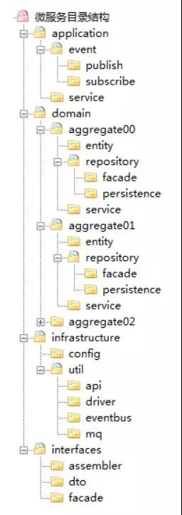
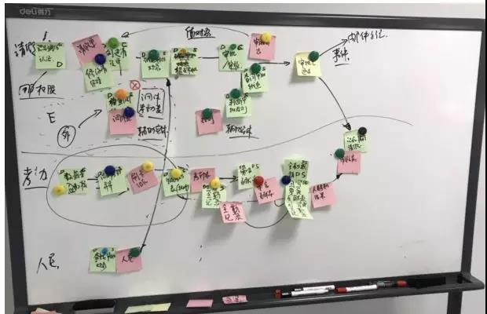
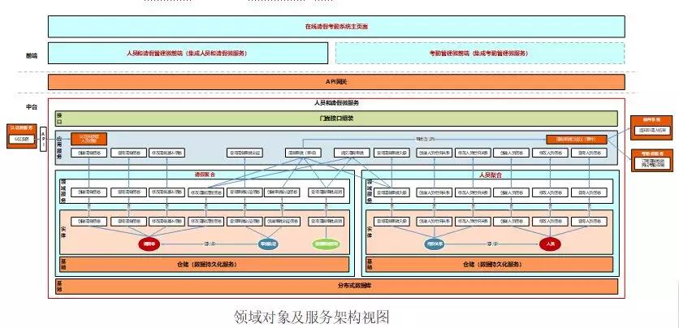
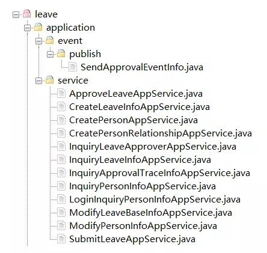

# 基于DDD的微服务设计和开发实战

你是否还在为微服务应该拆多小而争论不休？到底如何才能设计出收放自如的微服务？怎样才能保证业务领域模型与代码模型的一致性？或许本文能帮你找到答案。
本文是基于 DDD 的微服务设计和开发实战篇，通过借鉴领域驱动设计思想，指导微服务项目团队进行设计和开发（理论篇详见《当中台遇上 DDD，我们该如何设计微服务？》）。本文包括三部分内容：第一部分讲述领域驱动设计基本知识，包括：分层架构、服务视图、数据视图和领域事件发布和订阅等；第二部分讲述微服务设计方法、过程、模板、代码目录、设计原则等内容；最后部分以一个项目为例讲述基于 DDD 的微服务设计过程。

## 目标  

本文采用 DDD（领域驱动设计）作为微服务设计指导思想，通过事件风暴建立领域模型，合理划分领域逻辑和物理边界，建立领域对象及服务矩阵和服务架构图，定义符合 DDD 分层架构思想的代码结构模型，保证业务模型与代码模型的一致性。通过上述设计思想、方法和过程，指导团队按照 DDD 设计思想完成微服务设计和开发。
通过领域模型和 DDD 的分层思想，屏蔽外部变化对领域逻辑的影响，确保交付的软件产品是边界清晰的微服务，而不是内部边界依然混乱的小单体。在需求和设计变化时，可以轻松的完成微服务的开发、拆分和组合，确保微服务不易受外部变化的影响，并稳定运行。

## 适用范围  

本文适用于按照 DDD 设计方法进行微服务设计和开发的项目及相关人员。

## DDD 分层架构视图  

DDD 分层架构包括：展现层、应用层、领域层和基础层。

DDD 分层架构各层职能如下：

* 展现层  
展现层负责向用户显示信息和解释用户指令。
* 应用层  
应用层是很薄的一层，主要面向用户用例操作，协调和指挥领域对象来完成业务逻辑。应用层也是与其他系统的应用层进行交互的必要渠道。应用层服务尽量简单，它不包含业务规则或知识，只为下一层的领域对象协调任务，使它们互相协作。应用层还可进行安全认证、权限校验、分布式和持久化事务控制或向外部应用发送基于事件的消息等。
* 领域层  
领域层是软件的核心所在，它实现全部业务逻辑并且通过各种校验手段保证业务正确性。它包含业务所涉及的领域对象（实体、值对象）、领域服务以及它们之间的关系。它负责表达业务概念、业务状态以及业务规则，具体表现形式就是领域模型。
* 基础层  
基础层为各层提供通用的技术能力，包括：为应用层传递消息、提供 API 管理，为领域层提供数据库持久化机制等。它还能通过技术框架来支持各层之间的交互。

## 服务视图 

微服务内的服务视图  

微服务内有 Facade 接口、应用服务、领域服务和基础服务，各层服务协同配合，为外部提供服务。

### 1、接口服务

接口服务位于用户接口层，用于处理用户发送的 Restful 请求和解析用户输入的配置文件等，并将信息传递给应用层。

### 2、应用服务

应用服务位于应用层。用来表述应用和用户行为，负责服务的组合、编排和转发，负责处理业务用例的执行顺序以及结果的拼装。
应用层的服务包括应用服务和领域事件相关服务。
应用服务可对微服务内的领域服务以及微服务外的应用服务进行组合和编排，或者对基础层如文件、缓存等数据直接操作形成应用服务，对外提供粗粒度的服务。
领域事件服务包括两类：领域事件的发布和订阅。通过事件总线和消息队列实现异步数据传输，实现微服务之间的解耦。

### 3、领域服务

领域服务位于领域层，为完成领域中跨实体或值对象的操作转换而封装的服务，领域服务以与实体和值对象相同的方式参与实施过程。
领域服务对同一个实体的一个或多个方法进行组合和封装，或对多个不同实体的操作进行组合或编排，对外暴露成领域服务。领域服务封装了核心的业务逻辑。实体自身的行为在实体类内部实现，向上封装成领域服务暴露。
为隐藏领域层的业务逻辑实现，所有领域方法和服务等均须通过领域服务对外暴露。
为实现微服务内聚合之间的解耦，原则上禁止跨聚合的领域服务调用和跨聚合的数据相互关联。

### 4、基础服务

基础服务位于基础层。为各层提供资源服务（如数据库、缓存等），实现各层的解耦，降低外部资源变化对业务逻辑的影响。
基础服务主要为仓储服务，通过依赖反转的方式为各层提供基础资源服务，领域服务和应用服务调用仓储服务接口，利用仓储实现持久化数据对象或直接访问基础资源。

## 微服务外的服务视图  

### 1. 前端应用与微服务

微服务中的应用服务通过用户接口层组装和数据转换后，发布在 API 网关，为前端应用提供数据展示服务。

### 2. 微服务与外部应用

跨微服务数据处理时，对实时性要求高的场景，可选择直接调用应用服务的方式（新增和修改类型操作需关注事务一致性）。对实时性要求不高的场景，可选择异步化的领域事件驱动机制（最终数据一致性）。

## 数据视图  

DDD 分层架构中数据对象转换的过程如下图。

数据视图应用服务通过数据传输对象（DTO）完成外部数据交换。领域层通过领域对象（DO）作为领域实体和值对象的数据和行为载体。基础层利用持久化对象（PO）完成数据库的交换。
DTO 与 VO 通过 Restful 协议实现 JSON 格式和对象转换。
前端应用与应用层之间 DTO 与 DO 的转换发生在用户接口层。如微服务内应用服务需调用外部微服务的应用服务，则 DTO 的组装和 DTO 与 DO 的转换发生在应用层。
领域层 DO 与 PO 的转换发生在基础层。

## 领域事件和事件总线  

领域事件是领域模型中非常重要的部分，用来表示领域中发生的事件。一个领域事件将导致进一步的业务操作，有助于形成完整的业务闭环。领域事件主要用于解耦微服务，各个微服务之间不再是强一致性，而是基于事件的最终一致性。

### 微服务内的领域事件  

微服务内的领域事件可以通过事件总线或利用应用服务实现不同聚合之间的业务协同。当微服务内发生领域事件时，由于大部分事件的集成发生在同一个线程内，不一定需要引入消息中间件。但一个事件如果同时更新多个聚合数据，按照 DDD“一个事务只更新一个聚合根”的原则，可以考虑引入消息中间件，通过异步化的方式，对微服务内不同的聚合根采用不同的事务。

### 微服务之间的领域事件  

微服务之间的数据交互方式通常有两种：应用服务调用和领域事件驱动机制。
领域事件驱动机制更多的用于不同微服务之间的集成，实现微服务之间的解耦。事件库（表）可以用于微服务之间的数据对账，在应用、网络等出现问题后，可以实现源和目的端的数据比对，在数据暂时不一致的情况下仍可根据这些数据完成后续业务处理流程，保证微服务之间数据的最终一致性。
应用服务调用方式通常应用于实时性要求高的业务场景，但一旦涉及到跨微服务的数据修改，将会增加分布式事务控制成本，影响系统性能，微服务之间的耦合度也会变高。

### 事件总线

事件总线位于基础层，为应用层和领域层服务提供事件消息接收和分发等服务。其大致流程如下：
1、服务触发并发布事件。
2、事件总线事件分发。

* 如果是微服务内的订阅者（微服务内的其它聚合），则直接分发到指定订阅者。
* 如果是微服务外的订阅者，则事件消息先保存到事件库（表）并异步发送到消息中间件。
* 如果同时存在微服务内和外订阅者，则分发到内部订阅者，并将事件消息保存到事件库（表）并异步发送到消息中间件。为了保证事务的一致性，事件表可以共享业务数据库。也可以采用多个微服务共享事件库的方式。当业务操作和事件发布操作跨数据库时，须保证业务操作和事件发布操作数据的强一致性。

### 事件数据持久化

事件数据的持久化存储可以有两种方案，在项目实施过程中根据具体场景选择最佳方案。

* 事件数据保存到微服务所在业务数据库的事件表中，利用本地事务保证业务操作和事件发布操作的强一致性。
* 事件数据保存到多个微服务共享的事件库中。需要注意的一点是：这时业务操作和事件发布操作会跨数据库操作，须保证事务的强一致性（如分布式事务机制）。

事件数据的持久化可以保证数据的完整性，基于这些数据可以完成跨微服务数据的一致性比对。

## 微服务设计方法

### 事件风暴 

本阶段主要完成领域模型设计。
基于 DDD 的微服务设计通常采用事件风暴方法。通过事件风暴完成领域模型设计，划分出微服务逻辑边界和物理边界，定义领域模型中的领域对象，指导微服务设计和开发。事件风暴通常包括产品愿景、场景分析、领域建模、微服务设计和拆分等过程。本文不对事件风暴详细方法做深入描述，如感兴趣可查阅相关资料。

* 1、产品愿景

产品愿景是对产品的顶层价值设计，对产品目标用户、核心价值、差异化竞争点等信息达成一致，避免产品偏离方向。建议参与角色：业务需求方、产品经理和开发组长。

*  2、场景分析

场景分析是从用户视角出发，探索业务领域中的典型场景，产出领域中需要支撑的场景分类、用例操作以及不同子域之间的依赖关系，用以支撑领域建模。
建议参与角色：产品经理、需求分析人员、架构师、开发组长和测试组长。

* 3、领域建模

领域建模是通过对业务和问题域进行分析，建立领域模型，向上通过限界上下文指导微服务边界设计，向下通过聚合指导实体的对象设计。
建议参与角色：领域专家、产品经理、需求分析人员、架构师、开发组长和测试组长。

* 4、微服务拆分和设计

结合业务限界上下文与技术因素，对服务的粒度、分层、边界划分、依赖关系和集成关系进行梳理，完成微服务拆分和设计。
微服务设计应综合考虑业务职责单一、敏态与稳态业务分离、非功能性需求（如弹性伸缩要求、安全性等要求）、团队组织和沟通效率、软件包大小以及技术异构等因素。
建议参与角色：产品经理、需求分析人员、架构师、开发组长和测试组长。

### 领域对象及服务矩阵和代码模型设计  

本阶段完成领域对象及服务矩阵文档以及微服务代码模型设计。

* 1、领域对象及服务矩阵

根据事件风暴过程领域对象和关系，对产出的限界上下文、聚合、实体、值对象、仓储、事件、应用服务、领域服务等领域对象以及各对象之间的依赖关系进行梳理，确定各对象在分层架构中的位置和依赖关系，建立领域对象分层架构视图，为每个领域对象建立与代码模型对象的一一映射。
建议参与角色：架构师和开发组长。

*  2、微服务代码模型

根据领域对象在 DDD 分层架构中所在的层、领域类型、与代码对象的映射关系，定义领域对象在微服务代码模型中的包、类和方法名称等，设计微服务工程的代码层级和代码结构，明确各层间的调用关系。
建议参与角色：架构师和开发组长。

### 领域对象及服务矩阵样例说明

领域对象及服务矩阵主要用来记录事件风暴和微服务设计过程中产出的领域对象属性，如：各领域对象在 DDD 分层架构中的位置、属性、依赖关系以及与代码对象的映射关系等。通过建立领域对象与代码对象的映射关系，可指导软件开发人员准确无误的按照设计文档完成微服务开发。
以下为领域对象及服务矩阵样例（部分数据，仅供参考）。

各栏说明如下：
* 层：

定义领域对象位于 DDD 分层架构中的哪一层。如：接口层、应用层、领域层以及基础层等。

* 聚合：

在事件风暴过程中将关联紧密的实体和值对象等组合形成聚合。本栏说明聚合名称。
* 领域对象名称：

领域模型中领域对象的具体名称。如：“请假审批已通过”是类型为“事件”的领域对象；“请假单”是领域类型为“实体”的领域对象。

* 领域类型：

在领域模型中根据 DDD 知识域定义的领域对象的类型，如：限界上下文、聚合、聚合根（实体）、实体、值对象、事件、命令、应用服务、领域服务和仓储服务等。
依赖对象名称：根据业务对象依赖或分层调用依赖关系建立的领域对象的依赖关系（如服务调用依赖、关联对象聚合等）。本栏说明领域对象需依赖的其他领域对象，如上层服务在组合和编排过程中对下层服务的调用依赖、实体之间或者实体与值对象在聚合内的依赖等。

* 包名：

代码模型中的包名，本栏说明领域对象所在的软件包。

* 类名：

代码模型中的类名，本栏说明领域对象的类名。

* 方法名：

代码模型中的方法名，本栏说明领域对象实现或操作的方法名。

## 微服务代码结构模型  

微服务代码模型最终结果来源于领域对象及服务矩阵。在代码模型设计时须建立领域对象和代码对象的一一映射，保证业务模型与代码模型的一致性，即使不熟悉业务的开发人员或者不熟悉代码的业务人员也可以很快定位到代码位置。

### 微服务代码总目录  

基于 DDD 的代码模型包括 interfaces、application、domain 和 infrastructure 四个目录。

* Interfaces（用户接口层）：

本目录主要存放用户接口层代码。前端应用通过本层向应用服务获取展现所需的数据。本层主要用于处理用户发送的 Restful 请求和解析用户输入的配置文件等，并将信息传递给 Application 层。主要代码形态是数据组装以及 Facade 接口等。

* Application（应用层）：

本目录主要存放应用层代码。应用服务代码基于微服务内的领域服务或微服务外的应用服务完成服务编排和组合。为用户接口层提供各种应用数据展现支持。主要代码形态是应用服务和领域事件等。

* Domain（领域层）：

本目录主要存放领域层代码。本层代码主要实现核心领域逻辑，其主要代码形态是实体类方法和领域服务等。

* Infrastructure（基础层）：

本目录存放基础层代码，为其它各层提供通用技术能力、三方软件包、配置和基础资源服务等。

### 用户接口层代码模型  

用户接口层代码模型目录包括：assembler、dto 和 facade。

* Assembler：实现 DTO 与领域对象之间的相互转换和数据交换。理论上 Assembler 总是与 DTO 一同被使用。

* Dto：数据传输的载体，内部不存在任何业务逻辑，通过 DTO 把内部的领域对象与外界隔离。

* Facade：提供较粗粒度的调用接口，将用户请求委派给一个或多个应用服务进行处理。

### 应用层代码模型  

应用层代码模型目录包括：event 和 service。

* Event（事件）：事件目录包括两个子目录：publish 和 subscribe。publish 目录主要存放微服务内领域事件发布相关代码。subscribe 目录主要存放微服务内聚合之间或外部微服务领域事件订阅处理相关代码。为了实现领域事件的统一管理，微服务内所有领域事件（包括应用层和领域层事件）的发布和订阅处理都统一放在应用层。

* Service（应用服务）：这里的服务是应用服务。应用服务对多个领域服务或外部应用服务进行封装、编排和组合，对外提供粗粒度的服务。

### 领域层代码模型  

微服务领域层包括一个或多个聚合代码包。标准的聚合代码模型包括：entity、repository 和 service 三个子目录。

* Aggregate（聚合）：聚合代码包的根目录，实际项目中以实际业务属性的名称来命名。聚合定义了领域对象之间的关系和边界，实现领域模型的内聚。
* Entity（实体）：存放实体（含聚合根、实体和值对象）相关代码。同一实体所有相关的代码（含对同一实体类多个对象操作的方法，如对多个对象的 count 等）都放在一个实体类中。
* Service（领域服务）：存放对多个不同实体对象操作的领域服务代码。这部分代码以领域服务的形式存在，在设计时一个领域服务对应一个类。
* Repository（仓储）：存放聚合对应的查询或持久化领域对象的代码，通常包括仓储接口和仓储实现方法。为了方便聚合的拆分和组合，我们设定一个原则：一个聚合对应一个仓储。
* 特别说明：按照 DDD 分层原则，仓储实现本应属于基础层代码，但为了微服务代码拆分和重组的便利性，我们把聚合的仓储实现代码放到了领域层对应的聚合代码包内。如果需求或者设计发生变化导致聚合需要拆分或重新组合时，我们可以聚合代码包为单位，轻松实现微服务聚合的拆分和组合。

### 基础层代码模型  

基础层代码模型包括：config 和 util 两个子目录。

* Config：主要存放配置相关代码。
* Util：主要存放平台、开发框架、消息、数据库、缓存、文件、总线、网关、第三方类库、通用算法等基础代码，可为不同的资源类别建立不同的子目录。

### 微服务总目录结构  

微服务总目录结构如下：

### 微服务设计原则   

微服务设计原则中如高内聚低耦合、复用、单一职责等原则在此就不赘述了，这里主要强调以下几条：

* 第一条：“要领域驱动设计，而不是数据驱动设计，也不是界面驱动设计”。

微服务设计首先应建立领域模型，确定逻辑和物理边界后，然后才进行微服务边界拆分，而不是一上来就定义数据库表结构，也不是界面需要什么，就去调整领域逻辑代码。
领域模型和领域服务应具有高度通用性，通过接口层和应用层屏蔽外部变化对业务逻辑的影响，保证核心业务功能的稳定性。

*  第二条：“要边界清晰的微服务，而不是泥球小单体”。

微服务完成开发后其功能和代码也不是一成不变的。随着需求或设计变化，微服务内的代码也会分分合合。逻辑边界清晰的微服务，可快速实现微服务代码的拆分和组合。DDD 思想中的逻辑边界和分层设计也是为微服务各种可能的分分合合做准备的。
微服务内聚合与聚合之间的领域服务以及数据原则上禁止相互产生依赖。如有必要可通过上层的应用服务编排或者事件驱动机制实现聚合之间的解耦，以利于聚合之间的组合和拆分。

* 第三条：“要职能清晰的分层，而不是什么都放的大箩筐”。

分层架构中各层职能定位清晰，且都只能与其下方的层发生依赖，也就是说只能从外层调用内层服务，内层服务通过封装、组合或编排对外逐层暴露，服务粒度由细到粗。
应用层负责服务的编排和组合，领域层负责领域业务逻辑的实现，基础层为各层提供资源服务。

* 第四条：“要做自己能 hold 住的微服务，而不是过度拆分的微服务”

微服务的过度拆分必然会带来软件维护成本的上升，如：集成成本、运维成本以及监控和定位问题的成本。企业转型过程中很难短时间内提升这些能力，如果项目团队不具备这些能力，将很难 hold 住这些过细的微服务。而如果我们在微服务设计之初就已经定义好了微服务内的逻辑边界，项目初期我们可以尽可能少的拆分出过细的微服务，随着技术的积累和时间的推移，当我们具有这些能力后，由于微服务内有清晰的逻辑边界，这时就可以随时根据需要轻松的拆分或组合出新的微服务。

## 不同场景的微服务设计  

微服务的设计先从领域建模开始，领域模型是微服务设计的核心，微服务是领域建模的结果。在微服务设计之前，请先判断你的业务是否聚焦在领域和领域逻辑。
实际在做系统设计时我们可能面临各种不同的情形，如从传统单体拆分为多个微服务，也可能是一个全新领域的微服务设计（如创业中的应用），抑或是将一个单体中面临问题或性能瓶颈的模块拆分为微服务而其余功能仍为单体的情况。
下面分几类不同场景说明如何进行微服务和领域模型设计。

### 新建系统的微服务设计  

新建系统会遇到复杂和简单领域两种场景，两者的领域建模过程也会有所差别。

#### 1、简单领域的建模

对于简单的业务领域，一个领域可能就是一个小的子域。领域建模过程相对简单，根据事件风暴可以分解出事件、命令、实体、聚合和限界上下文等，根据领域模型和微服务拆分原则设计出微服务即可。

####  2、复杂领域的建模

对于复杂的业务领域，领域可能还需要拆分为子域，甚至子域还会进一步拆分，如：保险领域可以拆分为承保、理赔、收付费和再保等子域，承保子域还可以再拆分为投保、保单管理等子子域。对于这种复杂的领域模型，是无法通过一个事件风暴完成领域建模的，即使能完成，其工程量也是非常浩大，效果也不一定好。
对于这种复杂的领域，我们可以分三阶段来完成领域模型和微服务设计。

* 拆分子域建立领域模型：根据业务特点考虑流程节点或功能模块等边界因素（微服务最终的拆分结果很多时候跟这些边界因素有一定的相关性），按领域逐级分解为大小合适的子域，针对子域进行事件风暴，记录领域对象、聚合和限界上下文，初步确定各级子域的领域模型。

* 领域模型微调：梳理领域内所有子域的领域模型，对各子域模型进行微调，这个过程重点考虑不同限界上下文内聚合的重新组合，同步需要考虑子域、限界上下文以及聚合之间的边界、服务以及事件之间的依赖关系，确定最终的领域模型。

* 微服务设计和拆分：根据领域模型的限界上下文和微服务的拆分原则，完成微服务的拆分和设计。

### 单体遗留系统的微服务设计  

如果一个单体遗留系统，只是将面临问题或性能瓶颈的模块拆分为微服务，而其余功能仍为单体。我们只需要将这些特定功能领域理解为一个简单的子领域，按照简单领域建模方式进行领域模型的设计即可。但在新微服务设计中需要考虑新老系统之间的服务协议，必要时引入防腐层。

### 特别说明  

虽然有些业务领域在事件风暴后发现无法建立领域模型，如数据处理或分析类场景，但本文所述的分层架构模型、服务之间规约和代码目录结构在微服务设计和开发中仍然是通用的。

## 基于 DDD 的微服务设计和开发实例  

为了更好的理解 DDD 的设计思想和过程，我们用一个场景简单但基本涵盖 DDD 设计思想的项目来说明微服务设计和开发过程。

### 项目基本信息  

项目主要目标是实现在线请假和考勤管理。基本功能包括：请假、考勤以及人员管理等。

* 请假：请假人填写请假单提交审批，根据请假人身份和请假天数进行校验，根据审批规则逐级递交审批，核批通过则完成审批。
* 考勤：根据考勤规则，剔除请假数据后，对员工考勤数据进行校验，输出考勤统计表。
* 人员管理：维护人员基本信息和上下级关系。
......

### 设计和实施步骤  

####  步骤一：事件风暴

由于项目目标基本明确，我们在事件风暴过程中裁剪了产品愿景，直接从用户旅程和场景分析开始。

* 1、场景分析：场景分析是一个发散的过程。根据不同角色的旅程和场景分析，尽可能全面的梳理从前端操作到后端业务逻辑发生的所有操作、命令、领域事件以及外部依赖关系等信息（如下图），如：请假人员会执行创建请假信息操作命令，审批人员会执行审批操作，请假审批通过后会产生领域事件，通知邮件系统反馈请假人员结果，并将请假数据发送到考勤以便核销等。在记录这些领域对象的同时，我们也会标记各对象在 DDD 中的层和对象类型等属性，如：应用服务、领域服务、事件和命令等类型。

* 2、领域建模：领域建模是一个收敛的过程。这个收敛过程分三步：第一步根据场景分析中的操作集合定义领域实体；第二步根据领域实体业务关联性，定义聚合；第三步根据业务及语义边界等因素，定义限界上下文。

    * 定义领域实体：在场景分析过程中梳理完操作、命令、领域事件以及外部依赖关系等领域对象后。分析这些操作应由什么实体发起或产生，从而定义领域实体对象，并将这些操作与实体进行关联。
    在请假场景中，经分析需要有请假单实体对象，请假单实体有创建请假信息以及修改请假信息等操作。
    * 定义聚合：将业务紧密相关的实体进行组合形成聚合，同时确定聚合中的聚合根、值对象和实体。经分析项目最终形成三个聚合：人员管理、请假和考勤。在请假聚合中有请假单、审批轨迹、审批规则等实体，其中请假单是聚合根，审批轨迹是请假单的值对象，审批规则是辅助实体。
    * 聚合内须保证业务操作的事务性，高度内聚的实体对象可自包含完成本领域功能。聚合是可拆分为微服务的最小单元。在同一限界上下文内多个聚合可以组合为一个微服务。如有必要，也可以将某一个聚合独立为微服务。
    * 定义限界上下文：根据领域及语义边界等因素确定限界上下文，将同一个语义环境下的一个或者多个聚合放在一个限界上下文内。由于人员管理与请假聚合两者业务关联紧密，共同完成人员请假功能，两者一起构成请假限界上下文，考勤聚合则单独形成考勤限界上下文。

* 3、微服务设计和拆分：理论上一个限界上下文可以设计为一个微服务，但还需要综合考虑多种外部因素，如：职责单一性、性能差异、版本发布频率、团队沟通效率和技术异构等要素。

由于本项目微服务设计受技术以及团队等因素影响相对较小，主要考虑职责单一性，因此根据限界上下文直接拆分为请假和考勤两个微服务。其中请假微服务包含人员和请假两个聚合，考勤微服务只包含考勤聚合。

#### 步骤二、领域对象及服务矩阵

将事件风暴中产出的领域对象按照各自所在的微服务进行分类，定义每个领域对象在微服务中的层、领域类型和依赖的领域对象等。

这个步骤最关键的工作是确定实体、方法、服务等领域对象在微服务分层架构中的位置以及各对象之间的依赖关系，形成服务矩阵（如下表）。这个过程也将在事件风暴数据的基础上，进一步细化领域对象以及它们之间关系，并补充事件风暴中可能遗漏的细节。

确定完各领域对象的属性后，按照代码模型设计各个领域对象在代码模型中的代码对象（包括代码对象所在的：包名、类名和方法名），建立领域对象与代码对象的一一映射关系。根据这种映射关系，相关人员可快速定位到业务逻辑所在的代码位置。

####  步骤三：领域模型及服务架构

根据领域模型中领域对象属性以及服务矩阵，画出领域对象及服务架构视图（如下图）。这个视图可以作为标准的 DDD 分层领域服务架构视图模型，应用在不同的领域模型中。这个模型可以清晰的体现微服务内实体、聚合之间的关系，各层服务之间的依赖关系以及应用层服务组合和编排的关系，微服务之间的服务调用以及事件驱动的前后处理逻辑关系。
在这个阶段，前端的设计也可以同步进行，在这里我们用到了微前端的设计理念，为请假和考勤微服务分别设计了请假和考勤微前端，基于微前端和微服务，形成从前端到后端的业务逻辑自包含组件。两个微前端之上有一个集成主页面，可根据页面流动态加载请假和考勤的微前端页面。

####  步骤四：代码模型设计

根据 DDD 的代码结构模型和各领域对象在所在的包、类和方法，定义出请假微服务的代码结构模型。应用层代码结构包括：应用服务以及事件发布相关代码（如下图）。

领域层代码结构包括一个或多个聚合的实体类以及领域服务相关代码（如下图）。在本项目中请假微服务领域层包含了请假和人员两个聚合。

领域模型中的一个聚合对应一个聚合代码包，如：人员和请假领域逻辑代码都放在各自的聚合代码包中，如随着业务发展，人员管理功能需要从请假微服务中拆分出来，我们只需要将人员聚合代码包稍加改造并独立部署即可快速发布为人员管理微服务。

#### 步骤五：详细设计

在完成领域模型和代码模型设计后，我们就可以开始详细设计了，详细设计主要结合具体的业务功能来开展，主要工作包括：系统界面、数据库表以及字段、服务参数规约及功能等。

#### 步骤六：代码开发

软件开发人员只需要按照设计文档和功能要求，找到业务功能对应的代码位置，完成代码开发和服务编排即可。

#### 步骤七：测试和发布

完成代码开发后，由开发人员编写单元测试用例，基于挡板模拟依赖对象完成跨服务的测试。单元测试完成后，在团队内可进一步完成微服务与相应微前端的集成和测试，形成请假和考勤两个业务组件。前端主页面完成请假和考勤微前端页面集成和页面流及组件基础数据配置，主页面可以按照页面流程动态加载请假和考勤微前端页面。最终部署的软件包包括：请假和考勤两个微服务，请假和考勤两个微前端，一个主页面共计五个。这五个部署包独立开发、独立运行和独立部署。

#### 技术组件说明  

主页面和微前端采用：Vue(前端框架)，ElementUI(UI 框架 -PC)，VUX(UI 框架 - 移动端) 和 MPVUE(UI 框架 - 小程序) 等。微服务开发采用：Spring Cloud、Kafka、Redis 等。数据库采用：PostgreSQL。

### 附录一：DDD 名词和术语  

* Event Storming（事件风暴）：事件风暴是一项团队活动，旨在通过领域事件识别出聚合根，进而划分微服务的限界上下文。在活动中，团队先通过头脑风暴的形式罗列出领域中所有的领域事件，整合之后形成最终的领域事件集合，然后对于每一个事件，标注出导致该事件的命令（Command），再然后为每个事件标注出命令发起方的角色，命令可以是用户发起，也可以是第三方系统调用或者是定时器触发等。最后对事件进行分类整理出聚合根以及限界上下文。
* Entity（实体）：每个实体是唯一的，并且可以相当长的一段时间内持续地变化。我们可以对实体做多次修改，故一个实体对象可能和它先前的状态大不相同。但是，由于它们拥有相同的身份标识，他们依然是同一个实体。例如一件商品在电商商品上下文中是一个实体，通过商品中台唯一的商品 id 来标示这个实体。
* ValueObject（值对象）：值对象用于度量和描述事物，当你只关心某个对象的属性时，该对象便可作为一个值对象。实体与值对象的区别在于唯一的身份标识和可变性。当一个对象用于描述一个事物，但是又没有唯一标示，那么它就是一个值对象。例如商品中的商品类别，类别就没有一个唯一标识，通过图书、服装等这些值就能明确表示这个商品类别。
* Aggregate（聚合）：聚合是实体的升级，是由一组与生俱来就密切相关实体和值对象组合而成的，整个组合的最上层实体就是聚合。
* Bounded Context（限界上下文）：用来封装通用语言和领域对象，为领域提供上下文语境，保证在领域之内的一些术语、业务相关对象等（通用语言）有一个确切的含义，没有二义性。使团队所有成员能够明确地知道什么必须保持一致，什么必须独立开发。