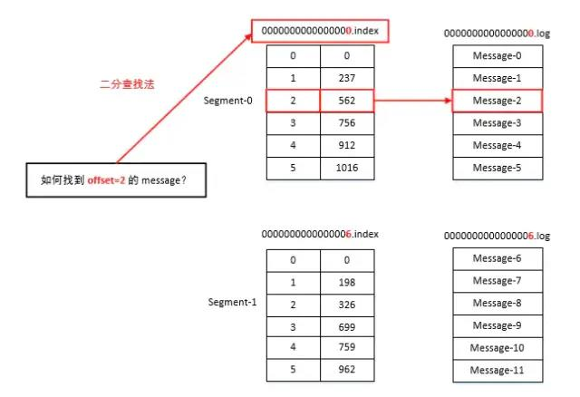
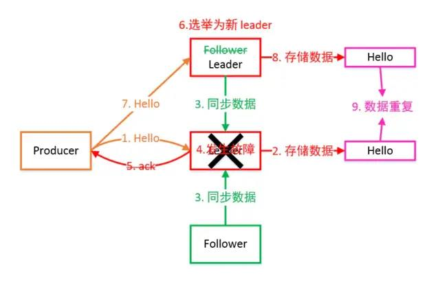

# Kafka架构原理

>最终大家会掌握 Kafka 中最重要的概念，分别是 Broker、Producer、Consumer、Consumer Group、Topic、Partition、Replica、Leader、Follower，这是学会和理解 Kafka 的基础和必备内容。

## 定义

Kafka 是一个分布式的基于发布/订阅模式的消息队列（Message Queue），主要应用与大数据实时处理领域。

### 消息队列

Kafka 本质上是一个 MQ（Message Queue），使用消息队列的好处？（面试会问）

* 解耦：允许我们独立的扩展或修改队列两边的处理过程。
* 可恢复性：即使一个处理消息的进程挂掉，加入队列中的消息仍然可以在系统恢复后被处理。
* 缓冲：有助于解决生产消息和消费消息的处理速度不一致的情况。
* 灵活性&峰值处理能力：不会因为突发的超负荷的请求而完全崩溃，消息队列能够使关键组件顶住突发的访问压力。
* 异步通信：消息队列允许用户把消息放入队列但不立即处理它。

### 发布/订阅模式


一对多，生产者将消息发布到 Topic 中，有多个消费者订阅该主题，发布到 Topic 的消息会被所有订阅者消费，被消费的数据不会立即从 Topic 清除。

## 架构


Kafka 存储的消息来自任意多被称为 Producer 生产者的进程。数据从而可以被发布到不同的 Topic 主题下的不同 Partition 分区。

在一个分区内，这些消息被索引并连同时间戳存储在一起。其它被称为 Consumer 消费者的进程可以从分区订阅消息。

Kafka 运行在一个由一台或多台服务器组成的集群上，并且分区可以跨集群结点分布。


下面给出 Kafka 一些重要概念，让大家对 Kafka 有个整体的认识和感知，后面还会详细的解析每一个概念的作用以及更深入的原理：

* Producer： 消息生产者，向 Kafka Broker 发消息的客户端。
* Consumer：消息消费者，从 Kafka Broker 取消息的客户端。
* Consumer Group：消费者组（CG），消费者组内每个消费者负责消费不同分区的数据，提高消费能力。一个分区只能由组内一个消费者消费，消费者组之间互不影响。所有的消费者都属于某个消费者组，即消费者组是逻辑上的一个订阅者。
* Broker：一台 Kafka 机器就是一个 Broker。一个集群由多个 Broker 组成。一个 Broker 可以容纳多个 Topic。
* Topic：可以理解为一个队列，Topic 将消息分类，生产者和消费者面向的是同一个 Topic。
* Partition：为了实现扩展性，提高并发能力，一个非常大的 Topic 可以分布到多个 Broker （即服务器）上，一个 Topic 可以分为多个 Partition，每个 Partition 是一个 有序的队列。
* Replica：副本，为实现备份的功能，保证集群中的某个节点发生故障时，该节点上的 Partition 数据不丢失，且 Kafka 仍然能够继续工作，Kafka 提供了副本机制，一个 Topic 的每个分区都有若干个副本，一个 Leader 和若干个 Follower。
* Leader：每个分区多个副本的“主”副本，生产者发送数据的对象，以及消费者消费数据的对象，都是 Leader。
* Follower：每个分区多个副本的“从”副本，实时从 Leader 中同步数据，保持和 Leader 数据的同步。Leader 发生故障时，某个 Follower 还会成为新的 Leader。
* Offset：消费者消费的位置信息，监控数据消费到什么位置，当消费者挂掉再重新恢复的时候，可以从消费位置继续消费。
* Zookeeper：Kafka 集群能够正常工作，需要依赖于 Zookeeper，Zookeeper 帮助 Kafka 存储和管理集群信息。

## 工作流程

Kafka集群将 Record 流存储在称为 Topic 的类别中，每个记录由一个键、一个值和一个时间戳组成。


> Kafka 是一个分布式流平台，这到底是什么意思？
  
  * 发布和订阅记录流，类似于消息队列或企业消息传递系统。
  * 以容错的持久方式存储记录流。
  * 处理记录流。

Kafka 中消息是以 Topic 进行分类的，生产者生产消息，消费者消费消息，面向的都是同一个 Topic。

Topic 是逻辑上的概念，而 Partition 是物理上的概念，每个 Partition 对应于一个 log 文件，该 log 文件中存储的就是 Producer 生产的数据。

Producer 生产的数据会不断追加到该 log 文件末端，且每条数据都有自己的 Offset。

消费者组中的每个消费者，都会实时记录自己消费到了哪个 Offset，以便出错恢复时，从上次的位置继续消费。

## 存储机制


由于生产者生产的消息会不断追加到 log 文件末尾，为防止 log 文件过大导致数据定位效率低下，Kafka 采取了分片和索引机制。

它将每个 Partition 分为多个 Segment，每个 Segment 对应两个文件：“.index” 索引文件和 “.log” 数据文件。

这些文件位于同一文件下，该文件夹的命名规则为：topic 名-分区号。例如，first 这个 topic 有三分分区，则其对应的文件夹为 first-0，first-1，first-2。

``` java
# ls /root/data/kafka/first-0        
00000000000000009014.index    
00000000000000009014.log
00000000000000009014.timeindex
00000000000000009014.snapshot   
leader-epoch-checkpoint
```
index 和 log 文件以当前 Segment 的第一条消息的 Offset 命名。下图为 index 文件和 log 文件的结构示意图：



“.index” 文件存储大量的索引信息，“.log” 文件存储大量的数据，索引文件中的元数据指向对应数据文件中 Message 的物理偏移量。

## 生产者

### 分区策略

>分区原因：

* 方便在集群中扩展，每个 Partition 可以通过调整以适应它所在的机器，而一个 Topic 又可以有多个 Partition 组成，因此可以以 Partition 为单位读写了。
* 可以提高并发，因此可以以 Partition 为单位读写了。

分区原则：我们需要将 Producer 发送的数据封装成一个 ProducerRecord 对象。

>该对象需要指定一些参数：

* topic：string 类型，NotNull。
* partition：int 类型，可选。
* timestamp：long 类型，可选。
* key：string 类型，可选。
* value：string 类型，可选。
* headers：array 类型，Nullable。

①指明 Partition 的情况下，直接将给定的 Value 作为 Partition 的值。

②没有指明 Partition 但有 Key 的情况下，将 Key 的 Hash 值与分区数取余得到 Partition 值。

③既没有 Partition 有没有 Key 的情况下，第一次调用时随机生成一个整数（后面每次调用都在这个整数上自增），将这个值与可用的分区数取余，得到 Partition 值，也就是常说的 Round-Robin 轮询算法。

### 数据可靠性保证

为保证 Producer 发送的数据，能可靠地发送到指定的 Topic，Topic 的每个 Partition 收到 Producer 发送的数据后，都需要向 Producer 发送 ACK（ACKnowledge 确认收到）。

如果 Producer 收到 ACK，就会进行下一轮的发送，否则重新发送数据。


①副本数据同步策略

何时发送 ACK？确保有 Follower 与 Leader 同步完成，Leader 再发送 ACK，这样才能保证 Leader 挂掉之后，能在 Follower 中选举出新的 Leader 而不丢数据。

多少个 Follower 同步完成后发送 ACK？全部 Follower 同步完成，再发送 ACK。


②ISR

采用第二种方案，所有 Follower 完成同步，Producer 才能继续发送数据，设想有一个 Follower 因为某种原因出现故障，那 Leader 就要一直等到它完成同步。

这个问题怎么解决？Leader维护了一个动态的 in-sync replica set（ISR）：和 Leader 保持同步的 Follower 集合。

当 ISR 集合中的 Follower 完成数据的同步之后，Leader 就会给 Follower 发送 ACK。

如果 Follower 长时间未向 Leader 同步数据，则该 Follower 将被踢出 ISR 集合，该时间阈值由 replica.lag.time.max.ms 参数设定。Leader 发生故障后，就会从 ISR 中选举出新的 Leader。

③ACK 应答机制

对于某些不太重要的数据，对数据的可靠性要求不是很高，能够容忍数据的少量丢失，所以没必要等 ISR 中的 Follower 全部接受成功。

所以 Kafka 为用户提供了三种可靠性级别，用户根据可靠性和延迟的要求进行权衡，选择以下的配置。



Ack 参数配置：
  * 0：Producer 不等待 Broker 的 ACK，这提供了最低延迟，Broker 一收到数据还没有写入磁盘就已经返回，当 Broker 故障时有可能丢失数据。
  * 1：Producer 等待 Broker 的 ACK，Partition 的 Leader 落盘成功后返回 ACK，如果在 Follower 同步成功之前 Leader 故障，那么将会丢失数据。
  * -1（all）：Producer 等待 Broker 的 ACK，Partition 的 Leader 和 Follower 全部落盘成功后才返回 ACK。但是在 Broker 发送 ACK 时，Leader 发生故障，则会造成数据重复。

④故障处理细节  


LEO：每个副本最大的 Offset。HW：消费者能见到的最大的 Offset，ISR 队列中最小的 LEO。

**Follower 故障**：Follower 发生故障后会被临时踢出 ISR 集合，待该 Follower 恢复后，Follower 会 读取本地磁盘记录的上次的 HW，并将 log 文件高于 HW 的部分截取掉，从 HW 开始向 Leader 进行同步数据操作。

等该 Follower 的 LEO 大于等于该 Partition 的 HW，即 Follower 追上 Leader 后，就可以重新加入 ISR 了。

**Leader 故障**：Leader 发生故障后，会从 ISR 中选出一个新的 Leader，之后，为保证多个副本之间的数据一致性，其余的 Follower 会先将各自的 log 文件高于 HW 的部分截掉，然后从新的 Leader 同步数据。

注意：这只能保证副本之间的数据一致性，并不能保证数据不丢失或者不重复。

### Exactly Once 语义

将服务器的 ACK 级别设置为 -1，可以保证 Producer 到 Server 之间不会丢失数据，即 At Least Once 语义。

相对的，将服务器 ACK 级别设置为 0，可以保证生产者每条消息只会被发送一次，即 At Most Once 语义。

At Least Once 可以保证数据不丢失，但是不能保证数据不重复；相对的，At Most Once 可以保证数据不重复，但是不能保证数据不丢失。

但是，对于一些非常重要的信息，比如交易数据，下游数据消费者要求数据既不重复也不丢失，即 Exactly Once 语义。

0.11 版本的 Kafka，引入了幂等性：Producer 不论向 Server 发送多少重复数据，Server 端都只会持久化一条。

即：

``` 
At Least Once + 幂等性 = Exactly Once   
```

要启用幂等性，只需要将 Producer 的参数中 enable.idompotence 设置为 true 即可。

开启幂等性的 Producer 在初始化时会被分配一个 PID，发往同一 Partition 的消息会附带 Sequence Number。

而 Borker 端会对 <PID,Partition,SeqNumber> 做缓存，当具有相同主键的消息提交时，Broker 只会持久化一条。

但是 PID 重启后就会变化，同时不同的 Partition 也具有不同主键，所以幂等性无法保证跨分区会话的 Exactly Once。

## 消费者

### 消费方式

Consumer 采用 Pull（拉取）模式从 Broker 中读取数据。

Consumer 采用 Push（推送）模式，Broker 给 Consumer 推送消息的速率是由 Broker 决定的，很难适应消费速率不同的消费者。

它的目标是尽可能以最快速度传递消息，但是这样很容易造成 Consumer 来不及处理消息，典型的表现就是拒绝服务以及网络拥塞。

而 Pull 模式则可以根据 Consumer 的消费能力以适当的速率消费消息。Pull 模式不足之处是，如果 Kafka 没有数据，消费者可能会陷入循环中，一直返回空数据。

因为消费者从 Broker 主动拉取数据，需要维护一个长轮询，针对这一点， Kafka 的消费者在消费数据时会传入一个时长参数 timeout。

如果当前没有数据可供消费，Consumer 会等待一段时间之后再返回，这段时长即为 timeout。

### 分区分配策略

一个 Consumer Group 中有多个 Consumer，一个 Topic 有多个 Partition，所以必然会涉及到 Partition 的分配问题，即确定哪个 Partition 由哪个 Consumer 来消费。

Kafka 有两种分配策略，一个是 RoundRobin，一个是 Range，默认为Range，当消费者组内消费者发生变化时，会触发分区分配策略（方法重新分配）。

①RoundRobin


RoundRobin 轮询方式将分区所有作为一个整体进行 Hash 排序，消费者组内分配分区个数最大差别为 1，是按照组来分的，可以解决多个消费者消费数据不均衡的问题。

但是，当消费者组内订阅不同主题时，可能造成消费混乱，如下图所示，Consumer0 订阅主题 A，Consumer1 订阅主题 B。


将 A、B 主题的分区排序后分配给消费者组，TopicB 分区中的数据可能分配到 Consumer0 中。

②Range


Range 方式是按照主题来分的，不会产生轮询方式的消费混乱问题。

但是，如下图所示，Consumer0、Consumer1 同时订阅了主题 A 和 B，可能造成消息分配不对等问题，当消费者组内订阅的主题越多，分区分配可能越不均衡。


### Offset 的维护

由于 Consumer 在消费过程中可能会出现断电宕机等故障，Consumer 恢复后，需要从故障前的位置继续消费。

所以 Consumer 需要实时记录自己消费到了哪个 Offset，以便故障恢复后继续消费。

Kafka 0.9 版本之前，Consumer 默认将 Offset 保存在 Zookeeper 中，从 0.9 版本开始，Consumer 默认将 Offset 保存在 Kafka 一个内置的 Topic 中，该 Topic 为 __consumer_offsets。

## 总结

上面和大家一起深入探讨了 Kafka 的架构，比较偏重理论和基础，这是掌握 Kafka 的必要内容，接下来我会以代码和实例的方式，更新 Kafka 有关 API 以及事务、拦截器、监控等高级篇，让大家彻底理解并且会用 Kafka。
