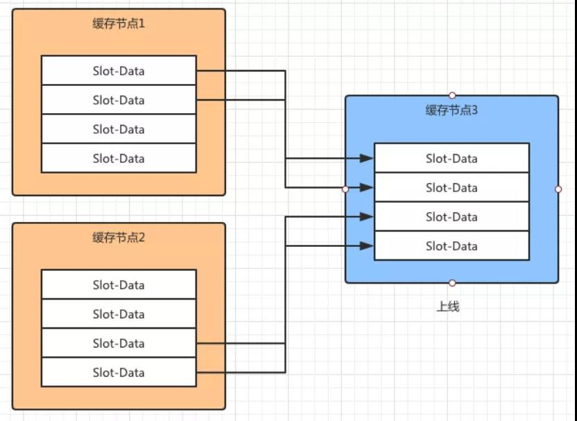
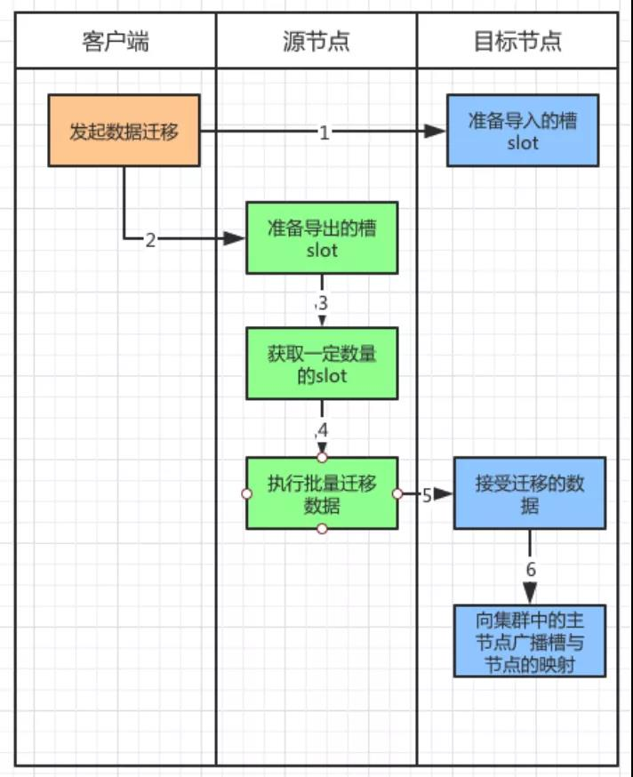

# Redis Cluster 原理

>Redis 缓存作为使用最多的缓存工具被各大厂商争相使用。通常我们会使用单体的 Redis 应用作为缓存服务，为了保证其高可用还会使用主从模式（Master-Slave），又或者是读写分离的设计。但是当缓存数据量增加以后，无法用单体服务器承载缓存服务时，就需要对缓存服务进行扩展。
将需要缓存的数据切分成不同的分区，将数据分区放到不同的服务器中，用分布式的缓存来承载高并发的缓存访问。恰好 Redis Cluster 方案刚好支持这部分功能。

今天就来一起看看 Redis Cluster 的核心原理和实践：
* Redis Cluster 实现数据分区
* 分布式缓存节点之间的通讯
* 请求分布式缓存的路由
* 缓存节点的扩展和收缩
* 故障发现和恢复

## Redis Cluster 实现数据分区

正如开篇中提到的，分布式数据库要解决的就是将整块数据，按照规则分配到多个缓存节点，解决的是单个缓存节点处理数量大的问题。

如果要将这些数据进行拆分，并且存放必须有一个算法。例如：哈希算法和哈希一致性算法，这些比较经典的算法。

Redis Cluster 则采用的是虚拟槽分区算法。其中提到了槽（Slot）的概念。这个槽是用来存放缓存信息的单位，在 Redis 中将存储空间分成了 16384 个槽，也就是说 Redis Cluster 槽的范围是 0 -16383（2^4 * 2^10）。

缓存信息通常是用 Key-Value 的方式来存放的，在存储信息的时候，集群会对 Key 进行 CRC16 校验并对 16384 取模（slot = CRC16(key)%16383）。

得到的结果就是 Key-Value 所放入的槽，从而实现自动分割数据到不同的节点上。然后再将这些槽分配到不同的缓存节点中保存。


如图 1 (Redis 集群中的数据分片)所示，假设有三个缓存节点分别是 1、2、3。Redis Cluster 将存放缓存数据的槽（Slot）分别放入这三个节点中：

* 缓存节点 1 存放的是（0-5000）Slot 的数据。
* 缓存节点 2 存放的是（5001-10000）Slot 的数据。
* 缓存节点 3 存放的是（10000-16383）Slot 的数据。

此时 Redis Client 需要根据一个 Key 获取对应的 Value 的数据，首先通过 CRC16(key)%16383 计算出 Slot 的值，假设计算的结果是 5002。

将这个数据传送给 Redis Cluster，集群接受到以后会到一个对照表中查找这个 Slot=5002 属于那个缓存节点。

发现属于“缓存节点 2”，于是顺着红线的方向调用缓存节点 2 中存放的 Key-Value 的内容并且返回给 Redis Client。

## 分布式缓存节点之间的通讯

如果说 Redis Cluster 的虚拟槽算法解决的是数据拆分和存放的问题，那么存放缓存数据的节点之间是如何通讯的，就是接下来我们要讨论的。

缓存节点中存放着缓存的数据，在 Redis Cluster 的分布式部署下，缓存节点会被分配到一台或者多台服务器上。


图 2：新上线的缓存节点 2 和缓存节点 1 进行通讯

缓存节点的数目也有可能根据缓存数据量和支持的并发进行扩展。如图 2 所示，假设 Redis Cluster 中存在“缓存节点 1”，此时由于业务扩展新增了“缓存节点 2”。

新加入的节点会通过 Gossip 协议向老节点，发出一个“Meet 消息”。收到消息以后“缓存节点 1”，会礼貌地回复一个“Pong 消息”。

此后“缓存节点 2”会定期发送给“缓存节点 1” 一个“Ping 消息”，同样的“缓存节点 1”每次都会回复“Pong 消息”。

上面这个例子说明了，在 Redis Cluster 中缓存节点之间是通过 Gossip 协议进行通讯的。

其实节点之间通讯的目的是为了维护节点之间的元数据信息。这个元数据就是每个节点包含哪些数据，是否出现故障。

节点之间通过 Gossip 协议不断相互交互这些信息，就好像一群人在一起八卦一样，没有多久每个节点就知道其他所有节点的情况了，这个情况就是节点的元数据。

整个传输过程大致分为以下几点：
* Redis Cluster 的每个缓存节点都会开通一个独立的 TCP 通道，用于和其他节点通讯。
* 有一个节点定时任务，每隔一段时间会从系统中选出“发送节点”。这个“发送节点”按照一定频率，例如：每秒 5 次，随机向最久没有通讯的节点发起 Ping 消息。
* 接受到 Ping 消息的节点会使用 Pong 消息向“发送节点”进行回复。

不断重复上面行为，让所有节点保持通讯。他们之间通讯是通过 Gossip 协议实现的。

从类型上来说其分为了四种，分别是：

* Meet 消息，用于通知新节点加入。就好像上面例子中提到的新节点上线会给老节点发送 Meet 消息，表示有“新成员”加入。
* Ping 消息，这个消息使用得最为频繁，该消息中封装了自身节点和其他节点的状态数据，有规律地发给其他节点。
* Pong 消息，在接受到 Meet 和 Ping 消息以后，也将自己的数据状态发给对方。同时也可以对集群中所有的节点发起广播，告知大家的自身状态。
* Fail 消息，如果一个节点下线或者挂掉了，会向集群中广播这个消息。


图 3：Gossip 协议结构

Gossip 协议的结构如图 3 所示，有其中 type 定义了消息的类型，例如：Meet、Ping、Pong、Fail 等消息。

另外有一个 myslots 的数组定义了节点负责的槽信息。每个节点发送 Gossip 协议给其他节点最重要的就是将该信息告诉其他节点。另外，消息体通过 clusterMsgData 对象传递消息征文。

## 请求分布式缓存的路由

对内，分布式缓存的节点通过 Gossip 协议互相发送消息，为了保证节点之间了解对方的情况。

那么对外来说，一个 Redis 客户端如何通过分布式节点获取缓存数据，就是分布式缓存路由要解决的问题了。

上文提到了 Gossip 协议会将每个节点管理的槽信息发送给其他节点，其中用到了 unsigned char myslots[CLUSTER_SLOTS/8] 这样一个数组存放每个节点的槽信息。

myslots 属性是一个二进制位数组（bit array），其中 CLUSTER_SLOTS 为 16384。

这个数组的长度为 16384/8=2048 个字节，由于每个字节包含 8 个 bit 位（二进制位），所以共包含 16384 个 bit，也就是 16384 个二进制位。

每个节点用 bit 来标识自己是否拥有某个槽的数据。如图 4 所示，假设这个图表示节点 A 所管理槽的情况。


图 4：通过二进制数组存放槽信息

0、1、2 三个数组下标就表示 0、1、2 三个槽，如果对应的二进制值是 1，表示该节点负责存放 0、1、2 三个槽的数据。同理，后面的数组下标位 0 就表示该节点不负责存放对应槽的数据。

用二进制存放的优点是，判断的效率高，例如对于编号为 1 的槽，节点只要判断序列的第二位，时间复杂度为 O（1）。


图 5：接受节点把节点槽的对应信息保存在本地

如图 5 所示，当收到发送节点的节点槽信息以后，接受节点会将这些信息保存到本地的 clusterState 的结构中，其中 Slots 的数组就是存放每个槽对应哪些节点信息。


图 6：ClusterStatus 结构以及槽与节点的对应

如图 6 所示，ClusterState 中保存的 Slots 数组中每个下标对应一个槽，每个槽信息中对应一个 clusterNode 也就是缓存的节点。

这些节点会对应一个实际存在的 Redis 缓存服务，包括 IP 和 Port 的信息。

Redis Cluster 的通讯机制实际上保证了每个节点都有其他节点和槽数据的对应关系。

Redis 的客户端无论访问集群中的哪个节点都可以路由到对应的节点上，因为每个节点都有一份 ClusterState，它记录了所有槽和节点的对应关系。

下面来看看 Redis 客户端是如何通过路由来调用缓存节点的：


图 7：MOVED 重定向请求

如图 7 所示，Redis 客户端通过 CRC16(key)%16383 计算出 Slot 的值，发现需要找“缓存节点 1”读/写数据，但是由于缓存数据迁移或者其他原因导致这个对应的 Slot 的数据被迁移到了“缓存节点 2”上面。

那么这个时候 Redis 客户端就无法从“缓存节点 1”中获取数据了。

但是由于“缓存节点 1”中保存了所有集群中缓存节点的信息，因此它知道这个 Slot 的数据在“缓存节点 2”中保存，因此向 Redis 客户端发送了一个 MOVED 的重定向请求。

这个请求告诉其应该访问的“缓存节点 2”的地址。Redis 客户端拿到这个地址，继续访问“缓存节点 2”并且拿到数据。

上面的例子说明了，数据 Slot 从“缓存节点 1”已经迁移到“缓存节点 2”了，那么客户端可以直接找“缓存节点 2”要数据。

那么如果两个缓存节点正在做节点的数据迁移，此时客户端请求会如何处理呢？


图 8：ASK 重定向请求

如图 8 所示，Redis 客户端向“缓存节点 1”发出请求，此时“缓存节点 1”正向“缓存节点 2”迁移数据，如果没有命中对应的 Slot，它会返回客户端一个 ASK 重定向请求并且告诉“缓存节点 2”的地址。

客户端向“缓存节点 2”发送 Asking 命令，询问需要的数据是否在“缓存节点 2”上，“缓存节点 2”接到消息以后返回数据是否存在的结果。

## 缓存节点的扩展和收缩

作为分布式部署的缓存节点总会遇到缓存扩容和缓存故障的问题。这就会导致缓存节点的上线和下线的问题。

由于每个节点中保存着槽数据，因此当缓存节点数出现变动时，这些槽数据会根据对应的虚拟槽算法被迁移到其他的缓存节点上。



图 9：分布式缓存扩容

如图 9 所示，集群中本来存在“缓存节点 1”和“缓存节点 2”，此时“缓存节点 3”上线了并且加入到集群中。

此时根据虚拟槽的算法，“缓存节点 1”和“缓存节点 2”中对应槽的数据会应该新节点的加入被迁移到“缓存节点 3”上面。

针对节点扩容，新建立的节点需要运行在集群模式下，因此新建节点的配置最好与集群内其他节点配置保持一致。

新节点加入到集群的时候，作为孤儿节点是没有和其他节点进行通讯的。因此，其会采用 cluster meet 命令加入到集群中。

在集群中任意节点执行 cluster meet 命令让新节点加入进来。假设新节点是 192.168.1.1 5002，老节点是 192.168.1.1 5003，那么运行以下命令将新节点加入到集群中。

```
192.168.1.1 5003> cluster meet 192.168.1.1 5002
```

这个是由老节点发起的，有点老成员欢迎新成员加入的意思。新节点刚刚建立没有建立槽对应的数据，也就是说没有缓存任何数据。

如果这个节点是主节点，需要对其进行槽数据的扩容；如果这个节点是从节点，就需要同步主节点上的数据。总之就是要同步数据。



图 10：节点迁移槽数据的过程

如图 10 所示，由客户端发起节点之间的槽数据迁移，数据从源节点往目标节点迁移：

* 客户端对目标节点发起准备导入槽数据的命令，让目标节点准备好导入槽数据。这里使用 cluster setslot {slot} importing {sourceNodeId} 命令。
* 之后对源节点发起送命令，让源节点准备迁出对应的槽数据。使用命令 cluster setslot {slot} importing {sourceNodeId}。
* 此时源节点准备迁移数据了，在迁移之前把要迁移的数据获取出来。通过命令 cluster getkeysinslot {slot} {count}。Count 表示迁移的 Slot 的个数。
* 然后在源节点上执行，migrate {targetIP} {targetPort} “” 0 {timeout} keys{keys} 命令，把获取的键通过流水线批量迁移到目标节点。
* 重复 3 和 4 两步不断将数据迁移到目标节点。目标节点获取迁移的数据。
* 完成数据迁移以后目标节点，通过 cluster setslot {slot} node {targetNodeId} 命令通知对应的槽被分配到目标节点，并且广播这个信息给全网的其他主节点，更新自身的槽节点对应表。

既然有缓存服务器的上线操作，那么也有下线的操作。下线操作正好和上线操作相反，将要下线缓存节点的槽数据分配到其他的缓存主节点中。

迁移的过程也与上线操作类似，不同的是下线的时候需要通知全网的其他节点忘记自己，此时通过命令 cluster forget{downNodeId} 通知其他的节点。

当节点收到 forget 命令以后会将这个下线节点放到仅用列表中，那么之后就不用再向这个节点发送 Gossip 的 Ping 消息了。

不过这个仅用表的超时时间是 60 秒，超过了这个时间，依旧还会对这个节点发起 Ping 消息。

不过可以使用 redis-trib.rb del-node{host:port} {donwNodeId} 命令帮助我们完成下线操作。

尤其是下线的节点是主节点的情况下，会安排对应的从节点接替主节点的位置。

## 故障发现和恢复

前面在谈到缓存节点扩展和收缩是提到，缓存节点收缩时会有一个下线的动作。

有些时候是为了节约资源，或者是计划性的下线，但更多时候是节点出现了故障导致下线。


针对下线故障来说有两种下线的确定方式：

**主观下线**：当节点 1 向节点 2 例行发送 Ping 消息的时候，如果节点 2 正常工作就会返回 Pong 消息，同时会记录节点 1 的相关信息。

同时接受到 Pong 消息以后节点 1 也会更新最近一次与节点 2 通讯的时间。

如果此时两个节点由于某种原因断开连接，过一段时间以后节点 1 还会主动连接节点 2，如果一直通讯失败，节点 1 中就无法更新与节点 2 最后通讯时间了。

此时节点 1 的定时任务检测到与节点 2 最好通讯的时间超过了 cluster-node-timeout 的时候，就会更新本地节点状态，把节点 2 更新为主观下线。

这里的 cluster-node-timeout 是节点挂掉被发现的超时时间，如果超过这个时间还没有获得节点返回的 Pong 消息就认为该节点挂掉了。

这里的主观下线指的是，节点 1 主观的认为节点 2 没有返回 Pong 消息，因此认为节点 2 下线。

只是节点 1 的主观认为，有可能是节点 1 与节点 2 之间的网络断开了，但是其他的节点依旧可以和节点 2 进行通讯，因此主观下线并不能代表某个节点真的下线了。


**客观下线**：由于 Redis Cluster 的节点不断地与集群内的节点进行通讯，下线信息也会通过 Gossip 消息传遍所有节点。

因此集群内的节点会不断收到下线报告，当半数以上持有槽的主节点标记了某个节点是主观下线时，便会触发客观下线的流程。

也就是说当集群内的半数以上的主节点，认为某个节点主观下线了，才会启动这个流程。

这个流程有一个前提，就是直针对主节点，如果是从节点就会忽略。也就是说集群中的节点每次接受到其他节点的主观下线是都会做以下的事情。

将主观下线的报告保存到本地的 ClusterNode 的结构中，并且针对主观下线报告的时效性进行检查，如果超过 cluster-node-timeout*2 的时间，就忽略这个报告。

否则就记录报告内容，并且比较被标记下线的主观节点的报告数量大于等于持有槽的主节点数量的时候，将其标记为客观下线。

同时向集群中广播一条 Fail 消息，通知所有的节点将故障节点标记为客观下线，这个消息指包含故障节点的 ID。

此后，群内所有的节点都会标记这个节点为客观下线，通知故障节点的从节点出发故障转移的流程，也就是故障的恢复。

说白了，客观下线就是整个集群中有一半的节点都认为某节点主观下线了，那么这个节点就被标记为客观下线了。

如果某个主节点被认为客观下线了，那么需要从它的从节点中选出一个节点替代主节点的位置。

此时下线主节点的所有从节点都担负着恢复义务，这些从节点会定时监测主节点是否下线。

一旦发现下线会走如下的恢复流程：

①资格检查，每个节点都会检查与主节点断开的时间。如果这个时间超过了 cluster-node-timeout*cluster-slave-validity-factor（从节点有效因子，默认为 10），那么就没有故障转移的资格。

也就是说这个从节点和主节点断开的太久了，很久没有同步主节点的数据了，不适合成为新的主节点，因为成为主节点以后其他的从节点回同步自己的数据。

②触发选举，通过了上面资格的从节点都可以触发选举。但是出发选举是有先后顺序的，这里按照复制偏移量的大小来判断。

这个偏移量记录了执行命令的字节数。主服务器每次向从服务器传播 N 个字节时就会将自己的复制偏移量+N，从服务在接收到主服务器传送来的 N 个字节的命令时，就将自己的复制偏移量+N。

复制偏移量越大说明从节点延迟越低，也就是该从节点和主节点沟通更加频繁，该从节点上面的数据也会更新一些，因此复制偏移量大的从节点会率先发起选举。

③发起选举，首先每个主节点会去更新配置纪元（clusterNode.configEpoch），这个值是不断增加的整数。

在节点进行 Ping/Pong 消息交互式也会更新这个值，它们都会将最大的值更新到自己的配置纪元中。

这个值记录了每个节点的版本和整个集群的版本。每当发生重要事情的时候，例如：出现新节点，从节点精选。都会增加全局的配置纪元并且赋给相关的主节点，用来记录这个事件。

说白了更新这个值目的是，保证所有主节点对这件“大事”保持一致。大家都统一成一个配置纪元（一个整数），表示大家都知道这个“大事”了。

更新完配置纪元以后，会想群内发起广播选举的消息（FAILOVER_AUTH_REQUEST）。并且保证每个从节点在一次配置纪元中只能发起一次选举。

④投票选举，参与投票的只有主节点，从节点没有投票权，超过半数的主节点通过某一个节点成为新的主节点时投票完成。

如果在 cluster-node-timeout*2 的时间内从节点没有获得足够数量的票数，本次选举作废，进行第二轮选举。

这里每个候选的从节点会收到其他主节点投的票。在第2步领先的从节点通常此时会获得更多的票，因为它触发选举的时间更早一些。

获得票的机会更大，也是由于它和原主节点延迟少，理论上数据会更加新一点。

⑤当满足投票条件的从节点被选出来以后，会触发替换主节点的操作。新的主节点别选出以后，删除原主节点负责的槽数据，把这些槽数据添加到自己节点上。

并且广播让其他的节点都知道这件事情，新的主节点诞生了。

## 总结

本文通过 Redis Cluster 提供了分布式缓存的方案为出发点，针对此方案中缓存节点的分区方式进行了描述。

虚拟槽的分区算法，将整块数据分配到了不同的缓存节点，通过 Slot 和 Node 的对应关系让数据找到节点的位置。

对于分布式部署的节点，需要通过 Gossip 协议进行 Ping、Pong、Meet、Fail 的通讯，达到互通有无的目的。

当客户端调用缓存节点数据的时候通过 MOVED 和 ASKED 重定向请求找到正确的缓存节点。

并且介绍了在缓存扩容和收缩时需要注意的处理流程，以及数据迁移的方式。

最后，讲述如何发现故障（主观下线和客观下线）以及如何恢复故障（选举节点）的处理流程。
