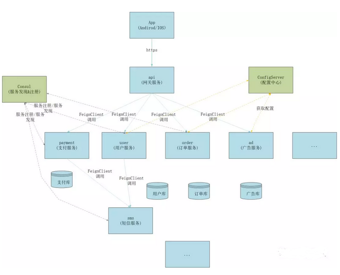
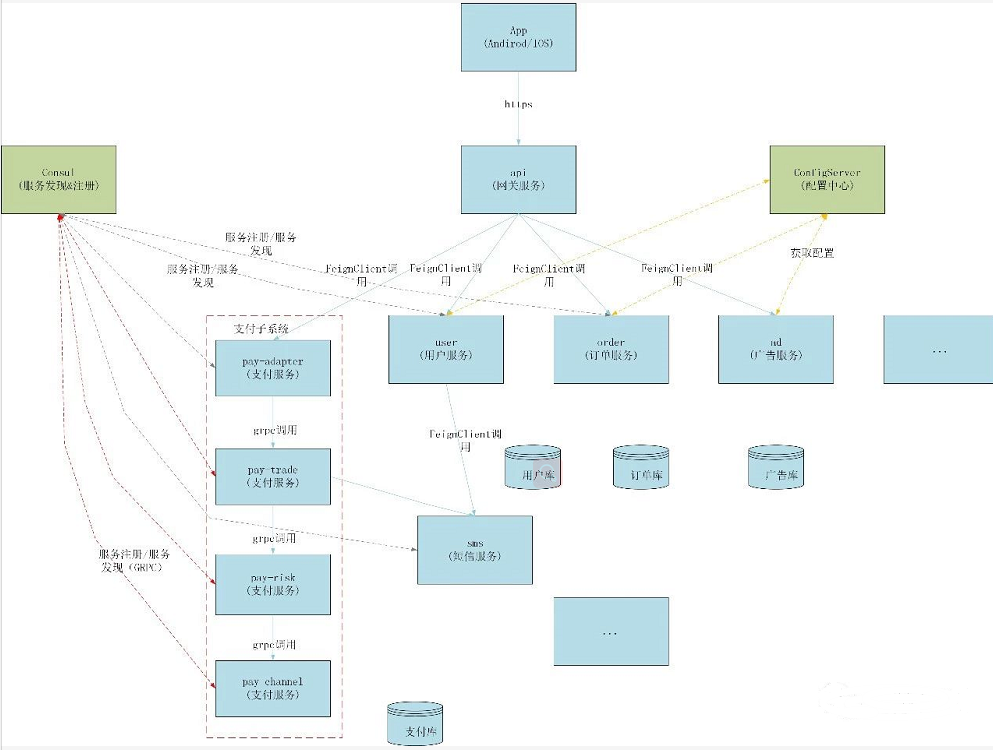
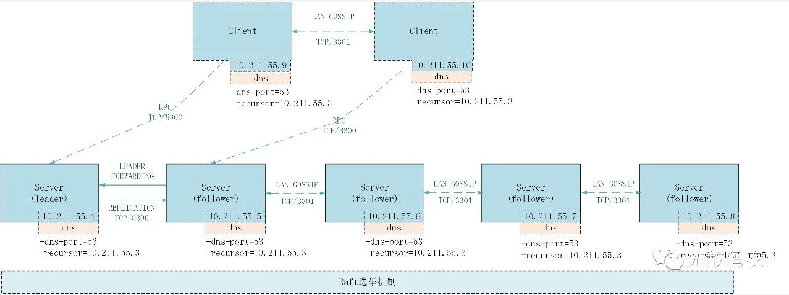

# 基于SpringCloud的微服务架构演变史？
## 导读
一段时期以来 “微服务架构 ”一直是一个热门词汇，各种技术类公众号或架构分享会议上，关于微服务架构的讨论和主题也都非常多。对于大部分初创互联网公司来说，早期的单体应用结构才是最合适的选择，只有当业务进入快速发展期，在系统压力、业务复杂度以及人员扩展速度都快速上升的情况下，如何快速、稳妥有序的将整个互联网软件系统升级成微服务架构，以满足业务发展需要及技术组织的重新塑造，才是进行微服务架构的最主要的动力，否则空谈微服务架构是没有意义的。

而一旦决定将整个应用体系按照微服务架构体系进行升级，就需要有组织有计划的进行业务系统、基础架构、运维体系等多个方面的升级配套。而另一个比较尴尬的现实是，一般业务发展进入到需要进行微服务架构层面的时候，业务发展往往又都是非常迅猛的，这种业务快速发展和增长的压力往往又会给整个技术团队带来非常大的挑战，因为此时你需要取舍，是简单方案快速支撑呢？还是选择适当长远一点的方案？当然这种情况大部分是技术细节方面的问题，掌控的“度”大部分情况是掌握在具体的工程师手中。

而如何整体上确保应用体系及组织结构向微服务时代快速、有序的跨越，是一件十分考验团队能力以及架构管理水平的事。能做到80分已然算优秀了，因为这是有其客观规律的！

作者自身亲历了一个快速发展的互联网公司从单体应用～以SpringCloud为技术栈的微服务架构体系的全过程。本文将主要从技术角度与大家探讨如何利用SpringCloud进行微服务架构拆分，以及在这个过程中一点自己的思考。水平有限，不足之处还请包涵！
## 系统架构演变概述
在公司业务初创时期，面对的主要问题是如何将一个想法变成实际的软件实现，在这个时候整个软件系统的架构并没有搞得那么复杂，为了快速迭代，整个软件系统就是由“App+后台服务”组成，而后台服务也只是从工程角度将应用进行Jar包的拆分。此时软件系统架构如下：
                
App(Andriod/IOS)-(http)->api(JVM进程)-(reference)->service(jar)


而此时整个软件系统的功能也比较简单，只有基本的用户、订单、支付等功能，并且由于业务流程没有那么复杂，这些功能基本耦合在一起。而随着App的受欢迎程度（作者所在的公司正好处于互联网热点），所以App下载量在2017年迅猛增长，在线注册人数此时也是蹭蹭往上涨。

随着流量的迅猛增长，此时整个后台服务的压力变得非常大，为了抗住压力只能不断的加机器，平行扩展后台服务节点。此时的部署架构如下：


通过这种方式，整个软件系统抗住了一波压力，然而系统往往还是会偶尔出点事故，特别是因为api中的某个接口性能问题导致整个服务不可用，因为这些接口都在一个JVM进程中，虽然此时部署了多个节点，但因为底层数据库、缓存系统都是一套，所以还是会出现一挂全挂的情况。

另一方面，随着业务的快速发展，以往相对简单的功能变得复杂起来，这些功能除了有用户看得见的、也会包括很多用户看不见的，就好像百度搜索，用户能看见的可能只是一个搜索框，但是实际上后台对应的服务可能是成百上千，如有些增长策略相关的功能：红包、分享拉新等。还有些如广告推荐相关的变现功能等。

此外，流量/业务的增长也意味着团队人数的迅速增长，如果此时大家开发各自的业务功能还是用一套服务代码，很难想象百十来号人，在同一个工程在叠加功能会是一个什么样的场景。所以如何划分业务边界、合理的进行团队配置也是一件十分迫切的事情了！

为了解决上述问题，适应业务、团队发展，架构团队决定进行微服务拆分。而要实施微服务架构，除了需要合理的划分业务模块边界外，也需要一整套完整的技术解决方案。

在技术方案的选择上，服务拆分治理的框架也是有很多，早期的有如WebService，近期的则有各种Rpc框架（如Dubbo、Thirft、Grpc）。而Spring Cloud则是基于Springboot提供的一整套微服务解决方案，因为技术栈比较新，并且各类组件的支撑也非常全面，所以Spring Cloud就成为了首选。

经过一系列的重构+扩展，整个系统架构最终形成了以app为中心的一套微服务软件系统，结构如下：

到这里，整个软件系统就基于SpringCloud初步完成了微服务体系的拆分。支付、订单、用户、广告等核心功能抽离成独立的微服务，与此同时各自微服务对应的数据库也按照服务边界进行了拆分。

在完成服务的拆分以后，原来功能逻辑之间的代码调用关系，转换成了服务间网络的调用关系，而各个微服务需要根据各自所承载的功能提供相应的服务，此时服务如何被其他服务发现并调用，就成了整个微服务体系中比较关键的部分，使用过Dubbo框架的同学知道，在Dubbo中服务的注册&发现是依赖于Zookeeper实现的，而在SpringCloud中我们是通过Consul来实现。另外在基于SpringCloud的架构体系中，提供了配置中心（ConfigServer）来帮助各个微服务管理配置文件，而原本的api服务，随着各个功能的抽离，逐步演变成前置网关服务了。

聊到这里，基于SpringCloud我们进行了微服务拆分，而在这个体系结构中，分别提到了Consul、ConfigServer、网关服务这几个关键组件，那么这几个关键组件具体是如何支撑这个庞大的服务体系的呢？

## SpringCloud关键组件

### Consul

Consul是一个开源的，使用go语言开发的注册中心服务。它里面内置了服务发现与注册框架、分布一致性协议实现、健康检查、Key/Value存储、多数据中心等多个方案。在SpringCloud框架中还可以选择Eurke作为注册中心，这里之所以选择Consul主要原因在于Consul对异构的服务的支持,如：grpc服务。

事实上，在后续的系统架构演进中，在某些服务模块进一步向子系统化拆分的过程中，就采用了grpc作为子系统服务间的调用方式。例如，支付模块的继续扩张，对支付服务本身又进行了微服务架构的拆分，此时支付微服务内部就采用了grpc的方式进行调用，而服务注册与发现本身则还是依赖于同一套Consul集群。

#### gRPC是什么:

gRPC是一个高性能、开源和通用的RPC框架，面向移动和HTTP/2设计。
目前提供C、Java和Go语言版本，分别是grpc、grpc-java、grpc-go。
gRPC基于HTTP/2标准设计，带来诸如双向流、流控、头部压缩、单TCP连接上的多复用请求等特性。
这些特性使得其在移动设备上表现更好，更省电和节省空间占用。
gRPC由google开发，是一款语言中立、平台中立、开源的远程过程调用系统。

在gRPC里客户端应用可以像调用本地对象一样直接调用另一台不同机器上服务端应用的方法，
使得你能够更容易地创建分布式应用和服务。与许多RPC系统类似，gRPC也是基于以下理念：
定义一个服务，指定其能够被远程调用的方法（包括参数和返回类型）。
在服务端实现这个接口，并运行一个gRPC服务器来处理客户端调用。
在客户端拥有一个存根能够像服务端一样的方法。

此时的系统架构演进如下：



原有微服务架构中的模块服务在规模达到一定程度或复杂性达到一定程度后，都会朝着独立的体系发展，从而将整个微服务的调用链路变的非常长，而从Consul的角度看，所有的服务又都是扁平的。

随着微服务规模的越来越大，Consul作为整个体系的核心服务组件，在整个体系中处于关键的位置，一旦Consul挂掉，所有的服务都将停止服务。那么Consul到底是什么样服务？其容灾机制又该如何设计呢？

要保证Consul服务的高可用，在生产环境Consul应该是一个集群（关于Consul集群的安装与配置可以参考网络资料），这是毫无疑问的。而在Consul集群中，存在两种角色：Server、Client，这两种角色与Consul集群上运行的应用服务并没有什么关系，只是基于Consul层面的一种角色划分。实际上，维持整个Consul集群状态信息的还是Server节点，与Dubbo中使用Zookeeper实现注册中心一样，Consul集群中的各个Server节点也需要通过选举的方式（使用GOSSIP协议、Raft一致性算法，这里不做详细展开，在后面的文章中可以和大家单独讨论）来选举整个集群中的Leader节点来负责处理所有查询和事务，并向其他节点同步状态信息。

而Client角色则是相对无状态的，只是简单的代理转发RPC请求到Server节点，之所以存在Client节点主要是分担Server节点的压力，作一层缓冲而已，这主要是因为Server节点的数量不宜过多，因为Server节点越多也就意味着达成共识的过程越慢，节点间同步的代价也就越高。对于Server节点，一般建议3-5台，而Client节点则没有数量的限制，可以根据实际情况部署数千或数万台。事实上，这也只是一种策略，在现实的生产环境中，大部分应用只需要设置3～5台Server节点就够了，作者所在的公司一套生产集群中的Consul集群的节点配置就是5个Server节点，并没有额外再设置Client节点。

另外，在Consul集群中还有一个概念是Agent，事实上每个Server或Client都是一个consul agent，它是运行在Consul集群中每个成员上的一个守护进程，主要的作用是运行DNS或HTTP接口，并负责运行时检查和保持服务信息同步。我们在启动Consul集群的节点（Server或Client）时，都是通过consul agent的方式启动的。例如：

```shell
consul agent -server -bootstrap -syslog \
    -ui \
    -data-dir=/opt/consul/data \
    -dns-port=53
    -recursor=10.211.55.3
    -config-dir=/opt/consul/conf \
    -pid-file=/opt/consul/run/consul.pid \
    -client=10.211.55.4 \
    -bind=10.211.55.4 \
    -node=consul-server01 \
    -disable-host-node-id &
```
以实际的生产环境为例，Consul集群的部署结构示意图如下：



实际生产案例中并没有设置Client节点，而是通过5个Consul Server节点组成的集群，来服务整套生产集群的应用注册&发现。这里有细节需要了解下，实际上5个Consul Server节点的IP地址是不一样的，具体的服务在连接Consul集群进行服务注册与查询时应该连接Leader节点的IP，而问题是，如果Leader节点挂掉了，相应的应用服务节点，此时如何连接通过Raft选举产生的新Leader节点呢？难道手工切换IP不成？

显然手工切换IP的方式并不靠谱，而在生产实践中，Consul集群的各个节点实际上是在Consul Agent上运行DNS（如启动参数中红色字体部分），应用服务在连接Consul集群时的IP地址为DNS的IP，DNS会将地址解析映射到Leader节点对应的IP上，如果Leader节点挂掉，选举产生的新Leader节点会将自己的IP通知DNS服务，DNS更新映射关系，这一过程对各应用服务则是透明的。

通过以上分析，Consul是通过集群设计、Raft选举算法，Gossip协议等机制来确保Consul服务的稳定与高可用的。如果需要更高的容灾级别，也可以通过设计双数据中心的方式，来异地搭建两个Consul数据中心，组成一个异地灾备Consul服务集群，只是这样成本会更高，这就看具体是否真的需要了。

## onfigServer(配置中心)

配置中心是对微服务应用配置进行管理的服务，例如数据库的配置、某些外部接口地址的配置等等。在SpringCloud中ConfigServer是独立的服务组件，它与Consul一样也是整个微服务体系中比较关键的一个组件，所有的微服务应用都需要通过调用其服务，从而获取应用所需的配置信息。

随着微服务应用规模的扩大，整个ConfigServer节点的访问压力也会逐步增加，与此同时，各个微服务的各类配置也会越来越多，如何管理好这些配置文件以及它们的更新策略（确保不因生产配置随意改动而造成线上故障风险），以及搭建高可用的ConfigServer集群，也是确保微服务体系稳定很重要的一个方面。

在生产实践中，因为像Consul、ConfigServer这样的关键组件，需要搭建独立的集群，并且部署在物理机而不是容器里。在上一节介绍Consul的时候，我们是独立搭建了5个Consul Server节点。而ConfigServer因为主要是http配置文件访问服务，不涉及节点选举、一致性同步这样的操作，所以还是按照传统的方式搭建高可用配置中心。具体结构示意图如下：


我们可以单独通过git来管理应用配置文件，正常来说由ConfigSeever直接通过网络拉取git仓库的配置供服务获取就可以了，这样只要git仓库配置更新，配置中心就能立刻感知到。但是这样做的不稳定之处，就在于git本身是内网开发用的代码管理工具，如果让线上实时服务直接读取，很容易将git仓库拉挂了，所以，我们在实际的运维过程中，是通过git进行配置文件的版本控制，区分线上分支/master与功能开发分支/feature，并且在完成mr后还需要手工（通过发布平台触发）同步一遍配置，过程是将新的master分支的配置同步一份到各个configserver节点所在主机的本地路径，这样configserver服务节点就可以通过其本地目录获取配置文件，而不用多次调用网络获取配置文件了。

而另一方面，随着微服务越来越多，git仓库中的配置文件数量也会越来越多。为了便于配置的管理，我们需要按照一定的组织方式来组织不同应用类型的配置。在早期所有的应用因为没有分类，所以导致上百个微服务的配置文件放在一个仓库目录，这样一来导致配置文件管理成本增加，另外一方面也会影响ConfigServer的性能，因为某个微服务用不到的配置也会被ConfigServer加载。

所以后期的实践是，按照配置的层次关系进行组织，将公司全局的项目配置抽象到顶层，由ConfigServer默认加载，而其他所有的微服务则按照应用类型进行分组（通过git项目空间的方式分组），相同的应用放在一个组，然后这个组下单独设立一个名为config的git仓库来存放这个组下相关微服务的配置文件。层次结构如下：


这样应用加载配置的优先级就是“本地配置->common配置->组公共配置->项目配置”这样的顺序。例如某服务A，在项目工程的默认配置文件（“bootstrap.yml/application.yml”）中配置了参数A，同时也在本地项目配置“application-production.yml”配置了参数B，而与此同时，ConfigServer中的common仓库下的配置文件“application.yml／application-production.yml”又分别存在参数C、参数D，同时有个组叫“pay”，其下的默认配置文件“application.yml／application-production.yml”存在参数E、参数F，具体项目pay-api又存在配置文件“pay-api-production.yml”其覆盖了common仓库中参数C、参数D的值。那么此时如果该应用以“spring.profiles.active=production”的方式启动，那么其能获取到的配置参数（通过链接访问：http://{spring.cloud.config.uri}/pay-api-production.yml）就是A、B、C、D、E、F，其中C、D的参数值为pay-api-production.yml中最后覆盖的值。

而对于ConfigServer服务本身来说，需要按照这样的组织方式进行配置类型匹配，例如上述的例子中，假设还存在finance的配置仓库，而pay组下的服务访问配置中心的时候，是不需要finance空间下的配置文件的，所以ConfigServer可以不用加载。这里就需要在ConfigServer服务配置中进行一些配置。具体如下：

```yml
spring:
  application:
    name: @project.artifactId@
    version: @project.version@
    build: @buildNumber@
    branch: @scmBranch@
  cloud:
    inetutils:
      ignoredInterfaces:
        - docker0
    config:
      server:
        health.enabled: false
        git:
          uri: /opt/repos/config
          searchPaths: 'common,{application}'
          cloneOnStart: true
          repos:
            pay:
                pattern: pay-*
                cloneOnStart: true
                uri: /opt/repos/example/config
                searchPaths: 'common,{application}'
            finance:
                pattern: finance-*
                cloneOnStart: true
                uri: /opt/repos/finance/config
                searchPaths: 'common,{application}'
```
通过在ConfigServer服务本身的application.yml本地配置中，设置其配置搜索方式，来实现这样的目的。

## 网关服务&服务熔断&监控

通过上面两小节的内容，我们相对详细地介绍了基于SpringCloud体系中比较关键的两个服务组件。然而在微服务架构体系中，还有很多关键的问题需要解决，例如，应用服务在Consul中部署了多个节点，那么调用方如何实现负载均衡？

关于这个问题，在传统的架构方案中是通过Nginx实现的，但是在前面介绍Consul的时候只提到了Consul的服务注册&发现、选举等机制，并没有提到Consul如何在实现服务调用的负载均衡。难道基于SpringCloud的微服务体系中的应用服务都是单节点在提供服务，哪怕即使部署了多个服务节点？事实上，我们在服务消费方通过@EnableFeignClients注解开启调用，通过@FeignClient("user")注解进行服务调用时，就已经实现了负载均衡，为什么呢？因为，这个注解默认是会默认开启Robbin代理的，而Robbin是实现客户端负载均衡的一个组件，通过从Consul拉取服务节点信息，从而以轮询的方式转发客户端调用请求至不同的服务端节点来实现负载均衡。而这一切都是在消费端的进程内部通过代码的方式实现的。这种负载方式寄宿于消费端应用服务上，对消费端存在一定的代码侵入性，这是为什么后面会出现Service Mesh（服务网格）概念的原因之一，这里就不展开了，后面有机会再和大家交流。

另一需要解决的关键问题是服务熔断、限流等机制的实现，SpringCloud通过集成Netflix的Hystrix框架来提供这种机制的支持，与负载均衡机制一样也是在消费端实现。由于篇幅的关系，这里也不展开了，在后面的文章中有机会再和大家交流。

此外还有Zuul组件来实现API网关服务，提供路由分发与过滤相关的功能。而其他辅助组件还有诸如Sleuth来实现分布式链路追踪、Bus实现消息总线、Dashboard实现监控仪表盘等。由于SpringCloud的开源社区比较活跃，还有很多新的组件在不断的被集成进来，感兴趣的朋友可以持续关注下！

### 微服务之运维形态
在微服务体系结构下，随着服务数量大量的增长，线上的部署&维护的工作量会变得非常大，而如果还采用原有的运维模式的话，就能难满足需要了。此时运维团队需要实施Devops策略，开发自动化运维发布平台，打通产品、开发、测试、运维流程，关注研发效能。

另外一方面也需要推进容器化（Docker/Docker Swarm/k8s）策略，这样才能快速对服务节点进行伸缩，这也是微服务体系下的必然要求。

### 微服务泛滥问题
这里还需要注意一个问题，就是实施微服务架构后，如何在工程上管控微服务的问题。盲目的进行微服务的拆分也不是一件很合理的事情，因为这会导致整个服务调用链路变得深不可测，对问题排查造成难度，也浪费线上资源。
### 重构问题

在早期单体架构方式向微服务架构的转变过程中，重构是一个非常好的方式，也是确保服务规范化，业务系统应用架构合理化的很重要的手段。但是，一般来说，在快速发展阶段也就意味着团队规模的迅速增长，短时间内如何让新的团队有事可做也是一件非常考验管理水平的事情，因为如果招了很多人，并且他们之间呈现一种过渡的竞争状态的话，就会出现让重构这件事变得有些功利的情况，从而导致重构不彻底、避重就轻，导致表象上看是很高大上的微服务架构，而业务系统实际上比较烂的情况。

另外，重构是在一定阶段后作出的重要决策，不仅仅是重新拆分，也是对业务系统的重新塑造，所以一定要考虑好应用软件的系统结构以及实施它们所需要付出的成本，切不可盲目！

## 后记
基于SpringCloud的微服务架构体系，通过集成各种开源组件来为整个体系服务支持，但是在负载均衡、熔断、流量控制的方面需要对服务消费端的业务进程进行侵入。所以很多人会认为这不是一件很好的事情，于是出现了Service Mesh（服务网格）的概念，Service Mesh的基本思路就是通过主机独立Proxy进行的部署来解耦业务系统进程，这个Proxy除了负责服务发现和负载均衡（不在需要单独的注册组件，如Consul）外，还负责动态路由、容错限流、监控度量和安全日志等功能。

而在具体的服务组件上目前主要是 Google/IBM 等大厂支持和推进的一个叫做Istio的ServiceMesh 标准化工作组。具体关于Service Mesh的知识，在后面的内容中再和大家交流。以上就是本文的全部内容，由于作者水平有限，还请多多包涵！
