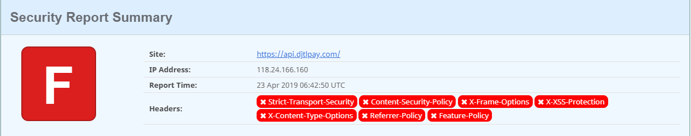

# 让你的ASP.NET Core应用程序更安全

对于ASP.NET Core应用程序，除了提供认证和授权机制来保证服务的安全性，还需要考虑下面的一些安全因素：

* CSRF

* 强制HTTPS

* 安全的HTTP Headers

### CSRF

ASP.NET Core通过AntiForgeryToken来阻止CSRF攻击，一般来说，当用户做表单提交的时候，表单中隐藏的token也会被提交到服务端，与此同时cookie中包含的另一半token也被提交到服务端，服务端通过合并两份token来验证客户端的数据是否有效。

例如在ASP.NET Core中通过下面的方式渲染表单:

``` c#
<form asp-controller="Manage" asp-action="ChangePassword" method="post">
   <!-- Form details -->
</form>
```

这样会生成下面的html，表单会包含一个隐藏的token

``` html
<form method="post" action="/Manage/ChangePassword">
  <!-- Form details -->
  <input name="__RequestVerificationToken" type="hidden" value="CfDJ8NrAkSldwD9CpLR...LongValueHere!" />
</form>
```

服务端的代码通过在对应的action上标记ValidateAntiForgeryToken来验证客户端的请求

``` C#
public class ManageController
{
  [HttpPost]
  [ValidateAntiForgeryToken]
  public IActionResult ChangePassword()
  {
    // ...
    return View();
  }
}
```

是不是每个POST请求都需要添加这样的attribute呢？

ASP.NET Core中有Filter的概念，通过添加全局Filter就能帮我们达到这样的目的：

``` C#
public class Startup
{
  public void ConfigureServices(IServiceCollection services)
  {
    services.AddMvc(options =>
    {
        options.Filters.Add(new AutoValidateAntiforgeryTokenAttribute());
    });
  }
}
```

AutoValidateAntiforgeryTokenAttribute会自动忽略不需要做CSRF验证的请求类型，例如HttpGet请求。

### 强制HTTPS

为了让服务更加安全，你还可以强制用户使用https，你可以通过配置API网关的方式达到这个目的，也可以使用ASP.NET Core自带的特性。

使用了RequireHttpsAttribute之后，http请求将会报错。

```C#
services.Configure<MvcOptions>(options =>
{
     options.Filters.Add(new RequireHttpsAttribute());
});
```

通过下面的方式强行跳转到https。

``` C#
public void Configure(IApplicationBuilder app, IHostingEnvironment env)
{
    app.UseHttpsRedirection();
}
```

### 让HTTP Header更加安全

通过https://securityheaders.com/来检查HTTP Header是不是安全，例如下面的扫描结果：


NWebsec是一个用来做安全相关的ASP.NET Core类库，针对ASP.NET Core中HTTP Header相关的修复，可以添加下面的Nuget包：

NWebsec.AspNetCore.Middleware

* Strict-Transport-Security：为了告诉浏览器所有的资源都必须使用https，你需要添加这个header:

``` C#
app.UseHsts(hsts => hsts.MaxAge(365));
```

* Redirect validation: 一旦启用了这个中间件，只能被Redirect到允许的站点, 否则会触发RedirectValidationException

``` C#
app.UseRedirectValidation(opts =>
{
    opts.AllowSameHostRedirectsToHttps();       opts.AllowedDestinations("https://www.google.com/accounts/");
});
```

* Referrer-Policy: 当用户点击了浏览器上的连接，请求报头中Referrer用来表示连接的来源，这个特性也可以用来做一些数据分析，通过Referrer-Policy可以控制是否显示Referrer:

``` C#
app.UseReferrerPolicy(opts => opts.NoReferrer());
```

* Content-Security-Policy:内容安全策略，这个http header可以让浏览器自动禁止外部注入恶意脚本，例如下面的策略将限制所有的脚本只能从同域加载：

``` C#
'Content-Security-Policy': 'script-src \'self\''
```

* 下面的脚本引用将会引起浏览器报错：

``` js
<script type="text/javascript" 
src="https://cdn.bootcss.com/jquery/3.3.1/jquery.js"></script>
```

* 使用NWebsec配置Content-Security-Policy:

``` C#
app.UseCsp(options => options
        .DefaultSources(s => s.Self())
        .ScriptSources(s => s.Self().CustomSources("scripts.nwebsec.com"))
        .ReportUris(r => r.Uris("/report")));
```

* X-XSS-Protection: 防XSS攻击设置

``` C#
app.UseXXssProtection(options => options.EnabledWithBlockMode());
```

* X-Content-Type-Options: 如果服务器发送响应头 X-Content-Type-Options: nosniff，则 script 和 styleSheet 元素会拒绝包含错误的 MIME 类型的响应。这是一种安全功能，有助于防止基于 MIME 类型混淆的攻击。

``` C#
app.UseXContentTypeOptions();
```