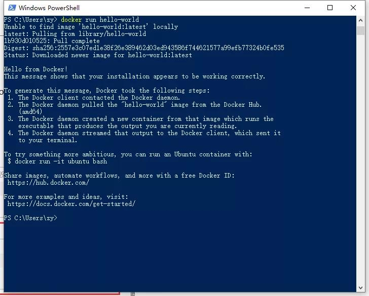
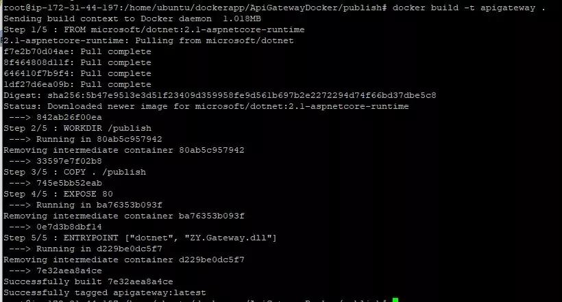
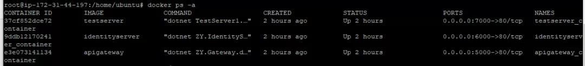
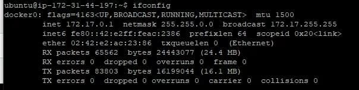

# .NET Core 微服务架构-Docker部署

本文主要介绍通过Docker来部署通过.NET Core开发的微服务架构，部署的微服务主要包括统一网关（使用Ocelot开发）、统一认证（IdentityServer4）、应用服务（ASP.NET Core WebAPI）。

本文不针对微服务进行说明，后续会针对我对微服务的理解在做记录。

### 一、Docker原理

对 Docker 最简单并且带有一定错误的认知就是 “Docker 是一种性能非常好的虚拟机”。

但是这是有一定错误的说法。Docker 相比于传统虚拟机的技术来说先进了不少，具体表现在 Docker 不是在宿主机上虚拟出一套硬件后再虚拟出一个操作系统，而是让 Docker 容器里面的进程直接运行在宿主机上（Docker 会做文件、网络等的隔离），这样一来 Docker 会 “体积更轻、跑的更快、同宿主机下可创建的个数更多”。

* Docker 中有三个核心概念：Image、Container、Repository。

* Image： 大家对 镜像 的概念不会陌生。但和 windows 的那种 iso 镜像相比，Docker 中的镜像是分层的，可复用的，而非简单的一堆文件迭在一起（类似于一个压缩包的源码和一个 git 仓库的区别）。

* Container： 容器的存在离不开镜像的支持，他是镜像运行时的一个载体（类似于实例和类的关系）。依托 Docker 的虚拟化技术，给容器创建了独立的端口、进程、文件等“空间”，Container 就是一个与宿机隔离 “容器”。容器可宿主机之间可以进行 port、volumes、network 等的通信。

Repository： Docker 的仓库和 git 的仓库比较相似，拥有仓库名、tag。在本地构建完镜像之后，即可通过仓库进行镜像的分发。

常用的 Docker hub有： 

https://hub.docker.com/（docker官方） 

https://cr.console.aliyun.com/

### 二、Windows系统中Docker的安装

#### 1、启用Hyper-V

打开控制面板 - 程序和功能 - 启用或关闭Windows功能，勾选Hyper-V，然后点击确定即可，如图：


#### 2、下载并安装Docker

下载地址：https://hub.docker.com/editions/community/docker-ce-desktop-windows，需要注册一个Docker账号才能下载

下载完成后直接安装

通过命令查看Docker版本号：


#### 3、修改镜像地址

由于Docker官方镜像会非常慢，我是修改的阿里云的镜像


#### 4、测试

万能的HelloWorld，通过PowerShell运行 Docker run hello-world



docker ps -a //查看运行的容器


以上就是整个Windows中安装Docker环境的过程

### 三、ubuntu中安装Docker环境

我是在AWS申请了一台免费的服务器，是用的ubuntu系统。如果需要申请AWS的服务器，可以通过AWS官网注册账号进行申请，需要填写信用卡账号，https://portal.aws.amazon.com/billing/signup#/start 

本文ubuntu中安装Docker是直接参考官方教程：https://docs.docker.com/install/linux/docker-ce/ubuntu/

安装的时候最好切换到root账号进行安装

ubuntu的远程是通过putty，具体怎么用可以百度

### 四、发布并部署服务

#### 1、创建Dockerfile、发布应用程序


这是我的工程目录，构建镜像是通过Dockerfile来构建的。

VS2017 是支持自动构建Dockerfile文件，工程右键-添加-Docker支持

下面是我的Dockerfile的内容：
``` C#
FROM microsoft/aspnetcore:2.1 
//基础镜像，这里是.net core的基础运行环境
WORKDIR /publish //创建工程目录
COPY . /publish //将当前目录拷贝到镜像中，注意 COPY . 后面又空格
EXPOSE 80 //容器对外暴露80端口
ENTRYPOINT ["dotnet", "ZY.Gateway.dll"] //启动容器内的服务
//这里相当于构建镜像的命令，是逐行执行
```
需要设置Dockerfile的编译为输出到发布目录


以上都设置好以后，通过VS发布程序


发布成功后，在工程目录的bin/release目录下找到我们的发布后的文件


其他服务的发布跟以上发布类似

#### 2、上传到ubuntu中

通过WinScp工具进行上传，将三个服务都上传到服务器，WinScp怎么用，可以百度一下


#### 3、构建镜像

``` C#
docker build -t apigateway .   //构建网关镜像 
docker build -t identityserver 
-f /home/ubuntu/dockerapp/identityserver/publish/Dockerfile . 
//构建认证服务镜像
docker build -t testserver 
-f /home/ubuntu/dockerapp/testserver/publish/Dockerfile .
 //构建测试服务镜像
-t //镜像名称
-f //dockerfile文件路径
```


docker images //查看镜像


#### 4、运行容器

镜像已经在前面构建完成，这一步会根据构建的镜像来运行容器，将我们的服务跑起来

``` C#
docker run -d -p 5000:80 
--name apigateway_container apigateway
docker run -d -p 6000:80 
--name identityserver_container identityserver
docker run -d -p 7000:80 
--name testserver_container testserver
//分别将网关服务，认证服务，测试服务容器跑起来
//-d 保持后台进程运行 -p 端口映射，{主机端口}:{容器端口}
```

通过命令查看容器运行情况
docker ps -a


在配置网关服务的时候会涉及到容器与容器之间的网络访问，Docker在安装的时候会创建一个172.17.0.1的IP网关，可以通过172.17.0.1来做端口的转发。

通过命令可以查看docker0的网关



Api网关的路由转发配置


#### 5、调用服务

通过Postman来调用通过Docker运行的服务，通过API网关访问认证服务获取Token


### 总结

整个Docker的安装，服务的发布，镜像的打包，容器的运行就全部完成。

整个过程不是一气呵成的，踩了不少坑，在踩坑的过程中也学到和理解了很多东西。

[Docekr介绍使用](https://yeasy.gitbooks.io/docker_practice/content/)