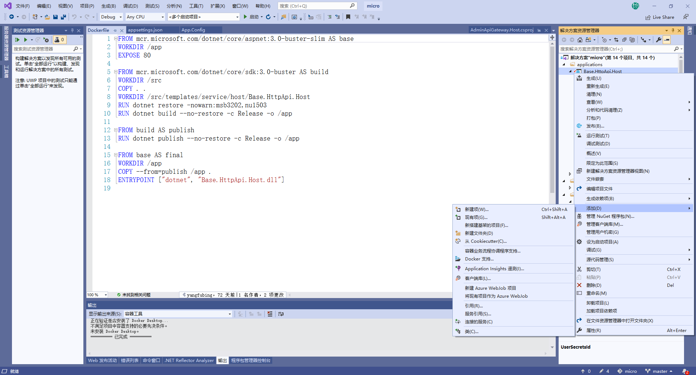

# ASP.NET Core 实战：使用 Docker 容器化部署 ASP.NET Core + sqlserver + Nginx

### 一、前言

　　在之前的文章（ASP.NET Core 实战：Linux 小白的 .NET Core 部署之路）中，我介绍了如何在 Linux 环境中安装 .NET Core SDK / .NET Core Runtime、Nginx、sqlserver，以及如何将我们的 ASP.NET Core MVC 程序部署到 Linux 上，同时，使用 supervisor  守护程序守护我们的 .NET Core 程序。如果，你有看过那篇文章，并且和我一样是个 Linux 小白用户的话，可能第一感觉就是，把 .NET Core 项目部署在 IIS 上也挺好。

　　将 .NET Core 项目部署到 Linux 上如此复杂，就没有简单的部署方式吗？

　　你好，有的，Docker 了解一下~~~

　　PS：这里的示例代码还是采用之前的毕业设计项目，在这篇文章发布的时候，我已经在程序的仓库中添加了对于 Docker 的支持，你可以下载下来，自己尝试一下，毕竟，实践出真知。

　　 代码仓储：https://github.com/burningmyself/micro

 ### 二、Step by Step

#### 1、安装 Docker & Docker Compose

　　在代码交付的过程中，偶尔会遇到这样的问题，在本地测试是好的，但是部署到测试环境、生产环境时就出这样那样的问题，同时，因为本地与测试环境、生产环境之间存在差异，我们可能无法在本地复现这些问题，那么，有没有一种工具可以很好的解决这一问题呢？随着历史的车轮不断前行，容器技术诞生了。

　　Docker，作为最近几年兴起的一种虚拟化容器技术，他可以将我们的运行程序与操作系统做一个隔离，例如这里我们需要运行 .NET Core 程序，我们不再需要关心底层的操作系统是什么，不需要在每台需要需要运行程序的机器上安装程序运行的各种依赖，我们可以通过程序打包成镜像的方式，将应用程序和该程序的依赖全部置于一个镜像文件中，这时，只要别的机器上有安装 Docker，就可以通过我们打包的这个镜像来运行这个程序。

#### 1.1、卸载 Docker

　　在安装 Docker 之前，我们应该确定当前的机器上是否已经安装好了 Docker，为了防止与现在安装的 Docker CE 发生冲突，这里我们先卸载掉以前版本的 Docker，如果你确定你的机器上并没有安装 Docker 的话此步可以跳过。

　　在 Linux 中可以使用 \ 加 Enter 在输入很长很长的语句时进行换行，这里和后面的命令都是采用这样的方式。

sudo yum remove docker \
  docker-client \
  docker-client-latest \
  docker-common \
  docker-latest \
  docker-latest-logrotate \
  docker-logrotate \
  docker-engine
#### 1.2、添加 yum 源

　　在安装 Docker CE 的方式上，我是采用将 Docker CE 的源添加到 yum 源中，之后我们就可以直接使用 yum install 安装 Docker CE，整个的安装过程如下。

安装工具包从而可以让我们在 yum 中添加别的仓储源
```
sudo yum install -y yum-utils \
  device-mapper-persistent-data \
  lvm2
```
设置 docker ce 的稳定库地址
```
sudo yum-config-manager \
    --add-repo \
    https://download.docker.com/linux/centos/docker-ce.repo
```
安装 docker ce
```
sudo yum install docker-ce docker-ce-cli containerd.io
```
当我们安装好 Docker 之后，我们就可以使用 docker 命令验证我们是否在机器上成功安装了 Docker，同时，也可以使用 docker --version 命令查看我们安装的 Docker CE 版本。


#### 1.3、设置开机自启

　　当 Docker 已经在我们的机器上安装完成后，我们就可以将 Docker 设置成机器的自启服务，这样，如果出现服务器重启的情况下，我们的 Docker 也可以随服务器的重启自动启动 Docker 服务。

启动 Docker 服务并允许开机自启
```
sudo systemctl start docker
```
查看当前 dokcer 的运行情况
```
sudo systemctl status docker
```
#### 1.4、Hello World

　　就像我们在学习一门新的语言时，运行的第一句代码，几乎都是打印出 Hello World，而在 Docker Hub 中，也有这么一个镜像，在无数的 Docker 教程中，安装完 Docker 后，第一件事就是拉取这个镜像文件，“告诉” Docker，我来了。

　　Docker Hub 是存放镜像的仓库，里面包含了许多的镜像文件，因为服务器在国外的原因，下载的速度可能不理想，像国内的阿里云、腾讯云也有提供对于 Docker 镜像的加速器服务，你可以按需使用，当然，你也可以创建属于你的私有镜像仓库。

　　docker run 命令，它会在我们的本地镜像库中先寻找这个镜像，然后运行。如果在本地没有找到的话，则会自动使用 docker pull 从 Docker Hub 中寻找，能找到的话，则会自动下载到本地，然后运行，找不到的话，这条命令也就运行失败了。


#### 1.5、安装 Docker Compose

　　在实际的项目开发中，我们可能会有多个应用镜像，例如在本篇文章的示例中，为了在 Docker 中运行我们的程序，我们需要三个镜像：应用程序自身镜像、sqlserver Server 镜像、以及 Nginx 镜像，为了将我们的程序启动起来，我们需要手敲各个容器的启动参数，环境变量，容器命名，指定不同容器的链接参数等等一系列的操作，又多又烦，可能某一步操作失败后程序就无法正常运行。而当我们使用了 Docker Compose 之后，我们就可以把这些命令一次性写在 docker-compose.yml 配置文件中，以后每次启动我们的应用程序时，只需要通过 docker compose 命令就可以自动帮我们完成这些操作。

从 github 下载 docker compose 二进制文件
```
sudo curl -L "https://github.com/docker/compose/releases/download/1.23.2/docker-compose-$(uname -s)-$(uname -m)" -o /usr/local/bin/docker-compose
```
对下载的二进制文件应用可执行权限
```
sudo chmod +x /usr/local/bin/docker-compose
```
查看 docker compose 版本
```
docker-compose --version
```
#### 2、构建程序镜像

　　当我们在服务器上安装好 docker 和 docker compose 之后，就可以开始构建我们的程序镜像了。首先我们需要对我们的运行程序添加对于 Docker 的支持。你可以自己手动在 MVC 项目中添加 Dockerfile 文件，或是通过右键添加 Docker 支持。



Dockerfile 就像一个执行的清单，它告诉 Docker，我们这个镜像在构建和运行时需要按照什么样的命令运行。打开 VS 为我们自动创建的 Dockerfile，可以看到清晰的分成了四块的内容。


我们知道，.NET Core 程序的运行需要依赖于 .NET Core Runtime（CoreCLR），因此，为了使我们的程序可以运行起来，我们需要从 hub 中拉取 runtime ，并在 此基础上构建我们的应用镜像。同时，为了避免因为基础的环境的不同造成对程序的影响，这里的 Runtime 需要同程序开发时的 .NET Core SDK 版本保持一致，所以这里我使用的是 .NET Core 3.0 Runtime。

　　一个镜像中包含了应用程序及其所有的依赖，与虚拟机不同的是，容器中的每个镜像最终是共享了宿主机的操作系统资源，容器作为用户空间中的独立进程运行在主机操作系统上。


PS:图片版权归属于微软的技术文档，如有侵权，请联系我删除，源文件地址：什么是 Docker？

　　镜像可以看成一个个小型的“虚拟主机”，这里我们在镜像中创建了一个 /app 路径作为我们程序在镜像中的工作目录，同时，将 80,443 端口暴露给 Docker，从而可以使我们在镜像外面通过端口访问到当前镜像中的运行的程序。
```
FROM  mcr.microsoft.com/dotnet/core/aspnet:3.0-buster-slim AS base
WORKDIR /app
EXPOSE 80
EXPOSE 443
```
　　因为我们的应用是一个微服架构的应用，最终的项目依赖于解决方案中的各个类库以及我们从 Nuget 中下载的各种第三方组件，在部署时，需要将这些组件打包成 dll 引用。所以，这里我们需要使用 .NET Core SDK 中包含的 .NET Core CLI 进行还原和构建。

　　就像在下面的代码中，我们在镜像的内部创建了一个 /src 的路径，将当前解决方案下的类库都复制到这个目录下，之后通过 dotnet restore 命令还原我们的主程序所依赖的各个组件。当我们还原好依赖的组件后，就可以使用 dotnet build 命令生成 Release版本的 dll 文件，同时输出到之前创建的 /app 路径下。

```
FROM mcr.microsoft.com/dotnet/core/sdk:3.0-buster AS build
WORKDIR /src
COPY . .
WORKDIR /src/templates/service/host/Base.IdentityServer
RUN dotnet restore -nowarn:msb3202,nu1503
RUN dotnet build --no-restore -c Release -o /app

```

上面一步可以看成我们在使用 VS 生成 Release 版本的解决方案，当生成没有出错之后，我们就可以进行程序的发布。
```
FROM build AS publish
RUN dotnet publish --no-restore -c Release -o /app
```
　　当已经生成发布文件之后，按照我们平时部署在 Windows 上的过程，这时就可以通过 IIS 部署运行了，因此，构建我们应用镜像的最后一步就是通过 dotnet 命令执行我们的程序。
```
FROM base AS final
WORKDIR /app
COPY --from=publish /app .
ENTRYPOINT ["dotnet", "Base.IdentityServer.dll"]
```
　　似乎到这一步构建程序镜像就结束了，按照这样流程做的话，就需要我们将整个的解决方案上传到服务器上了，可是，很多时候，我们仅仅是把我们在本地发布好的项目上传到服务器上，这与我们现在的构建流程具有很大的不同，所以这里我们来修改 Dockerfile 文件，从而符合我们的发布流程。

　　从上面分析 Dockerfile 的过程中不难看出，在服务器上构建镜像的第二步、第三步就是我们现在在开发环境中手动完成的部分，所以这里，我们只需要对这部分进行删除即可，修改后的 Dockerfile 如下。
```
FROM mcr.microsoft.com/dotnet/core/sdk:3.0-buster
WORKDIR /app
COPY . /app 
EXPOSE 80
EXPOSE 443
ENTRYPOINT ["dotnet", "Base.IdentityServer.dll"]
```
　　在修改后的 Dockerfile 中，可以看到，我们删去了 build 和 release 的过程，选择直接将我们 Dockerfile 路径下的文件拷贝到镜像中的 /app 路径下，然后直接执行 dotnet 命令，运行我们的程序。

　　为了确保 Dockerfile 与发布后的文件处于同一路径下，这里我们需要使用 VS 修改 Dockerfile 的属性值，确保会复制到输出的目录下，这里选择如果较新则复制即可。


#### 3、编写 docker-compose.yml

　　当我们构建好应用的镜像，对于 Nginx 和 sqlserver 我们完全可以从 hub 中拉取下来，再执行一些配置即可。所以，我们现在就可以编写 docker compose 文件，来定义我们的应用镜像运行时需要包含的依赖以及每个镜像的启动顺序。

　　右键选中 MVC 项目，添加一个 docker-compose.yml 文件，同样的，需要修改该文件的属性，以便于该文件可以复制到输出目录下。注意，这里的文件名和上文的 Dockerfile 都是特定的，你不能做任何的修改。如果你的电脑上已经安装了 Docker for Windows，你也可以使用 VS，右键添加，选中容器业务流程协调程序支持自动对 docker compose 进行配置。


在 yml 文件中，我定义了三个镜像：AdminApiGateway.Host、Base.IdentityServer、Base.HttpApi.Host。三个镜像的定义中有许多相同的地方，都设置了自动重启（restart），以及都处于同一个桥接网络下（psu-net）从而达到镜像间的通信。


sqlserver 是 SqlServer 的镜像，我们通过环境变量 SA_PASSWORD 设置了 SqlServer 的数据库连接密码，并通过挂载卷的方式将镜像中的数据库文件持久化到我们的服务器本地路径中。同时，将镜像的 1433 端口映射到服务器的 1433 端口上。

　　AdminApiGateway.Host 则是我们的程序后台网关镜像，采用位于 /data/dotnet/AdminApiGateway/ 路径下的 Dockerfile 文件进行构建的，因为主程序的运行需要依赖于数据库，所以这里采用 depends_on 属性，使我们的应用镜像依赖于 sqlserver 镜像，即，在 sqlserver 启动后才会启动应用镜像。

　　nginx 则是我们的 nginx 镜像，这里将镜像中的 80 端口和 443 端口都映射到服务器 IP 上，因为我们需要配置 Nginx 从而监听我们的程序，所以通过挂载卷的方式，将本地的 nginx.conf 配置文件用配置映射到镜像中。同时，因为我们在构建应用镜像的 Dockerfile 文件时，对外暴露了 80,443 端口，所以这里就可以通过 links 属性进行监听（如果构建时未暴露端口，你可以在 docker compose 文件中通过 Expose 属性暴露镜像中的端口）。

　　Nginx 的配置文件如下，这里特别需要注意文件的格式，缩进，一点小错误都可能导致镜像无法正常运行。如果你和我一样将 nginx.conf 放到程序运行路径下的，别忘了修改文件的属性。
```
user  nginx;
worker_processes  1;

error_log  /var/log/nginx/error_log.log warn;
pid        /var/run/nginx.pid;


events {
    worker_connections  1024;
}


http {
    include       /etc/nginx/mime.types;
    default_type  application/octet-stream;

    log_format  main  '$remote_addr - $remote_user [$time_local] "$request" '
                      '$status $body_bytes_sent "$http_referer" '
                      '"$http_user_agent" "$http_x_forwarded_for"';

    access_log   /var/log/nginx/access.log  main;

    sendfile        on;
    #tcp_nopush     on;

    keepalive_timeout  65;

    #gzip  on;

    gzip on; #开启gzip
    gzip_disable "msie6"; #IE6不使用gzip
    gzip_vary on; #设置为on会在Header里增加 "Vary: Accept-Encoding"
    gzip_proxied any; #代理结果数据的压缩
    gzip_comp_level 6; #gzip压缩比（1~9），越小压缩效果越差，但是越大处理越慢，所以一般取中间值
    gzip_buffers 16 8k; #获取多少内存用于缓存压缩结果
    gzip_http_version 1.1; #识别http协议的版本
    gzip_min_length 1k; #设置允许压缩的页面最小字节数，超过1k的文件会被压缩
    gzip_types application/javascript text/css; #对特定的MIME类型生效,js和css文件会被压缩

    include /etc/nginx/conf.d/*.conf;

    server {
      #nginx同时开启http和https
        listen 80 default backlog=2048;
        listen 443 ssl;
        server_name ysf.djtlpay.com;

        ssl_certificate  /ssl/1_ysf.djtlpay.com_bundle.crt;
        ssl_certificate_key  /ssl/2_ysf.djtlpay.com.key;

        location / {
            proxy_http_version 1.1;
            proxy_set_header Upgrade $http_upgrade;
            proxy_set_header Host $http_host;
            proxy_cache_bypass $http_upgrade;
            root /usr/share/nginx/html;
            index  index.html index.htm;
        }
   }        
}
```
一个完整的 docker compose 文件如下，包含了三个镜像以及一个桥接网络。
```
version: '3.0'

services:
  # 指定服务名称
  sqlserver:
    # 指定服务使用的镜像
    image: mcr.microsoft.com/mssql/server
    # 指定容器名称
    container_name: sqlserver
    # 指定服务运行的端口
    ports:
      - "1433"
    # 指定容器中需要挂载的文件  
    volumes:
      - /data/sqlserver:/var/opt/mssql
    # 挂断自动重新启动  
    restart: always
    environment:
      - TZ=Asia/Shanghai
      - SA_PASSWORD=mssql-MSSQL
      - ACCEPT_EULA=Y
    # 指定容器运行的用户为root
    user:
      root
 # 指定服务名称
  redis:
    # 指定服务使用的镜像
    image: redis
    # 指定容器名称
    container_name: redis
    # 指定服务运行的端口
    ports:
      - 6379:6379
    # 指定容器中需要挂载的文件
    volumes:
      - /etc/localtime:/etc/localtime
      - /data/redis:/data
      - /data/redis/redis.conf:/etc/redis.conf
    # 挂断自动重新启动
    restart: always
    # 指定容器执行命令
    command: redis-server /etc/redis.conf --requirepass xiujingredis. --appendonly yes
    # 指定容器的环境变量
    environment:
      - TZ=Asia/Shanghai # 设置容器时区与宿主机保持一致
  # 指定服务名称
  mongo:
    # 指定服务使用的镜像
    image: mongo
    # 指定容器名称
    container_name: mongo
    # 指定服务运行的端口
    ports:
      - 27017:27017
    # 指定容器中需要挂载的文件
    volumes:
      - /etc/localtime:/etc/localtime
      - /data/mongodb/db:/data/db
      - /data/mongodb/configdb:/data/configdb
      - /data/mongodb/initdb:/docker-entrypoint-initdb.d      
    # 挂断自动重新启动
    restart: always
    # 指定容器的环境变量
    environment:
      - TZ=Asia/Shanghai # 设置容器时区与宿主机保持一致
      - AUTH=yes
      - MONGO_INITDB_ROOT_USERNAME=admin
      - MONGO_INITDB_ROOT_PASSWORD=admin
  nginx:
    # 指定服务使用的镜像
    image: nginx
    # 指定容器名称
    container_name: nginx
    # 指定服务运行的端口
    ports:
      - 80:80
      - 443:443
    # 指定容器中需要挂载的文件
    volumes:
      - /etc/localtime:/etc/localtime
    # 挂断自动重新启动
    restart: always

  AdminApiGateway.Host:
    image: 'volosoft/microservice-demo-public-website-gateway:${TAG:-latest}'
    build:
      context: ../
      dockerfile: micro/gateways/AdminApiGateway.Host/Dockerfile
    depends_on:
      - sqlserver
      - redis
      - mongo    

  Base.IdentityServer:
    image: 'Base.IdentityServer:${TAG:-latest}'
    build:
      context: ../
      dockerfile: micro/modules/base/host/Base.IdentityServer/Dockerfile
    depends_on:
      - sqlserver
      - redis
      - mongo
      - AdminApiGateway.Host

  Base.HttpApi.Host:
    image: 'Base.HttpApi.Host:${TAG:-latest}'
    build:
      context: ../
      dockerfile: micro/modules/base/host/Base.HttpApi.Host/Dockerfile
    depends_on:
      - sqlserver
      - redis
      - mongo
      - AdminApiGateway.Host
      - Base.IdentityServer 
```

这里需要注意，所有有用到镜像间的通信的地方，我们都需要使用镜像名进行指代，例如上面的 nginx 的配置文件中，我们需要将监听的地址改为镜像名称，以及，我们需要修改程序的数据库访问字符串的服务器地址

#### 4、发布部署程序

　　当我们构建好 docker compose 文件后就可以把整个文件上传到服务器上进行构建 docker 镜像了。这里我将所有的部署文件放在服务器的 /data/wwwroot/micro/ 路径下，这时我们就可以通过 docker compose 命令进行镜像构建。

　　定位到部署文件在的位置，我们可以直接使用下面的命令进行镜像的（重新）构建，启动，并链接一个服务相关的容器，整个过程都会在后台运行，如果你希望看到整个过程的话，你可以去掉 -d 参数。

执行镜像构建，启动
```
docker-compose up -d
```
　　当 up 命令执行完成后，我们就可以通过 ps 命令查看正在运行的容器，若有的容器并没有运行起来，则可以使用 logs 查看容器的运行日志从而进行排错。

 查看所有正在运行的容器
```
docker-compose ps
```
显示容器运行日志
```
docker-compose logs
```
### 三、总结

 　　 本章主要是介绍了如何通过 docker 容器，完整的部署一个可实际使用的 .NET Core 的单体应用，相比于之前通过 Linux 部署 .NET Core 应用，可以看到整个步骤少了很多，也简单很多。文中涉及到了一些 docker 的命令，如果你之前并没有接触过 docker 的话，可能需要你进一步的了解。当我们将程序打包成一个镜像之后，你完全可以将镜像上传到私有镜像仓库中，或是直接打包成镜像的压缩文件，这样，当需要切换部署环境时，只需要获取到这个镜像之后即可快速完成部署，相比之前，极大的方便了我们的工作。
