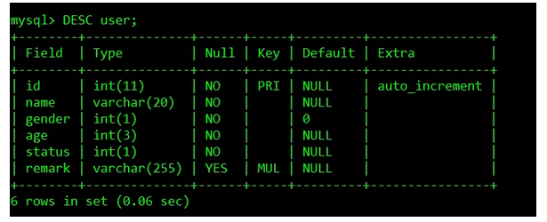
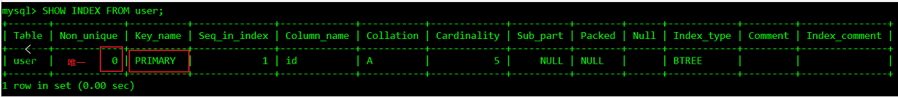
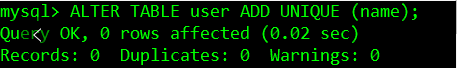
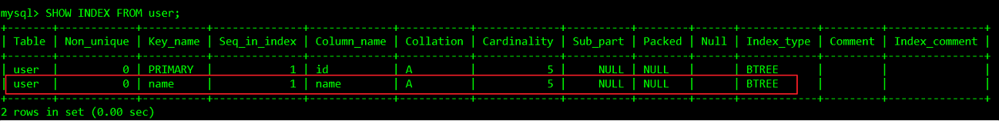
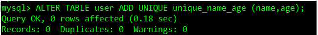
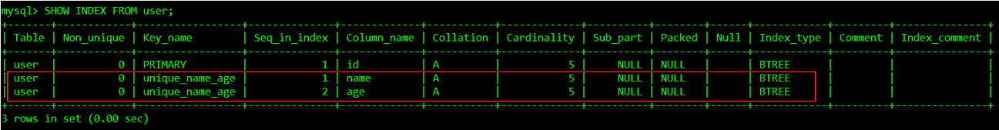
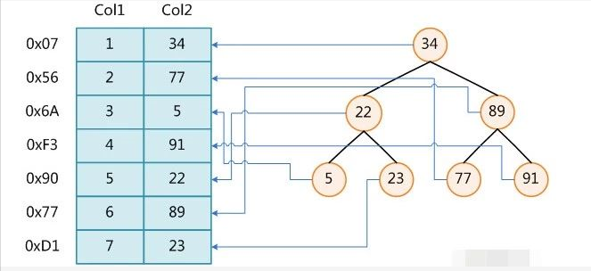
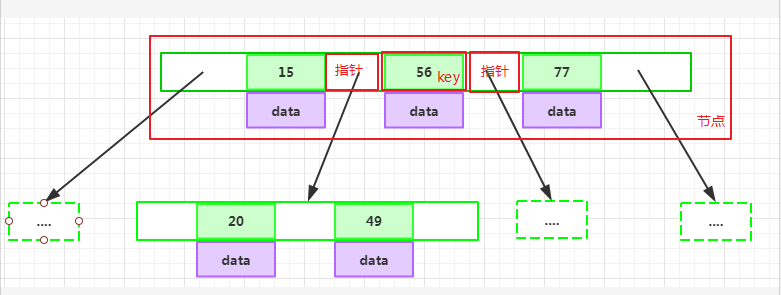

# MySQL索引优化
---
本文主要讨论MySQL索引的部分知识。将会从MySQL索引基础、索引优化实战和数据库索引背后的数据结构三部分相关内容，下面一一展开。

## 一、MySQL——索引基础

首先，我们将从索引基础开始介绍一下什么是索引，分析索引的几种类型，并探讨一下如何创建索引以及索引设计的基本原则。

此部分用于测试索引创建的pay_user表的结构如下：

### 1、什么是索引

“索引（在MySQL中也叫“键key”）是存储引擎快速找到记录的一种数据结构。”
——《高性能MySQL》

我们需要知道索引其实是一种数据结构，其功能是帮助我们快速匹配查找到需要的数据行，是数据库性能优化最常用的工具之一。其作用相当于超市里的导购员、书本里的目录。

### 2、索引类型

可以使用SHOW INDEX FROM table_name;查看索引详情：

* 主键索引 PRIMARY KEY

它是一种特殊的唯一索引，不允许有空值。一般是在建表的时候同时创建主键索引。注意：一个表只能有一个主键。

* 唯一索引 UNIQUE

唯一索引列的值必须唯一，但允许有空值。如果是组合索引，则列值的组合必须唯一。

可以通过ALTER TABLE table_name ADD UNIQUE [alias] (column);创建唯一索引：

可以通过ALTER TABLE table_name ADD UNIQUE [alias] (column1,column2);创建唯一组合索引：

* 普通索引 INDEX

这是最基本的索引，它没有任何限制。

可以通过ALTER TABLE table_name ADD INDEX index_name (column);创建普通索引：

* 组合索引 INDEX
即一个索引包含多个列，多用于避免回表查询。

可以通过ALTER TABLE table_name ADD INDEX index_name(column1,column2, column3);创建组合索引：

全文索引 FULLTEXT

也称全文检索，是目前搜索引擎使用的一种关键技术。

可以通过ALTER TABLE table_name ADD FULLTEXT (column);创建全文索引：

索引一经创建不能修改，如果要修改索引，只能删除重建。可以使用DROP INDEX index_name ON table_name;删除索引。

### 3、索引设计的原则

1. 适合索引的列是出现在where子句中的列，或者连接子句中指定的列；
2. 基数较小的类，索引效果较差，没有必要在此列建立索引；
3. 使用短索引，如果对长字符串列进行索引，应该指定一个前缀长度，这样能够节省大量索引空间；
4. 不要过度索引。索引需要额外的磁盘空间，并降低写操作的性能。在修改表内容的时候，索引会进行更新甚至重构，索引列越多，这个时间就会越长。所以只保持需要的索引有利于查询即可。

## 二、MySQL——索引优化实战

上面我们介绍了索引的基本内容，这部分我们介绍索引优化实战。在介绍索引优化实战之前，首先要介绍两个与索引相关的重要概念，这两个概念对于索引优化至关重要。

此部分用于测试的user表结构：

### 1、索引相关的重要概念
* 基数
单个列唯一键（distict_keys）的数量叫做基数。

SELECT COUNT(DISTINCT UserName),COUNT(DISTINCT LoginPassWord) FROM pay_user;

pay_user表的总行数是5，UserName列的基数是10，说明LoginPassWord列里面有大量重复值，UserName列的基数等于总行数，说明UserName列没有重复值，相当于主键。

返回数据的比例：
pay_user表中共有5条数据：

基数越大命中索引命中越高，一半取表数据30%一下走索引

* 回表

当对一个列创建索引之后，索引会包含该列的键值及键值对应行所在的rowid。通过索引中记录的rowid访问表中的数据就叫回表。回表次数太多会严重影响SQL性能，如果回表次数太多，就不应该走索引扫描，应该直接走全表扫描。

EXPLAIN命令结果中的Using Index意味着不会回表，通过索引就可以获得主要的数据。Using Where则意味着需要回表取数据。

### 2、索引优化实战

有些时候虽然数据库有索引，但是并不被优化器选择使用。

我们可以通过SHOW STATUS LIKE 'Handler_read%';查看索引的使用情况：

* Handler_read_key：如果索引正在工作，Handler_read_key的值将很高。
* Handler_read_rnd_next：数据文件中读取下一行的请求数，如果正在进行大量的表扫描，值将较高，则说明索引利用不理想。

#### 索引优化规则：

* 如果MySQL估计使用索引比全表扫描还慢，则不会使用索引。

返回数据的比例是重要的指标，比例越低越容易命中索引。记住这个范围值——30%，后面所讲的内容都是建立在返回数据的比例在30%以内的基础上。

* 前导模糊查询不能命中索引。

UserName列创建普通索引：

前导模糊查询不能命中索引：

EXPLAIN SELECT * FROM pay_user WHERE UserName LIKE '%s%';

非前导模糊查询则可以使用索引，可优化为使用非前导模糊查询：

EXPLAIN SELECT * FROM pay_user WHERE UserName LIKE 's%';

* 数据类型出现隐式转换的时候不会命中索引，特别是当列类型是字符串，一定要将字符常量值用引号引起来。
EXPLAIN SELECT * FROM pay_user WHERE UserName=1;--未使用索引

EXPLAIN SELECT * FROM user WHERE name='1';--使用索引

* 复合索引的情况下，查询条件不包含索引列最左边部分（不满足最左原则），不会命中符合索引。

注意，最左原则并不是说是查询条件的顺序

* union、in、or都能够命中索引，建议使用in。

查询的CPU消耗：or>in>union

* 用or分割开的条件，如果or前的条件中列有索引，而后面的列中没有索引，那么涉及到的索引都不会被用到。

因为or后面的条件列中没有索引，那么后面的查询肯定要走全表扫描，在存在全表扫描的情况下，就没有必要多一次索引扫描增加IO访问。

* 负向条件查询不能使用索引，可以优化为in查询。
负向条件有：!=、<>、not in、not exists、not like等。

* 范围条件查询可以命中索引。范围条件有：<、<=、>、>=、between等。

范围列可以用到索引（联合索引必须是最左前缀），但是范围列后面的列无法用到索引，索引最多用于一个范围列，如果查询条件中有两个范围列则无法全用到索引：

如果是范围查询和等值查询同时存在，优先匹配等值查询列的索引：

* 数据库执行计算不会命中索引

计算逻辑应该尽量放到业务层处理，节省数据库的CPU的同时最大限度的命中索引。

* 利用覆盖索引进行查询，避免回表。

被查询的列，数据能从索引中取得，而不用通过行定位符row-locator再到row上获取，即“被查询列要被所建的索引覆盖”，这能够加速查询速度。

当查询其他列时，就需要回表查询，这也是为什么要避免SELECT*的原因之一：

* 建立索引的列，不允许为null。

单列索引不存null值，复合索引不存全为null的值，如果列允许为null，可能会得到“不符合预期”的结果集，所以，请使用not null约束以及默认值。

虽然IS NULL可以命中索引，但是NULL本身就不是一种好的数据库设计，应该使用NOT NULL约束以及默认值。

* 更新十分频繁的字段上不宜建立索引：因为更新操作会变更B+树，重建索引。这个过程是十分消耗数据库性能的。
* 区分度不大的字段上不宜建立索引：类似于性别这种区分度不大的字段，建立索引的意义不大。因为不能有效过滤数据，性能和全表扫描相当。另外返回数据的比例在30%以外的情况下，优化器不会选择使用索引。
* 业务上具有唯一特性的字段，即使是多个字段的组合，也必须建成唯一索引。虽然唯一索引会影响insert速度，但是对于查询的速度提升是非常明显的。另外，即使在应用层做了非常完善的校验控制，只要没有唯一索引，在并发的情况下，依然有脏数据产生。
* 多表关联时，要保证关联字段上一定有索引。
* 创建索引时避免以下错误观念：索引越多越好，认为一个查询就需要建一个索引；宁缺勿滥，认为索引会消耗空间、严重拖慢更新和新增速度；抵制唯一索引，认为业务的唯一性一律需要在应用层通过“先查后插”方式解决；过早优化，在不了解系统的情况下就开始优化。

### 3、总结

对于自己编写的SQL查询语句，要尽量使用EXPLAIN命令分析一下，做一个对SQL性能有追求的程序员。衡量一个程序员是否靠谱，SQL能力是一个重要的指标。作为后端程序员，深以为然。

## 三、数据库索引背后的数据结构

第一部分开头我们简单提到，索引是存储引擎快速找到记录的一种数据结构。进一步说，在数据库系统里，这种数据结构要满足特定查找算法，即这些数据结构以某种方式引用（指向）数据，这样就可以在这些数据结构上实现高级查找算法。

### 1、B-Tree

B-Tree是一种平衡的多路查找(又称排序)树，在文件系统中和数据库系统中有所应用，主要用作文件的索引。其中的B就表示平衡(Balance) 。

### B-Tree的特性

为了描述B-Tree，首先定义一条数据记录为一个二元组[key, data]，key为记录的键值，对于不同数据记录，key是互不相同的；data为数据记录除key外的数据。那么B-Tree是满足下列条件的数据结构：

d为大于1的一个正整数，称为B-Tree的度：

h为一个正整数，称为B-Tree的高度：

key和指针互相间隔，节点两端是指针：

一个节点中的key从左到右非递减排列：

所有节点组成树结构。

每个指针要么为null，要么指向另外一个节点；每个非叶子节点由n-1个key和n个指针组成，其中d<=n<=2d：

每个叶子节点最少包含一个key和两个指针，最多包含2d-1个key和2d个指针，叶节点的指针均为null：

所有叶节点具有相同的深度，等于树高h。

如果某个指针在节点node最左边且不为null，则其指向节点的所有key小于key1，其中key1为node的第一个key的值：

如果某个指针在节点node最右边且不为null，则其指向节点的所有key大于keym，其中keym为node的最后一个key的值：

如果某个指针在节点node的左右相邻key分别是keyi和keyi+1且不为null，则其指向节点的所有key小于keyi+1且大于keyi：

### B-Tree查找数据

B-Tree是一个非常有效率的索引数据结构。这主要得益于B-Tree的度可以非常大，高度会变的非常小，只需要二分几次就可以找到数据。例如一个度为d的B-Tree，设其索引N个key，则其树高h的上限为logd((N+1)/2))，检索一个key，其查找节点个数的渐进复杂度为O(logdN)。

在B-Tree中按key检索数据的算法非常直观：

* 首先从根节点进行二分查找，如果找到则返回对应节点的data；
* 否则对相应区间的指针指向的节点递归进行查找，如果找到则返回对应节点的data；
* 如果找不到，则重复上述“对相应区间的指针指向的节点递归进行查找”，直到找到节点或找到null指针，前者查找成功，后者查找失败。

### 2、B+Tree

B+Tree是B-Tree的一种变种。一般来说，B+Tree比B-Tree更适合实现外存储索引结构，具体原因与外存储器原理及计算机存取原理有关，将在以后讨论。

B+Tree的特性:

区别于B-Tree:

每个节点的指针上限为2d而不是2d+1；
内节点不存储data，只存储key；叶子节点不存储指针。

3、带有顺序访问指针的B+Tree

一般在数据库系统或者文件系统中，并不是直接使用B+Tree作为索引数据结构的，而是在B+Tree的基础上做了优化，增加了顺序访问指针，提升了区间查询的性能。

如上图所示，在B+Tree的每个叶子节点增加一个指向相邻叶子节点的指针，就形成了带有顺序访问指针的B+Tree。

例如要查询18到30之间的数据记录，只要先找到18，然后顺着顺序访问指针就可以访问到所有的数据节点。这样就提升了区间查询的性能。数据库的索引全扫描index和索引范围扫描range就是基于此实现的。

