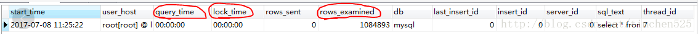
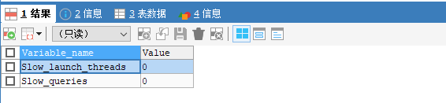
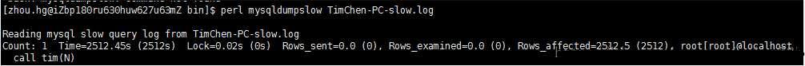

# MySQL查询日志
MySQL中的日志包括：错误日志、二进制日志、通用查询日志、慢查询日志等等。这里主要介绍下比较常用的两个功能：通用查询日志和慢查询日志。
1. 通用查询日志：记录建立的客户端连接和执行的语句。

2. 慢查询日志：记录所有执行时间超过longquerytime秒的所有查询或者不使用索引的查询

## 一、通用查询日志

 在学习通用日志查询时，需要知道两个数据库中的常用命令：
```sql
show variables like '%general%';
```
可以查看，当前的通用日志查询是否开启，如果general_log的值为ON则为开启，为OFF则为关闭（默认情况下是关闭的）。
```sql
show variables like '%log_output%';
```
查看当前慢查询日志输出的格式，可以是FILE（存储在数数据库的数据文件中的hostname.log），也可以是TABLE（存储在数据库中的mysql.general_log）

问题：如何开启MySQL通用查询日志，以及如何设置要输出的通用日志输出格式呢？

开启通用日志查询： 
```sql
set global general_log=on;
```
关闭通用日志查询： 
```sql
set global general_log=off;
```
设置通用日志输出为表方式：
```sql
set global log_output='TABLE';
```
设置通用日志输出为文件方式： 
```sql
set global log_output='FILE';
```
设置通用日志输出为表和文件方式：
```sql
set global log_output='FILE,TABLE';
```
（注意：上述命令只对当前生效，当MySQL重启失效，如果要永久生效，需要配置 my.cnf）

my.cnf文件的配置如下：
```conf
general_log=1  #为1表示开启通用日志查询，值为0表示关闭通用日志查询

log_output=FILE,TABLE #设置通用日志的输出格式为文件和表
```
## 二、慢查询日志

MySQL的慢查询日志是MySQL提供的一种日志记录，用来记录在MySQL中响应时间超过阈值的语句，具体指运行时间超过long_query_time值的SQL，则会被记录到慢查询日志中（日志可以写入文件或者数据库表，如果对性能要求高的话，建议写文件）。默认情况下，MySQL数据库是不开启慢查询日志的，long_query_time的默认值为10（即10秒，通常设置为1秒），即运行10秒以上的语句是慢查询语句。

一般来说，慢查询发生在大表（比如：一个表的数据量有几百万），且查询条件的字段没有建立索引，此时，要匹配查询条件的字段会进行全表扫描，耗时查过long_query_time，则为慢查询语句。

问题：如何查看当前慢查询日志的开启情况？

在MySQL中输入命令：
```sql
show variables like '%quer%';
```
主要掌握以下的几个参数：
1. slow_query_log 的值为ON为开启慢查询日志，OFF则为关闭慢查询日志。

2. slow_query_log_file 的值是记录的慢查询日志到文件中（注意：默认名为主机名.log，慢查询日志是否写入指定文件中，需要指定慢查询的输出日志格式为文件，相关命令为：show variables like '%log_output%'；去查看输出的格式）。

3. long_query_time 指定了慢查询的阈值，即如果执行语句的时间超过该阈值则为慢查询语句，默认值为10秒。

4. log_queries_not_using_indexes 如果值设置为ON，则会记录所有没有利用索引的查询（注意：如果只是将log_queries_not_using_indexes设置为ON，而将slow_query_log设置为OFF，此时该设置也不会生效，即该设置生效的前提是slow_query_log的值设置为ON），一般在性能调优的时候会暂时开启。

问题：设置MySQL慢查询的输出日志格式为文件还是表，或者两者都有？

通过命令：show variables like '%log_output%';

通过log_output的值可以查看到输出的格式，上面的值为TABLE。当然，我们也可以设置输出的格式为文本，或者同时记录文本和数据库表中，设置的命令如下：
```sql
#慢查询日志输出到表中（即mysql.slow_log）

set globallog_output='TABLE';

#慢查询日志仅输出到文本中(即：slow_query_log_file指定的文件)

setglobal log_output='FILE';

#慢查询日志同时输出到文本和表中

setglobal log_output='FILE,TABLE';  

```
关于慢查询日志的表中的数据个文本中的数据格式分析：



慢查询的日志记录到hostname.log文件中，格式如下：


可以看到，不管是表还是文件，都具体记录了：是那条语句导致慢查询（sql_text），该慢查询语句的查询时间（query_time），锁表时间（Lock_time），以及扫描过的行数（rows_examined）等信息。

问题：如何查询当前慢查询的语句的个数？

在MySQL中有一个变量专门记录当前慢查询语句的个数：

输入命令：show global status like '%slow%';



（注意：上述所有命令，如果都是通过MySQL的shell将参数设置进去，如果重启MySQL，所有设置好的参数将失效，如果想要永久的生效，需要将配置参数写入my.cnf文件中）。

补充知识点：如何利用MySQL自带的慢查询日志分析工具mysqldumpslow分析日志？
```shell
perlmysqldumpslow –s c –t 10 slow-query.log
```
具体参数设置如下：

-s 表示按何种方式排序，c、t、l、r分别是按照记录次数、时间、查询时间、返回的记录数来排序，ac、at、al、ar，表示相应的倒叙；

-t 表示top的意思，后面跟着的数据表示返回前面多少条；

-g 后面可以写正则表达式匹配，大小写不敏感。



上述中的参数含义如下：

Count:414            语句出现了414次；

Time=3.51s（1454）  执行最长时间为3.51s，累计总耗费时间1454s；

Lock=0.0s（0）           等待锁最长时间为0s，累计等待锁耗费时间为0s；

Rows=2194.9（9097604） 发送给客户端最多的行数为2194.9，累计发送给客户端的函数为90976404

（注意：mysqldumpslow脚本是用perl语言写的，具体mysqldumpslow的用法后期再讲）

问题：实际在学习过程中，如何得知设置的慢查询是有效的？

很简单，我们可以手动产生一条慢查询语句，比如，如果我们的慢查询log_query_time的值设置为1，则我们可以执行如下语句：

selectsleep(1);

该条语句即是慢查询语句，之后，便可以在相应的日志输出文件或表中去查看是否有该条语句。