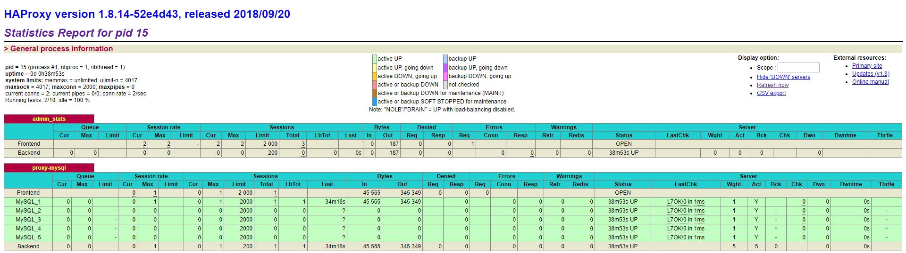

# Docker 搭建pxc集群 + haproxy + keepalived 高可用

## docker基本指令：
1. 更新软件包
```shell
yum -y update
```
2. 安装Docker虚拟机（centos 7）
```shell
yum install -y docker
```
3. 运行、重启、关闭Docker虚拟机
```shell
service docker start
service docker stop
```
3. 搜索镜像
```shell
 docker search 镜像名称
```
4. 下载镜像
```shell
docker pull 镜像名称
```
5. 查看镜像
```shell
docker images
```
6. 删除镜像
```shell
docker rmi 镜像名称
```
7. 运行容器
```shell
docker run 启动参数  镜像名称
```
8. 查看容器列表
```shell
docker ps -a
```
## 安装PXC集群
1. 安装PXC镜像
```shell
docker pull percona/percona-xtradb-cluster
```
2. 查看本地镜像
```shell
[root@VM_71_225_centos ~]# docker images
REPOSITORY                                 TAG                 IMAGE ID            CREATED             SIZE
docker.io/hello-world                      latest              e38bc07ac18e        2 months ago        1.85 kB
docker.io/percona/percona-xtradb-cluster   latest              f1439de62087        3 months ago        413 MB
docker.io/java                             latest              d23bdf5b1b1b        17 months ago       643 MB
```
3. docker.io/percona/percona-xtradb-cluster 太长，进行改名：
``` shell
[root@VM_71_225_centos ~]# docker tag percona/percona-xtradb-cluster pxc
[root@VM_71_225_centos ~]# docker images
REPOSITORY                                 TAG                 IMAGE ID            CREATED             SIZE
docker.io/percona/percona-xtradb-cluster   latest              f1439de62087        3 months ago        413 MB
pxc                                        latest              f1439de62087        3 months ago        413 MB
```

4. 创建net1网段：
```shell
docker network create --subnet=172.18.0.0/16 net1
```
5. 创建五个数据卷（pxc无法直接存取宿组机的数据，所以创建五个docker数据卷）
```shell
docker volume create v1
docker volume create v2
docker volume create v3
docker volume create v4
docker volume create v5
```
6. 查看数据卷位置：
```shell
[root@VM_71_225_centos code]# docker inspect v1
[
    {
        "Driver": "local",
        "Labels": {},
        "Mountpoint": "/var/lib/docker/volumes/v1/_data",
        "Name": "v1",
        "Options": {},
        "Scope": "local"
    }
]
```
7. 创建5节点的PXC集群

创建第1个MySQL节点
```shell
docker run -d -p 3306:3306 -e MYSQL_ROOT_PASSWORD=abc123456 -e CLUSTER_NAME=PXC -e XTRABACKUP_PASSWORD=abc123456 -v v1:/var/lib/mysql -v backup:/data --privileged --name=node1 --net=net1 --ip 172.18.0.2 pxc
```
等待2分钟后，再创建第二个节点，等待第一个节点实例化完毕后，才能开启第二个节点实例，不然会瞬间停止

创建其他节点：

创建第2个MySQL节点
```shell
docker run -d -p 3307:3306 -e MYSQL_ROOT_PASSWORD=abc123456 -e CLUSTER_NAME=PXC -e XTRABACKUP_PASSWORD=abc123456 -e CLUSTER_JOIN=node1 -v v2:/var/lib/mysql -v backup:/data --privileged --name=node2 --net=net1 --ip 172.18.0.3 pxc
```
创建第3个MySQL节点
``` shell
docker run -d -p 3308:3306 -e MYSQL_ROOT_PASSWORD=abc123456 -e CLUSTER_NAME=PXC -e XTRABACKUP_PASSWORD=abc123456 -e CLUSTER_JOIN=node1 -v v3:/var/lib/mysql --privileged --name=node3 --net=net1 --ip 172.18.0.4 pxc
```
创建第4个MySQL节点
``` shell
docker run -d -p 3309:3306 -e MYSQL_ROOT_PASSWORD=abc123456 -e CLUSTER_NAME=PXC -e XTRABACKUP_PASSWORD=abc123456 -e CLUSTER_JOIN=node1 -v v4:/var/lib/mysql --privileged --name=node4 --net=net1 --ip 172.18.0.5 pxc
```
创建第5个MySQL节点
```shell
docker run -d -p 3310:3306 -e MYSQL_ROOT_PASSWORD=abc123456 -e CLUSTER_NAME=PXC -e XTRABACKUP_PASSWORD=abc123456 -e CLUSTER_JOIN=node1 -v v5:/var/lib/mysql -v backup:/data --privileged --name=node5 --net=net1 --ip 172.18.0.6 pxc
```

## 安装Haproxy进行高可用与负载均衡
1. 在mysql集群数据库进行创建该用户haproxy
```shell
create user 'haproxy'@'%'  identified by '';
```
2. 拉取haproxy
```shell
docker pull haproxy
```
3. 编写Haproxy配置文件
```shell
vi /usr/local/docker/haproxy/haproxy.cfg
```
配置文件如下：
```conf
global
    #工作目录
    chroot /usr/local/etc/haproxy
    #日志文件，使用rsyslog服务中local5日志设备（/var/log/local5），等级info
    log 127.0.0.1 local5 info
    #守护进程运行
    daemon
​
defaults
    log global
    mode    http
    #日志格式
    option  httplog
    #日志中不记录负载均衡的心跳检测记录
    option  dontlognull
    #连接超时（毫秒）
    timeout connect 5000
    #客户端超时（毫秒）
    timeout client  50000
    #服务器超时（毫秒）
    timeout server  50000
​
#监控界面   
listen  admin_stats
    #监控界面的访问的IP和端口
    bind  0.0.0.0:8888
    #访问协议
    mode        http
    #URI相对地址
    stats uri   /dbs
    #统计报告格式
    stats realm     Global\ statistics
    #登陆帐户信息
    stats auth  admin:abc123456
#数据库负载均衡
listen  proxy-mysql
    #访问的IP和端口
    bind  0.0.0.0:3306  
    #网络协议
    mode  tcp
    #负载均衡算法（轮询算法）
    #轮询算法：roundrobin
    #权重算法：static-rr
    #最少连接算法：leastconn
    #请求源IP算法：source 
    balance  roundrobin
    #日志格式
    option  tcplog
    #在MySQL中创建一个没有权限的haproxy用户，密码为空。Haproxy使用这个账户对MySQL数据库心跳检测
    option  mysql-check user haproxy
    server  MySQL_1 172.18.0.2:3306 check weight 1 maxconn 2000  
    server  MySQL_2 172.18.0.3:3306 check weight 1 maxconn 2000  
    server  MySQL_3 172.18.0.4:3306 check weight 1 maxconn 2000 
    server  MySQL_4 172.18.0.5:3306 check weight 1 maxconn 2000
    server  MySQL_5 172.18.0.6:3306 check weight 1 maxconn 2000
    #使用keepalive检测死链
    option  tcpka  
```
4. 创建第1个Haproxy负载均衡服务器
```shell
docker run -it -d -p 4001:8888 -p 4002:3306 -v docker run -it -d -p 4001:8888 -p 4002:3306 -v /usr/local/docker/haproxy:/usr/local/etc/haproxy --name h1 --privileged --net=net1 --ip 172.18.0.7 haproxy
```
5. 进入h1容器，启动Haproxy
```shell
docker exec -it h1 bash
haproxy -f /usr/local/etc/haproxy/haproxy.cfg
```
6. 查看是否启动成功：
访问http://ip:4001/dbs


## 安装keepalive实现双击热备 