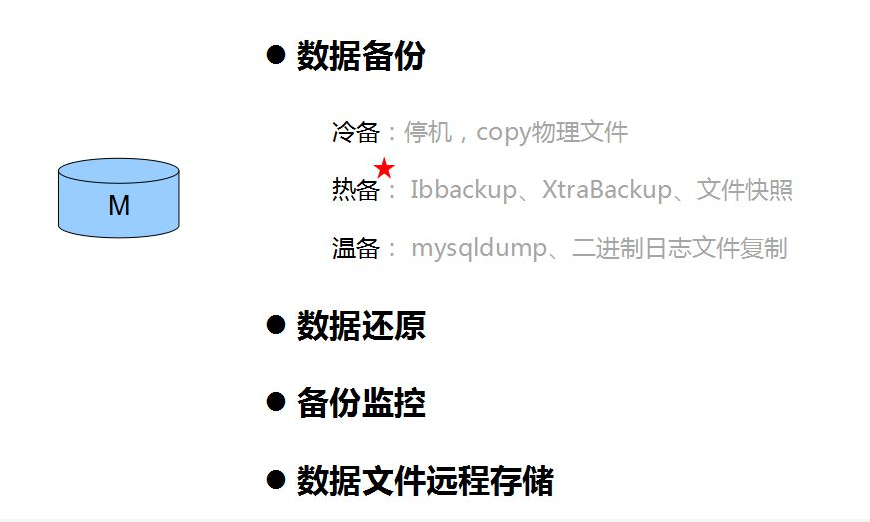

# 埋在MySQL数据库应用中的17个关键问题！

MySQL的使用非常普遍，跟MySQL有关的话题也非常多，如性能优化、高可用性、强一致性、安全、备份、集群、横向扩展、纵向扩展、负载均衡、读写分离等。要想掌握其中的精髓，可得花费不少功力，虽然目前流行的MySQL替代方案有很多，可是从最小成本最容易维护的角度而言，MySQL还是首选。下面从应用场景的角度切入，对MySQL的技术点进行组织，写一份知识图谱，方便进行更深入的学习和总结。

如下图整理，我试着把MySQL的应用场景分为6种，每种场景下需要考虑的重点问题不一样，从而引出不同问题点下需要补齐的知识点，后续继续基于这些知识点进行学习和整理。

## 一、单Master

单Master的情况是普遍存在的，对于很多个人站点、初创公司、小型内部系统，考虑到成本、更新频率、系统重要性等问题，系统只依赖一个单例数据库提供服务，基本上已经满足需求。这种场景下我觉得重点应该关注的话题有上图所示的四点。

其中最重要的环节是数据备份，如果是交易量非常低，并且具有非常明确的服务时间段特性的话，简单的mysqldump是可以胜任的。但是这是有缺陷的，数据还原之后注定从备份点到还原点之间的数据会丢失。然而在极多数的情况下，备份的工作是没法马虎的，如下列举的几点小细节。

### 1）冷备：
停机，直接copy物理文件，InnoDB引擎（frm文件、共享表空间文件、独立表空间文件、重做日志文件、my.cnf）。

恢复：把文件copy到对应目录。

### 2）热备： 
Ibbackup或者XtraBackup工具，记录重做日志文件检查点的LSN，copy共享表空间文件以及独立表空间文件（不产生任何阻塞），记录copy后重做日志文件检查点的LSN，copy备份是产生的重做日志。

恢复：恢复表空间文件，应用重做日志文件。

### 3）温备：

mysqldump，--single-transaction参数进行事务管理保证数据一致性。备份时不能用DDL语句。 恢复：直接执行文件，mysql –uroot –p <文件名.sql>

二进制半同步复制，主从服务器增量复制

恢复：mysqlbinlog

## 二、一主一从

考虑一主一从的多数初衷是系统性能和系统高可用性问题，除了单Master场景中的备份工作需要做好以外，还有性能优化、读写分离、负载均衡三项重点工作需要考虑。其中性能优化的内容比较多，也是一块大主题，要从系统的服务指标作为依据采取相应的动作，多数系统要求的是3秒内完成请求，总体换算下来，数据库大概可以有1.5秒的总执行时间，能满足这个性能要求就是合理的优化方案。下学期以这样的优先级来分别整理内容：索引优化 -》 表设计优化 -》数据库配置优化 -》硬件优化。

读写分离和负载均衡的实现相对简单些，我目前维护的系统比较落后，没有做读写分离，因为是一套以报表类功能为主的系统，而负载均衡是依赖php代码来做的，从实际运维效果来看，不大理想，而且负载均衡的代码过分嵌入到业务逻辑代码中，给代码维护带来一定噪音。下学期计划对各种中间件进行实践和性能测试，到时候把一些测试数据分享出来。

##  三、一主 n 从

一旦开始考虑一主多从的服务器架构，则证明你的系统对可用性、一致性、性能中一种或者多种的要求比较高。好多系统在开始搭建的时候都会往这个方向看齐，毕竟这样“看起来”系统会健壮很多。不过其实并不能单单依靠MySQL的配置和MySQL自带的中间件来解决可用性、一致性方面的问题。

## 四、横向集群

系统庞大到需要分库分表，其实是一件可喜可贺的事情，但是切记的是要前面提到性能优化工作做到极致之后才好考虑这些会增加系统复杂度的解决方案。横向集群主要是从业务特性的角度对系统进行切分，最彻底就是切分成了各个子系统，子系统之间通过一些数据同步的方案来把一些核心数据进行共享，以避免跨库调用跨库join。

然后是各种系统接口调用，把大事务拆成小事务，事务之间做好隔离和同步。上图中的三个问题在横向集群的架构体系中应属于很有特色的问题，在实际项目中其实是尽量去避免这些需求的存在的，不过如果确实需要了，也得有解决方案。下学期也将针对这些问题进行逐一整理，并测试一下一些号称支持这些功能的中间件。

## 五、纵向集群

横向集群的切分思路最终是切分子系统，而纵向集群最后遇到的最棘手的问题是扩缩容，我运维的一个系统是提前对数据做了256个切片，256切片中0~127切片和128~255切片分别存在两个一主两从的数据库集群中，系统运维了3年多，目前还没有扩容需求。设计初衷应该是考虑得到，假设有一天数据量非常大，可以把256个切片分4大片，分别存储到4个一主两从的集群中，从而实现扩容。

这个思路的确是可取的，只是我们的分库逻辑当前是php代码实现，也有一定程度上影响了业务代码的逻辑，运维起来有点心惊胆战，还是保持业务代码清爽比较好。

下学期将介绍一些实现了库路由功能的中间件的使用，也根据实际情况把想到的一些扩缩容方案实践一遍，敬请期待实操效果的分享。

## 六、混合模式

与其说这部分内容讨论上面5种场景的混合，不如说这部分内容是做总结。上面的5种场景中，一共列举了17个问题点，这17个问题点基本上都是叠加式的，越往深入的框架去做就越需要考虑齐这17个问题点。17个问题点考虑全了，混合模式下的问题就不成问题了。