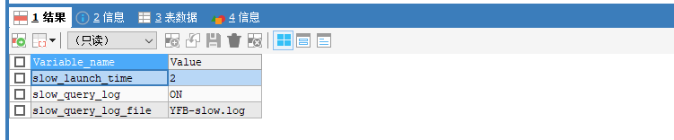
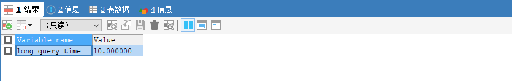
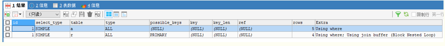

# MySQL 优化指南

## 慢查询日志 开启撒网模式

开启了MySQL慢查询日志之后，MySQL会自动将执行时间超过指定秒数的SQL统统记录下来，这对于搜罗线上慢SQL有很大的帮助。

``` sql
SHOW VARIABLES LIKE 'slow%'
```

以我刚安装的mysql5.7为例 查询结果是这样子的：



1. slow_launch_time：表示如果建立线程花费了比这个值更长的时间,slow_launch_threads 计数器将增加
2. slow_query_log：是否开启慢查询日志 ON开启，OFF关闭 默认没有开启
3. slow_query_log_file：日志保存路径

``` sql
SHOW VARIABLES LIKE 'long%'
```



long_query_time：达到多少秒的sql就记录日志

客户端可以用set设置变量的方式让慢查询开启，但是个人不推荐，因为真实操作起来会有一些问题，比如说，重启MySQL后就失效了，或者是开启了慢查询，我又去改变量值，它就不生效了。

## 编辑MySQL的配置文件：

```shell
vim /etc/my.cnf
```

加入如下三行：

``` config
slow_query_log=ON
slow_query_log_file=/var/lib/mysql/localhost-centos-slow.log
long_query_time=3
```

我这里设置的是3秒

## 重启MySQL

```shell
systemctl restart mysqld;
```

## 服务器开一个监控：

```shell
tail -f /var/lib/mysql/localhost-centos-slow.log
```

## 客户端走一条SQL：

```sql
SELECT SLEEP(3)
```

此时发现sql已经被记录到日志里了。（有时候不一定，我看到很多博客讲的是超过指定秒数，但我实验得出的结果是达到指定秒数）

## EXPLAIN 点对点分析

explain是一个神奇的命令，可以查看sql的具体的执行计划。

以一条联查sql为例：

```sql
SELECT a.id,a.cn_name,a.role_id,r.name
FROM tb_usr_admins a
INNER JOIN tb_base_roles r ON r.id=a.role_id
WHERE a.cn_name="接单人员"
```

查询结果是：


加上explain命令来执行：

```sql
EXPLAIN
SELECT a.id,a.cn_name,a.role_id,r.name
FROM tb_usr_admins a
INNER JOIN tb_base_roles r ON r.id=a.role_id
WHERE a.cn_name="接单人员"
```

查询结果是：


这就是这条SQL的执行计划，下面来说明一下这个执行计划怎么看

id：代表优先级  id值越大，越先执行，id值相同，从上往下执行。（比如示例的这条sql的执行计划，就是先执行第一行，再执行第二行）

## select_type：表示select类型 取值如下

- simple 简单表 即不使用表连接或者子查询
- primary 包含union或者子查询的主查询 即外层的查询
- union UNION中的第二个或者后面的查询语句
- subquery 一般子查询中的子查询被标记为subquery，也就是位于select列表中的查询
- derived 派生表 该临时表是从子查询派生出来的
- 等等

## type：表示MySQL在表中查找数据的方式，或者叫访问类型，以下对于type取值的说明 从上往下性能由最差到最好

1. all:全表扫描，MySQL遍历全表来找到匹配的行
2. index：索引全扫描，MySQL遍历挣个索引来查询匹配的行
3. range：索引范围扫描，常见于<、<=、>、>=、between等操作符
4. ref：使用非唯一索引或唯一索引的前缀扫描，返回匹配的单行数据
5. eq_ref：类似ref，区别就在于使用的索引是唯一索引，简单来说，就是多表连接中使用primary key或者unique index作为关联条件。
6. const/system：单表中最多有一个匹配行，查询起来非常迅速，常见于根据primary key或者唯一索引unique index进行的单表查询
7. null：mysql不用访问表或者索引，直接就能够得到查询的结果，例如select 1+2 as result。

## possible_keys：表示查询时可能使用的索引

## key：表示实际使用的索引

## key_len：使用到索引字段的长度

## rows：扫描数量

## Extra：执行情况的说明和描述，包含不适合在其他列中显示但是对执行计划非常重要的额外信息，常用取值如下：

- Using index：直接访问索引就取到了数据，高性能的表现。
- Using where：直接在主键索引上过滤数据，必带where子句，而且用不上索引
- Using index condition：先条件过滤索引，再查数据，
- Using filesort：使用了外部文件排序 只要见到这个 就要优化掉
- Using temporary：创建了临时表来处理查询 只要见到这个 也要尽量优化掉

## 优化争议无数的count()

## 统计列与统计行？

COUNT()是一个特殊的函数，有两种不同的作用，它可以统计某个列值的数量，也可以统计行数。

在统计列值的时候要求列值是非空的，也就是不统计null。

当我们统计行的时候，常见的是COUNT(*)，这种情况下，通配符*并不会像我们猜想的那样扩展成所有的列，实际上，它会忽略所有的列而直接统计所有的行数

## 解密MyiSAM的‘快’

这是一个容易产生误解的事情：MyiSAM的count()函数总是非常快。

不过它是有前提条件的，条件是没有任何where条件的count(*)才非常快，因为此时无须实际的去计算表的行数，mysql可以利用存储引擎的特性直接获得这个值，如果mysql知道某列不可能有null值，那么mysql内部会将count(列)表达式优化为count(*)。

当统计带有where条件的查询，那么mysql的count()和其他存储引擎就没有什么不同了。

## COUNT(1)、COUNT(*)、COUNT(列)

（先提前申明，本人是在innodb库里做的实验。）

1. count(1)和count(*)直接就是统计主键，他们两个的效率是一样的。如果删除主键，他们都走全表扫描。

2. 如果count(列)中的字段是索引的话，count(列)和count(*)一样快，否则count(列)走全表扫描。

## 优化order by 语句

## MySQL的排序方式

优化order by语句就不得不了解mysql的排序方式。

1. 第一种通过有序索引返回数据，这种方式的extra显示为Using Index,不需要额外的排序，操作效率较高。

2. 第二种是对返回的数据进行排序，也就是通常看到的Using filesort，filesort是通过相应的排序算法，将数据放在sort_buffer_size系统变量设置的内存排序区中进行排序，如果内存装载不下，它就会将磁盘上的数据进行分块，再对各个数据块进行排序，然后将各个块合并成有序的结果集。

## filesort的优化

了解了MySQL排序的方式，优化目标就清晰了：尽量减少额外的排序，通过索引直接返回有序数据。where条件和order by使用相同的索引。

1. 创建合适的索引减少filesort的出现。

2. 查询时尽量只使用必要的字段，select 具体字段的名称，而不是select * 选择所有字段，这样可以减少排序区的使用，提高SQL性能。

## 优化group by 语句

## 为什么order by后面不能跟group by

事实上，MySQL在所有的group by 后面隐式的加了order by ，也就是说group by语句的结果会默认进行排序。

如果你要在order by后面加group by ，那结果执行的SQL是不是这样：select * from tb order by … group by … order by … ？ 这不是搞笑吗？

## 禁止排序

既然知道问题了，那么就容易优化了，如果查询包括group by但又不关心结果集的顺序，而这种默认排序又导致了需要文件排序，则可以指定order by null 禁止排序。

例如：

```sql
select * from tb group by name order by null;
```

## 优化limit 分页

一个非常常见又非常头痛的场景：‘limit 1000,20’。

这时MySQL需要查询1020条记录然后只返回最后20条，前面的1000条都将被抛弃，这样的代价非常高。如果所有页面的访问频率都相同，那么这样的查询平均需要访问半个表的数据。

## 第一种思路 在索引上分页

在索引上完成分页操作，最后根据主键关联回原表查询所需要的其他列的内容。

例如：

```sql
SELECT * FROM tb_user LIMIT 1000,10
```

可以优化成这样：

```sql
SELECT * FROM tb_user u
INNER JOIN (SELECT id FROM tb_user LIMIT 1000,10) AS b ON b.id=u.id
```

## 第二种思路 将limit转换成位置查询

这种思路需要加一个参数来辅助，标记分页的开始位置：

```sql
SELECT * FROM tb_user WHERE id > 1000 LIMIT 10
```

## 优化子查询

子查询，也就是查询中有查询，常见的是where后面跟一个括号里面又是一条查询sql

尽可能的使用join关联查询来代替子查询。

当然 这不是绝对的，比如某些非常简单的子查询就比关联查询效率高，事实效果如何还要看执行计划。

只能说大部分的子查询都可以优化成Join关联查询。

## 改变执行计划

## 提高索引优先级

use index 可以让MySQL去参考指定的索引，但是无法强制MySQL去使用这个索引，当MySQL觉得这个索引效率太差，它宁愿去走全表扫描。。。

```sql
SELECT * FROM tb_user USE INDEX (user_name)
```

注意：必须是索引，不能是普通字段，（亲测主键也不行）。

## 忽略索引

ignore index 可以让MySQL忽略一个索引

SELECT * FROM tb_user IGNORE INDEX (user_name) WHERE user_name="张学友"

## 强制使用索引

使用了force index 之后 尽管效率非常低，MySQL也会照你的话去执行

```sql
SELECT * FROM tb_user FORCE INDEX (user_name) WHERE user_name="张学友"
```

## 个人分享

查看执行计划时建议依次观察以下几个要点：

1. SQL内部的执行顺序。
2. 查看select的查询类型。
3. 实际有没有使用索引。
4. Extra描述信息

PS:一定要养成查看执行计划的习惯，这个习惯非常重要。