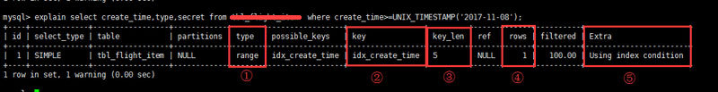
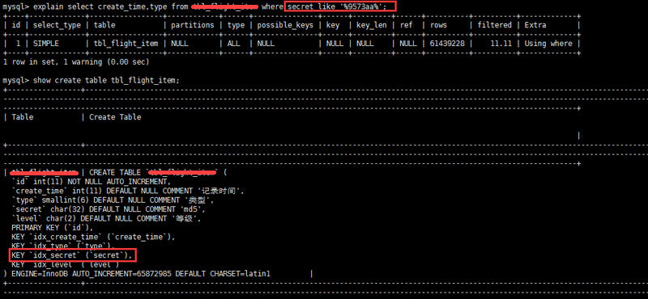
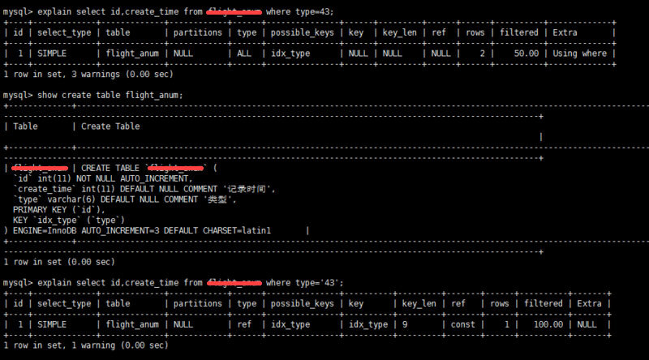

# 项目中常用的19条MySQL优化

## 一、EXPLAIN

做MySQL优化，我们要善用 EXPLAIN 查看SQL执行计划。

下面来个简单的示例，标注(1,2,3,4,5)我们要重点关注的数据



1. type列，连接类型。一个好的sql语句至少要达到range级别。杜绝出现all级别
2. key列，使用到的索引名。如果没有选择索引，值是NULL。可以采取强制索引方式
3. key_len列，索引长度
4. rows列，扫描行数。该值是个预估值
5. extra列，详细说明。注意常见的不太友好的值有：Using filesort, Using temporary

## 二、SQL语句中IN包含的值不应过多

MySQL对于IN做了相应的优化，即将IN中的常量全部存储在一个数组里面，而且这个数组是排好序的。但是如果数值较多，产生的消耗也是比较大的。再例如：select id from table_name where num in(1,2,3) 对于连续的数值，能用 between 就不要用 in 了；再或者使用连接来替换。

## 三、SELECT语句务必指明字段名称

SELECT *增加很多不必要的消耗（cpu、io、内存、网络带宽）；增加了使用覆盖索引的可能性；当表结构发生改变时，前断也需要更新。所以要求直接在select后面接上字段名。

## 四、当只需要一条数据的时候，使用limit 1

这是为了使EXPLAIN中type列达到const类型

## 五、如果排序字段没有用到索引，就尽量少排序

## 六、如果限制条件中其他字段没有索引，尽量少用or

or两边的字段中，如果有一个不是索引字段，而其他条件也不是索引字段，会造成该查询不走索引的情况。很多时候使用 union all 或者是union(必要的时候)的方式来代替“or”会得到更好的效果

## 七、尽量用union all代替union

union和union all的差异主要是前者需要将结果集合并后再进行唯一性过滤操作，这就会涉及到排序，增加大量的CPU运算，加大资源消耗及延迟。当然，union all的前提条件是两个结果集没有重复数据。

## 八、不使用ORDER BY RAND()

``` sql
select id from `table_name` order by rand() limit 1000;
```

上面的sql语句，可优化为

``` sql
select id from `table_name` t1 join (select rand() * (select max(id) from `table_name`) as nid) t2 on t1.id > t2.nid limit 1000;
```

## 九、区分in和exists， not in和not exists

``` sql
select * from 表A where id in (select id from 表B)
```

上面sql语句相当于

``` sql
select * from 表A where exists(select * from 表B where 表B.id=表A.id)
```

区分in和exists主要是造成了驱动顺序的改变（这是性能变化的关键），如果是exists，那么以外层表为驱动表，先被访问，如果是IN，那么先执行子查询。所以IN适合于外表大而内表小的情况；EXISTS适合于外表小而内表大的情况。
关于not in和not exists，推荐使用not exists，不仅仅是效率问题，not in可能存在逻辑问题。如何高效的写出一个替代not exists的sql语句？

原sql语句

``` sql
select colname … from A表 where a.id not in (select b.id from B表)
```

高效的sql语句

``` sql
select colname … from A表 Left join B表 on where a.id = b.id where b.id is null
```

取出的结果集如下图表示，A表不在B表中的数据


## 十、使用合理的分页方式以提高分页的效率

``` sql
select id,name from table_name limit 866613, 20
```

使用上述sql语句做分页的时候，可能有人会发现，随着表数据量的增加，直接使用limit分页查询会越来越慢。

优化的方法如下：可以取前一页的最大行数的id，然后根据这个最大的id来限制下一页的起点。比如此列中，上一页最大的id是866612。sql可以采用如下的写法：

``` sql
select id,name from table_name where id> 866612 limit 20
```

## 十一、分段查询

在一些用户选择页面中，可能一些用户选择的时间范围过大，造成查询缓慢。主要的原因是扫描行数过多。这个时候可以通过程序，分段进行查询，循环遍历，将结果合并处理进行展示。

如下图这个sql语句，扫描的行数成百万级以上的时候就可以使用分段查询


## 十二、避免在 where 子句中对字段进行 null 值判断

对于null的判断会导致引擎放弃使用索引而进行全表扫描。

## 十三、不建议使用%前缀模糊查询

例如LIKE “%name”或者LIKE “%name%”，这种查询会导致索引失效而进行全表扫描。但是可以使用LIKE “name%”。

**那如何查询%name%**?

如下图所示，虽然给secret字段添加了索引，但在explain结果果并没有使用



那么如何解决这个问题呢，答案：**使用全文索引**

在我们查询中经常会用到select id,fnum,fdst from table_name where user_name like '%zhangsan%'; 。这样的语句，普通索引是无法满足查询需求的。庆幸的是在MySQL中，有全文索引来帮助我们。

创建全文索引的sql语法是：

``` sql
ALTER TABLE `table_name` ADD FULLTEXT INDEX `idx_user_name` (`user_name`);
```

使用全文索引的sql语句是：

``` sql
select id,fnum,fdst from table_name where match(user_name) against('zhangsan' in boolean mode);
```

**注意：在需要创建全文索引之前，请联系DBA确定能否创建。同时需要注意的是查询语句的写法与普通索引的区别**.

## 十四、避免在where子句中对字段进行表达式操作

比如

``` sql
select user_id,user_project from table_name where age*2=36;
```

中对字段就行了算术运算，这会造成引擎放弃使用索引，建议改成

``` sql
select user_id,user_project from table_name where age=36/2;
```

## 十五、避免隐式类型转换

where 子句中出现 column 字段的类型和传入的参数类型不一致的时候发生的类型转换，建议先确定where中的参数类型



## 十六、对于联合索引来说，要遵守最左前缀法则

举列来说索引含有字段id,name,school，可以直接用id字段，也可以id,name这样的顺序，但是name;school都无法使用这个索引。所以在创建联合索引的时候一定要注意索引字段顺序，常用的查询字段放在最前面

## 十七、必要时可以使用force index来强制查询走某个索引

有的时候MySQL优化器采取它认为合适的索引来检索sql语句，但是可能它所采用的索引并不是我们想要的。这时就可以采用force index来强制优化器使用我们制定的索引。

## 十八、注意范围查询语句

对于联合索引来说，如果存在范围查询，比如between,>,<等条件时，会造成后面的索引字段失效。

## 十九、关于JOIN优化


* LEFT JOIN A表为驱动表
* INNER JOIN MySQL会自动找出那个数据少的表作用驱动表
* RIGHT JOIN B表为驱动表

注意：**MySQL中没有full join，可以用以下方式来解决**

``` sql
select * from A left join B on B.name = A.name
where B.name is null
 union all
select * from B;
```

### 尽量使用inner join，避免left join

参与联合查询的表至少为2张表，一般都存在大小之分。如果连接方式是inner join，在没有其他过滤条件的情况下MySQL会自动选择小表作为驱动表，但是left join在驱动表的选择上遵循的是左边驱动右边的原则，即left join左边的表名为驱动表。

### 合理利用索引

被驱动表的索引字段作为on的限制字段。

### 利用小表去驱动大表


从原理图能够直观的看出如果能够减少驱动表的话，减少嵌套循环中的循环次数，以减少 IO总量及CPU运算的次数。

### 巧用STRAIGHT_JOIN

inner join是由mysql选择驱动表，但是有些特殊情况需要选择另个表作为驱动表，比如有group by、order by等「Using filesort」、「Using temporary」时。STRAIGHT_JOIN来强制连接顺序，在STRAIGHT_JOIN左边的表名就是驱动表，右边则是被驱动表。**在使用STRAIGHT_JOIN有个前提条件是该查询是内连接，也就是inner join。其他链接不推荐使用**


这个方式有时可能减少3倍的时间。