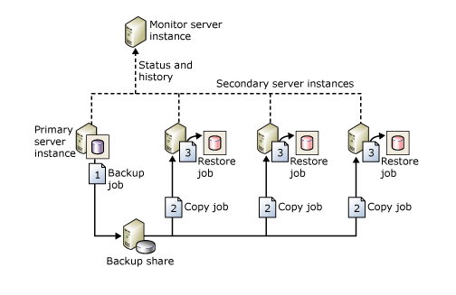
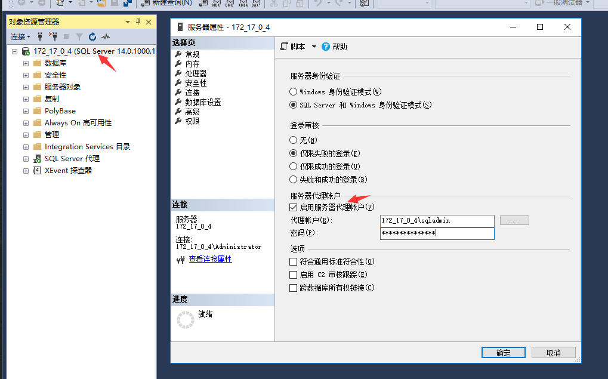
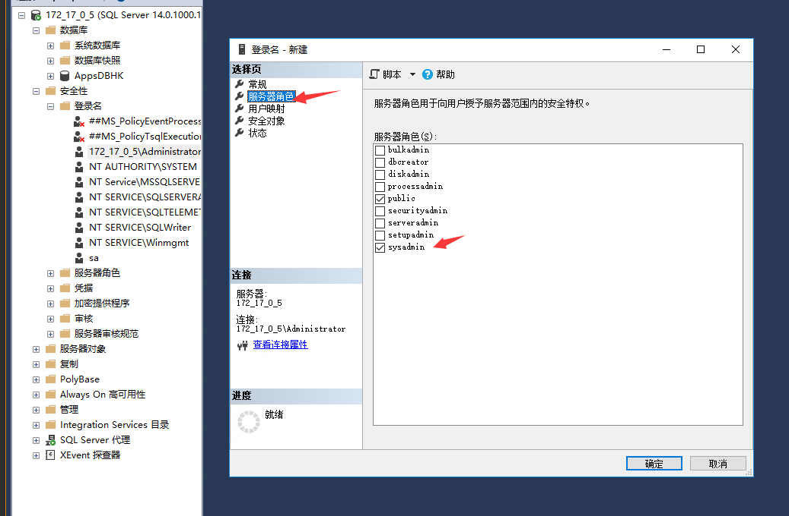
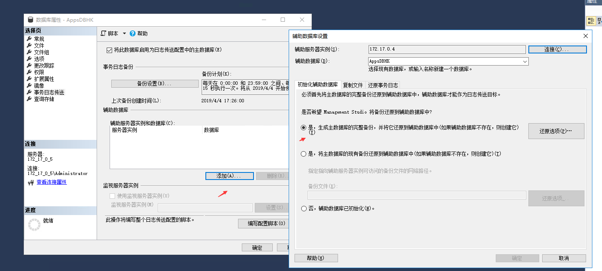
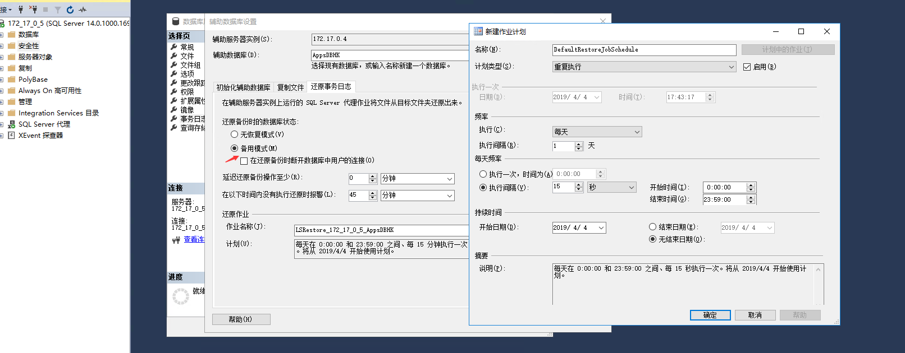

# SQL Server 2017搭建主从备份

### 关于日志传输

和Oracle DG，Mysql主从一样，SQL Server也支持主从的高可用。进一步提高数据的安全性和业务的高可用。通过将主库上的日志传输到备用实例上，从而达到主备库数据的一致性。

优点
* 可以为一个主库添加多个备库，从而提高数据灾难性恢复的解决方法。
* 和其他数据库主从一样，从库可以提高只读访问(在还原数据期间)。
* 可以自定义数据延迟应用时间。这样好处就是如果主库错误修改了数据，而从库还没有应用修改的数据，那么就可以通过从库来把错误环境的数据还原回来。

日志传输过程
* 在主服务器实例中备份事务日志。
* 将事务日志文件复制到辅助服务器实例。
* 在辅助服务器实例中还原日志备份。

日志可传送到多个辅助服务器实例。 在这些情况下，将针对每个辅助服务器实例重复执行操作 2 和操作 3。
日志传送配置不会自动从主库故障转移到辅助服务器。 如果主数据库变为不可用，可手动切换到任意一个从库。
下图是由一个主库，三个从库组成的主从环境。

注：SQL Server 2008 Enterprise 及更高版本支持备份压缩。

### 前提条件

主数据库必须处于Full恢复模式或大容量日志恢复模式。
在配置日志传送之前，必须创建共享备份目录，以便备库可以访问事务日志备份。 这是对生成事务日志备份的目录的共享。 例如，如果将事务日志备份到目录 E:\log_backup，则可以对该目录创建共享。

### 搭建主从

下面步骤是可选的，使用administrator管理员账户也是可以的。如果是使用administrator用户，则下文中关于sqladmin用户权限相关的，替换为administrator。

1. 主从两台分别创建sqladmin用户加入administrators组删除默认的users组，并且设置"密码永不过期"和"用户不能更改密码" 为sqladmin创建一个密码
win+R，输入lusrmgr.msc
2. 设置用户权限 右击用户，点击“属性”，将默认的USERS组删除，新增Administrators组。

3. 设置共享目录 在主或者从服务器上创建日志存放目录E:\log_backup

在“高级共享”窗口中，勾选“共享此文件夹”选项，然后单机“权限”按钮对该共享文件夹的权限进行设置。需要让sqladmin用户具有完全控制该文件夹的权限，先将默认的“erverone”用户删除，然后添加sqladmin,administaor用户，并在“sqladmin,administaor”的权限中勾选“完全控制”，“更改”和“读取”项，然后单击两次“确定”按钮保存共享设置。

在NTFS文件系统中，还需要设置用户对该目录的安全权限，如果安全权限不够，系统在写入备份文件的时候会报没有权限的错误。
可以在“安全”选项卡，单机“编辑”按钮，在“log_backup的权限”界面，单击“按钮”，添加sqladmin用户，然后在“sqladmin的权限”中选择“完全控制”权限，单机“确定”按钮保存权限信息。

4. 配置SQL Server启动模式

分别从主数据库服务器上和从数据库服务器上打开SQLServer配置管理器，将SQLServer服务和SQLServer代理服务的“登录身为”sqladmin用户且启动模式为：自动

5. 配置日志传输
右击数据库服务器实例，选择“属性”选项，在弹出的“服务器属性”界面中，单机左侧的“安全性”，然后在右侧窗口中的“服务器身份验证”中选择“SQLServer和Windows身份验证模式”，并勾选“服务器代理账户”中的“启用服务器代理账户”选项。输入正确的“代理账号”和“密码”，单击“确定”按钮保存配置信息。。

6. 在主数据库服务器中配置要同步的数据库AppsHK属性

7. 设置完之后选择“事务日志传送”，勾选“将此数据库启用未日志传送配置中的主数据库”选项，单击“事务日志备份”中的“备份设置按钮”，打开“事务日志备份设置”界面。

8. 主库上备份文件夹的网路路径可以在备库上进行测试，看备库能否访问
备库上进行操作：

9. 点击计划,在“作业计划属性”界面，确认“计划类型”为重复执行，为测试效果明显，设置为15秒执行一次作业计划。最后确认“持续时间”，根据自己需要设置，如果一直备份的话，可以设置为“无结束日期”。

10. 设置完成，确认之后再次打开“事务日志备份设置”界面，则备份作业的作业名称后面变成“编辑作业”按钮，单击进去，将“所有者”修改为sqladmin。

如果没有sqladmin先添加

11. 单击数据库属性界面的“辅助数据库”中的“添加”按钮，打开“辅助数据库设置”窗口。

12. 设置完之后点击确定按钮，在数据库属性配置界面将配置好的脚本保存到本地，最后点击确定

到此数据库主从配置完成，可以在主库进行操作，在从库上查看对应的数据是否同步，如果没有同步成功，可以在从库上查看同步任务状态，查看失败原因。

