# Cat分布式监控

## Cat 是什么？

CAT（Central Application Tracking）是基于 Java 开发的实时应用监控平台，包括实时应用监控，业务监控。

CAT 作为服务端项目基础组件，提供了 Java, C/C++, Node.js, Python, Go 等多语言客户端，已经在美团点评的基础架构中间件框架（MVC 框架，RPC 框架，数据库框架，缓存框架等，消息队列，配置系统等）深度集成，为美团点评各业务线提供系统丰富的性能指标、健康状况、实时告警等。

CAT 很大的优势是它是一个实时系统，CAT 大部分系统是分钟级统计，但是从数据生成到服务端处理结束是秒级别，秒级定义是 48 分钟 40 秒，基本上看到 48 分钟 38 秒数据，整体报表的统计粒度是分钟级；第二个优势，监控数据是全量统计，客户端预计算；链路数据是采样计算。

[Github Cat](https://github.com/dianping/cat)

## Cat 功能亮点

* 实时处理：信息的价值会随时间锐减，尤其是事故处理过程中
* 全量数据：全量采集指标数据，便于深度分析故障案例
* 高可用：故障的还原与问题定位，需要高可用监控来支撑
* 故障容忍：故障不影响业务正常运转、对业务透明
* 高吞吐：海量监控数据的收集，需要高吞吐能力做保证
* 可扩展：支持分布式、跨 IDC 部署，横向扩展的监控系统

## 为什么要用 Cat?

**场景一:** 用户反馈 App 无法下单，用户反馈无法支付，用户反馈商品无法搜索等问题

场景一的问题在于当系统出现问题后，第一反馈的总是用户。我们需要做的是什么，是在出问题后研发第一时间知晓，而不是让用户来告诉我们出问题了。

Cat 可以出故障后提供秒级别的异常告警机制，不用再等用户来反馈问题了。

**场景二:** 出故障后如何快速定位问题

一般传统的方式当出现问题后，我们就会去服务器上看看服务是否还存活。如果存活就会看看日志是否有异常信息。

在 Cat 后台的首页，会展示各个系统的运行情况，如果有异常，则会大片飘红，非常明显。最直接的方式还是直接查看 Problem 报表，这里会为我们展示直接的异常信息，快速定位问题。

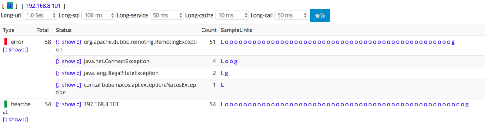

**场景三:** 用户反馈订单列表要 10 几秒才展示，用户反馈下单一直在转圈圈

场景三属于优化相关，对于研发来说，优化是一个长期的过程，没有最好只有更好。优化除了需要有对应的方案，最重要的是要对症下药。

所谓的对症下药也就是在优化之前，你得先知道哪里比较慢。RPC 调用慢？数据库查询慢？缓存更新慢?

Cat 可以提供详细的性能数据，95 线，99 线等。更细粒度的就是可以看到某个请求或者某个业务方法的所有耗时逻辑，前提是你做了埋点操作。

## Cat 报表

>Cat 目前有五种报表，每种都有特定的应用场景，下面我们来具体聊聊这些报表的作用。

**Transaction 报表** 适用于监控一段代码运行情况，比如：运行次数、QPS、错误次数、失败率、响应时间统计（平均影响时间、Tp 分位值）等等场景。

埋点方式：

``` java
public void shopService() {
    Transaction transaction = Cat.newTransaction("ShopService", "Service");
    try {
        service();
        transaction.setStatus(Transaction.SUCCESS);
    } catch (Exception e) {
        transaction.setStatus(e); // catch 到异常，设置状态，代表此请求失败
        Cat.logError(e); // 将异常上报到cat上
        // 也可以选择向上抛出：throw e;
    } finally {
        transaction.complete();
    }
}
```

可以在基础框架中对 Rpc, 数据库等框架进行埋点，这样就可以通过 Cat 来监控这些组件了。

业务中需要埋点也可以使用 Cat 的 Transaction，比如下单，支付等核心功能，通常我们对 URL 进行埋点就可以了，也就包含了具体的业务流程。

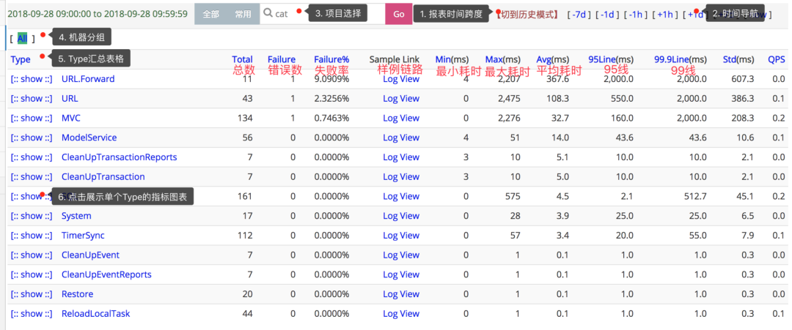


**Event 报表** 适用于监控一段代码运行次数，比如记录程序中一个事件记录了多少次，错误了多少次。Event 报表的整体结构与 Transaction 报表几乎一样，只缺少响应时间的统计。

埋点方式：
``` java
Cat.logEvent("Func", "Func1");
```

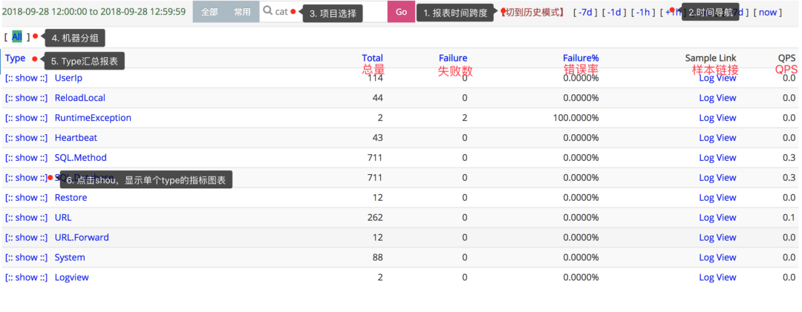

**Problem 报表** Problem 记录整个项目在运行过程中出现的问题，包括一些异常、错误、访问较长的行为。

如果有人反馈你的接口报 500 错误了，你进 Cat 后就直接可以去 Problem 报表了，错误信息就在 Problem 中。

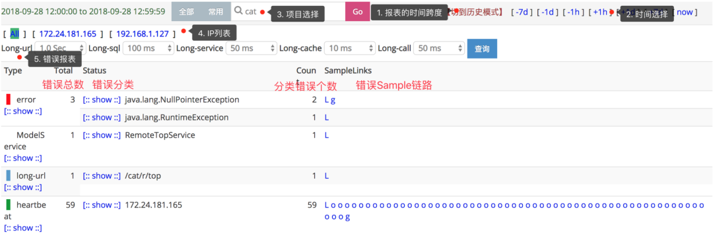

Problem 报表不需要手动埋点，我们只需要在项目中集成日志的 LogAppender 就可以将所有 error 异常记录，下面的段落中会讲解如何整合 LogAppender。

**Heartbeat 报表** Heartbeat 报表是 CAT 客户端，以一分钟为周期，定期向服务端汇报当前运行时候的一些状态。

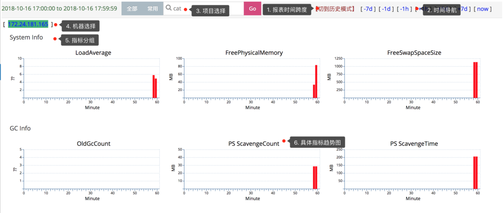

系统指标有系统的负载信息，内存使用情况，磁盘使用情况等。

JVM 指标有 GC 相关信息，线程相关信息。

**Business 报表** Business 报表对应着业务指标，比如订单指标。与 Transaction、Event、Problem 不同，Business 更偏向于宏观上的指标，另外三者偏向于微观代码的执行情况。

这个报表我也没怎么用过，用的多的还是前面几个。

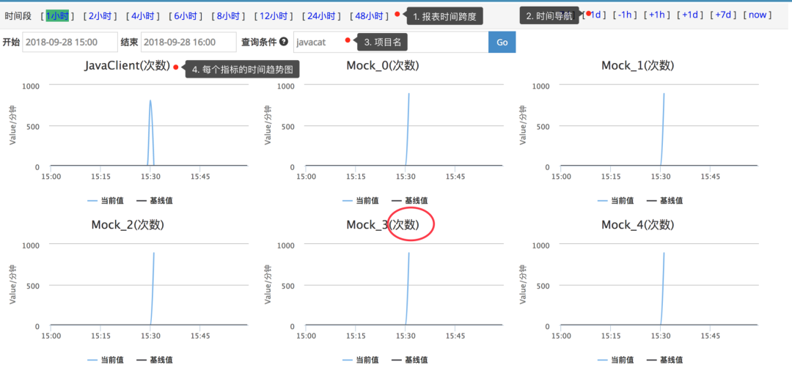

## Cat 在 Kitty Cloud 中的应用

>Kitty Cloud 的基础组件是 Kitty，Kitty 里面对需要的一些框架都进行了一层包装，比如扩展，增加 Cat 埋点之类的功能。

**Cat 的集成** Kitty 中对 Cat 封装了一层，在使用的时候直接依赖 kitty-spring-cloud-starter-cat 即可整合 Cat 到项目中。

```
<dependency>
       <groupId>com.cxytiandi</groupId>
       <artifactId>kitty-spring-cloud-starter-cat</artifactId>
       <version>Kitty Version</version>
</dependency>
```
然后在 application 配置文件中配置 Cat 的服务端地址信息，多个英文逗号分隔：

``` yml
cat.servers=47.105.66.210
```

在项目的 resources 目录下创建 META-INF 目录，然后在 META-INF 中创建 app.properties 文件配置 app.name。此名称是在 Cat 后台显示的应用名

``` yml
app.name=kitty-cloud-comment-provider
```
最后需要配置一下 Cat 的 LogAppender，这样应用在记录 error 级别的日志时，Cat 可以及时进行异常告警操作。

在 logback.xml 增加下面的配置：
``` yml
<appender name="CatAppender" class="com.dianping.cat.logback.CatLogbackAppender"></appender>
 <root level="INFO">
     <appender-ref ref="CatAppender" />
 </root>
```

[更详细的内容请移步 Cat 的 Github 主页进行查看。]()

**MVC 框架埋点** 基于 Spring Boot 做 Web 应用开发，我们最常用到的一个 Starter 包就是 spring-boot-starter-web。

如果你使用了 Kitty 来构建微服务的框架，那么就不再需要直接依赖 spring-boot-starter-web。而是需要依赖 Kitty 中的 kitty-spring-cloud-starter-web。

kitty-spring-cloud-starter-web 在 spring-boot-starter-web 的基础上进行了封装，会对请求的 Url 进行 Cat 埋点，会对一些通用信息进行接收透传，会对 RestTemplate 的调用进行 Cat 埋点。

在项目中依赖 kitty-spring-cloud-starter-web：

``` 
<dependency>
      <groupId>com.cxytiandi</groupId>
      <artifactId>kitty-spring-cloud-starter-web</artifactId>
      <version>Kitty Version</version>
</dependency>
```

启动项目，然后访问你的 REST API。可以在 Cat 的控制台看到 URL 的监控信息。

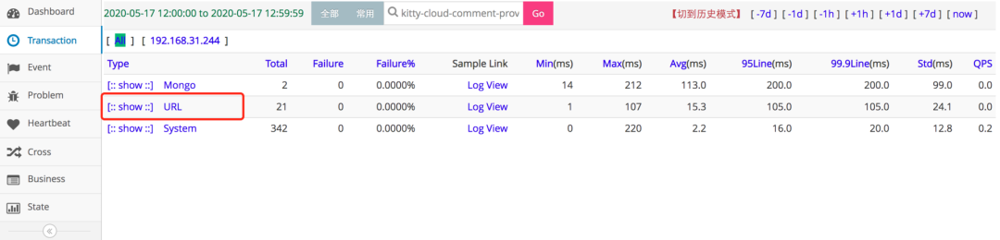

点击 URL 进去可以看到具体的 URL 信息。

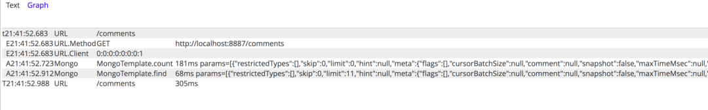

**Mybatis 埋点**

Kitty 中 Mybatis 是用的 Mybatis Plus, 主要是对数据库相关操作的 SQL 进行了 Cat 埋点，可以很方便的查看 SQL 的耗时情况。

依赖 kitty-spring-cloud-starter-mybatis：

```
<dependency>
     <groupId>com.cxytiandi</groupId>
     <artifactId>kitty-spring-cloud-starter-mybatis</artifactId>
     <version>Kitty Version</version>
 </dependency> 
```
[其他的使用方式还是跟 Mybatis Plus 一样，具体参考 Mybatis Plus 文档](https://mp.baomidou.com)

只要涉及到数据库的操作，都会在 Cat 中进行数据的展示。

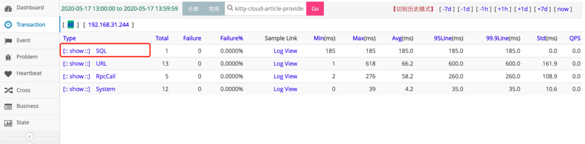

点击 SQL 进去还可以看到是哪个 Mapper 的操作。

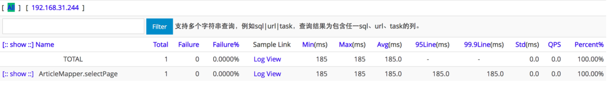

再进一步就可以看到具体的 SQL 语句和消耗的时间。

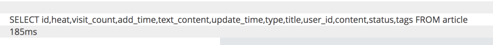

有了这些数据，后端研发同学就可以对相关的 SQL 进行优化了。

**Redis 埋点**如果需要使用 Spring Data Redis 的话，直接集成 kitty-spring-cloud-starter-redis 就可以，kitty-spring-cloud-starter-redis 中对 Redis 的命令进行了埋点，可以在 Cat 上直观的查看对应的命令和消耗的时间。

添加对应的 Maven 依赖：

```
<dependency>
     <groupId>com.cxytiandi</groupId>
     <artifactId>kitty-spring-cloud-starter-redis</artifactId>
     <version>Kitty Version</version>
 </dependency>
```

直接使用 StringRedisTemplate：

``` java
@Autowired
private StringRedisTemplate stringRedisTemplate;
 
stringRedisTemplate.opsForValue().set("name", "yinjihuan");
```

Cat 中可以看到 Redis 信息。

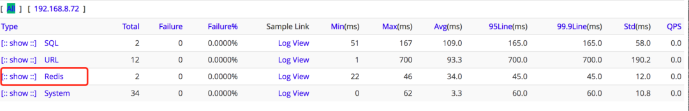

点击 Redis 进去可以看到有哪些命令。

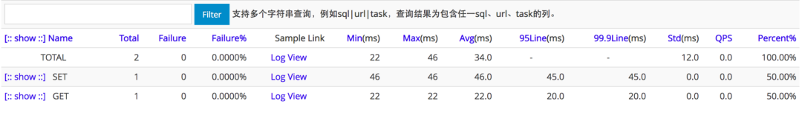

**MongoDB 埋点** Kitty 中对 Spring Data Mongodb 做了封装，只对 MongoTemplate 做了埋点。使用时需要依赖 kitty-spring-cloud-starter-mongodb。

```
<dependency>
    <groupId>com.cxytiandi</groupId>
    <artifactId>kitty-spring-cloud-starter-mongodb</artifactId>
    <version>Kitty Version</version>
</dependency>
```

在发生 Mongo 的操作后，Cat 上就可以看到相关的数据了。

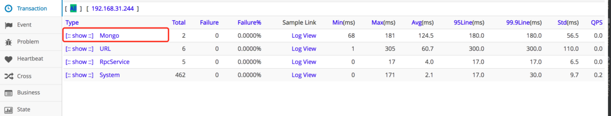

点进去就可以看到是 MongoTemplate 的哪个方法发生了调用。

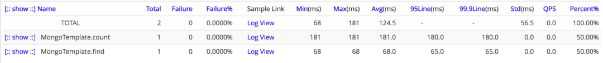

再进一步就可以看到具体的 Mongo 参数和消耗的时间。

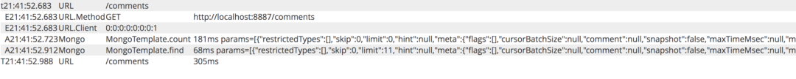

还有 Dubbo, Feign，Jetcache，ElasticSearch 等框架的埋点就不细讲了，感兴趣的可以移步 Github 查看代码。

## Cat 使用小技巧

**埋点工具类**如果要对业务方法进行监控，我们一般会用 Transaction 功能，将业务逻辑包含在 Transaction 里面，就能监控这个业务的耗时信息。

埋点的方式也是通过 Cat.newTransaction 来进行，具体可以参考上面 Transaction 介绍时给出的埋点示列。

像这种埋点的方式最好是有一个统一的工具类去做，将埋点的细节封装起来。

``` java
public class CatTransactionManager {
    public static <T> T newTransaction(Supplier<T> function, String type, String name, Map<String, Object> data) {
        Transaction transaction = Cat.newTransaction(type, name);
        if (data != null && !data.isEmpty()) {
            data.forEach(transaction::addData);
        }
        try {
            T result = function.get();
            transaction.setStatus(Message.SUCCESS);
            return result;
        } catch (Exception e) {
            Cat.logError(e);
            if (e.getMessage() != null) {
                Cat.logEvent(type + "_" + name + "_Error", e.getMessage());
            }
            transaction.setStatus(e);
            throw e;
        } finally {
            transaction.complete();
        }
    }
}
```

工具类使用：

``` java
public SearchResponse search(SearchRequest searchRequest, RequestOptions options) {
    Map<String, Object> catData = new HashMap<>(1);
    catData.put(ElasticSearchConstant.SEARCH_REQUEST, searchRequest.toString());
    return CatTransactionManager.newTransaction(() -> {
        try {
            return restHighLevelClient.search(searchRequest, options);
        } catch (IOException e) {
            throw new RuntimeException(e);
        }
    }, ElasticSearchConstant.ES_CAT_TYPE, ElasticSearchConstant.SEARCH, catData);
}
```

通过使用工具类，不再需要每个监控的地方都是设置 Transaction 是否 complete，是否成功这些信息了。

**注解埋点** 为了让 Transaction 使用更方便，我们可以自定义注解来做这个事情。比如需要监控下单，支付等核心业务方法，那么就可以使用自定义的 Transaction 注解加在方法上，然后通过 AOP 去统一做监控。

定义注解：

``` java
@Retention(RetentionPolicy.RUNTIME)
@Target({ElementType.METHOD, ElementType.TYPE})
public @interface CatTransaction {
    /**
     * 类型, 默认为Method
     * @return
     */
    String type() default "";
    /**
     * 名称, 默认为类名.方法名
     * @return
     */
    String name() default "";
    /**
     * 是否保存参数信息到Cat
     * @return
     */
    boolean isSaveParamToCat() default true;
}
```

定义切面：

``` java
@Aspect
public class CatTransactionAspect {
    @Around("@annotation(catTransaction)")
    public Object aroundAdvice(ProceedingJoinPoint joinpoint, CatTransaction catTransaction) throws Throwable {
        String type = catTransaction.type();
        if (StringUtils.isEmpty(type)){
            type = CatConstantsExt.METHOD;
        }
        String name = catTransaction.name();
        if (StringUtils.isEmpty(name)){
            name = joinpoint.getSignature().getDeclaringType().getSimpleName() + "." + joinpoint.getSignature().getName();
        }
        Map<String, Object> data = new HashMap<>(1);
        if (catTransaction.isSaveParamToCat()) {
            Object[] args = joinpoint.getArgs();
            if (args != null) {
                data.put("params", JsonUtils.toJson(args));
            }
        }
        return CatTransactionManager.newTransaction(() -> {
            try {
                return joinpoint.proceed();
            } catch (Throwable throwable) {
               throw new RuntimeException(throwable);
            }
        }, type, name, data);
    }

}
```

注解使用：

``` java
@CatTransaction
@Override
public Page<ArticleIndexBO> searchArticleIndex(ArticleIndexSearchParam param) {
}
```

## 你可能关心的几个问题

**Cat 能做链路跟踪吗？** 

Cat 主要是一个实时监控系统，并不是一个标准的全链路系统，主要是 Cat 的 logview 在异步线程等等一些场景下，不太合适，Cat 本身模型并不适合这个。Cat 的 Github 上有说明：在美团点评内部，有 mtrace 专门做全链路分析。

但是如果在 Mvc，远程调用等这些框架中做好了数据的无缝传输，Cat 也可以充当一个链路跟踪的系统，基本的场景足够了。

Cat 也可以构建远程消息树，可以看到请求经过了哪些服务，每个服务的耗时等信息。只不过服务之间的依赖关系图在 Cat 中没有。

下图请求从网关进行请求转发到 articles 上面，然后 articles 里面调用了 users 的接口。

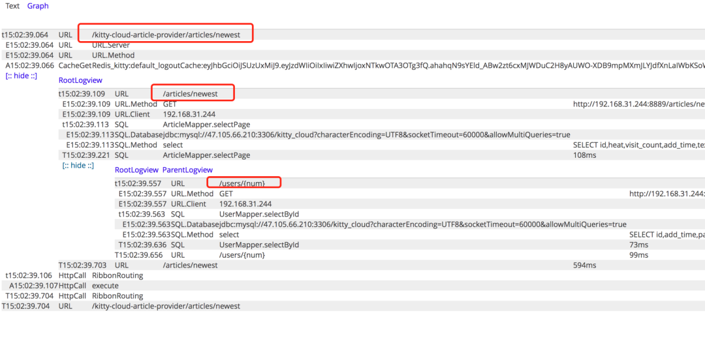

**Cat 跟 Skywalking 哪个好用?**

Skywalking 也是一款非常优秀的 APM 框架，我还没用过，不过看过一些文档，功能点挺全的 ，界面也挺好看。最大的优势是不用像 Cat 一样需要埋点，使用字节码增强的方式来对应用进行监控。

之所以列出这个小标题是因为如果大家还没有用的话肯定会纠结要选择落地哪个去做监控。我个人认为这两个都可以，可以自己先弄个简单的版本体验体验，结合你想要的功能点来评估落地哪个。

用 Cat 的话最好有一套基础框架，在基础框架中埋好点，这样才能在 Cat 中详细的显示各种信息来帮助我们快速定位问题和优化性能。

[感兴趣的 Star 下呗：https://github.com/yinjihuan/kitty-cloud](https://github.com/yinjihuan/kitty-cloud)

参考资料

[1 cat](https://github.com/dianping/cat)

[2 mybatisPlus](https://mp.baomidou.com)

[3 kitty-cloud](https://github.com/yinjihuan/kitty-cloud)


