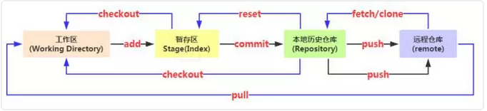

# Git 常用命令速查手册



## 初始化仓库

``` s
git init
```

## 设置远程仓库地址后再做push

''' s
git remote add origin <https://gitee.com/useraddress/HelloGitee.git>
'''

## 将文件添加到仓库

``` s
git add 文件名 # 将工作区的某个文件添加到暂存区
git add -u # 添加所有被tracked文件中被修改或删除的文件信息到暂存区，不处理untracked的文件
git add -A # 添加所有被tracked文件中被修改或删除的文件信息到暂存区，包括untracked的文件
git add . # 将当前工作区的所有文件都加入暂存区
git add -i # 进入交互界面模式，按需添加文件到缓存区
```

## 将暂存区文件提交到本地仓库

``` s
git commit -m "提交说明" # 将暂存区内容提交到本地仓库
git commit -a -m "提交说明" # 跳过缓存区操作，直接把工作区内容提交到本地仓库
```

## 查看仓库当前状态

``` s
git status
```

## 比较文件异同

``` s
git diff # 工作区与暂存区的差异
git diff 分支名 #工作区与某分支的差异，远程分支这样写：remotes/origin/分支名
git diff HEAD  # 工作区与HEAD指针指向的内容差异
git diff 提交id 文件路径 # 工作区某文件当前版本与历史版本的差异
git diff --stage # 工作区文件与上次提交的差异(1.6 版本前用 --cached)
git diff 版本TAG # 查看从某个版本后都改动内容
git diff 分支A 分支B # 比较从分支A和分支B的差异(也支持比较两个TAG)
git diff 分支A...分支B # 比较两分支在分开后各自的改动

# 另外：如果只想统计哪些文件被改动，多少行被改动，可以添加 --stat 参数
```

## 查看历史记录

``` s
git log # 查看所有commit记录(SHA-A校验和，作者名称，邮箱，提交时间，提交说明)
git log -p -次数 # 查看最近多少次的提交记录
git log --stat # 简略显示每次提交的内容更改
git log --name-only # 仅显示已修改的文件清单
git log --name-status # 显示新增，修改，删除的文件清单
git log --oneline # 让提交记录以精简的一行输出
git log –graph –all --online # 图形展示分支的合并历史
git log --author=作者  # 查询作者的提交记录(和grep同时使用要加一个--all--match参数)
git log --grep=过滤信息 # 列出提交信息中包含过滤信息的提交记录
git log -S查询内容 # 和--grep类似，S和查询内容间没有空格
git log fileName # 查看某文件的修改记录，找背锅专用
```

## 代码回滚

``` s
git reset HEAD^ # 恢复成上次提交的版本
git reset HEAD^^ # 恢复成上上次提交的版本，就是多个^，以此类推或用~次数

git reflog

git reset --hard 版本号

--soft：只是改变HEAD指针指向，缓存区和工作区不变；
--mixed：修改HEAD指针指向，暂存区内容丢失，工作区不变；
--hard：修改HEAD指针指向，暂存区内容丢失，工作区恢复以前状态；
```

## 同步远程仓库

``` s
git push -u origin master
```

## 删除版本库文件

``` s
git rm 文件名
```

## 版本库里的版本替换工作区的版本

``` s
git checkout -- test.txt
```

## 本地仓库内容推送到远程仓库

``` s
git remote add origin git@github.com:帐号名/仓库名.git
```

## 将本地仓库内容推送到远程仓库

''' s
git add . #将当前目录所有文件添加到git暂存区
git commit -m "my first commit" #提交并备注提交信息
git push origin master #将本地提交推送到远程仓库
'''

## 从远程仓库克隆项目到本地

``` s
git clone git@github.com:git帐号名/仓库名.git
```

## 创建分支

``` s
git checkout -b dev
-b表示创建并切换分支
上面一条命令相当于一面的二条：
git branch dev //创建分支
git checkout dev //切换分支
```

## 查看分支

``` s
git branch
```

## 合并分支

``` s
git merge dev
//用于合并指定分支到当前分支

git merge --no-ff -m "merge with no-ff" dev
//加上--no-ff参数就可以用普通模式合并，合并后的历史有分支，能看出来曾经做过合并
```

## 删除分支

``` s
git branch -d dev
```

## 查看分支合并图

``` s
git log --graph --pretty=oneline --abbrev-commit
```

## 查看远程库信息

``` s
git remote
// -v 显示更详细的信息
```

## git相关配置

``` s
# 安装完Git后第一件要做的事，设置用户信息(global可换成local在单独项目生效)：
git config --global user.name "用户名" # 设置用户名
git config --global user.email "用户邮箱"   #设置邮箱
git config --global user.name   # 查看用户名是否配置成功
git config --global user.email   # 查看邮箱是否配置

# 其他查看配置相关
git config --global --list  # 查看全局设置相关参数列表
git config --local --list # 查看本地设置相关参数列表
git config --system --list # 查看系统配置参数列表
git config --list  # 查看所有Git的配置(全局+本地+系统)
git config --global color.ui true //显示git相关颜色
```

## 撤消某次提交

``` s
git revert HEAD # 撤销最近的一个提交
git revert 版本号 # 撤销某次commit
```

## 拉取远程分支到本地仓库

``` s
git checkout -b 本地分支 远程分支 # 会在本地新建分支，并自动切换到该分支
git fetch origin 远程分支:本地分支 # 会在本地新建分支，但不会自动切换，还需checkout
git branch --set-upstream 本地分支 远程分支 # 建立本地分支与远程分支的链接
```

## 标签命令

``` s
git tag 标签 //打标签命令，默认为HEAD
git tag //显示所有标签
git tag 标签 �版本号 //给某个commit版本添加标签
git show 标签 //显示某个标签的详细信息
```

## 同步远程仓库更新

``` s
git fetch  origin master
 //从远程获取最新的到本地，首先从远程的origin的master主分支下载最新的版本到origin/master分支上，然后比较本地的master分支和origin/master分支的差别，最后进行合并。

git fetch比git pull更加安全
git pull origin master
```

## 推送时选择强制推送

强制推送需要执行下面的命令(默认不推荐该行为)：

``` s
git push origin master -f
```

## git 提示授权失败解决

``` s
git config --system --unset credential.helper # 管理员权限执行命令
```

## git 授权永久有效

``` s
git config --global credential.helper 'store'
```

## 程序员的那些迷之缩写

就像你可能不知道 现充 其实是 现实生活很充实的人生赢家 的缩写一样，我们经常看到 Github 上的码农们在 code review 时，把乱七八糟的缩写写得到处都是——娴熟的司机们都会使用缩写来达到提高逼格的效果——我们第一次看到时还是会出现一脸懵逼的状况，这里整理一下这些缩写都是什么含义，以后我们也可以欢快地装逼了。

1. PR: Pull Request. 拉取请求，给其他项目提交代码

2. LGTM: Looks Good To Me. 朕知道了 代码已经过 review，可以合并

3. SGTM: Sounds Good To Me. 和上面那句意思差不多，也是已经通过了 review 的意思

4. WIP: Work In Progress. 传说中提 PR 的最佳实践是，如果你有个改动很大的 PR，可以在写了一部分的情况下先提交，但是在标题里写上 WIP，以告诉项目维护者这个功能还未完成，方便维护者提前 review 部分提交的代码。

5. PTAL: Please Take A Look. 你来瞅瞅？用来提示别人来看一下

6. TBR: To Be Reviewed. 提示维护者进行 review

7. TL , DR: Too Long; Didn't Read. 太长懒得看。也有很多文档在做简略描述之前会写这么一句

8. TBD: To Be Done(or Defined/Discussed/Decided/Determined). 根据语境不同意义有所区别，但一般都是还没搞定的意思

9. PRD : Product Requirement Document. 产品需求文档

## git常用命令归纳

|分支命令|说明|
|:-----|:-----|
|git branch|	列出所有本地分支机构。|	
|git branch -a|	列出远程和本地分支。|
|git checkout -b branch_name|	创建一个本地分支并切换到该分支。	|
|git checkout branch_name|	切换到现有分支。	|
|git push origin branch_name|	将分支推送到远程。	|
|git branch -m new_name|	重命名当前分支。	|
|git branch -d branch_name|	删除本地分支。	|
|git push origin :branch_name|	删除远程分支。|

|日志命令|说明|
|:-----|:-----|
|git log --oneline|	单行显示提交历史记录。|	
|git log -2|	显示最近N次提交的提交历史记录。	|
|git log -p -2|	用diff显示最近N次提交的提交历史记录。	|
|git diff|	在工作树中显示所有本地文件更改。	|
|git diff myfile|	显示对文件所做的更改。	|
|git blame myfile|	显示谁更改了文件的内容和时间。	|
|git remote show origin|	显示远程分支及其到本地的映射。|

|清理命令|说明|
|:-----|:-----|
|git clean -f|	删除所有未跟踪的文件。	|
|git clean -df|	删除所有未跟踪的文件和目录。	|
|git checkout -- .|	撤消对所有文件的本地修改。	|
|git reset HEAD myfile|	取消暂存文件。|

|标签命令|说明|
|:-----|:-----|
|git tag|	列出所有标签。|	
|git tag -a tag_name -m "tag message"|	创建一个新标签。	|
|git push --tags|	将所有标签推送到远程仓库。|

|存放命令|说明|
|:-----|:-----|
|git stash save "stash name" && git stash|	将更改保存到存储中。	|
|git stash list|	列出所有藏匿处。	|
|git stash pop|	应用藏匿处。|
