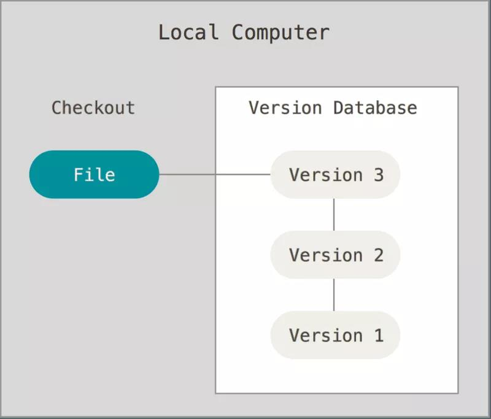
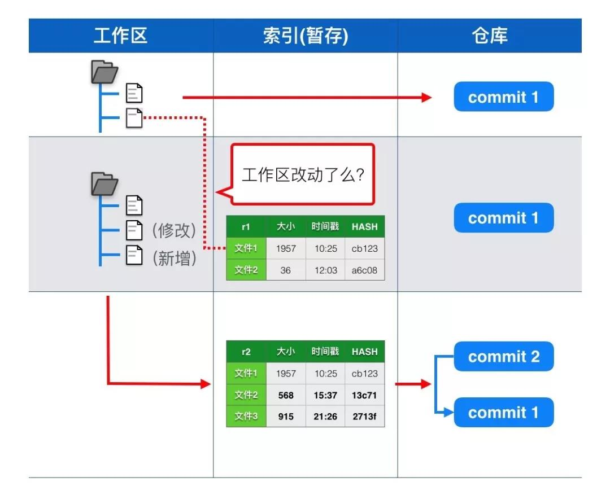
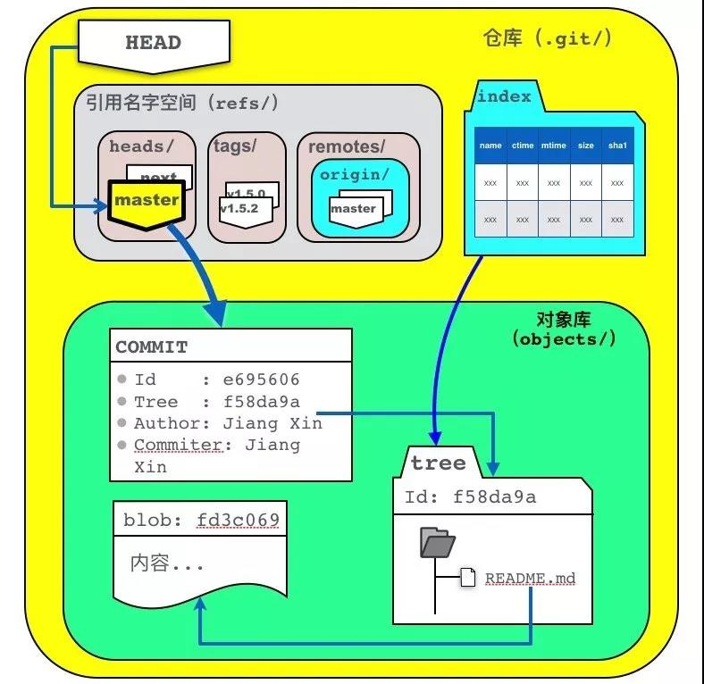
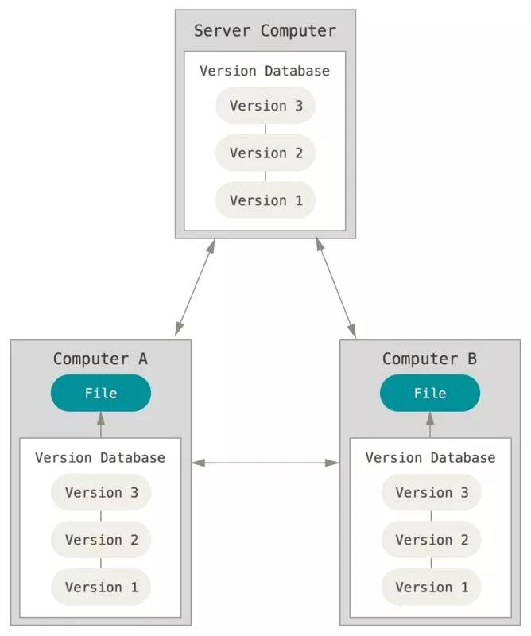

# 30 分钟让你掌握 Git 的黑魔法

## 担忧

很多人怕使用 git，我个人觉得主要可能是两部分的原因：

* 没接触过：平时接触的代码还托管在 SVN 或 CVS 等工具上。
* 不太熟悉：可能对 git 的使用还不太熟悉和全面，导致在使用 git 时步步为营。

>Never Be Afraid To Try Something New.

代码对于开发者是劳作成果的结晶，对于公司而言是核心资产，有一些担忧也是正常的。但 git 也并没有我们想象中的那么复杂，让我们每次使用都心有余悸，其实我们只需要稍微花一点时间尝试多多了解它，在很多时候你会发现，非但 git 不会让你产生担忧，反而会让自己的交付过程更加高效。

## Version Control

谈及 git 就不得不提到版本控制，我们不妨先来看下版本控制是做什么的，这将有助于后续对 git 的理解。

当你在工作中面对的是一些经常变化的文档、代码等交付物的时候，考虑如何去追踪和记录这些 changes 就变得非常重要，原因可能是：

* 对于频繁改动和改进的交付物，非常有必要去记录下每次变更的内容，每次记录的内容汇成了一段修改的历史，有了历史我们才知道我们曾经做了什么。
* 记录的历史中必须要包含一些重要的信息，这样追溯才变得有意义，比如：
      - Who: 是谁执行的变更？
      - When: 什么时候做出的变更？
      - What: 这次变更做了什么事情？
* 最好可以支持撤销变更，不让某一个提交的严重问题，去污染整个提交历史。

版本控制系统（VCS: Version Control System），正会为你提供这种记录和追溯变更的能力。



大多数的 VCS 支持在多个使用者之间共享变更的提交历史，这从实质上让团队协同变为了可能，简单说来就是：

* 你可以看到我的变更提交。
* 我也可以看到你的变更提交。
* 如果双方都进行了变更提交，也可以以某种方式方法进行比对和合并，最终作出统一的变更版本。

VCS 历经多年的发展，目前业界中有许多 VCS 工具可供我们选择。在本文中，我们将会针对目前最流行的 git 来介绍。

## git是黑魔法么？

刚接触 git 时，git 确实有让人觉得有点像黑魔法一样神秘，但是又有哪个技术不是这样呢？当我们了解其基本的数据结构后，会发现 git 从使用角度来讲其实并不复杂，我们甚至可以更进一步的学习 git 的一些先进的软件设计理论，从中获益。首先，让我们先从 commit 说起。

### git commit object

* 提交对象(git commit object): 每一个提交在 git 中都通过 git commit object 存储，对象具有一个全局唯一的名称，叫做 revision hash。它的名字是由 SHA-1 算法生成，形如 "998622294a6c520db718867354bf98348ae3c7e2"，我们通常会取其缩写方便使用，如 "9986222"。
* 对象构成: commit 对象包含了 author + commit message 的基本信息。
* 对象存储：git commit object 保存一次变更提交内的所有变更内容，而不是增量变化的数据 delta (很多人都理解错了这一点)，所以 git 对于每次改动存储的都是全部状态的数据。
* 大对象存储：因对于大文件的修改和存储，同样也是存储全部状态的数据，所以可能会影响 git 使用时的性能(glfs 可以改进这一点）。
* 提交树: 多个 commit 对象会组成一个提交树，它让我们可以轻松的追溯 commit 的历史，也能对比树上 commit 与 commit 之间的变更差异。

### git commit 练习

让我们通过实战来帮助理解，第一步我们来初始化一个 repository（git仓库），默认初始化之后仓库是空的，其中既没有保存任何文本内容也没有附带任何提交：

```s
$ git init hackers
$ cd hackers
$ git status
```

第二步，让我们来看下执行过后 git 给出的输出内容，它会指引我们进行进一步的了解：

```s
➜  hackers git:(master) git status
On branch master
No commits yet
nothing to commit (create/copy files anduse "git add" to track)
```

>output 1: On branch master

* 对于刚刚创建空仓库来说，master 是我们的默认分支，一个 git 仓库下可以有很多分支(branches)，具体某一个分支的命名可以完全由你自己决定，通常会起便于理解的名字，如果用 hash 号的话肯定不是一个好主意。
* branches 是一种引用(ref)，他们指向了一个确定的 commit hash 号，这样我们就可以明确我们的分支当前的内容。
* 除了 branches 引用以外，还有一种引用叫做 tags，相信大家也不会陌生。
* master 通常被我们更加熟知，因为大多数的分支开发模式都是用 master 来指向“最新”的 commit。
* On branch master 代表着我们当前是在 master 分支下操作，所以每次当我们在提交新的 commit 时，git 会自动将 master 指向我们新的 commit，当工作在其他分支上时，同理。
* 有一个很特殊的 ref 名称叫做"HEAD"，它指向我们当前正在操作的 branches 或 tags (正常工作时)，其命名上非常容易理解，表示当前的引用状态。
* 通过 git branch(或 gittag) 命令你可以灵活的操作和修改 branches 或 tags。

>output 2: No commits yet

对于空仓库来说，目前我们还没有进行任意的提交。

>nothing to commit (create/copy files anduse "git add" to track)

output 中提示我们需要使用 git add 命令，说到这里就必须要提到暂存或索引(stage)，那么如何去理解暂存呢？

一个文件从改动到提交到 git 仓库，需要经历三个状态：

* 工作区：工作区指的是我们本地工作的目录，比如我们可以在刚才创建的 hackers 目录下新增一个readme文件，readme 文件这时只是本地文件系统上的修改，还未存储到 git。
* 暂存(索引)区: 暂存实际上是将我们本地文件系统的改动转化为 git 的对象存储的过程。
* 仓库：git commit 后将提交对象存储到 git 仓库。



git add 的帮助文档中很详细的解释了暂存这一过程：

>DESCRIPTION

    This command updates the index using thecurrent content found in the
    working tree, to prepare the content stagedfor the next commit.
    （ git add 命令将更新暂存区，为接下来的提交做准备）

    It typically adds the current content ofexisting paths as a whole, but
    with some options it can also be used toadd content with only part of
    the changes made to the working tree filesapplied, or remove paths
    that do not exist in the working tree anymore.
    The "index" holds a snapshot ofthe content of the working tree, and it
    is this snapshot that is taken as thecontents of the next commit.
    （暂存区的 index 保存的是改动的完整文件和目录的快照(非delta)）

    Thus after making any changes to theworking tree, and before running the
    commit command, you must use the addcommand to add any new or modified
    files to the index.
    （暂存是我们将改动提交到 git 仓库之前必须经历的状态）

对 git 暂存有一定了解后，其相关操作的使用其实也非常简单，简要的说明如下：

1. 暂存区操作
    * 通过 git add 命令将改动暂存；
    * 可以使用 git add -p 来依次暂存每一个文件改动，过程中我们可以灵活选择文件中的变更内容，从而决定哪些改动暂存；
    * 如果 git add 不会暂存被 ignore 的文件改动；
    * 通过 git rm 命令，我们可以删除文件的同时将其从暂存区中剔除；
2. 暂存区修正
    * 通过 git reset 命令进行修正，可以先将暂存区的内容清空，在使用 git add -p 命令对改动 review 和暂存；
    * 这个过程不会对你的文件进行任何修改操作，只是 git 会认为目前没有改动需要被提交；
    * 如果我们想分阶段(or 分文件)进行 reset，可以使用 git reset FILE or git reset -p 命令；
3. 暂存区状态
    * 可以用 git diff --staged 依次检查暂存区内每一个文件的修改；
    * 用 git diff 查看剩余的还未暂存内容的修改；
4. Just Commit！
    * 当你对需要修改的内容和范围满意时，你就可以将暂存区的内容进行 commit 了，命令为 git commit；
    * 如果你觉得需要把所有当前工作空间的修改全部 commit，可以执行 git commit -a ，这相当于先执行 git add 后执行 git commit，将暂存和提交的指令合二为一，这对于一些开发者来说是很高效的，但是如果提交过大这样做通常不合适；
    * 我们建议一个提交中只做一件事，这在符合单一职责的同时，也可以让我们明确的知道每一个 commit 中做了一件什么事情而不是多个事情。所以通常我们的使用习惯都是执行 git add -p 来 review 我们将要暂存内容是否合理？是否需要更细的拆分提交？这些优秀的工程实践，将会让代码库中的 commits 更加优雅☕️；

ok，我们已经在不知不觉中了解了很多内容，我们来回顾下，它们包括了：

* commit 包含的信息是什么？
* commit 是如何表示的？
* 暂存区是什么？如何全部添加、一次添加、删除、查询和修正？
* 如何将暂存区的改动内容 commit？
* 不要做大提交，一个提交只做一件事；

附带的，在了解 commit 过程中我们知道了从本地改动到提交到 git 仓库，经历的几个关键的状态：

* 工作区(Working Directory)
* 暂存区(Index)
* Git 仓库(Git Repo)

下图为上述过程中各个状态的转换过程：

* 本地改动文件时，此时还仅仅是工作区内的改动；
* 当执行 git add 之后，工作区内的改动被索引在暂存区；
* 当执行 git commit 之后，暂存区的内容对象将会存储在 git 仓库中，并执行更新 HEAD 指向等后续操作，这样就完成了引用与提交、提交与改动快照的一一对应了。



正是因为 git 本身对于这几个区域(状态)的设计，为 git 在本地开发过程带来了灵活的管理空间。我们可以根据自己的情况，自由的选择哪些改动暂存、哪些暂存的改动可以 commit、commit 可以关联到那个引用，从而进一步与其他人进行协同。

### 提交之后

我们已经有了一个 commit，现在我们可以围绕 commit 做更多有趣的事情：

* 查看 commit 历史: git log(or git log --oneline)。
* 在 commit 中查看改动的 diff:git log -p。
* 查看 ref 与提交的关联关系，如当前 master 指向的 commit: git show master。
* 检出覆盖: git checkout NAME（如果NAME是一个具体的提交哈希值时，git 会认为状态是“detached(分离的)”，因为 gitcheckout 过程中重要的一步是将 HEAD 指向那个分支的最后一次 commit。所以如果这样做，将意味着没有分支在引用此提交，所以若我们这时候进行提交的话，没有人会知道它们的存在）。
* 使用 git revert NAME 来对 commit 进行反转操作。
* 使用 git diff NAME.. 将旧版本与当前版本进行比较，查看 diff。
* 使用 git log NAME, 查看指定区间的提交。
* 使用 git reset NAME 进行提交重置操作。
* 使用 git reset --hard NAME：将所有文件的状态强制重置为 NAME 的状态，使用上需要小心。

### 引用基本操作

引用(refs)包含两种分别是 branches 和 tags， 我们接下来简单介绍下相关操作：

* git branch b 命令可以让我们创建一个名称为 b 的分支；
* 当我们创建了一个 b 分支后，这也相当于意味着 b 的指向就是 HEAD 对应的 commit；
* 我们可以先在 b 分支上创建一个新的 commitA ，然后假如切回 master 分支上，这时再提交了一个新的 commitB，那么 master 和 HEAD 将会指向了新的commit __B，而 b 分支指向的还是原来的 commit A；
* git checkout b 可以切换到 b 分支上,切换后新的提交都会在 b 分支上，理所应当；
* git checkout master 切换回 master 后，b分支的提交也不会带回 master 上，分支隔离；

分支上提交隔离的设计，可以让我们非常轻松的切换我们的修改，非常方便的做各类测试。
tags 的名称不会改变，而且它们有自己的描述信息(比如可以作为 release note 以及标记发布的版本号等)。

### 做好你的提交

可能很多人的提交历史是长这个样子的：

``` s
commit 14: add feature x – maybe even witha commit message about x!

commit 13: forgot to add file

commit 12: fix bug 

commit 11: typo

commit 10: typo2

commit 9: actually fix

commit 8: actually actually fix

commit 7: tests pass

commit 6: fix example code

commit 5: typo

commit 4: x

commit 3: x

commit 2: x

commit 1: x

```

单就 git 而言，这看上去是没有问题而且合法的，但对于那些对你修改感兴趣的人（很可能是未来的你!），这样的提交在信息在追溯历史时可能并没有多大帮助。但是如果你的提交已经长成这个样子，我们该怎么办？

没关系，git 有办法可以弥补这一些：

### git commit --amend

我们可以将新的改动提交到当前最近的提交上，比如你发现少改了什么，但是又不想多出一个提交时会很有用。

如果我们认为我们的提交信息写的并不好，我要修改修改，这也是一种办法，但是并不是最好的办法。

这个操作会更改先前的提交，并为其提供新的hash值。

### git rebase -i HEAD~13

这个命令非常强大，可以说是 git 提交管理的神器，此命令含义是我们可以针对之前的 13 次的提交在 VI 环境中进行重新修改设计：

* 操作选项 p 意味着保持原样什么都不做，我们可以通过 vim 中编辑提交的顺序，使其在提交树上生效；
* 操作选项 r: 我们可以修改提交信息，这种方式比 commit --amend 要好的多，因为不会新生成一个 commit；
* 操作选项 e: 我们可以修改 commit，比如新增或者删除某些文件改动；
* 操作选项 s: 我们可以将这个提交与其上一次的提交进行合并，并重新编辑提交信息；
* 操作选项 f: f 代表着"fixup"。例如我们如果想针对之前一个老的提交进行 fixup，又不想做一次新的提交破坏提交树的历史的逻辑含义，可以采用这种方式，这种处理方式非常优雅；

### 关于git

版本控制的一个常见功能是允许多个人对一组文件进行更改，而不会互相影响。或者更确切地说，为了确保如果他们不会踩到彼此的脚趾，不会在提交代码到服务端时偷偷的覆盖彼此的变化。

在 git 中我们如何保证这一点呢？

git 与svn 不同，git 不存在本地文件 lock 的情况，这是一种避免出现写作问题的方式，但是并不方便，而 git 与 svn 最大的不同在于它是一个分布式 VCS，这意味着：

* 每个人都有整个存储库的本地副本（其中不仅包含了自己的，也包含了其他人的提交到仓库的所有内容）。
* 一些 VCS 是集中式的（例如，svn）：服务器具有所有提交，而客户端只有他们“已检出”的文件。所以基本上在本地我们只有当前文件，每次涉及本地不存在的文件操作时，都需要访问服务端进行进一步交互。
* 每一个本地副本都可以当作服务端对外提供 git 服务。
* 我们可以用 git push 推送本地内容到任意我们有权限的 git 远端仓库。
* 不管是集团的 force、github、gitlab 等工具，其实本质上都是提供的 git 仓库存储的相关服务，在这一点上其实并没有特别之处，针对 git 本身和其协议上是透明的。




### git冲突解决

冲突的产生几乎是不可避免的，当冲突产生时你需要将一个分支中的更改与另一个分支中的更改合并，对应 git 的命令为 git merge NAME ，一般过程如下：

* 找到 HEAD 和 NAME 的一个共同祖先(common base)；
* 尝试将这些 NAME 到共同祖先之间的修改合并到 HEAD 上；
* 新创建一个 merge commit 对象，包含所有的这些变更内容；
* HEAD 指向这个新的 mergecommit；

git 将会保证这个过程改动不会丢失，另外一个命令你可能会比较熟悉，那就是 git pull 命令，git pull 命令实际上包含了 git merge 的过程，具体过程为：

* git fetch REMOTE
* git merge REMOTE/BRANCH
* 和 git push一样，有的时候需要先设置 "tracking"(-u) ，这样可以将本地和远程的分支一一对应。

如果每次 merge 都如此顺利，那肯定是非常完美的，但有时候你会发现在合并时产生了冲突文件，这时候也不用担心，如何处理冲突的简要介绍如下：

* 冲突只是因为 git 不清楚你最终要合并后的文本是什么样子，这是很正常的情况；
* 产生冲突时，git 会中断合并操作，并指导你解决好所有的冲突文件；
* 打开你的冲突文件，找到 <<<<<<< ，这是你需要开始处理冲突的地方，然后找到=======，等号上面的内容是 HEAD 到共同祖先之间的改动，等号下面是 NAME 到共同祖先之间的改动。用 git mergetool 通常是比较好的选择，当然现在大多数 IDE 都集成了不错的冲突解决工具；
* 当你把冲突全部解决完毕，请用 git add . 来暂存这些改动；
* 最后进行 git commit，如果你想放弃当前修改重新解决可以使用 git merge --abort ，非常方便；
* 当你完成了以上这些艰巨的任务，最后 git push 吧！

### push失败？

排除掉远端的 git 服务存在问题以外，我们 push 失败的大多数原因都是因为我们在工作的内容其他人也在工作的关系。

Git 是这样判断的：

1. 会判断 REMOTE 的当前 commit 是不是你当前正在 pushing commit 的祖先。
2. 如果是的话，代表你的提交是相对比较新的，push 是可以成功的(fast-forwarding)。
3. 否则 push 失败并提示你其他人已经在你 push 之前执行更新(push is rejected)。

当发生push is rejected 后我们的几个处理方法如下:

* 使用 git pull 合并远程的最新更改（git pull相当于 git fetch + git merge） ；
* 使用 --force 强制推送本地变化到远端饮用进行覆盖，需要注意的是 这种覆盖操作可能会丢失其他人的提交内容；
* 可以使用 --force-with-lease 参数，这样只有远端的 ref 自上次从 fetch 后没有改变时才会强制进行更改，否则 reject the push，这样的操作更安全，是一种非常推荐使用的方式；
* 如果 rebase 操作了本地的一些提交，而这些提交之前已经 push 过了的话，你可能需要进行 force push 了，可以想象看为什么？

本文只是选取部分 Git 基本命令进行介绍，目的是抛砖引玉，让大家对 git 有一个基本的认识。当我们深入挖掘 Git 时，你会发现它本身有着如此多优秀的设计理念，值得我们学习和探究。

**不要让 Git 成为你认知领域的黑魔法，而是让 Git 成为你掌握的魔法。**

[参考英文](https://hacker-tools.github.io/version-control/)