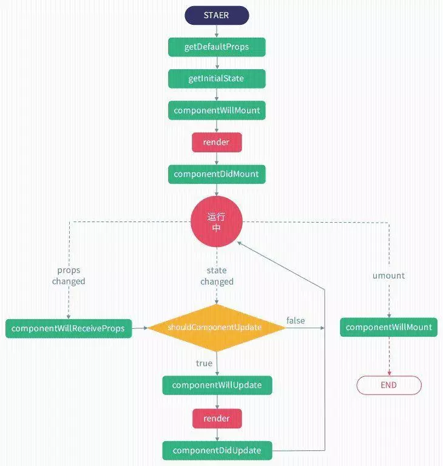

# 前端框架用vue还是react？清晰对比两者差异

## 前言

近两年前端技术层出不穷，目前市面上已经有了很多供前端人员使用的开发框架，转眼19年已过大半，前端框架领域日趋成熟，实现了三足鼎立的局面，截止到10月22日，Angular，react和vue数据统计如下图所示:


最近在学习使用框架的时候，分别使用vue和react开发了两个移动端产品，对这两个框架的学习曲线有了一些感悟，这两个都是现在比较热门的js框架，它俩在使用方式上和学习复杂度上还是有很大区别的，这里简单总结下两者的差异。
主要从以下几个方面入手方面展开：

* 框架的诞生
* 设计思想
* 编写语法
* 脚手架构建工具
* 数据绑定
* 虚拟DOM
* 指令
* 性能优化
* 原生渲染native
* ssr服务端渲染
* 生命周期函数
* 销毁组件
* 状态集管理工具

## 诞生

### vue

vue由尤雨溪开发，由独立团队维护，现在大部分的子项目都交给团队成员打理，Vue核心库依然主要由尤雨溪亲自维护。vue近几年来特别的受关注，三年前的时候angularJS霸占前端JS框架市场很长时间，接着react框架横空出世，因为它有一个特性是虚拟DOM，从性能上碾轧angularJS，这个时候，vue1.0悄悄的问世了，它的优雅，轻便也吸引了一部分用户，开始受到关注，16年中旬，VUE2.0问世，不管从性能上，还是从成本上都隐隐超过了react，火的一塌糊涂，这个时候，angular开发团队也开发了angular2.0版本，并且更名为angular，吸收了react、vue的优点，加上angular本身的特点，也吸引到很多用户，目前已经迭代到8.0了。友情提示注意下vue的诞生时间，如果正好有小伙伴在面试，被问到你是从什么时候开始接触并且使用vue的，你要是回答用了5、6年了那场面就十分尴尬了。

### react

起初facebook在建设instagram（图片分享）的时候，因为牵扯到一个东西叫数据流，那为了处理数据流并且还要考虑好性能方面的问题，Facebook开始对市场上的各种前端MVC框架去进行一个研究，然而并没有看上眼的，于是Facebook觉得，还是自己开发一个才是最棒的，那么他们决定抛开很多所谓的“最佳实践”，重新思考前端界面的构建方式，他们就自己开发了一套，果然大牛创造力还是很强大的。
React 起源于 Facebook 的内部项目，因为该公司对市场上所有 JavaScript MVC 框架，都不满意，就决定自己写一套，用来架设Instagram 的网站。做出来以后，发现这套东西很好用，就在2013年5月开源了。

## 设计思想

### vue

vue的官网中说它是一款渐进式框架，采用自底向上增量开发的设计。这里我们需要明确一个概念，什么是渐进式框架。在声明式渲染（视图模板引擎）的基础上，我们可以通过添加组件系统（components）、客户端路由（vue-router）、大规模状态管理（vuex）来构建一个完整的框架。Vue从设计角度来讲，虽然能够涵盖所有这些内容，但是你并不需要一上手就把所有东西全用上，因为没有必要。无论从学习角度，还是实际情况，这都是可选的。声明式渲染和组建系统是Vue的核心库所包含内容，而客户端路由、状态管理、构建工具都有专门解决方案。这些解决方案相互独立，你可以在核心的基础上任意选用其他的部件，不一定要全部整合在一起。可以看到，所说的“渐进式”，其实就是Vue的使用方式，同时也体现了Vue的设计的理念。

### react

react主张函数式编程，所以推崇纯组件，数据不可变，单向数据流，当然需要双向的地方也可以手动实现，比如借助 onChange 和 setState 来实现一个双向的数据流。而vue是基于可变数据的，支持双向绑定，它提供了v-model这样的指令来实现文本框的数据流双向绑定。

## 编写语法

### vue
vue推荐的做法是webpack+vue-loader的单文件组件格式，vue保留了html、css、js分离的写法，使得现有的前端开发者在开发的时候能保持原有的习惯，更接近常用的web开发方式，模板就是普通的html，数据绑定使用mustache风格，样式直接使用css。其中**style**标签还提供了一个可选的scoped属性，它会为组件内 CSS 指定作用域，用它来控制仅对当前组件有效还是全局生效。
模板和JSX是各有利弊的东西。模板更贴近我们的HTML，可以让我们更直观地思考语义结构，更好地结合CSS的书写。
同时vue也支持JSX语法，因为是真正的JavaScript，拥有这个语言本身的所有的能力，可以进行复杂的逻辑判断，进行选择性的返回最终要返回的DOM结构，能够实现一些在模板的语法限制下，很难做到的一些事情。

### react

用过react的开发者可能知道，react是没有模板的，直接就是一个渲染函数，它中间返回的就是一个虚拟DOM树，React推荐的做法是 JSX + inline style, 也就是把HTML和CSS全都写进JavaScript了,即'all in js'。JSX实际就是一套使用XML语法，用于让我们更简单地去描述树状结构的语法糖。在react中，所有的组件的渲染功能都依靠JSX。你可以在render()中编写类似XML的语法，它最终会被编译成原生JavaScript。不仅仅是 HTML 可以用 JSX 来表达，现在的潮流也越来越多地将 CSS 也纳入到 JavaScript 中来处理。JSX是基于 JS 之上的一套额外语法，学习使用起来有一定的成本。

## 构建工具

### vue

vue提供了CLI 脚手架，可以帮助你非常容易地构建项目。全局安装之后，我们就可以用 vue create命令创建一个新的项目，vue 的 CLI 跟其他 CLI不同之处在于，有多个可选模板，有简单的也有复杂的，可以让用户自定义选择需要安装的模块，还可以将你的选择保存成模板，便于后续使用。
极简的配置，更快的安装，可以更快的上手。它也有一个更完整的模板，包括单元测试在内的各种内容都涵盖，但是，它的复杂度也更高，这又涉及到根据用例来选择恰当复杂度的问题。

### react

React 在这方面也提供了 create-react-app，但是现在还存在一些局限性：

* 它不允许在项目生成时进行任何配置，而 Vue CLI 运行于可升级的运行时依赖之上，该运行时可以通过插件进行扩展。
* 它只提供一个构建单页面应用的默认选项，而 Vue 提供了各种用途的模板。
* 它不能用用户自建的预设配置构建项目，这对企业环境下预先建立约定是特别有用的。

而要注意的是这些限制是故意设计的，这有它的优势。例如，如果你的项目需求非常简单，你就不需要自定义生成过程。你能把它作为一个依赖来更新。

## 数据绑定
### vue
vue是实现了双向数据绑定的mvvm框架，当视图改变更新模型层，当模型层改变更新视图层。在vue中，使用了双向绑定技术，就是View的变化能实时让Model发生变化，而Model的变化也能实时更新到View。
Vue采用数据劫持&发布-订阅模式的方式，vue在创建vm的时候，会将数据配置在实例当中，然后通过Object.defineProperty对数据进行操作，为数据动态添加了getter与setter方法，当获取数据的时候会触发对应的getter方法，当设置数据的时候会触发对应的setter方法，从而进一步触发vm的watcher方法，然后数据更改，vm则会进一步触发视图更新操作。
### react
react是单向数据流，react中属性是不允许更改的，状态是允许更改的。react中组件不允许通过this.state这种方式直接更改组件的状态。自身设置的状态，可以通过setState来进行更改。在setState中，传入一个对象，就会将组件的状态中键值对的部分更改，还可以传入一个函数，这个回调函数必须向上面方式一样的一个对象函数可以接受prevState和props。通过调用this.setState去更新this.state,不能直接操作this.state，请把它当成不可变的。
调用setState更新this.state，它不是马上就会生效的，它是异步的。所以不要认为调用完setState后可以立马获取到最新的值。多个顺序执行的setState不是同步的一个接着一个的执行，会加入一个异步队列，然后最后一起执行，即批处理。
setState是异步的，导致获取dom可能拿的还是之前的内容，所以我们需要在setState第二个参数（回调函数）中获取更新后的新的内容。

## diff算法
### vue
vue中diff算法实现流程

在内存中构建虚拟dom树
将内存中虚拟dom树渲染成真实dom结构
数据改变的时候，将之前的虚拟dom树结合新的数据生成新的虚拟dom树
将此次生成好的虚拟dom树和上一次的虚拟dom树进行一次比对（diff算法进行比对），来更新只需要被替换的DOM，而不是全部重绘。在Diff算法中，只平层的比较前后两棵DOM树的节点，没有进行深度的遍历。
会将对比出来的差异进行重新渲染

### react
react中diff算法实现流程

DOM结构发生改变-----直接卸载并重新create
DOM结构一样-----不会卸载,但是会update变化的内容
所有同一层级的子节点.他们都可以通过key来区分-----同时遵循1.2两点
（其实这个key的存在与否只会影响diff算法的复杂度,换言之,你不加key的情况下,diff算法就会以暴力的方式去根据一二的策略更新,但是你加了key,diff算法会引入一些另外的操作）

React会逐个对节点进行更新，转换到目标节点。而最后插入新的节点，涉及到的DOM操作非常多。diff总共就是移动、删除、增加三个操作，而如果给每个节点唯一的标识（key），那么React优先采用移动的方式，能够找到正确的位置去插入新的节点。
vue会跟踪每一个组件的依赖关系，不需要重新渲染整个组件树。而对于React而言,每当应用的状态被改变时,全部组件都会重新渲染,所以react中会需要shouldComponentUpdate这个生命周期函数方法来进行控制。

## 指令

指令 (Directives) 是带有
v- 前缀的特殊特性，指令的职责是，当表达式的值改变时，将其产生的连带影响，响应式地作用于 DOM。
### vue
vue中提供很多内部指令供我们使用，它可以让我们进行一些模板的操作，例如有时候，我们的data中的存放的数据不是个简单的数字或者字符串，而是数组Array类型，这个时候，我们要把数组的元素展示在视图上，就需要用到vue提供的 v-for 指令，来实现列表的渲染。
### react
因为react中没有v-for指令，所以循环渲染的时候需要用到map()方法来渲染视图，并且将符合条件的元素放入一个新数组返回。

## 性能优化
### vue
vue中的每个组件内部自动实现了
shouldComponentUpdate的优化，在vue里面由于依赖追踪系统的存在，当任意数据变动的时，Vue的每一个组件都精确地知道自己是否需要重绘，所以并不需要手动优化。用vue渲染这些组件的时候，数据变了，对应的组件基本上去除了手动优化的必要性。而在react中我们需要手动去优化其性能，但是当数据特别多的时候vue中的watcher也会特别多，从而造成页面卡顿，所以一般数据比较多的大型项目会倾向于使用react。在react官网中，官方也建议我们使用React来构建快速响应的大型 Web 应用程序。
### react
当props或state发生改变的时候会触发
shouldComponentUpdate生命周期函数，它是用来控制组件是否被重新渲染的，如果它返回true，则执行render函数，更新组件；如果它返回false，则不会触发重新渲染的过程。
有的时候我们希望它在更新之前，和之前的状态进行一个对比，这个时候我们就需要重写
shouldComponentUpdate来避免不必要的dom操作，对比当前的props或state和更新之后的nextProps或nextState，返回true时 ，组件更新；返回false，则不会更新，节省性能。
``` js
shouldComponentUpdate(nextProps, nextState) {
    if (this.props.a !== nextProps.a) {
        return true;
    }
    if (this.state.b !== nextState.b) {
        return true;
    }
    return false;
}
```

我们也可以创建一个继承React.PureComponent的React组件，它自带
shouldComponentUpdate，可以对props进行浅比较，发现更新之后的props与当前的props一样，就不会进行render了。
classTestextendsReact.PureComponent{constructor(props){super(props);}render(){return<div>hello...{this.props.a}</div>}}
由于React.PureComponent进行的是浅比较，也就是说它只会对比原对象的值是否相同，当我们的props或state为数组或者对象这种引用类型的时候，我们修改它的数值，由于数据引用指针没有发生改变，所以组件也是不会重新渲染的。这个时候我们就需要进行深拷贝，创建一个新的对象或数组，将原对象的各项属性的"值"（数组的所有元素）拷贝过来，是"值"而不仅仅是"引用地址"。我们可以使用slice()方法：
``` js
ew_state.todos = new_state.todos.slice();
```
或者引入immutable库来实现数据不可变。

## 原生渲染native
native指的是使用原生API来开发App，比如ios使用OC语言，android使用java。
### vue
vue和Weex进行官方合作，weex是阿里巴巴发起的跨平台用户界面开发框架，它的思想是多个平台，只写一套代码，weex允许你使用 vue 语法开发不仅仅可以运行在浏览器端，还能被用于开发 iOS 和 Android 上的原生应用的组件。即只需要编写一份代码，即可运行在Web、iOS、Android上。
weex相对来说上手比较简单，安装vue-cli之后就可以使用，学习门槛低，但是它的社区目前还处于成长期，react native的社区非常成熟活跃，有非常丰富的组件可供扩展。
### react
react native是Facebook在2015年3月在F8开发者大会上开源的跨平台UI框架，需针对iOS、Android不同编写2份代码，使用react native需要按照文档安装配置很多依赖的工具，相对比较麻烦。weex的思想是多个平台，只写一套代码，而react-native的思想是多个平台可以写多套代码，但其使用的是同一套语言框架。
weex的目标在于抹平各个平台的差异性，从而简化应用开发。而react-native承认了各个平台之间的差异，退而求其次，在语言和框架层面对平台进行抽象，从方法论的角度去解决多平台开发的问题。

## ssr服务端渲染
服务端渲染核心在于方便seo优化，后端先调用数据库，获得数据之后，将数据和页面元素进行拼装，组合成完整的html页面，再直接返回给浏览器，以便用户浏览。
### vue
2016 年 10 月 25 日，zeit.co背后的团队对外发布了 Next.js，一个 React 的服务端渲染应用框架。几小时后，与 Next.js 异曲同工，一个基于 Vue.js 的服务端渲染应用框架应运而生，我们称之为：Nuxt.js。
服务端渲染支持流式渲染，因为HTTP请求也是流式，Vue 的服务端渲染结果可以直接 pipe 到返回的请求里面。这样一来，就可以更早地在浏览器中呈现给用户内容，通过合理的缓存策略，可以有效地提升服务端渲染的性能。

* 基于 Vue.js
* 自动代码分层
* 服务端渲染
* 强大的路由功能，支持异步数据
* 静态文件服务
* ES2015+ 语法支持
* 打包和压缩 JS 和 CSS
* HTML 头部标签管理
* 本地开发支持热加载
* 集成 ESLint
* 支持各种样式预处理器： SASS、LESS、 Stylus 等等
* 支持 HTTP/2 推送

### react
Next是一个React框架，允许使用React构建SSR和静态web应用

* 服务器渲染，获取数据非常简单
* 无需学习新框架，支持静态导出。
* 支持CSS-in-JS库
* 自动代码拆分，加快页面加载速度，不加载不必要的代码
* 基于Webpack的开发环境，支持模块热更新（HMR）
* 支持Babel和Webpack自定义配置服务器、路由和next插件。
* 能够部署在任何能运行node的平台
* 内置页面搜索引擎优化（SEO）处理
* 在生产环境下，打包文件体积更小，运行速度更快

## 生命周期
### vue
【初始化阶段（4个）】
（1）beforeCreate
此钩子函数不能获取到数据，dom元素也没有渲染出来，此钩子函数不会用来做什么事情。
（2）created
此钩子函数，数据已经挂载了，但是dom节点还是没有渲染出来，在这个钩子函数里面，如果同步更改数据的话，不会影响运行中钩子函数的执行。可以用来发送ajax请求，也可以做一些初始化事件的相关操作。
（3）beforeMount
代表dom节点马上要被渲染出来了，但是还没有真正的渲染出来，此钩子函数跟created钩子函数基本一样，也可以做一些初始化数据的配置。
（4）mounted
是生命周期初始化阶段的最后一个钩子函数，数据已经挂载完毕了，真实dom也可以获取到了。
【运行中阶段（2个）】
（5）beforeUpdate
运行中钩子函数beforeUpdate默认是不会执行的，当数据更改的时候，才会执行。数据更新的时候，先调用beforeUpdate，然后数据更新引发视图渲染完成之后，再会执行updated。运行时beforeUpdate这个钩子函数获取的数据还是更新之前的数据（获取的是更新前的dom内容），在这个钩子函数里面，千万不能对数据进行更改，会造成死循环。
（6）updated
这个钩子函数获取的数据是更新后的数据，生成新的虚拟dom，跟上一次的虚拟dom结构进行比较，比较出来差异（diff算法）后再渲染真实dom，当数据引发dom重新渲染的时候，在updated钩子函数里面就可以获取最新的真实dom了。
【销毁阶段（2个）】
（7）beforeDestroy
切换路由的时候，组件就会被销毁了，销毁之前执行beforeDestroy。在这个钩子函数里面，我们可以做一些善后的操作，例如可以清空一下全局的定时器（created钩子函数绑定的初始化阶段的事件）、清除事件绑定。
（8）destoryed
组件销毁后执行destroyed，销毁后组件的双向数据绑定、事件监听watcher相关的都被移除掉了，但是组件的真实dom结构还是存在在页面中的。
添加keep-alive标签后会增加active和deactive这两个生命周期函数，初始化操作放在actived里面，一旦切换组件，因为组件没有被销毁，所以它不会执行销毁阶段的钩子函数，所以移除操作需要放在deactived里面，在里面进行一些善后操作，这个时候created钩子函数只会执行一次，销毁的钩子函数一直没有执行。


### react
【初始化阶段（5个）】：
（1）getDefaultProps：实例化组件之后，组件的getDefaultProps钩子函数会执行
这个钩子函数的目的是为组件的实例挂载默认的属性
这个钩子函数只会执行一次，也就是说，只在第一次实例化的时候执行，创建出所有实例共享的默认属性，后面再实例化的时候，不会执行getDefaultProps，直接使用已有的共享的默认属性
理论上来说，写成函数返回对象的方式，是为了防止实例共享，但是react专门为了让实例共享，只能让这个函数只执行一次
组件间共享默认属性会减少内存空间的浪费，而且也不需要担心某一个实例更改属性后其他的实例也会更改的问题，因为组件不能自己更改属性，而且默认属性的优先级低。
（2）getInitialState：为实例挂载初始状态，且每次实例化都会执行，也就是说，每一个组件实例都拥有自己独立的状态。
（3）componentWillMount：执行componentWillMount，相当于Vue里的created+beforeMount，这里是在渲染之前最后一次更改数据的机会，在这里更改的话是不会触发render的重新执行。
（4）render：渲染dom
render()方法必须是一个纯函数，他不应该改变
state，也不能直接和浏览器进行交互，应该将事件放在其他生命周期函数中。 如果
shouldComponentUpdate()返回
false，
render()不会被调用。
（5）componentDidMount：相当于Vue里的mounted,多用于操作真实dom
【运行中阶段（5个）】
当组件mount到页面中之后，就进入了运行中阶段，在这里有5个钩子函数，但是这5个函数只有在数据（属性、状态）发送改变的时候才会执行
（1）componentWillReceiveProps(nextProps,nextState)
当父组件给子组件传入的属性改变的时候，子组件的这个函数才会执行。初始化props时候不会主动执行
当执行的时候，函数接收的参数是子组件接收到的新参数，这个时候，新参数还没有同步到this.props上,多用于判断新属性和原有属性的变化后更改组件的状态。
（2）接下来就会执行shouldComponentUpdate(nextProps,nextState),这个函数的作用：当属性或状态发生改变后控制组件是否要更新，提高性能,返回true就更新，否则不更新，默认返回true。
接收nextProp、nextState，根据根据新属性状态和原属性状态作出对比、判断后控制是否更新
如果
shouldComponentUpdate()返回
false，
componentWillUpdate,
render和
componentDidUpdate不会被调用。
（3）componentWillUpdate,在这里，组件马上就要重新render了，多做一些准备工作，千万千万，不要在这里修改状态，否则会死循环 相当于Vue中的beforeUpdate
（4）render，重新渲染dom
（5）componentDidUpdate，在这里，新的dom结构已经诞生了,相当于Vue里的updated
【销毁阶段】
当组件被销毁之前的一刹那，会触发componentWillUnmount，临死前的挣扎
相当于Vue里的beforeDestroy，所以说一般会做一些善后的事情，例如使定时器无效，取消网络请求或清理在
componentDidMount中创建的任何监听。



## 销毁组件

### vue
vue在调用$destroy方法的时候就会执行beforeDestroy生命周期函数，然后组件被销毁，这个时候组件的dom结构还存在于页面结构中，也就说如果想要对残留的dom结构进行处理必须在destroyed生命周期函数中处理。
### react
react执行完componentWillUnmount之后把事件、数据、dom都全部处理掉了，也就是说当父组件从渲染这个子组件变成不渲染这个子组件的时候，子组件相当于被销毁，所以根本不需要其他的钩子函数了。react销毁组件的时候，会将组件的dom结构也移除，vue则不然，在调用destory方法销毁组件的时候，组件的dom结构还是存在于页面中的，this.$destory组件结构还是存在的，只是移除了事件监听，所以这就是为什么vue中有destroyed，而react却没有componentDidUnmount。

## 状态集管理工具
### vue
vuex是一个专门为vue构建的状态集管理工具，vue和react都是基于组件化开发的，项目中包含很多的组件，组件都会有组件嵌套，想让组件中的数据被其他组件也可以访问到就需要使用到Vuex。
vuex的流程

将需要共享的状态挂载到state上：this.$store.state来调用

创建store，将状态挂载到state上，在根实例里面配置store，之后我们在组件中就可以通过this.$store.state来使用state中管理的数据，但是这样使用时，当state的数据更改的时候，vue组件并不会重新渲染，所以我们要通过计算属性computed来使用，但是当我们使用多个数据的时候这种写法比较麻烦，vuex提供了mapState辅助函数，帮助我们在组件中获取并使用vuex的store中保存的状态。

我们通过getters来创建状态：通过this.$store.getters来调用

可以根据某一个状态派生出一个新状态，vuex也提供了mapGetters辅助函数来帮助我们在组件中使用getters里的状态。

使用mutations来更改state：通过this.$store.commit来调用

我们不能直接在组件中更改state，而是需要使用mutations来更改，mutations也是一个纯对象，里面包含很多更改state的方法，这些方法的形参接收到state，在函数体里更改，这时，组件用到的数据也会更改，实现响应式。vuex提供了mapMutations方法来帮助我们在组件中调用mutations 的方法。

使用actions来处理异步操作：this.$store.dispatch来调用

Actions类似于mutations，不同在于：Actions提交的是mutations，而不是直接变更状态。Actions可以包含任意异步操作。也就是说，如果有这样的需求：在一个异步操作处理之后，更改状态，我们在组件中应该先调用actions，来进行异步动作，然后由actions调用mutations来更改数据。在组件中通过this.$store.dispatch方法调用actions的方法，当然也可以使用mapMutations来辅助使用。
### react
2015年Redux出现，将 Flux 与函数式编程结合一起，很短时间内就成为了最热门的前端架构。它的出现主要是为解决react中组件之间的通信问题。建议把数据放入到redux中管理，目的就是方便数据统一，好管理。项目一旦出现问题，可以直接定位问题点。组件扩展的时候，后续涉及到传递的问题。本来的话，组件使用自己的数据，但是后来公用组件，还需要考虑如何值传递，在redux中可以存储至少5G以上的数据。
redux的流程


1. 创建store： 从redux工具中取出createStore去生成一个store。
2. 创建一个reducer，然后将其传入到createStore中辅助store的创建。 reducer是一个纯函数，接收当前状态和action，返回一个状态，返回什么，store的状态就3是什么，需要注意的是，不能直接操作当前状态，而是需要返回一个新的状态。 想要给store创建默认状态其实就是给reducer一个参数创建默认值。
4. 组件通过调用store.getState方法来使用store中的state，挂载在了自己的状态上。
5. 组件产生用户操作，调用actionCreator的方法创建一个action，利用store.dispatch方法传递给reducer
6. reducer对action上的标示性信息做出判断后对新状态进行处理，然后返回新状态，这个时候store的数据就会发生改变， reducer返回什么状态，store.getState就可以获取什么状态。
7. 我们可以在组件中，利用store.subscribe方法去订阅数据的变化，也就是可以传入一个函数，当数据变化的时候，传入的函数会执行，在这个函数中让组件去获取最新的状态。

## 小结

vue和react的核心都是专注于轻量级的视图层，虽然只是解决一个很小的问题，但是它们庞大的生态圈提供了丰富的配套工具，一开始它并不会给你提供全套的配置方案，将所有的功能都一次性给你打包好，它只会给你提供一些简单的核心功能，当你需要做一个更复杂的应用时，再增添相应的工具。例如做一个单页应用的时候才需要用路由；做一个相当庞大的应用，涉及到多组件状态共享以及多个开发者共同协作时，才可能需要大规模状态管理方案。
框架的存在就是为了帮助我们应对不同的项目复杂度，当我们面对一个大型、复杂的开发项目时，使用太简陋的工具会极大的降低开发人员的生产力，影响工作效率，框架的诞生就是在这些工程中提取一些重复的并且已经受过验证的模式，抽象到一个已经帮你设计好的API封装当中，帮助我们去应对不同复杂度的问题。所以在开发的过程中，选择一个合适的框架就会事半功倍。但是，框架本身也有复杂度，有些框架会让人一时不知如何上手。当你接到一个并不复杂的需求，却使用了很复杂的框架，那么就相当于杀鸡用牛刀，会遇到工具复杂度所带来的副作用，不仅会失去工具本身所带来优势，还会增加各种问题，例如学习成本、上手成本，以及实际开发效率等。
所以并不是说做得少的框架就不如做的做的框架，每个框架都有各自的优势和劣势，并不能找到完全符合需求的框架，最重要的适合当前项目，目前两大框架的生态圈一片繁荣，react社区是当前最活跃的，最快的时候三天更新一个版本，一个问题可能存在几十种不同的解决方案，这就需要我们前端人员去在不同的功能之间做取舍，以后前端框架的发展方向应该是小而精、灵活以及开放的，核心功能+生态附加库可以帮我们更加灵活的构建项目，为了跟上前进的脚步，就需要不停的吸收最新的内容，这也是从事前端开发领域的一大乐趣，希望大家都能在学习中获得长足的进步。
