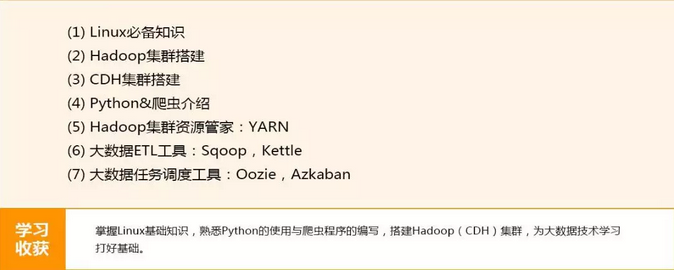
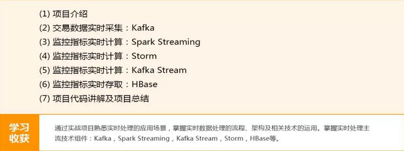
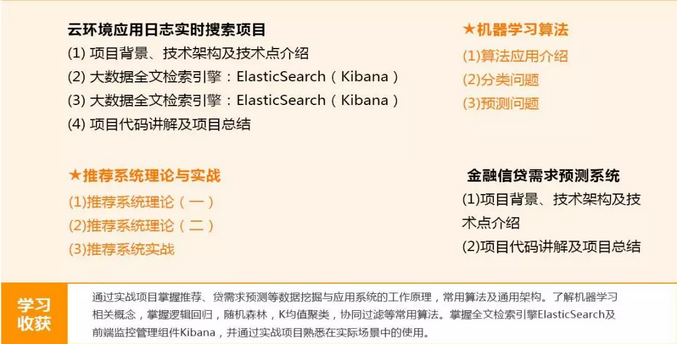
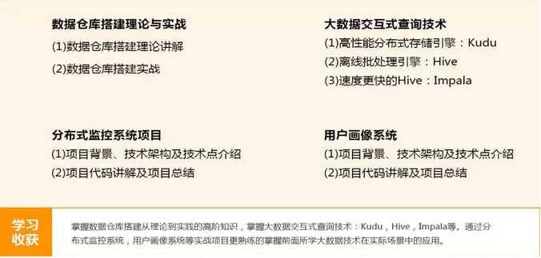

#月薪8k 与 月薪38K的程序员差距在哪里？

回想自己做开发的这么多年，我获得了很多，技术能力、培训、出国、大公司的，还记得刚刚出来第一年那段时间，太多东西不懂的，我都是一切听从老大的安排，敲敲代码，看看数据库，测试自己和别人的代码；这样浑浑噩噩干了一年。

第二年的时候我就在想，自己还要这样吗？

当然是否定的，不可能的，一年的经验自己完全可以入行了，是时候该学习怎么进行需求分析，怎么设计数据库，怎么写各类文档，怎么写更好的代码？

所以说：一个人在一家公司呆久了，千万不要模式化，一直待着舒适区，因为当你一旦离开这家公司，找工作的时候就会很容易碰壁，在这里：我建议大家一定要提前计划着去学习...

##第一阶段：大数据基础及工具

##第二阶段：网站分析项目

##第三阶段：实施交易项目

##第四阶段：三大项目&机器学习

##第五阶段：三大项目&交互式查询

